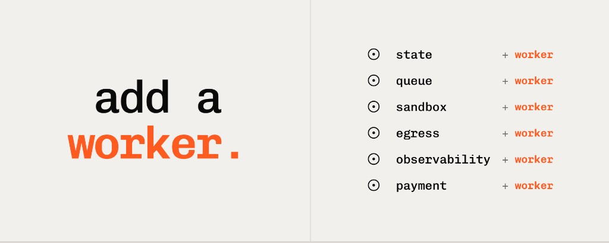
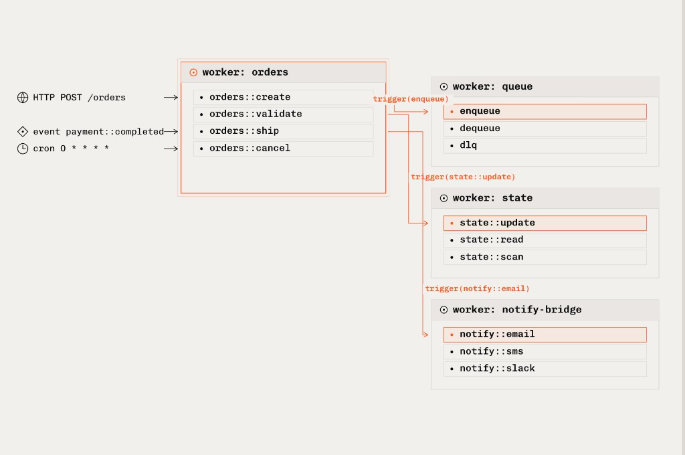
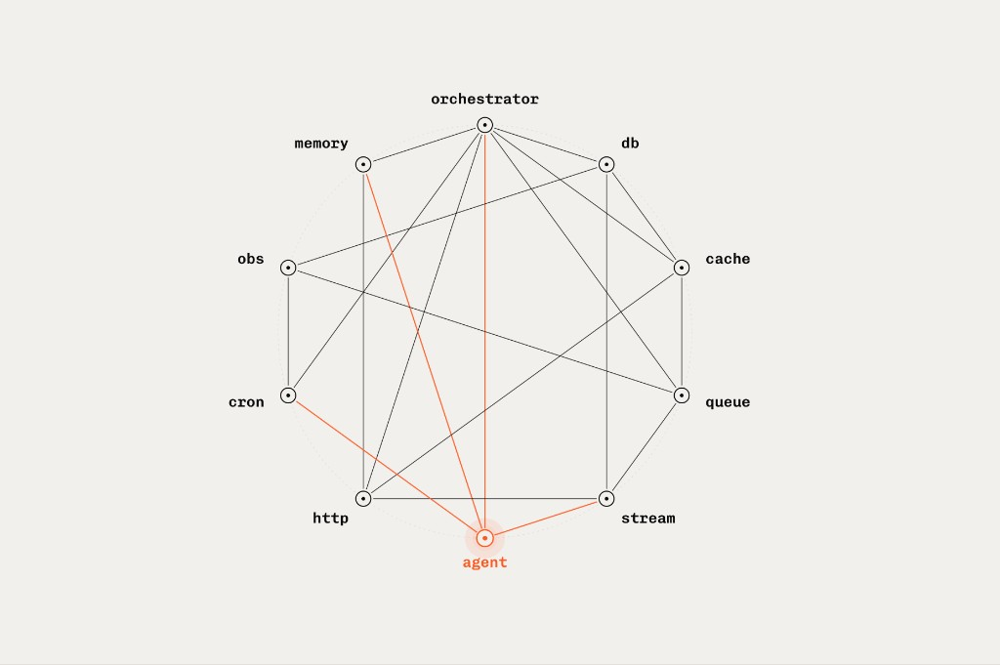

The cloud is a bazaar, and that was okay until agents arrived and had to
contend with 10,000 shops.

Cloudflare opened their Agents Week with a line that names this directly:
*"The Internet wasn't built for the age of AI. Neither was the cloud."* When
I read it, I agreed. But I think the reason the cloud wasn't built for agents
is older than agents. The cloud feels barely even built for humans.

The cloud was built as a cloud. Compute is a product. State is a product.
Sandbox is a product. Egress is a product. Tool discovery is a product.
Payment is a product. Queues are a product. Each product has its own API, its
own lifecycle, its own failure mode, its own billing, its own on-call
rotation. You choose which to adopt and integrate them in application code.

This organization is so naturalized that it's hard to see it as a choice.
But it is a choice, and it carries a tax. Every boundary between products is
a place to write integration code, correlate logs, debug, and get paged on a
Saturday. Developers have quietly paid this invisible tax for decades.
Agents are making this tax visible.

## The cloud tax, compounding

A typical web request touches three or four services and completes in 300
milliseconds. You notice the boundaries on a bad day. An agent reasoning loop
touches more. The agent needs a compute environment, a sandbox, a state
store, a credential broker, a tool registry, an identity service, a queue,
an observability pipeline, sometimes a payment service. It crosses those
boundaries not once but repeatedly, over minutes or hours, in a single task.

The cost of each crossing is specific and cumulative. A single user-visible
failure can be three retries deep and impact three different teams with
three independent budgets before anyone notices.

This is the cloud tax, and agents pay it on every loop iteration.

Cloudflare's Agents Week is a clear-eyed response to this problem. Their
answer: build isolate-level primitives inside their cloud at the category
level. A better compute primitive (V8 isolates, 100x faster and more
memory-efficient than containers). A better state primitive (Durable Objects
with per-instance SQLite). A new sandbox primitive (Sandboxes GA). A new
egress primitive (Outbound Workers for zero-trust credential policy). A new
tool-discovery primitive (MCP). A new payment primitive (x402). A new CLI
that agents themselves can drive.

Each of these is a serious piece of engineering. The isolate work in
particular solves a hard problem: per-agent economics at the scale agents
actually require. Cloudflare's math on this is correct and worth
internalizing. One hundred million US knowledge workers at 15% concurrency
is 24 million simultaneous agent sessions. At current compute density, we
are not a little short. We are orders of magnitude short. Isolates close
that gap in a way containers cannot. That is real.

But I think the move accepts a premise it doesn't examine: that the right
shape for all infrastructure can be defined above the isolate level. The
reason Cloudflare has missed this is simple — their business is selling
multiple categories of infrastructure. A primitive that collapses all
infrastructure categories risks significantly lowering switching costs
between them and their competitors.

## The shape of the question

Every time an agent needs a new capability, the cloud model asks the same
sequence of questions. Which product? Which API? Which config? Which
lifecycle? Which billing? Which on-call? The questions multiply with the
capabilities. An agent that needs eight things has adopted eight products.

The cloud teaches you to think in categories. Each category is its own
world, with its own ontology and its own integration story. You learn the
queue world, then the identity world, then the observability world. The
expertise requirements compound, quadratically with the surface area. Every
new category you bring in for your agent is a new boundary the agent has to
cross at runtime, with no guarantee the behavior or the format or the
vocabulary will match what's on the other side.

I think the answer can be the same every time.

## Three primitives

When I first started building backends, I took the cloud and its hidden
costs for granted. Agents made that cost visible. Every loop iteration
crossed boundaries that weren't designed to compose, and the cost compounded
faster and faster. For over a decade I thought the answer was a better
cloud: better products, better APIs, better integrations. Eventually I
realized the answer was a smaller surface, not a bigger one. The right
primitive is small enough to absorb every category.

This is what iii does by adhering to 3 simple primitives, or shapes that can
encapsulate everything else:

- A **Function** is a unit of work with a stable identifier
  (`cloudflare::workers::r2::get`, `azure::blob::get`, `agents::researcher`)
  that receives input, optionally returns output, and can live in any
  process in any language. Functions invoke other functions through
  `trigger()`. The engine handles routing, serialization, and delivery.
- A **Trigger** is what causes a function to run. You register a trigger to
  bind any event source to any function: an HTTP endpoint, a cron schedule,
  a queue subscription, a state change, a stream event. Triggers are
  declarative. The function doesn't change when you add a new way to invoke
  it.
- A **Worker** is any process that connects to the engine and registers
  functions and triggers.

The queue is a worker. Cron is a worker. The state store is a worker. The
HTTP front door is a worker. The egress proxy is a worker. The tool
registry is a worker. The payment gateway is a worker. The observability
pipeline is a worker. A TypeScript API service is a worker. A Python ML
pipeline is a worker. A Rust microservice is a worker. A hardware-isolated
microVM sandbox is a worker. A browser tab is a worker.

And an agent is a worker.

Your application code connects as workers too. There's no separate ontology
for "infrastructure" and "application" and "agent." There's one model, and
the differences live in what each worker does, not in what kind of thing it
is.

That fact is what makes the following section possible.

## Consider the agent

Consider the list of things agents need. The same list Cloudflare organized
an entire product week around.

An agent needs persistent state between reasoning steps. **Add a worker.**
The state worker exposes scoped key-value operations. The agent writes
progress through `trigger()`, reads it on re-entry, and continues from where
it left off.

An agent needs to run untrusted code in an isolated sandbox with its own
filesystem, shell, and network. **Add a worker.** Sandbox workers in iii are
hardware-isolated microVMs, each with its own root filesystem, network
stack, and process tree. `iii worker add ./my-project`. The engine manages
the VM lifecycle and auto-detects Node, Python, or Rust.

An agent needs to discover what tools and capabilities exist in the system
right now. iii keeps a live catalog. That catalog is the same and always up
to date whether it's being served over MCP, A2A, or some other protocol not
yet invented. These protocols all become workers and can all share the same
single source of truth: iii. **Add a worker.**

An agent needs to speak MCP to an external tool server. **Add a worker** that
bridges MCP into `trigger()` calls. The bridge is a worker like any other.

An agent needs identity and authorization boundaries for sensitive actions.
**Add a worker** that enforces the boundary, and scope access through the
engine's worker RBAC.

An agent needs to call a payment service. **Add a worker.**

An agent needs durable multi-step execution with retries, backoff, and
dead-letter queues. **Add a worker.** We already ship a worker that does
this. Configure retry policy, backoff, FIFO ordering, and DLQ per queue.
Each step is a function. Chaining them is a `trigger()` call with an
enqueue action.

An agent needs to run on a different continent. **Add a worker** there. The
code, the primitives, and the composition model don't change.

The title of this post isn't a slogan. It's the answer to every
infrastructure integration question.

## One trace, not eight

The research-steps queue's retry policy, backoff, FIFO ordering, and
dead-letter behavior live in `iii-config.yaml`. If the worker crashes
mid-step, the queue redelivers. The function reads state on entry, sees
what already completed, and continues from there.

The observability story is the part that genuinely changes compared to the
cloud model. Every function invocation carries a trace ID. Every
`trigger()` call propagates OpenTelemetry context across workers, across
queues, across language boundaries. Logs emitted through the iii Logger
attach automatically to the active span. When an agent step enqueues the
next step, which writes state, which fires a downstream worker in a
different language, the entire chain is one trace, in one tool, with spans
and logs already correlated.

One trace, instead of eight products' worth of timestamp archaeology.

## Composition, not runtime

There are workloads for which Cloudflare's shape is exactly right. If your
agent needs a V8 isolate in 50 milliseconds, on an edge node 30 milliseconds
from your user, with a per-instance SQLite database you can query without a
network hop, Cloudflare built that for you and you should use it.

iii doesn't ship managed isolates, Durable Objects, a native MCP
implementation today, an x402 payment primitive, or a zero-trust egress
platform. iii ships the runtime that makes them all behave like one
cohesive end-to-end application — and a worker registry that makes adding
functionality as easy as `iii worker add iii-http`.

iii doesn't try to build the best version of every category. iii lets you
seamlessly pick and choose the best version of every category. iii asks
whether the categories need to exist at all, or whether they're patterns
that emerge from composing a small number of primitives. A payment
integration is a worker. A zero-trust egress policy is a worker. An MCP
bridge is a worker. Each is a pattern on top of the same workers, triggers,
and functions.

## The bet

The cloud wasn't built for agents. Making the cloud better is one answer.
Collapsing the cloud into a primitive is another.

Three primitives, one engine, and one answer to every question: **add a
worker.**

iii is open source. Get started with our [quickstart](https://docs.iii.dev).
