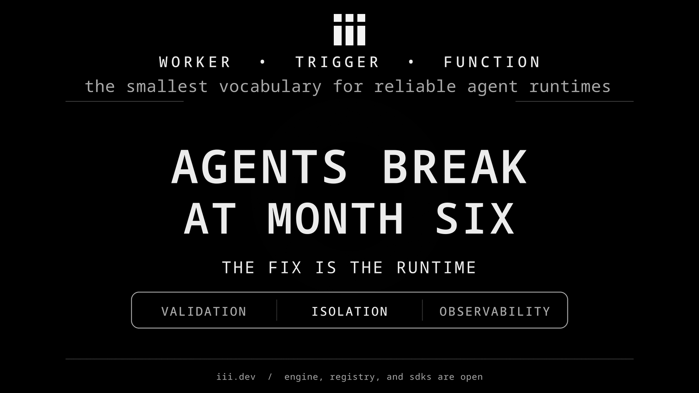

The agent codebases that break at month six all break the same way.

Class-level mutable defaults that share state between two agents the moment a second user shows up. Tool functions that accept any string and return `None` on every kind of failure. Session memory that gets mutated by an LLM-extracted string and silently poisons every subsequent action. Multi-agent setups passing the parent's full conversation history to a sub-agent because it was the easiest thing to wire. Loops without step bounds. Custom harnesses without span propagation.

I've spent the last year reviewing this pattern across teams. The diagnosis everyone reaches first is "discipline." The implication is that with a long enough internal playbook, every team converges to the production shape. That isn't what I see in the codebases that survive contact with concurrency.

The teams shipping reliable agents have moved validation, isolation, and observability out of "things the engineer remembers to do" and into properties of the runtime. The discipline is real, and it is reproducible because the architecture absorbs it. The teams forgetting are working in abstractions that make the bad shape easier to write than the right one.

The unit shrank. Agent is too coarse to be the unit of execution in a production backend, the same way "page" was too coarse for production frontend before component-level state. The unit that survives concurrency, observability, and version drift is narrower. Three primitives close the vocabulary: Worker is a narrowly focused set of capabilities, Function is the unit of execution, Trigger is how functions get invoked. The Engine sits between them as a protocol bus, unopinionated about language or runtime, holding the websocket connections, handling discovery, routing calls between workers.

This is the architecture we're building at iii. The argument below is what the primitives buy you, with the production failure modes they remove.

## Workers are narrow on purpose

A Worker is a narrowly focused set of capabilities. It groups a set of related functions under one namespace and one runtime. One scope per worker. Memory worker holds the state functions against a session-scoped namespace. Memory-compress worker holds the summarization functions. Memory-graph worker holds the entity-relation functions. Memory-mcp worker exposes the family over the MCP bridge. None of those collapse into a single `MemoryAgent` class with a list of tools attached.

The first effect is that god-class agents stop forming. Most agent code I've seen at month six has accumulated ten to thirty tools on one class because each new capability was a tool addition rather than a new component. The class-level mutable list bug is downstream of this shape. So is the tool-shadowing bug where two teams add overlapping tools and the model picks the wrong one. Both stop being expressible when adding a capability is a registry install rather than a class edit.

The second effect is composition. Workers call other workers through the engine. An agent worker that needs memory operations doesn't import a memory module; it calls a memory function. The agent worker doesn't have to know the memory worker's runtime, language, or version, only its function signatures. Replacing `memory-compress` with `memory-compress-v2` is a registry update rather than a code change in every consumer. Independent versioning at the runtime layer instead of the import layer.

## Functions are the unit of execution

Every Function inside a worker has a typed input and output schema. `memory::set` takes a key, a value, and a source. `memory::get` takes a key and returns a typed event with status and value. `fetch::page` takes a URL and returns a structured page object or a typed error. The schema lives in the engine's discovery layer. The engine validates input against the function's schema before the worker code runs, and validates output against the schema before returning it to the caller.

This is where the typed boundary lives. A `get_customer` function expecting a Stripe canonical ID rejects an email at the boundary, before the worker ever sees the call. The class of bug where the model passes wrong-shaped input, the function swallows the exception, and the agent confidently tells a paying customer there's no account dissolves into three structural properties. Validation lives at the function boundary, before any worker code runs. The error returned is a typed event with status and error type. The calling worker reads that same event as its next-turn context.

State isn't a special engine subsystem. State is a worker. `memory` is a worker that holds session-scoped key-value data and exposes get, set, delete, list, and update as functions. `memory-graph` is a worker that holds entity-relation data and exposes its own functions. The agent worker that needs to remember something calls `memory::set` the same way it would call any other worker's function. The engine routes the call; the memory worker handles it.

This collapses two problems at once.

The first is the class-level state problem. Agents stop holding state on Python instances because there are no Python instances that outlive a function call. Worker invocations are stateless from the engine's perspective. State that needs to persist lives in the memory worker, addressed by a session-scoped namespace. Two agent workers running concurrently in two processes cannot share Python state because there is no shared Python state to begin with. The cross-tenant data leak that has cost the industry three years of incident reports gets structurally harder to reproduce when the only path to memory is a typed function call into a worker.

The second is state poisoning. Every call to `memory::set` carries a source as part of its schema. A sensitive field changing source mid-session becomes an event the memory worker can reject or emit an alert on, because every mutation routes through the same set of functions with the same schema. Provenance is a property of the call signature, not a convention to remember in each agent's prompt.

Because memory is just a worker, swapping it out is a registry operation. `memory-v1` with flat key-value can be replaced by `memory-v2` with TTLs, or with a graph-backed memory, or with a per-customer encrypted memory, without any consumer worker changing its function calls. The function signature is the contract. The implementation behind the worker namespace is free to evolve.

Tools are just functions. When a model invokes a tool, it's calling a function on some worker through the engine. There is no separate tool runtime, no separate tool registry, no separate tool schema format. The "tool" the model sees is the function's input schema. The "tool result" the model reads is the function's typed output. MCP tool calls, A2A function calls, internal worker-to-worker calls, and HTTP-exposed endpoints all resolve to the same primitive. Once tools are functions, the category stops needing its own vocabulary.

## Triggers are how functions get invoked

A Trigger is the entry point that causes a function to run. HTTP request to an exposed function. Queue message routed to a function. Cron firing on a schedule. Another worker calling a function through the engine. MCP tool call from a model. A2A call from another agent. Browser-side event from `iii-browser-sdk` on port 49135. Or simply using a manual `trigger()` in your code or `iii trigger` in the CLI.

Triggers are how the outside world reaches functions, and how workers reach each other. The function's schema is what gets validated. The trigger is what supplies the input. An HTTP trigger on `memory::set` turns the request body into the function's typed input. A queue trigger turns the message payload into the same shape. An A2A trigger turns the agent-to-agent call into the same shape. Different sources, same validated boundary.

This is why the entry-point bugs disappear. There is no second way into a function. Every path runs through the same schema check at the engine. The team that adds a new HTTP endpoint doesn't get a new opportunity to forget validation, because there is no validation to remember; the function has a schema and the engine enforces it on every trigger that fires it.

## The harness disappears

The Claude Code postmortem from April 2026 is the cleanest evidence anyone has produced for the harness-as-operating-system argument. Three changes, none to the model, collapsed median visible thinking length by 73% and pushed retry rates up 80x. Reasoning effort cut from high to medium. Caching change discarding reasoning history mid-session. System prompt capping responses at 25 words between tool calls. Every one of those is a runtime change. Anthropic's own postmortem says the runtime is where reliability lives.

Most production teams converge on the same harness pattern: OTEL spans around LLM and tool calls, structured tool errors, `MAX_STEPS`, token usage as span attributes. The pattern is correct. The reason teams don't ship it is that writing it well is months of work, every team writes it once for one agent, and the harness is rebuilt per-product because it lives inside the agent code.

Worker as the primitive removes the layer. The LLM call is a function call. The tool call is a function call. The sub-agent call is a function call. State ops are function calls. The engine instruments every function invocation the same way: trace context propagates across function boundaries, step bounds and timeouts are engine-level config per worker, OTEL runs always-on at the engine layer. The harness stops being a thing each team writes around their agent because its responsibilities are properties of the engine + function boundary that apply uniformly.

The engine itself stays unopinionated. It hosts workers in any language, manages websocket connections, handles discovery, routes calls. It does not impose a loop shape, a prompt structure, or a tool format on the workers it hosts. The guarantees are about the boundary between functions, not about what happens inside one.

A regression of the Claude Code shape becomes structurally observable. Three runtime changes pushing thinking length down 73% surfaces as a span-attribute distribution shift in any deployment with always-on OTEL on the LLM worker. The community had to surface the original from sampled session logs because most production systems don't ship that level of runtime telemetry by default. Making it default is the lever.

## Category collapse

Once Worker is the primitive, categories that used to be separate runtimes collapse into the same vocabulary.

Sandbox provider is a worker. The 40+ providers we've mapped (E2B, Daytona, Modal, Vercel sandbox and the rest) all express as workers with sandbox-shaped functions. The choice of provider becomes a registry swap rather than an integration rewrite.

Browser tab is a worker. `iii-browser-sdk` runs on port 49135 and registers the tab as a worker the engine can address. Browser-side events are triggers. DOM operations are functions. The page becomes part of the same execution graph as the backend.

External agent is a worker via the A2A protocol. MCP server is a worker via the MCP bridge. The agent itself is a peer worker, not a privileged consumer of tools. The "agent calls tools" mental model collapses into "worker calls function on another worker."

Integration cost goes from quadratic to linear. Each new capability is one registry entry instead of an integration with every consumer. Each new consumer reads from the registry instead of a custom integration per provider.

## The production argument

The teams shipping reliable agents at scale share three properties. Narrow components with single scopes. Typed boundaries between them. Observability that runs across boundaries by default.

Workers are narrow because the primitive is. Functions are typed because they have schemas the engine enforces. Triggers fire functions through the same validated boundary regardless of source. Observability runs across boundaries because the engine instruments every function call. The properties production teams converge on after months of incident reports are the defaults of the architecture.

This is the same shape that played out in frontend in 2013. jQuery applications scattered DOM state across whichever closure was handy. The discipline of "keep state in one place, derive the DOM from it" was well understood and got forgotten in approximately every codebase, because the framework didn't enforce it. React made the discipline structural. The bug class went away because the architecture stopped allowing the bad shape.

The four failure patterns at the top of this post are the agent-runtime equivalent of pre-React state management. They read as a discipline checklist and they get forgotten in approximately every codebase hitting six months in production. The fix is the same as 2013. Move the discipline into the architecture.

## Closing

The model is the easy part. The runtime around the model is where reliability lives, and the runtime is best expressed as an architecture rather than a checklist. Worker, Function, Trigger is the smallest closed vocabulary I've found that absorbs the production discipline into the primitive. Workers as narrowly focused sets of capabilities, typed functions as the unit of execution, triggers as the invocation source, state served by a memory worker like any other. The bugs that show up at month six stop being possible at the layer where teams currently make them.

iii.dev. Engine, registry, and SDKs are open.

```bash
curl -fsSL https://install.iii.dev/iii/main/install.sh | sh
```
