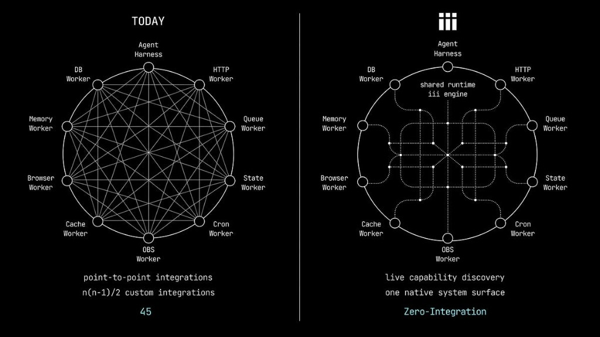

---

title: 'The Harness Is the Backend'  
description: 'The agent harness debate takes for granted that the harness is its own world, separate from the backend. iii makes a different bet: the harness is the backend.'  
pubDate: 2026-04-28  
author: 'Mike Piccolo, Founder & CEO of iii'  
tags: ['agents', 'architecture', 'harness', 'backend']
---

The most important architectural question in AI infrastructure right now isn't
which model to use. It's how much infrastructure is required to build something
useful with it.

Anthropic, OpenAI, CrewAI, LangChain all call that wrapping the *agent
harness*. The harness includes the orchestration loop, tools (MCP, A2A),
memory, context management, and error handling that make a model useful. They
all agree the model isn't the product. The infrastructure is. They disagree
deeply on how much of it should exist.

Anthropic keeps their harness thin. It's an elegant loop: assemble the prompt,
call the model, execute tool calls, and repeat. The model decides everything.
OpenAI adds more structure: instruction stacks, orchestration modes, and
explicit handoff patterns. CrewAI takes a multi-pronged approach: deterministic
Flows for routing and validation, autonomous agents for the rest. LangGraph has
the biggest harness — every decision is a node, every transition a defined
edge, the entire workflow encoded in the harness.

The spectrum runs from strongly trusting the model and weakly encoding the
logic, to weakly trusting the model and strongly encoding the logic. And every
team building with agents has to choose what size of harness they need.

But there's an assumption buried in the debate that nobody is questioning:
that the harness is extrinsic to the traditional backend.

The agent's loop, its tools, and its memory live in one layer: the harness.
While execution infrastructure such as queues, state, HTTP routing, server
side rendering, observability, and all other backend components live in
another: "the backend".

I believe that this is temporary and it's just a small step along the way to
true adoption and acceptance of agentic infrastructure into "the backend".



## How Agents Work Today

Here's how most agentic architectures work. The harness is a Python process
(or TypeScript, or a managed framework) that wraps the model. When the agent
decides to act, the harness translates a tool call into an HTTP request which
in turn triggers something to happen on the backend like a queue publish or a
database write. The backend is its own world that is kept separate from the
agents.

The harness retries on its own schedule, the queue retries on its own
conditions, and the HTTP layer manages its own timeouts. There is no trace
directly connecting these disparate systems. When something breaks, debugging
means correlating logs across systems and reconstructing observed behavior.
This is a common process in backend engineering but whereas prior systems were
largely deterministic, agents are stochastic at best.

With every additional agent the probabilities widen and at the most basic
level are `agents^2 * services`. Put another way, 1 agent and 5 backend
systems is 5 stochastic paths to debug. 4 agents and 5 backend systems are 80
stochastic paths to debug.

There is no good way to make agents more deterministic, much of their basic
functionality is intended to give varied answers for similar and even
identical inputs. They're not stochastic by chance, they're stochastic by
intention because they make computers useful in a brand new way. The billion
dollar question is how to handle agents properly by creating the correct
harnesses in the correct contexts.

## Taking a Step Back

The fundamental promise of harnesses today is that they are trying to operate
a new paradigm (stochastic LLMs) within an old one (deterministic backends).
It's not that construction of agent harnesses is inherently wrong, it's that
effective solutions must begin with the deconstruction of what a backend is.

Most of us have up until very recently taken the backend and how it works for
granted; including myself. Without agents and the LLMs that power them I
probably would have never thought about this problem before. So I embarked on
a journey to figure out the fundamental building blocks of a backend.

At first I thought that backends are collections of services that exist in
categories of products and are assembled with libraries, integrations,
architecture diagrams, orchestration code, and the list kept growing.
Eventually I realized that I was approaching this solution from the top down
instead of bottom up. Once I realized that, the backend became very simple:

> A backend is composed of three essential elements: **workers** that
> orchestrate work, **triggers** that invoke these services, and **functions**
> within the services that do the actual work.

## Abstracting the Backend

Once I realized this it became clear that I, and my very talented team, could
build a backend using this abstraction. Far from an academic exercise we've
found this abstraction has very real utility both in the agentic world and
more broadly as our abstraction completely encapsulates the execution context
of "the backend". So we built iii to make that abstraction available to
everyone.

iii works just like my description above:

- A **Function** is a unit of work with a stable identifier (e.g. `orders::validate`) that receives input and optionally returns output. It can live in any process, in any language.
- A **Trigger** is what causes a function to run — a direct call, an HTTP endpoint, a cron schedule, a queue subscription, a state change, a stream event, or anything else. Triggers are declarative: the worker says "this function runs when this thing happens," and iii handles routing, serialization, and delivery.
- A **Worker** is any process that connects to the engine and registers functions and triggers.

A TypeScript API service is a worker. A Python ML pipeline is a worker. A Rust
microservice is a worker. And an agent is a worker.

This is the idea that changes everything. An agent connects to the engine,
registers functions and triggers, persists context through `state::set`,
hands off work through queue-backed triggers, and broadcasts results via
pub/sub. It doesn't call "the backend" through a separate integration layer.
It participates in the same system, with the same primitives, as everything
else.

```typescript
const iii = registerWorker('ws://localhost:49134', { workerName: 'agentic-backend' })

iii.registerFunction('agents::researcher', async (data) => { // the unit of work
  // Python Worker: requests + duckduckgo-search
  const sources = await iii.trigger({
    function_id: 'web::search',
    payload: { query: data.topic, limit: 10 }
  })
  // Rust Worker: scraper + tokio, fetched in parallel
  const pages = await iii.trigger({
    function_id: 'web::scrape',
    payload: { urls: sources.map(s => s.url) }
  })
  // TypeScript Worker: wraps the OpenAI SDK
  const findings = await iii.trigger({
    function_id: 'llm::summarize',
    payload: { topic: data.topic, documents: pages }
  })
  await iii.trigger({ // Rust Worker: persist to shared state
    function_id: 'state::set',
    payload: { scope: 'research-tasks', key: data.task_id, value: findings }
  })
  iii.trigger({ // TypeScript Worker: hand off to the critic
    function_id: 'agents::critic',
    payload: { task_id: data.task_id },
    action: TriggerAction.Enqueue({ queue: 'agent-tasks' }) // run in the queue
  })
  return findings
})

iii.registerTrigger({ // HTTP entrypoint
  type: 'http',
  function_id: 'agents::researcher',
  config: { api_path: '/agents/research', http_method: 'POST' }
})

iii.registerTrigger({ // also runs on a pending state row
  type: 'state',
  function_id: 'agents::researcher',
  config: { scope: 'research-tasks', condition: 'status == "pending"' }
})
```

Three calls. `registerFunction` defines the work. `registerTrigger` binds it
to the world — in this case an HTTP endpoint and a state change reaction, for
the same function. The researcher is now callable via a POST request and
automatically fires whenever a research task enters a pending state. Add
another trigger and it also runs on a cron schedule. The function doesn't
change. The triggers compose.

The agent stores state with the same `trigger()` call a payment service would
use. It hands off to the critic through the same queue mechanism an order
pipeline would use. The agent's "tools" are functions. Its "memory" is state.
Its "orchestration" is triggers and composition. There is no special agent
infrastructure because there doesn't need to be.

**The harness is the backend.**

## Workers all the way down

This goes deeper than agents fitting into a backend. It's about what iii
considers a primitive and what happens when one primitive, in just a few lines
of code, is the answer to every question.

In most platforms, every new capability is a new category. Need queues?
Evaluate queue products. Need streaming? Different product. Sandboxing?
Another. Each has its own internals, its own lifecycle, its own integration
story. The platform is a catalog. Your job is to shop it and assemble it.

In iii, the answer to almost any question is the same: add a worker, which in
turn registers triggers and functions.

I want sandboxing. Add a worker. I want an agent that researches topics. Add
a worker. I want real-time streaming. Add a worker. I want go-to-market
capabilities like lead scoring, email sequences, CRM sync. Add a worker. I
want cron scheduling. It's already a worker. I want observability. Already a
worker.

The worker connects, registers what it can do, and the system absorbs it:
live, discoverable, observable. The answer doesn't change based on what kind
of capability you're adding. It doesn't change based on language, or whether
it's infrastructure or business logic, or whether a human or an agent is
creating it. Add a worker.

This is not just architectural uniformity. It's a collapse of categories. In
traditional systems, every capability lives in its own ontology. Queues have
broker semantics, HTTP has routing semantics, cron has scheduling semantics,
agents have orchestration semantics. In iii, they are all the same thing: a
process that registers functions and triggers. The semantics live in the
functions, not in the infrastructure.

Paradigm shifts in software don't add features. They collapse categories.
"Everything is a file" made Unix composable. Components as functions made
React's mental model stick. In iii, the answer is always "add a worker."
That's the primitive. That's the whole model.

## A live system

Because everything is a worker, three properties emerge that traditional
architectures cannot produce:

**Live discovery.** When a worker connects, it receives the full catalog of
every function registered across every other worker. When new functions
appear, every worker gets notified. When a worker disconnects, every worker
is notified. The engine is the single source of truth.

For agents, this is also cognitive infrastructure. An agent can see exactly
what the entire system can do right now. There is no risk of an agent
receiving outdated context.

**Live extensibility.** Add new workers and capabilities to a running iii
system without redeploying or redesigning the architecture. There are no
config changes and no restarts, because the system extends at runtime.

This is how agentic systems actually want to operate. You don't ever need to
interrupt production to add a new capability. You connect a new worker, its
functions distribute across the system, and any agent can use them at will;
or even extend the system with their own workers.

**Live observability.** iii's observability is built on OpenTelemetry. Every
function invocation carries a trace ID. Every `trigger()` call propagates it
across workers, across languages, across queue handoffs. Every log emitted
through the iii Logger is automatically correlated to the active trace and
span, emitted as structured OpenTelemetry LogRecords, and routed to whichever
backend you use: the iii Console, Grafana, Jaeger, Datadog. This isn't a
separate component to install and integrate, it's just another worker.
Traces, metrics, and structured logs are produced by the engine itself, not
by application-level middleware.

When an agent calls a tool that enqueues a message that triggers a downstream
function that writes to state, the entire chain is one trace. Not three
separate systems connected with timestamp correlation or manually tracked
trace ids. One trace, across languages, across workers, across the
agent-backend boundary. You go from a slow waterfall span directly to the
correlated logs that explain what happened.

## Agents that create workers

Here is where the model gets truly recursive.

iii supports hardware-isolated microVM workers. The sandbox functionality
itself is a worker with its own filesystem, network stack, and process tree.
You create a worker with a single command: `iii worker add ./my-worker`. The
sandbox worker connects to the engine, registers functions and triggers, and
participates in the system exactly like every other worker.

Now consider what happens when an agent can do this.

An agent worker can also spin up a new sandbox worker at runtime. That
sandbox gets its own isolated environment. It registers its own functions and
triggers. Those functions immediately appear in the live catalog. Other
agents and services can invoke them. When the sandbox is no longer needed, it
disconnects and its functions unregister.

The sandbox is not a separate "sandbox product." It is a worker, using the
same primitives as everything else — it just happens to provide hardware
isolation. An agent creating a sandbox worker is just one worker creating
another.

This is what it looks like when infrastructure becomes a design pattern
instead of a product category. Need isolated execution for untrusted code?
That's a sandbox worker. Need a temporary specialist agent? Spin up a worker,
register functions, shut it down when finished. Need a fleet of parallel task
executors? Have a worker spin up other workers. The primitive is the same.
The pattern varies.

## The distinction disappears

Go back to the harness debate. Anthropic says thin. LangGraph says thick.
They're arguing about how much cognitive structure to encode around the
model. The thin-vs-thick debate matters, but it's a question within a design
space, not about the design space itself.

When agents are workers, thin versus thick is just a question of how many
functions you register and how you compose them. A thin harness is an agent
worker with a few functions that lets the model decide what to `trigger()`
next. A thick harness is an agent worker with more functions, explicit
approval gates, and conditional logic before enqueuing the next step. It's
the same primitives and system, but a different pattern.

The scaffolding metaphor shifts too. The industry talks about harness
scaffolding as temporary. As models improve, you remove it. Manus has
described rebuilding Claude's agent framework four times, with each rewrite
the result of discovering a better way to shape context. Claude Code strips
planning steps as new models absorb the capability.

If the harness is built from the same primitives as the rest of the backend,
then removing scaffolding just means simplifying a function. You don't
rearchitect an integration layer. You don't rebuild the interface between two
systems. You just register fewer functions, or compose them differently.

## Anything is a worker

A worker is anything that can open a WebSocket, register a function, and
speak the primitives interface. There is no constraint on what that thing is
or what language it's written in.

iii ships SDKs for TypeScript, Python, and Rust. But those aren't the
boundaries of the system. They're three implementations of an open wire
protocol: JSON over WebSocket. The engine doesn't know what language is on
the other end of the connection. It sees functions, triggers, and a
connection. If your team writes Go, or Java, or Swift, or Zig, you write a
small SDK that speaks the protocol and you're a first-class participant. The
primitives interface is the contract. Everything else is a design pattern.

This means the set of what can be a worker is genuinely unbounded. A Node.js
service. A Python ML pipeline. An agent. A queue. A sandbox running inside a
microVM. A browser. iii ships a browser SDK, so a tab on someone's laptop
can register functions, participate in live discovery, invoke backend
functions, and be invoked by backend functions. The browser is in the system
the same way a Kubernetes pod is.

A Raspberry Pi is a worker. An IoT sensor at the edge is a worker. A phone
running a thin client is a worker. A CI runner that spins up, registers a
function, does work, and disconnects is a worker. The engine doesn't
distinguish between these. Every new language, every new device, every new
runtime that implements the primitives interface gets the full system for
free: live discovery, live extensibility, live observability, durable
triggers, cross-everything invocation. Not because we built a special
integration for each one, but because the primitive allows this composition.

## The bet

The industry is debating how much scaffolding to wrap around the model. That
debate matters, but it takes for granted that the harness is its own world,
separate from the backend and separate from the infrastructure that actually
runs when a tool fires.

iii makes a different bet: that the right primitives — worker, trigger,
function — are small enough and universal enough that the question "what can
participate in this system?" has the answer: anything. A cloud service. An
agent. A browser. A microcontroller. A sandbox an agent just spun up. They
all compose the same way. They all discover each other. They all trace the
same.

When you stop treating "agent infrastructure" as separate from "backend
infrastructure," and when you stop treating any category of participant as
architecturally different from any other, the system simplifies in a way
that adding features never achieves. The boundaries between harness and
backend, between cloud and edge, between infrastructure and application, and
between human-written services and agent-created workers all dissolve into
the same three primitives.

The harness isn't on top of the backend. The harness *is* a part of the
backend. And the backend is whatever connects to iii.

When you get the primitives right, the categories collapse and complexity is
radically simplified.

iii is open source. Get started with our [quickstart](https://docs.iii.dev).