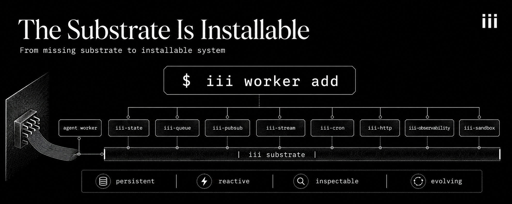

A really good piece from Yohei this week, named something a lot of us building agent infrastructure feel, but have not articulated well. Every long-running agent ends up needing the same surrounding layer: task state, event logs, replay, approvals, memory, retries, branching, provenance, and capability tracking. Everyone is independently rebuilding it. He calls what's missing a "persistent, reactive, inspectable, evolving state substrate."

That description is exact. What I want to argue, from a year of building [iii](https://iii.dev/), is that the substrate is not the missing thing. The framing has been. Treating the substrate as a problem each agent team has to solve is what makes everyone rebuild it. Treat it as a system everyone shares and installs into, and the problem dissolves.

That is the bet iii has been running on. Three primitives: Worker, Trigger, Function. Small enough that every category in the list above is the same primitive composed differently. And because they're the same primitive, the substrate is not architecture. It's a command.

**iii worker add**

The single most important line is:

> iii worker add is the npm moment for systems. What is installed is not a library. It is a complete running service.

That sounds like a tagline. It is also literally true.

When you type `iii worker add iii-state`, the engine pulls a published worker from the [registry at workers.iii.dev](https://workers.iii.dev/), starts it, and registers its functions and triggers on the engine. From the moment that command returns, every other worker in your system can call `state::set` and `state::get` and subscribe to state-change triggers. There is no integration code. There is no SDK to import. There is no client to instantiate. The worker is there, the catalog updated, and every existing worker, including any agent already running, can use it on the next tick.

That is the move that turns **"the missing substrate" into "an installable package."**

Here is what's in the registry today:

```bash
iii worker add iii-state          # distributed KV state with reactive change triggers
iii worker add iii-queue          # async jobs with retries, dead-letter
iii worker add iii-pubsub         # topic-based pub/sub
iii worker add iii-stream         # durable streams
iii worker add iii-cron           # cron scheduling
iii worker add iii-http           # HTTP endpoints
iii worker add iii-observability  # OpenTelemetry traces, metrics, logs
iii worker add iii-sandbox        # hardware-isolated microVMs
iii worker add iii-bridge         # connect to another iii instance
```

That's nine commands. That is also, as far as I can tell, every box in the "people keep independently rebuilding the same surrounding layer" list, expressed as the same primitive.

It keeps going. The agent layer itself, on the registry today:

```bash
iii worker add turn-orchestrator  # durable run::start state machine for each agent turn
iii worker add provider-router    # router::stream_assistant across providers
iii worker add provider-anthropic # Anthropic Messages API
iii worker add provider-openai    # OpenAI Chat Completions
iii worker add models-catalog     # model capability registry
iii worker add auth-credentials   # API key and OAuth token vault
iii worker add approval-gate      # pause calls until the UI resolves them
iii worker add policy-denylist    # block calls matching a denylist
iii worker add hook-fanout        # publish-collect primitive for hooks
iii worker add session-inbox      # per-session inbox backed by iii-state
```

Each one is a complete running service. Each one fulfills the same contract as every other worker on the bus. The agent harness is not a monolithic framework you adopt. It is a tower of workers you compose, and each layer is swappable because each layer speaks the same protocol as the layer next to it.

## The four properties, by composition

Walk through each adjective in that substrate description: persistent, reactive, inspectable, evolving, and watch each one map to a worker that already exists on the registry.

**Persistent.** State has to survive restarts, network blips, and worker disconnects. `iii worker add iii-state` exposes `state::set`, `state::get`, scopes, transactional reads. The state lives in the state worker, not in the agent process. Crash the agent worker; reconnect it; read scoped state; resume.

**Reactive.** Changes in the substrate cause work to happen elsewhere, without the affected workers polling for them. iii-state ships reactive change triggers as a first-class trigger type. Any worker can register:

```ts
iii.registerTrigger({
  type: 'state',
  function_id: 'agents::researcher',
  config: { scope: 'research-tasks', condition: 'status == "pending"' },
})
```

The agent function runs every time a row enters that state. No queue subscription you wrote. No webhook you maintained. No cron polling at 5-second intervals. The state change is the event, declared at registration time, fired by the engine.

Want it broadcast instead of narrowed? `iii worker add iii-pubsub` and the same shape works on a topic. Want it durable across a backlog? `iii worker add iii-queue` and you have retries and dead-letter for free. The reactive property is composed from these workers, not bolted on top.

**Inspectable.** `iii worker add iii-observability` adds OpenTelemetry traces, metrics, and logs across every worker on the bus, in one trace per logical call. The agent's `state::set` writes a span. The state worker's change-trigger fire writes a child span. The downstream function that handles the change writes another child span. The whole chain across languages, across worker boundaries, across queue handoffs is one trace. The observability worker isn't a separate vendor you correlated with timestamp magic. It's a worker that subscribes to the same engine bus that everything else uses.

**Evolving.** This is the property the other systems struggle with most, and it's where the worker model has its strongest answer.

A worker joins the system by opening a single WebSocket connection to the engine and registering functions and triggers. The moment that connection lands, the engine's live catalog updates, and every other worker on the bus sees the new functions. No restart. No redeploy. No config reload. Capabilities appear at runtime.

This is what makes "capability evolution" a property of the substrate by construction. The set of things the system can do is whatever set of workers is currently connected. When that set changes, the catalog changes. When the catalog changes, every reader sees the new shape on its next read. An agent that holds the catalog in context window for reasoning is, by definition, reasoning over the live state of the system.

It goes further. An agent that hits a task outside its current capabilities can `iii worker add` a new worker at runtime, expose new functions, and extend the system it operates inside. That isn't a future direction. The agent and the human use the same command to extend the same system.

That last sentence is the one I want to dwell on. **The agent and the human use the same command to extend the same system.** Most agent frameworks ship with a fixed surface and a model that reasons against it. iii ships with a primitive that lets the agent change the surface. Capability evolution isn't a feature you build by tracking "what tools does the agent have right now" in a sidecar database. It's a consequence of the agent participating in a live worker bus where the answer to that question is always whatever is currently registered.

## Quadratic to zero

The reason the substrate has to be installable, and not built bespoke per team, is the cost curve.

The iii docs put it directly: four services means at least six possible integration edges. Twenty means 190. Every new capability quadratically compounds the coordination cost of everything already in your stack. That cost is what shows up as "every long-running agent eventually rebuilds the same surrounding infrastructure." It's not laziness. It's that every team starts from a stateless model plus a chat loop, and the only way to integrate ten other things into that shape is to write ten integration layers, each with its own retry semantics, its own observability story, its own state-handoff convention.

`iii worker add` is the operation that flattens that curve. Adding two workers or two hundred is the same operation. A new worker joins the system by opening a single WebSocket connection and becomes immediately available to every other worker at that moment. The 190-edge graph for twenty services becomes one bus with twenty workers on it. Every worker speaks the same protocol. Every cross-worker call is a `trigger()`. Every state read is `state::get`. Every observability hook is automatic.

The integration code stops existing because there is no longer anything to integrate. There's a worker, it's on the bus, it's ready.

## Realtime is the property that changes the shape

The piece of this that I think the agent ecosystem hasn't fully metabolized yet is what "realtime" means in this model.

When the engine docs say "becomes immediately available to every other worker at that moment," that is not marketing. The engine streams catalog updates over the same WebSocket the workers connect on. A worker registering a function at T=0 means a different worker reading the catalog at **T+1**ms sees the new function. An agent worker reasoning at T+10ms about what tools it has access to includes the new function in its context, because the context is built from the live catalog.

This is the property that lets the system extend itself while it's running. Most architectures bolt that on with hot reload, config push, service discovery, sidecar registries. In iii, it's a consequence of the wire shape. The catalog is the source of truth, the catalog updates on every worker connect and disconnect, and every worker reads from the catalog. There is nothing to bolt on because the wire was designed to carry it.

The same is true of the observability and state stories. iii-observability doesn't need to be configured into the application. It subscribes to the engine bus and starts emitting OTLP. iii-state doesn't need an ORM. It exposes functions. The substrate is realtime not because someone added real-time support to it, but because the primitive, a WebSocket-connected worker registering functions and triggers, is real-time by construction.

## Same contract, both sides

The other thing that makes the substrate composable is the symmetry of the contract.

The docs put it in one phrase under [Same Contract, Both Sides](https://iii.dev/docs): application teams register functions and declare triggers, focused entirely on business logic. Platform teams publish workers, focused entirely on the capabilities they provide. Both sides fulfill the same contract.

This is the part that kills the integration tax for good. When the "platform" workers you install — iii-state, iii-queue, iii-pubsub, iii-observability — speak the same protocol as the "application" workers you write, there is no boundary between them. Your `agents::researcher` function and the state worker's `state::set` function are the same kind of thing in the catalog. The agent calling state and the state worker calling back via a change trigger are both ordinary `trigger()` calls. The cross-language case: a Python ML pipeline calling a Rust state worker, which in turn calls a TypeScript agent, has the same shape end to end.

That symmetry is what makes the worker model actually compose, instead of just being a thin abstraction over a service mesh.

## The harness is workers, too

Look back at the long list of things every long-running agent ends up rebuilding: task state, event logs, replay, approvals, memory, retries, branching, provenance, capability tracking, durable workflow runs. Now look at what's on workers.iii.dev today.

Durable agent turn loop → `turn-orchestrator`.

Multi-provider model routing → `provider-router`.

Per-provider streaming → `provider-anthropic`, `provider-openai`.

Model capability discovery → `models-catalog`.

Credential vault → `auth-credentials`.

Approval gates → `approval-gate`.

Policy enforcement → `policy-denylist`.

Generic publish-collect for hooks → `hook-fanout`.

Session-scoped inbox → `session-inbox`.

Hardware-isolated execution → `iii-sandbox`.

These aren't a framework. They are individual workers, versioned independently, swappable independently, runnable in any combination. You can install all of them, none of them, or any subset. If you don't like approval-gate, you can write your own that subscribes to the same hook and replaces it. If you want to add a step the harness doesn't have today, you publish a worker. The "harness" stops being a thing you adopt and starts being a thing you compose.

This is the part the harness debate doesn't see when it argues "thin versus thick." When the harness is composed of workers on the same bus as the rest of the system, "how much harness" is just "how many workers." Thin is fewer workers. Thick is more. The architectural decisions stop being a fork in the road and become a slider.

## What does this get you, concretely

Pull all of this together and the shape of building an agent on iii looks different from building one on top of a framework.

You install a few workers from the registry. You write your agent as a worker that registers a function. The agent's tools are functions on other workers it can call via `trigger()`. The agent's memory is `state::set` and `state::get` against iii-state. The agent's branching is forked scopes against the same state worker. The agent's lineage is the OpenTelemetry trace iii-observability is already collecting. The agent's approvals are the approval-gate worker pausing the call. The agent's policies are the policy-denylist worker rejecting it. The agent's durable runs are turn-orchestrator driving the state machine. The agent's sandboxed code execution is iii-sandbox booting a fresh microVM.

You did not build any of those layers. You installed them. And because they're all workers on the same bus, the trace from the HTTP request that started the run to the final state mutation is one continuous trace across every one of them.

If the agent needs something none of those workers do, you write a new worker. Then you publish it to the registry, or you keep it local. Either way it composes with everything else from the moment it connects.

## The missing primitive is not missing

The "missing primitive" framing is the right framing: the missing thing may be a persistent, reactive, inspectable, evolving state substrate, treated not as separate systems around an agent loop, but as one operational substrate.

That description fits iii exactly. It also fits what's on workers.iii.dev today. The substrate isn't missing. It's installed in three commands and extended at runtime in one. The reason it doesn't feel solved yet, in the broader ecosystem, is that we've been treating it as architecture each team builds. The move that worked, for us, was to make it a primitive each team installs and extends.

The agent harness debate, the memory debate, the workflow debate, the orchestration debate; they all dissolve into composition once you have the right primitive. Three primitives. One engine. A registry that anyone can publish to. A `iii worker add` command that turns the substrate into a one-liner. Real-time live discovery so capabilities show up the moment they connect. Same contract, both sides, so application teams and platform teams stop having to translate at every boundary.

When the substrate is a primitive instead of a project, capability evolution is what the system does, not what the team builds.

iii is open source. The docs are at [iii.dev/docs](https://iii.dev/docs). The registry is at [workers.iii.dev](https://workers.iii.dev/). The fastest way to feel the argument is to type `iii worker add iii-state` and watch a different worker react to it a second later.
