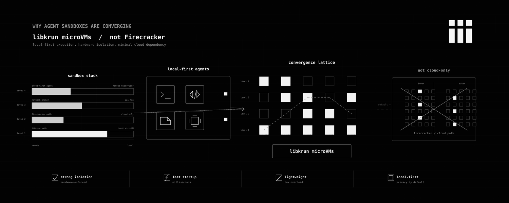

Every coding agent that matters runs on your laptop now. Claude Code, Codex, OpenCode, Cursor's agent mode, the new wave of CLI-first harnesses. They install a binary, take over a directory, and start generating code that wants to actually run.

People shouting Firecrackers as the future sandbox everyone needs assumes the agent and the sandbox both live in someone else's data center. That model still ships a lot of agents. But the agent shape that's eating the world (Claude Code, Codex, the local CLI agents) lives on a developer's MacBook, and Firecracker can't boot there. Not "not yet." It cannot be architecturally.

So the question for anyone building agent infra in 2026 is no longer "which microVM monitor do we wrap?" It's "which microVM monitor wraps everywhere our agents actually run?" That question has exactly one answer right now, and it isn't Firecracker.

It's libkrun. And the more interesting part of the answer isn't the VMM at all. It's what you put inside it.

I've been working on iii-sandbox at iii for the past few months. iii-sandbox is the hardware-isolated execution layer for iii, an open-source engine where every primitive (an HTTP route, a queue, a cron, an agent, a sandbox) is the same thing: a worker that connects to the engine over WebSocket and registers functions and triggers. The sandbox is just one of those workers. This post is the deep dive on why we built it on libkrun, what's inside the guest, and what we learned about the actual hard parts.

## Recap: why a kernel boundary at all

This part is well-known, so I'll keep it short. A Linux container is namespaces plus cgroups plus seccomp filters layered over a single shared kernel. That kernel exposes hundreds of syscalls. One bug in any of them and the multi-tenant story is over. For a request that lives 40ms inside your own backend running your own code, that's fine. For an agent invoking commands it generated five seconds ago, against a model with unknown failure modes, against a filesystem the user cares about, it isn't.

Full virtual machines solve this by brute force. Every guest gets its own kernel. The hypervisor (Linux's KVM on Intel/AMD, Apple's Hypervisor.framework on macOS, Microsoft's Hyper-V) mediates the privileged moments. The cost was always speed and footprint: a classic QEMU VM emulates a 1998 PC because that's what a 1998 OS wanted to boot against.

The microVM idea (popularized by AWS for Lambda and open-sourced as Firecracker in 2018) is: delete the 1998 PC. No BIOS. No PCI. No VGA. Keep KVM, a serial console, and the handful of virtio devices the guest actually needs. The result is hardware isolation with sub-second boots and a few MB of overhead. This is the design every cloud sandbox vendor converged on for the obvious reason that it solves the right problem.

What changed is where the sandbox needs to run.

## Firecracker on a Mac is not a thing

Firecracker depends on `/dev/kvm`. KVM is a Linux kernel module. There is no port of KVM to macOS, and there will not be one, because Hypervisor.framework already occupies that slot in the OS architecture. Firecracker's own FAQ is unambiguous: Linux `x86_64` or `aarch64` with KVM enabled.

You can run Firecracker on a Mac the same way you can run any Linux binary on a Mac: inside another Linux VM. That gets you nested virtualization (a guest VM running inside another VM), which Apple Silicon supports on M3+ but at a real performance cost, and which means your local sandbox is now a microVM inside a UTM VM inside macOS. The boot times stack. The disk image stacks. The networking stacks. It works for a demo. It does not work for an agent that wants to boot a fresh isolated environment every few seconds while a developer is in flow.

Meanwhile, the agents that are actually shipping (Claude Code, Codex, OpenCode, every IDE-embedded coding agent) run as a native binary on macOS. They write to the user's actual filesystem, drive the user's actual git, hit the user's actual ports. The sandbox they want is a fresh Linux microVM that boots in a few hundred milliseconds on whatever machine the agent already runs on, with the agent's repo mounted, network optional, output streamable back. The agent doesn't care which hypervisor underlies it. It cares that it works on a MacBook Pro and on a CI runner and on an EC2 instance, the same way, with the same API.

There is exactly one open-source VMM that meets that bar right now. It's libkrun.

## What libkrun is

libkrun started life as a Red Hat project to power podman machine on macOS. It's a dynamic library (`libkrun.so` on Linux, `libkrun.dylib` on macOS) that exposes a VMM as a function you link against, not a process you exec. You hand it a kernel (`libkrunfw`), a rootfs (any directory you want passthrough-mounted), an exec spec ("run `/init` with these args, this env, this rlimit"), and it boots a microVM in-process and waits for it to exit.

The crucial detail: libkrun is hypervisor-agnostic. On Linux, it uses KVM via the same `/dev/kvm` Firecracker uses. On macOS Apple Silicon, it uses Hypervisor.framework directly. Intel Macs aren't a supported target (Apple Intel hardware is end-of-life). One API, one device model, the two host operating systems your users actually run on.

It also intentionally throws out one of Firecracker's defaults: legacy block devices. Firecracker exposes the guest rootfs as a virtio-block device backed by an ext4 image on the host. libkrun exposes the guest rootfs as a virtio-fs directory on the host, mounted into the guest. No image creation. No image rebuild when you change a file. You point libkrun at a directory and the guest sees that directory.

For a sandbox that boots an arbitrary rootfs the user pulled from an OCI registry five seconds ago, this is dramatically better. You unpack the OCI image to a directory, hand the directory to libkrun, and the guest is reading the same bytes that are on the host disk. No `mkfs.ext4`. No loopback. No re-pack when you cache-bust.

The tradeoff is that virtio-fs has its own quirks (the root-directory `readdir` bug we'll get to in a minute), and the smoltcp-based network path is more opinionated than Firecracker's TAP-device model. We'll get to those too. But the high-order bit is: libkrun is the only open-source VMM that gives you Firecracker-class isolation on the operating system half your users run.

## iii-sandbox, at the level of one boot

iii-sandbox is a worker like any other iii worker. It connects to the engine over WebSocket, registers fourteen functions (four lifecycle ops plus ten filesystem ops), and waits for `iii.trigger()` calls. Internally, it's a daemon that owns a registry of live microVMs and three things on disk: a rootfs cache (one extracted OCI image per image name), a per-sandbox overlay tree, and a Unix socket per sandbox for the shell channel.

When a caller fires `sandbox::create`, here is the actual sequence, with code references:

```rust
// crates/iii-worker/src/sandbox_daemon/create.rs
let id = Uuid::new_v4();
let layout = OverlayLayout::for_sandbox(id);
layout.ensure_dirs()?;
let shell_sock = layout.base().join("shell.sock");

let boot = launcher.boot(&BootParams {
    rootfs, workdir, shell_sock,
    cpus, memory_mb, env, network,
}).await?;
```

The launcher is the indirection that makes the daemon testable: `VmLauncher` is a trait, and the production implementation forks the parent `iii-worker` binary as `__vm-boot` (a hidden subcommand) with the boot params as CLI flags. That subprocess is what actually links libkrun.

The fork is deliberate. libkrun is a C library with a non-trivial amount of unsafe Rust binding code. If the guest kernel panics or libkrun itself segfaults, the parent daemon shouldn't die with it. Crash isolation costs us a fork+exec per boot, which is fine compared to the libkrun boot itself.

The `__vm-boot` child does roughly this:

```rust
// crates/iii-worker/src/cli/vm_boot.rs (abridged)
let passthrough_fs = PassthroughFs::builder()
    .root_dir(&args.rootfs)
    .build()?;

let mut builder = VmBuilder::new()
    .machine(|m| m.vcpus(args.vcpus as u8)
                  .memory_mib(args.ram as usize)
                  .hyperthreading(false)
                  .nested_virt(false))
    .kernel(|k| k.krunfw_path(libkrunfw_path).init_path("/init.krun"))
    .fs(move |fs| fs.tag("/dev/root").custom(Box::new(passthrough_fs)));

if args.network {
    let mut network = SmoltcpNetwork::new(NetworkConfig::default(), args.slot);
    network.start(tokio_rt.handle().clone());
    builder = builder.net(|net| net.mac(network.guest_mac())
                                    .custom(network.take_backend()));
}

builder = builder.console(move |mut c| {
    if let Some(path) = console_output_path { c = c.output(path); }
    if let Some(fd) = guest_control_fd {
        c = c.port("iii.control", fd, fd);
    }
    if let Some(fd) = guest_shell_fd {
        c = c.port("iii.exec", fd, fd);
    }
    c
});

builder.exec(|e| e.path("/init.krun").workdir(&args.workdir)
                  .rlimit("RLIMIT_NOFILE", 65536, 65536)
                  .env("III_WORKER_CMD", &worker_cmd));
```

A few things in there are worth pulling out, because each one is a place we had to make a non-obvious call.

The kernel is `libkrunfw`, not a kernel image you manage. `libkrunfw` ships a curated, hardened Linux kernel as a dynamic library. The first boot of a fresh iii installation downloads it from a GitHub release; subsequent boots `dlopen` the cached copy. We chose this over shipping our own `vmlinux` for the same reason most projects don't fork the C compiler: the surface area of "Linux kernel that microVMs are happy with" is large enough that the Red Hat folks doing it as a focused subproject will do it better than we will.

No virtio-net + TAP. libkrun's network model is a smoltcp userspace TCP/IP stack on the host that bridges to the guest's virtio-net through a shared-memory queue. There is no host-side `tap0`. There is no kernel routing change. There is no `iptables` rule. The implication for macOS (where TAP devices require a kernel extension that Apple has been actively deprecating) is that network just works without asking the user for root or installing tuntap kexts.

The implication for security is also worth saying out loud: smoltcp is the entire network attack surface from the guest into the host. It's a pure-Rust TCP/IP implementation designed for bare-metal embedded use, no heap allocation, small enough to audit. The host-side bridge translates the guest's outbound connect into a `tokio::net::TcpStream` on the host. Loopback addresses inside the guest get rewritten to the gateway IP so that an agent trying to hit `localhost:3000` reaches the user's actual dev server, which is the behavior an agent wants 99% of the time.

`virtio-console` named ports, not `vsock`. Firecracker (and most microVMs) use virtio-vsock for host-guest RPC: an in-kernel socket type addressed by `(context_id, port)` that doesn't traverse IP. We tried that first. The problem is that vsock support on macOS via Hypervisor.framework is half-implemented and not exposed through libkrun's public API. The workable substitute is `virtio-console` with named ports, which libkrun exposes natively. We open a `socketpair(AF_UNIX)` on the host, hand one end to libkrun as a named guest port (`iii.control`, `iii.exec`), and the in-guest init binary reads from `/dev/vport0p1`. The wire is bidirectional bytes; we layer a line-framed JSON protocol on top.

This sounds like a downgrade. It is, slightly. But the property it preserves is the only one that mattered: the guest cannot address the host except through ports the host explicitly attached. There is no `127.0.0.1:port` on the host that the guest can reach without the host having booted the VM with that port wired in. Same security model, slightly chunkier transport.

No PCI, no virtio-block, no ACPI. libkrun's machine model is roughly: one MMIO bus, one PMU, virtio devices the builder attaches, and that's it. No `pci=off` boot flag because there's no PCI in the first place. The kernel command line is mostly empty by the time it reaches the guest.

The whole boot from `sandbox::create` to shell-ready is logged in the daemon as `boot_phase: shell_sock_wait` and on a warm daemon (`libkrunfw` already cached, rootfs already extracted, codesign already applied) it's the few hundred milliseconds the README claims. The cold path (first ever boot of a fresh install) is dominated by `libkrunfw` download and macOS codesign, both of which we cache via an atomic `PROVISION_DONE` flag.

## The init binary is the actual product

The piece of iii-sandbox that took the longest and matters the most isn't in libkrun. It's in `iii-init`, the PID 1 binary we ship into every guest.

A microVM doesn't have systemd. It barely has a userspace. When the guest kernel starts, it `exec`s whatever the VMM pointed `init=` at. That binary is PID 1. If PID 1 exits, the kernel panics. If PID 1 blocks on something, the whole VM blocks. If PID 1 leaks file descriptors or doesn't reap children, you get the world's worst process-table corruption.

You can use systemd as PID 1. That's what real Linux distributions do. It's also 1.5M of binary and a feature set designed for booting laptops, and you don't need 95% of it for a sandbox that's going to live for 4 minutes and run six commands.

You can use tini as PID 1. That's the standard for containers. It's 12K, reaps children, forwards signals, and does nothing else. It's also the wrong primitive for a sandbox, because what PID 1 actually has to do in a microVM is more than what tini does and less than what systemd does.

The PID 1 binary inside an iii-sandbox guest does five things, in order:

```rust
// crates/iii-init/src/main.rs
fn run() -> Result<(), InitError> {
    iii_init::root_pivot::pivot_to_tmpfs_root()?;
    iii_init::mount::mount_filesystems()?;
    iii_init::mount::mount_virtiofs_shares();
    iii_init::mount::override_proc_meminfo();
    iii_init::rlimit::raise_nofile()?;
    iii_init::network::configure_network()?;
    iii_init::supervisor::exec_worker()?;
    Ok(())
}
```

That's the whole boot. Each line is doing work that exists because we hit a real edge case.

`pivot_to_tmpfs_root` pivots `/` off the virtio-fs root onto a tmpfs and re-exposes the rootfs entries via per-directory bind mounts. This exists because libkrun's virtio-fs root has a `readdir` bug where `ls /` enumerates entries in a pattern that OOM-kills the caller on a guest with <1GB RAM. We tripped this with bun's startup probe of `/`. The workaround is to never let any process read the virtio-fs root directly: tmpfs at `/`, bind mounts for everything underneath.

`override_proc_meminfo` fakes `/proc/meminfo::MemTotal` to the per-worker RAM cap. This exists because bun's allocator (Zig's `GeneralPurposeAllocator` under the hood) reads `MemTotal` directly and ignores cgroup v2's `memory.max`. So a sandbox booted with `memory_mb: 512` would have bun trying to allocate against whatever the host's RAM looked like through virtio's view. The fix is a bind mount over `/proc/meminfo` with a faked total.

`raise_nofile` raises `RLIMIT_NOFILE` to 1M. This exists because node's `fs.promises` and Python's `asyncio` open enough fds during a parallel test run to blow through the default 1024 limit. The host-side `vm_boot.rs` also sets it via libkrun's `KRUN_RLIMITS`, before the init binary even runs, because the dynamic loader for some workloads opens enough shared objects to trip the limit before our Rust code starts. Belt and suspenders.

`configure_network` reads `III_INIT_IP`, `III_INIT_GW`, `III_INIT_CIDR`, `III_INIT_DNS` from the env and configures `eth0` and `/etc/resolv.conf` accordingly. Or, if those env vars aren't set, does nothing, which means a sandbox booted with `network: false` is genuinely network-less: no interface, no DNS, no loopback to anywhere outside the guest itself.

`exec_worker` is the supervisor loop. It opens the virtio-console control port, services `Restart`/`Shutdown`/`Ping`/`Status` RPCs, and execs the user-supplied command. If the user runs `python3 -c 'print(2+2)'`, that's what gets exec'd. If they ask for an interactive shell over `sandbox::exec`, the shell port runs a multiplexed dispatcher that lets concurrent exec requests share the same VM.

The thing this list is meant to show is that the surface where you spend your time, if you build something like this, is the init binary. The microVM monitor is a commodity. The kernel is a commodity. The reason iii-sandbox boots cleanly is that we ship a Rust musl PID 1 that knows the specific bugs and edge cases of every runtime we expect to host. We don't run agents in containers wrapped in microVMs. We run them in microVMs where PID 1 is something we built to host agents.

This is also the reason "just use Firecracker" wouldn't have been a one-line port. The init story would have been the same work either way: 6.4k lines of Rust in `iii-init` covering `mount`, `root_pivot`, `network`, `rlimit`, `fs_handler`, `supervisor`, `shell_dispatcher`. The microVM monitor was the easy choice once we accepted that the init binary is the load-bearing component.

## Sandbox as worker, not sandbox as product

Here is where iii-sandbox is shaped differently from the cloud-side agent sandboxes.

In every other sandbox-as-a-service I've looked at, the sandbox is the product. You sign up, you get an API key, you call `Sandbox.create()` and get a handle back, and the rest of your agent system has to figure out how to talk to it. The sandbox lives in a different trust domain, with a different identity model, a different observability surface, a different rate limit.

In iii, the sandbox is one worker among many. The same engine that hosts your HTTP routes hosts your sandbox daemon. The same trace ID that started in the agent's `agents::researcher` function propagates through `sandbox::create` and `sandbox::exec` and shows up in the agent worker's logs and the sandbox worker's logs in the same OpenTelemetry view. The image allowlist that controls what an agent can boot is the same kind of config a queue worker uses to control what topics it subscribes to. The cleanup behavior on sandbox death (overlay discarded, virtual MAC reclaimed, slot freed) is the same lifecycle every other worker participates in.

The shape of a typical use looks like this:

```typescript
import { registerWorker } from 'iii-sdk'

const iii = registerWorker('ws://127.0.0.1:49134')

iii.registerFunction('agents::run-untrusted', async ({ code }) => {
  const { sandbox_id } = await iii.trigger({
    function_id: 'sandbox::create',
    payload: { image: 'python', cpus: 1, memory_mb: 512 },
    timeoutMs: 300_000,
  })

  try {
    const out = await iii.trigger({
      function_id: 'sandbox::exec',
      payload: { sandbox_id, cmd: 'python3', args: ['-c', code] },
      timeoutMs: 35_000,
    })
    return { stdout: out.stdout, stderr: out.stderr, exit: out.exit_code }
  } finally {
    await iii.trigger({
      function_id: 'sandbox::stop',
      payload: { sandbox_id, wait: true },
    })
  }
})
```

There is no separate sandbox SDK. There is no separate identity surface. There is no "now connect your observability to the sandbox vendor's webhooks." The sandbox is reachable through the same `trigger()` call you use to enqueue a job or invoke any other worker function. When the agent worker fires `sandbox::exec`, the engine routes it to the sandbox worker the same way it would route a queue publish.

The thing this enables that's harder to do when the sandbox is a separate product: an agent worker can register a function that boots a sandbox, runs code, captures the output, and shuts down, and that whole composite is itself a function other workers can call. The sandbox isn't a layer you reach for at the edge of your system. It's a primitive you compose with everything else.

That's the bet underneath iii in general (every category of infrastructure becomes the same primitive) and it lands particularly well for sandboxes, because sandboxes are exactly the kind of thing that traditionally gets bolted on as a separate product with its own ontology.

## What I'd tell anyone building this now

If you're shipping a hosted agent sandbox to other developers, Firecracker is still the right answer. AWS is going to keep it production-fit, and your customers' agents run in your data center anyway.

If you're shipping a local-first agent (a CLI, an IDE plugin, anything that ends up `npm install`'d or `brew install`'d on a developer's machine), libkrun is the only open-source path that gives you Firecracker-class isolation on macOS without forcing your users to set up nested virt or run a separate Linux VM. The cost is a slightly chunkier device model and a more opinionated network stack. The gain is your users can run your sandbox on the machine they actually have.

If you're building anything at all, the load-bearing engineering is in the init binary, not in the microVM monitor. The monitor is a commodity. The kernel is a commodity. The boot speed comes from what you delete (PCI, BIOS, vsock if you can swap for virtio-console) and what your PID 1 doesn't bother to do.

And the composition shape (sandbox-as-worker, not sandbox-as-separate-product) is the most underrated piece. The agent and the sandbox and the queue and the state store and the HTTP front door should all be the same kind of thing in the same system with the same trace ID. We built iii because every other shape we tried had a "now correlate this across systems" failure mode that compounds quadratically with the number of agents in the loop. When the sandbox is a worker, that failure mode never gets a chance to exist.

iii is open source. Get started with our [quickstart](https://docs.iii.dev).
