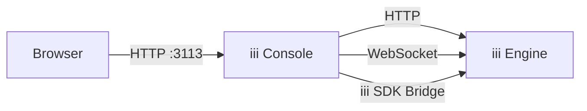

The iii Console is a standalone application that gives you full operational visibility into a running iii engine. It provides a web UI to inspect functions, triggers, state, streams, traces, and logs — all in real time.



## Installation

Install the console binary:

```bash
curl -fsSL https://install.iii.dev/console/main/install.sh | sh
```

Verify the installation:

```bash
iii-console --help
```

## Quick Start

Start the console while your iii engine is running:

```bash
iii-console
```

Then open your browser to [http://localhost:3113](http://localhost:3113).


<Warning title="Engine must be running">
  The console connects to a running iii engine instance. Make sure your engine is started before launching the console.
  By default it expects the engine at `127.0.0.1:3111`.
</Warning>

## Dashboard

The Dashboard is the landing page. It provides an at-a-glance view of your running iii engine, including live metrics, system health, and quick navigation to every major feature.

When you open the console at `http://localhost:3113/`, the Dashboard shows:

- **System counters** — total registered Functions, Triggers, Workers, and Streams
- **Mini-charts** — real-time metric visualizations for recent activity
- **Application flow** — a high-level diagram showing how Triggers, Functions, and data flow through your system
- **Last update timestamp** — indicates when metrics were last refreshed

| Metric    | Description                                    |
|-----------|------------------------------------------------|
| Functions | Total number of registered functions           |
| Triggers  | Total number of registered triggers            |
| Workers   | Active worker processes connected to the engine |
| Streams   | Total number of streams in the system          |

These counters update automatically via WebSocket and reflect the current state of the engine. Each counter links directly to its dedicated section.

The Dashboard also includes an application flow diagram that shows how triggers, functions, and data flow through your system.

## Functions

The Functions page lists every function registered with the iii engine and lets you invoke any of them directly with custom JSON input.


All registered functions are displayed with their metadata:

| Column      | Description                                           |
|-------------|-------------------------------------------------------|
| Function ID | The fully qualified path (e.g. `my.service.handler`)  |
| Triggers    | Number and types of triggers attached to the function |
| Workers     | Worker processes that can execute the function        |
| Status      | Current function status                               |

Use the **search bar** at the top to filter functions by name.

### Invoking Functions

You can invoke any function directly from the console:


1. Click on a function to open its detail panel
2. Enter a JSON payload in the input editor
3. Click **Invoke**
4. View the result or error in real time

This is useful for:

- **Testing** a function during development without wiring up a trigger
- **Debugging** by sending specific payloads to reproduce an issue
- **Ad-hoc operations** like running a migration function manually

For example, to invoke a function `users.getProfile`:

```json
{
  "user_id": "user-123"
}
```

The console sends the payload to the engine via `POST /_console/invoke` and displays the JSON response or error inline.

<Info title="Function must be registered">
  Only functions that are currently registered and connected via an active worker will appear in the list. If a function is missing, check that its worker process is running.
</Info>

## Triggers

The Triggers page shows every trigger registered with the engine and provides interactive tools to test each trigger type. Triggers are grouped by kind (HTTP, CRON, QUEUE) with a total count badge and per-type filter tabs.


| Column       | Description                                              |
|--------------|----------------------------------------------------------|
| Type         | The trigger type: `http`, `cron`, `event`, `state`, etc. |
| Function     | The function this trigger invokes                        |
| Path / Config | HTTP path, cron schedule, or event name                 |
| Status       | Active, Error, or Inactive                               |

### Testing HTTP Triggers

For HTTP-type triggers, the console provides a built-in request builder:


1. Select the **HTTP method** (GET, POST, PUT, DELETE, PATCH)
2. The **path** is pre-filled from the trigger configuration
3. Add **query parameters** as key-value pairs
4. Enter a **request body** (for POST/PUT/PATCH) as JSON
5. Click **Send** to execute the request

The response is displayed inline with status code, headers, and body. For example, for a trigger registered at `POST /api/users`:

```json
{
  "name": "Alice",
  "email": "alice@example.com"
}
```

### Testing Cron Triggers

Cron triggers display their schedule expression (e.g. `0 */5 * * * *`). You can view the configured schedule and click **Trigger Now** to manually fire the cron job immediately. This is useful for testing scheduled tasks without waiting for the next scheduled run.

### Testing Event Triggers

For event-type triggers, the console provides an event emitter: the event name is pre-filled, you enter a JSON payload, and click **Emit** to publish the event.

<Info title="Trigger types">
  The available trigger types depend on which modules are loaded in your engine configuration. See [Trigger Types](../how-to/use-functions-and-triggers#trigger-types) and [Modules](../modules/index) for the full list.
</Info>

## States

The States page provides a browser for the engine's key-value state store. You can view, create, edit, and delete state entries organized by scope. The layout is divided into three panels: a group list on the left, an items table in the center, and a detail sidebar on the right.


The state browser displays a two-level hierarchy:

1. **Groups (Scopes)** — top-level namespaces that organize state
2. **Items** — individual key-value pairs within each group

Select a group from the left panel to see all its key-value items. Each item shows a **Key** and **Value** (rendered as formatted JSON). Complex values are displayed in a collapsible JSON viewer.


### Managing State

- **Add** — Click **Add Item**, enter the scope, key, and JSON value, then save. Persisted via `state::set`.
- **Edit** — Click an existing item, modify the JSON value, and save. Fires `state:updated` triggers if registered.
- **Delete** — Click the delete icon and confirm. Fires `state:deleted` triggers if registered.

<Info title="State persistence">
  State persistence depends on your engine's State module configuration. With `in_memory` storage, state is lost on engine restart. With `file_based` or `RedisAdapter`, state persists across restarts. See [State Module](../modules/module-state) for configuration details.
</Info>

Use the search bar to filter items by key name. For groups with many items, the browser supports pagination.

## Streams

The Streams page is a live WebSocket monitor that captures messages flowing through the engine's stream connections. It shows message counters (total, inbound, outbound, and buffer size), subscription management, and direction filter tabs.


| Column   | Description                                         |
|----------|-----------------------------------------------------|
| Name     | The stream identifier                               |
| Group    | The consumer group the stream belongs to            |
| Type     | Whether the stream is user-defined or system-internal |

Use the filter toggle to show or hide system streams. Streams update in real time via WebSocket.


<Info title="Stream module required">
  Streams are provided by the Stream module. Make sure `modules::stream::StreamModule` is included in your engine configuration. See [Stream Module](../modules/module-stream) for details.
</Info>

## Traces

The Traces page provides full OpenTelemetry trace visualization with multiple view modes, advanced filtering, and detailed span inspection.


<Info title="Observability module required">
  Trace collection requires the Observability module with `exporter` set to `memory` or `both`. See [Observability Module](../modules/module-observability) for configuration.
</Info>

### Trace List

| Column    | Description                                    |
|-----------|------------------------------------------------|
| Trace ID  | Unique identifier (click to expand)            |
| Service   | The service that produced the trace            |
| Root Span | The top-level operation name                   |
| Duration  | Total trace duration                           |
| Status    | OK, Error, or Pending                          |
| Spans     | Number of spans in the trace                   |
| Timestamp | When the trace started                         |

### View Modes

Click on a trace to open the detail view with four visualization modes:

- **Waterfall Chart** — Timeline view showing every span laid out horizontally by start time and duration. This is the default view and is best for understanding the sequential and parallel flow of operations.
- **Flame Graph** — Stack-based visualization where each span is stacked on its parent. Wider bars indicate longer duration. Useful for identifying which operations consume the most time.
- **Service Breakdown** — Groups spans by service name with aggregate statistics: total spans, average duration, and error rate. Useful for identifying which service is the bottleneck.
- **Trace Map** — Topology graph showing how services communicate. Nodes represent services and edges represent span parent-child relationships across service boundaries. Useful for understanding distributed call patterns.


### Span Details

Click on any span to open the detail panel:


| Tab       | Content                                             |
|-----------|-----------------------------------------------------|
| Info      | Span name, service, duration, status, trace/span IDs |
| Tags      | All span attributes as key-value pairs              |
| Logs      | Events and log entries attached to the span         |
| Errors    | Error messages, stack traces, and exception details |
| Baggage   | Trace context baggage key-value pairs               |

### Trace Filtering

| Filter       | Description                                                |
|--------------|------------------------------------------------------------|
| Trace ID     | Search by exact trace ID                                   |
| Service Name | Filter by service name (substring match)                   |
| Span Name    | Filter by span/operation name (substring match)            |
| Status       | Filter by status: OK, Error, or Pending                    |
| Duration     | Min and max duration range in milliseconds                 |
| Time Range   | Start and end time window                                  |
| Attributes   | Filter by span attributes as key-value pairs (AND logic)   |

Multiple filters are combined with AND logic. Pagination controls at the bottom allow browsing large result sets.

## Logs

The Logs page provides a viewer for structured OpenTelemetry logs collected by the engine. Logs are displayed in reverse chronological order. Each entry shows a timestamp, severity level, service name, trace/span context, and message. A severity filter toggle, full-text search, and time-range controls let you zero in on specific log entries. The source breakdown at the bottom shows which services are contributing the most log volume.


<Info title="Observability module required">
  Log collection requires the Observability module with `logs_enabled: true`. See [Observability Module](../modules/module-observability) for configuration.
</Info>

### Log Viewer


| Column    | Description                                |
|-----------|--------------------------------------------|
| Timestamp | When the log entry was produced            |
| Severity  | Log level: DEBUG, INFO, WARN, ERROR, TRACE |
| Service   | The service that produced the log          |
| Message   | The log body/message content               |

Click on a log entry to expand and see the full JSON payload, including attributes, trace/span IDs, and resource metadata.

### Log Filtering

| Filter        | Description                                         |
|---------------|-----------------------------------------------------|
| Severity      | Filter by one or more log levels                    |
| Time Range    | Start and end time window                           |
| Text Search   | Full-text search across log messages                |
| Trace ID      | Show only logs from a specific trace                |

### Log Entry Details


Each expanded log entry includes:

| Field                | Type     | Description                                      |
|----------------------|----------|--------------------------------------------------|
| `timestamp_unix_nano`| number   | Timestamp of the log entry                       |
| `severity_text`      | string   | Severity level: `INFO`, `WARN`, `ERROR`, `DEBUG`, or `TRACE` |
| `body`               | string   | The log message content                          |
| `attributes`         | object   | Structured attributes attached to the log entry  |
| `trace_id`           | string   | Distributed trace ID for correlating with traces |
| `span_id`            | string   | Span ID within the trace                         |
| `service_name`       | string   | Name of the service that produced the entry      |

<Info title="Trace correlation">
  If a log entry has a `trace_id`, you can click it to jump directly to the corresponding trace in the [Traces](#traces) section above.
</Info>

## Flow

The Flow page renders an interactive graph of your system's architecture, showing how triggers, functions, state stores, and queues connect.


<Warning title="Feature flag required">
  The Flow page is an opt-in feature. Enable it by starting the console with the `--enable-flow` flag or setting the `III_ENABLE_FLOW` environment variable.
</Warning>

```bash
iii-console --enable-flow
```

The flow diagram uses an auto-layout algorithm (Dagre) to arrange nodes and edges:

| Node Type   | Description                          | Visual           |
|-------------|--------------------------------------|-------------------|
| HTTP Trigger | HTTP endpoint triggers               | Colored by method |
| Cron Trigger | Scheduled triggers                  | Clock icon        |
| Event Trigger | Event-driven triggers              | Lightning icon    |
| Function    | Registered functions                 | Code icon         |
| State       | Key-value state stores               | Database icon     |
| Queue       | Queue nodes                          | List icon         |

Edges show the data flow direction between components — from triggers to the functions they invoke, and from functions to the state or queues they interact with.

- **Pan and zoom** — scroll to zoom, drag to pan
- **Click a node** — view its details (function ID, trigger config, etc.)
- **Auto-layout** — the graph arranges itself automatically using a directed-graph layout

Layout configuration is saved to the engine's state store and restored on next visit.

## Configuration

The iii Console is configured via CLI flags and environment variables. All settings have sensible defaults for local development.

### CLI Flags

```bash
iii-console [OPTIONS]
```

| Flag                   | Default         | Description                              |
|------------------------|-----------------|------------------------------------------|
| `--port, -p`           | `3113`          | Port for the console web UI              |
| `--host`               | `127.0.0.1`    | Host address to bind the console to      |
| `--engine-host`        | `127.0.0.1`    | Host address of the iii engine           |
| `--engine-port`        | `3111`          | Port of the engine's HTTP API            |
| `--ws-port`            | `3112`          | Port of the engine's WebSocket server    |
| `--bridge-port`        | `49134`         | Port of the engine's SDK bridge WebSocket |
| `--no-otel`            | `false`         | Disable OpenTelemetry export             |
| `--otel-service-name`  | `iii-console`   | Service name for console's own OTEL traces |
| `--enable-flow`        | `false`         | Enable the Flow visualization page       |

### Environment Variables

| Variable            | Equivalent Flag         | Description                    |
|---------------------|------------------------|--------------------------------|
| `OTEL_DISABLED`     | `--no-otel`            | Disable OTEL export            |
| `OTEL_SERVICE_NAME` | `--otel-service-name`  | OTEL service name              |
| `III_ENABLE_FLOW`   | `--enable-flow`        | Enable Flow visualization      |

### Default Ports

| Service              | Port    | Description                      |
|----------------------|---------|----------------------------------|
| iii Engine HTTP API   | `3111`  | Engine HTTP API                  |
| iii Engine WebSocket | `3112`  | Engine real-time updates         |
| iii Console UI       | `3113`  | Console web interface            |
| iii SDK Bridge       | `49134` | SDK bridge WebSocket connection  |

### Examples

```bash
iii-console

iii-console --engine-host 192.168.1.50 --engine-port 3111 --ws-port 3112

iii-console --port 8080

iii-console --enable-flow --otel-service-name my-console
```

The console includes a **Config** page (accessible from the sidebar) that displays the current runtime configuration: engine connectivity, port information, OpenTelemetry settings, and service version.
