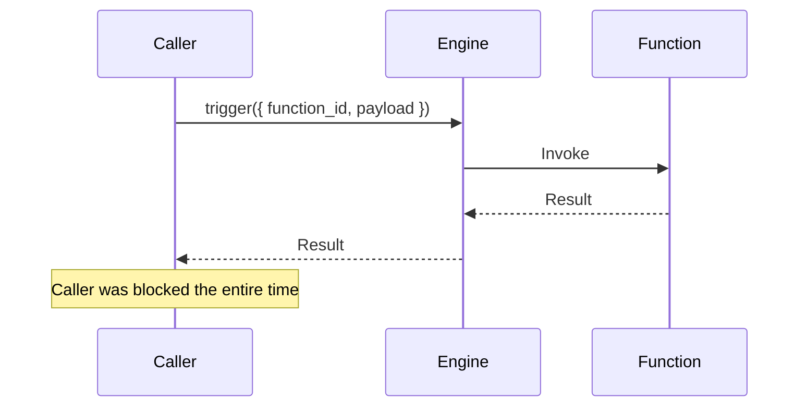
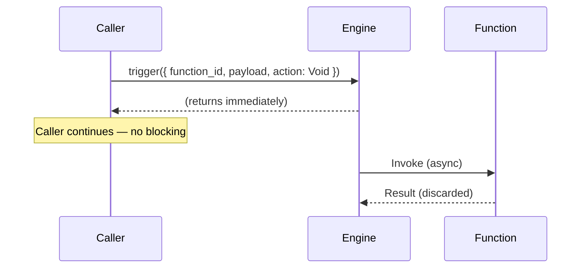
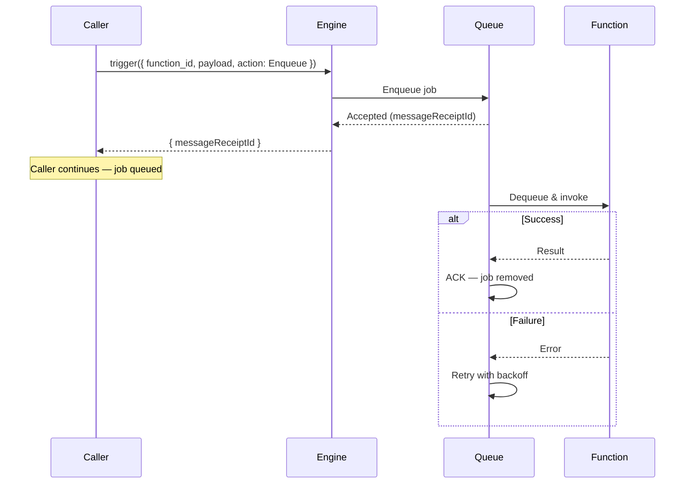
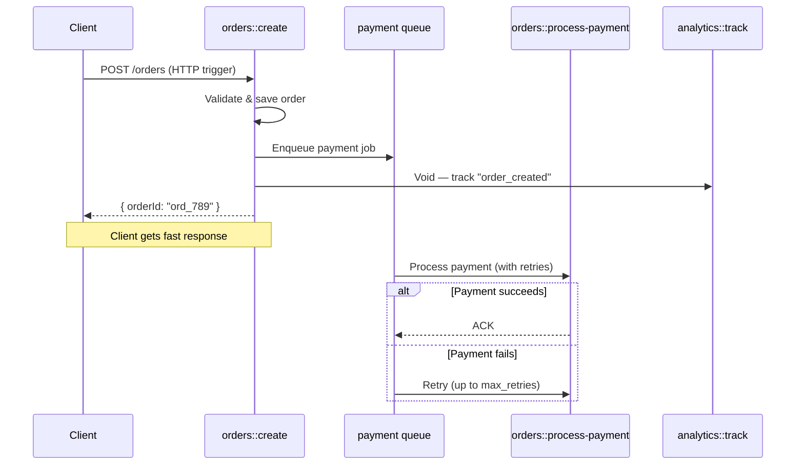
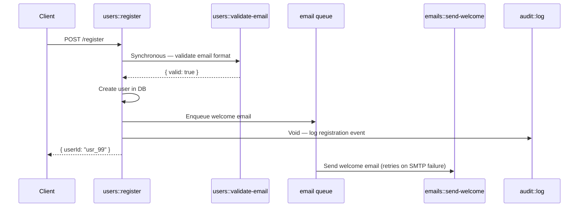
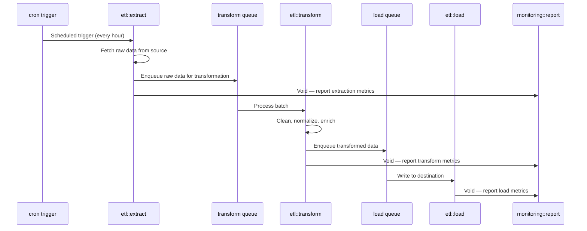
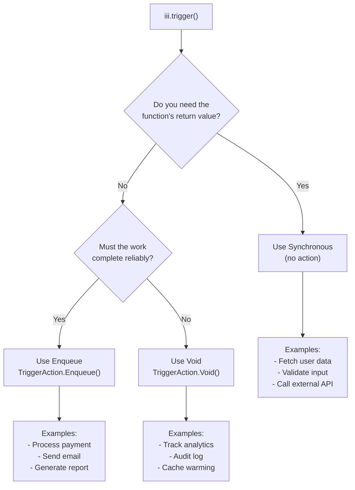

## Overview

Every call to `trigger()` can behave in one of three fundamentally different ways depending on the **action** you pass. Choosing the right action determines whether the caller blocks, whether the work is queued with retries, or whether the message is simply dispatched and forgotten.

| Action | Caller blocks? | Retries? | Returns |
|--------|---------------|----------|---------|
| _(none)_ — Synchronous | Yes | No | Function result |
| `Void` — Fire-and-forget | No | No | `None` / `null` |
| `Enqueue` — Named queue | No | Yes | `{ messageReceiptId }` |

Understanding these three modes is critical because they affect latency, reliability, ordering, and error handling across your entire system.

## The Three Trigger Actions

### 1. Synchronous (no action)

When you omit the `action` field, `trigger()` performs a **direct, synchronous invocation**. The caller sends the request to the engine, the engine routes it to the target function, and the caller blocks until the function returns a result or the timeout expires.



<Tabs>
<Tab title="Node / TypeScript">
```typescript
import { registerWorker } from 'iii-sdk'

const iii = registerWorker(process.env.III_URL ?? 'ws://localhost:49134')

const result = await iii.trigger({
  function_id: 'users::get',
  payload: { id: 'usr_42' },
  timeoutMs: 5000,
})

console.log(result.name) // "Alice"
```
</Tab>
<Tab title="Python">
```python
from iii import register_worker

iii = register_worker("ws://localhost:49134")

result = iii.trigger({
    "function_id": "users::get",
    "payload": {"id": "usr_42"},
    "timeout_ms": 5000,
})

print(result["name"])  # "Alice"
```
</Tab>
<Tab title="Rust">
```rust
use iii_sdk::{register_worker, InitOptions, TriggerRequest};
use serde_json::json;

let iii = register_worker("ws://localhost:49134", InitOptions::default());

let result = iii.trigger(TriggerRequest {
    function_id: "users::get".to_string(),
    payload: json!({ "id": "usr_42" }),
    action: None,
    timeout_ms: Some(5000),
}).await?;

println!("{}", result["name"]); // "Alice"
```
</Tab>
</Tabs>

**When to use synchronous triggers:**

- You need the function's return value to continue (e.g. fetching data, validating input)
- The operation is fast and the caller can afford to wait
- You want errors to propagate directly to the caller
- Request/response APIs like HTTP endpoints that must return data to a client

### 2. Void (fire-and-forget)

`TriggerAction.Void()` tells the engine to dispatch the invocation but **not wait for a result**. The caller continues immediately. If the target function fails, the caller is unaware — there are no retries and no acknowledgement.



<Tabs>
<Tab title="Node / TypeScript">
```typescript
import { registerWorker, TriggerAction } from 'iii-sdk'

const iii = registerWorker(process.env.III_URL ?? 'ws://localhost:49134')

await iii.trigger({
  function_id: 'analytics::track-event',
  payload: { event: 'page_view', userId: 'usr_42', page: '/dashboard' },
  action: TriggerAction.Void(),
})
// Execution continues immediately — no waiting for analytics to complete
```
</Tab>
<Tab title="Python">
```python
from iii import register_worker, TriggerAction

iii = register_worker("ws://localhost:49134")

iii.trigger({
    "function_id": "analytics::track-event",
    "payload": {"event": "page_view", "userId": "usr_42", "page": "/dashboard"},
    "action": TriggerAction.Void(),
})
# Execution continues immediately
```
</Tab>
<Tab title="Rust">
```rust
use iii_sdk::{register_worker, InitOptions, TriggerAction, TriggerRequest};
use serde_json::json;

let iii = register_worker("ws://localhost:49134", InitOptions::default());

iii.trigger(TriggerRequest {
    function_id: "analytics::track-event".to_string(),
    payload: json!({
        "event": "page_view",
        "userId": "usr_42",
        "page": "/dashboard",
    }),
    action: Some(TriggerAction::Void),
    timeout_ms: None,
}).await?;
// Execution continues immediately
```
</Tab>
</Tabs>

**When to use Void:**

- The caller does not need a response
- Losing the occasional message is acceptable (best-effort delivery)
- You want minimal latency impact on the caller's hot path
- Side effects like logging, analytics, non-critical notifications

### 3. Enqueue (named queue)

`TriggerAction.Enqueue({ queue: 'name' })` routes the invocation through a **named queue** configured in `iii-config.yaml`, check how to [create queues in more detail](./use-queues). The caller receives an acknowledgement (`messageReceiptId`) once the engine accepts the job but does not wait for it to be processed. The queue provides retries, concurrency control, backoff, and optional FIFO ordering. If all retries are exhausted, the job moves to a dead letter queue.



<Tabs>
<Tab title="Node / TypeScript">
```typescript
import { registerWorker, TriggerAction } from 'iii-sdk'

const iii = registerWorker(process.env.III_URL ?? 'ws://localhost:49134')

const receipt = await iii.trigger({
  function_id: 'orders::process-payment',
  payload: { orderId: 'ord_789', amount: 149.99, currency: 'USD' },
  action: TriggerAction.Enqueue({ queue: 'payment' }),
})

console.log(receipt.messageReceiptId) // "msg_abc123"
```
</Tab>
<Tab title="Python">
```python
from iii import register_worker, TriggerAction

iii = register_worker("ws://localhost:49134")

receipt = iii.trigger({
    "function_id": "orders::process-payment",
    "payload": {"orderId": "ord_789", "amount": 149.99, "currency": "USD"},
    "action": TriggerAction.Enqueue(queue="payment"),
})

print(receipt["messageReceiptId"])  # "msg_abc123"
```
</Tab>
<Tab title="Rust">
```rust
use iii_sdk::{register_worker, InitOptions, TriggerAction, TriggerRequest};
use serde_json::json;

let iii = register_worker("ws://localhost:49134", InitOptions::default());

let receipt = iii.trigger(TriggerRequest {
    function_id: "orders::process-payment".to_string(),
    payload: json!({
        "orderId": "ord_789",
        "amount": 149.99,
        "currency": "USD",
    }),
    action: Some(TriggerAction::Enqueue { queue: "payment".to_string() }),
    timeout_ms: None,
}).await?;

println!("{}", receipt["messageReceiptId"]); // "msg_abc123"
```
</Tab>
</Tabs>

**When to use Enqueue:**

- The work is expensive or slow and you do not want to block the caller
- You need automatic retries with backoff on failure
- You need concurrency control over how many jobs run in parallel
- You need FIFO ordering guarantees (e.g. financial transactions)
- You want failed jobs preserved in a dead letter queue for later inspection

## Key Differences at a Glance

| Dimension | Synchronous | Void | Enqueue |
|-----------|------------|------|---------|
| **Caller blocks** | Yes — waits for result | No | No |
| **Returns** | Function return value | `null` / `None` | `{ messageReceiptId }` |
| **Error propagation** | Errors reach the caller directly | Errors are silent to the caller | Retried automatically; DLQ on exhaustion |
| **Retries** | None — caller handles retry logic | None | Configurable (`max_retries`, `backoff_ms`) |
| **Ordering** | Sequential by nature | No guarantees | Optional FIFO with `message_group_field` |
| **Concurrency control** | N/A | N/A | Configurable per queue |
| **Use case** | Read data, validate, RPC | Analytics, logs, non-critical side effects | Payments, emails, heavy processing |

## Real-World Scenarios

### Scenario 1: E-Commerce Order Flow

An order API must respond fast, payment processing must be reliable, and analytics can be best-effort.



<Tabs>
<Tab title="Node / TypeScript">
```typescript
import { registerWorker, TriggerAction, Logger } from 'iii-sdk'

const iii = registerWorker(process.env.III_URL ?? 'ws://localhost:49134')

iii.registerFunction({ id: 'orders::create' }, async (req) => {
  const logger = new Logger()
  const order = { id: crypto.randomUUID(), ...req.body }

  // Reliable payment processing — enqueued with retries
  await iii.trigger({
    function_id: 'orders::process-payment',
    payload: order,
    action: TriggerAction.Enqueue({ queue: 'payment' }),
  })

  // Best-effort analytics — fire and forget
  await iii.trigger({
    function_id: 'analytics::track',
    payload: { event: 'order_created', orderId: order.id },
    action: TriggerAction.Void(),
  })

  logger.info('Order created', { orderId: order.id })
  return { status_code: 201, body: { orderId: order.id } }
})

iii.registerTrigger({
  type: 'http',
  function_id: 'orders::create',
  config: { api_path: '/orders', http_method: 'POST' },
})
```
</Tab>
<Tab title="Python">
```python
import os
import uuid

from iii import Logger, TriggerAction, register_worker

iii = register_worker(os.environ.get("III_URL", "ws://localhost:49134"))


def create_order(req):
    logger = Logger()
    order = {"id": str(uuid.uuid4()), **req.get("body", {})}

    # Reliable payment processing — enqueued with retries
    iii.trigger({
        "function_id": "orders::process-payment",
        "payload": order,
        "action": TriggerAction.Enqueue(queue="payment"),
    })

    # Best-effort analytics — fire and forget
    iii.trigger({
        "function_id": "analytics::track",
        "payload": {"event": "order_created", "orderId": order["id"]},
        "action": TriggerAction.Void(),
    })

    logger.info("Order created", {"orderId": order["id"]})
    return {"status_code": 201, "body": {"orderId": order["id"]}}


fn = iii.register_function({"id": "orders::create"}, create_order)

iii.register_trigger({
    "type": "http",
    "function_id": fn.id,
    "config": {"api_path": "/orders", "http_method": "POST"},
})
```
</Tab>
<Tab title="Rust">
```rust
use iii_sdk::{
    register_worker, InitOptions, Logger, RegisterFunctionMessage,
    RegisterTriggerInput, TriggerAction, TriggerRequest,
};
use serde_json::{json, Value};

let iii = register_worker("ws://localhost:49134", InitOptions::default());

let iii_clone = iii.clone();
iii.register_function(
    RegisterFunctionMessage {
        id: "orders::create".into(), description: None,
        request_format: None, response_format: None,
        metadata: None, invocation: None,
    },
    move |req: Value| {
        let iii = iii_clone.clone();
        async move {
            let logger = Logger::new();
            let order_id = uuid::Uuid::new_v4().to_string();
            let order = json!({ "id": order_id, "items": req["body"]["items"] });

            // Reliable payment processing — enqueued with retries
            iii.trigger(TriggerRequest {
                function_id: "orders::process-payment".into(),
                payload: order.clone(),
                action: Some(TriggerAction::Enqueue { queue: "payment".into() }),
                timeout_ms: None,
            }).await?;

            // Best-effort analytics — fire and forget
            iii.trigger(TriggerRequest {
                function_id: "analytics::track".into(),
                payload: json!({ "event": "order_created", "orderId": order_id }),
                action: Some(TriggerAction::Void),
                timeout_ms: None,
            }).await?;

            logger.info("Order created", Some(json!({ "orderId": order_id })));
            Ok(json!({ "status_code": 201, "body": { "orderId": order_id } }))
        }
    },
);

iii.register_trigger(RegisterTriggerInput {
    trigger_type: "http".into(),
    function_id: "orders::create".into(),
    config: json!({ "api_path": "/orders", "http_method": "POST" }),
})?;
```
</Tab>
</Tabs>

### Scenario 2: User Registration Pipeline

Registration must return the created user (synchronous), send a welcome email reliably (enqueue), and log the event without blocking (void).



<Tabs>
<Tab title="Node / TypeScript">
```typescript
import { registerWorker, TriggerAction } from 'iii-sdk'

const iii = registerWorker(process.env.III_URL ?? 'ws://localhost:49134')

iii.registerFunction({ id: 'users::register' }, async (req) => {
  const { email, name } = req.body

  // Synchronous — need the validation result before proceeding
  const validation = await iii.trigger({
    function_id: 'users::validate-email',
    payload: { email },
  })

  if (!validation.valid) {
    return { status_code: 400, body: { error: 'Invalid email' } }
  }

  const user = await createUserInDb({ email, name })

  // Enqueue — welcome email must be delivered reliably
  await iii.trigger({
    function_id: 'emails::send-welcome',
    payload: { userId: user.id, email, name },
    action: TriggerAction.Enqueue({ queue: 'email' }),
  })

  // Void — audit log is best-effort
  await iii.trigger({
    function_id: 'audit::log',
    payload: { action: 'user_registered', userId: user.id },
    action: TriggerAction.Void(),
  })

  return { status_code: 201, body: { userId: user.id } }
})
```
</Tab>
<Tab title="Python">
```python
from iii import TriggerAction, register_worker

iii = register_worker("ws://localhost:49134")


def register_user(req):
    email = req["body"]["email"]
    name = req["body"]["name"]

    # Synchronous — need the validation result before proceeding
    validation = iii.trigger({
        "function_id": "users::validate-email",
        "payload": {"email": email},
    })

    if not validation.get("valid"):
        return {"status_code": 400, "body": {"error": "Invalid email"}}

    user = create_user_in_db({"email": email, "name": name})

    # Enqueue — welcome email must be delivered reliably
    iii.trigger({
        "function_id": "emails::send-welcome",
        "payload": {"userId": user["id"], "email": email, "name": name},
        "action": TriggerAction.Enqueue(queue="email"),
    })

    # Void — audit log is best-effort
    iii.trigger({
        "function_id": "audit::log",
        "payload": {"action": "user_registered", "userId": user["id"]},
        "action": TriggerAction.Void(),
    })

    return {"status_code": 201, "body": {"userId": user["id"]}}


fn = iii.register_function({"id": "users::register"}, register_user)
```
</Tab>
<Tab title="Rust">
```rust
use iii_sdk::{
    register_worker, InitOptions, RegisterFunctionMessage,
    TriggerAction, TriggerRequest,
};
use serde_json::{json, Value};

let iii = register_worker("ws://localhost:49134", InitOptions::default());

let iii_clone = iii.clone();
iii.register_function(
    RegisterFunctionMessage {
        id: "users::register".into(), description: None,
        request_format: None, response_format: None,
        metadata: None, invocation: None,
    },
    move |req: Value| {
        let iii = iii_clone.clone();
        async move {
            let email = req["body"]["email"].as_str().unwrap_or("");
            let name = req["body"]["name"].as_str().unwrap_or("");

            // Synchronous — need the validation result before proceeding
            let validation = iii.trigger(TriggerRequest {
                function_id: "users::validate-email".into(),
                payload: json!({ "email": email }),
                action: None,
                timeout_ms: None,
            }).await?;

            if validation["valid"].as_bool() != Some(true) {
                return Ok(json!({ "status_code": 400, "body": { "error": "Invalid email" } }));
            }

            let user = create_user_in_db(email, name).await;

            // Enqueue — welcome email must be delivered reliably
            iii.trigger(TriggerRequest {
                function_id: "emails::send-welcome".into(),
                payload: json!({ "userId": user.id, "email": email, "name": name }),
                action: Some(TriggerAction::Enqueue { queue: "email".into() }),
                timeout_ms: None,
            }).await?;

            // Void — audit log is best-effort
            iii.trigger(TriggerRequest {
                function_id: "audit::log".into(),
                payload: json!({ "action": "user_registered", "userId": user.id }),
                action: Some(TriggerAction::Void),
                timeout_ms: None,
            }).await?;

            Ok(json!({ "status_code": 201, "body": { "userId": user.id } }))
        }
    },
);
```
</Tab>
</Tabs>

### Scenario 3: Multi-Step Data Pipeline

An ETL pipeline where each stage hands off to the next via queues, with monitoring dispatched as void.



<Tabs>
<Tab title="Node / TypeScript">
```typescript
import { registerWorker, TriggerAction, Logger } from 'iii-sdk'

const iii = registerWorker(process.env.III_URL ?? 'ws://localhost:49134')

iii.registerFunction({ id: 'etl::extract' }, async () => {
  const logger = new Logger()
  const rawData = await fetchFromSource()

  // Reliable handoff — transform stage must not lose data
  await iii.trigger({
    function_id: 'etl::transform',
    payload: { records: rawData, extractedAt: Date.now() },
    action: TriggerAction.Enqueue({ queue: 'etl-transform' }),
  })

  // Best-effort monitoring
  await iii.trigger({
    function_id: 'monitoring::report',
    payload: { stage: 'extract', recordCount: rawData.length },
    action: TriggerAction.Void(),
  })

  logger.info('Extraction complete', { records: rawData.length })
})

iii.registerTrigger({
  type: 'cron',
  function_id: 'etl::extract',
  config: { expression: '0 * * * *' },
})
```
</Tab>
<Tab title="Python">
```python
from iii import Logger, TriggerAction, register_worker

iii = register_worker("ws://localhost:49134")


def extract(_data):
    logger = Logger()
    raw_data = fetch_from_source()

    # Reliable handoff — transform stage must not lose data
    iii.trigger({
        "function_id": "etl::transform",
        "payload": {"records": raw_data, "extractedAt": time.time()},
        "action": TriggerAction.Enqueue(queue="etl-transform"),
    })

    # Best-effort monitoring
    iii.trigger({
        "function_id": "monitoring::report",
        "payload": {"stage": "extract", "recordCount": len(raw_data)},
        "action": TriggerAction.Void(),
    })

    logger.info("Extraction complete", {"records": len(raw_data)})


fn = iii.register_function({"id": "etl::extract"}, extract)

iii.register_trigger({
    "type": "cron",
    "function_id": fn.id,
    "config": {"expression": "0 * * * *"},
})
```
</Tab>
<Tab title="Rust">
```rust
use iii_sdk::{
    register_worker, InitOptions, Logger, RegisterFunctionMessage,
    RegisterTriggerInput, TriggerAction, TriggerRequest,
};
use serde_json::{json, Value};

let iii = register_worker("ws://localhost:49134", InitOptions::default());

let iii_clone = iii.clone();
iii.register_function(
    RegisterFunctionMessage {
        id: "etl::extract".into(), description: None,
        request_format: None, response_format: None,
        metadata: None, invocation: None,
    },
    move |_: Value| {
        let iii = iii_clone.clone();
        async move {
            let logger = Logger::new();
            let raw_data = fetch_from_source().await;

            // Reliable handoff — transform stage must not lose data
            iii.trigger(TriggerRequest {
                function_id: "etl::transform".into(),
                payload: json!({ "records": raw_data, "extractedAt": now_ms() }),
                action: Some(TriggerAction::Enqueue { queue: "etl-transform".into() }),
                timeout_ms: None,
            }).await?;

            // Best-effort monitoring
            iii.trigger(TriggerRequest {
                function_id: "monitoring::report".into(),
                payload: json!({ "stage": "extract", "recordCount": raw_data.len() }),
                action: Some(TriggerAction::Void),
                timeout_ms: None,
            }).await?;

            logger.info("Extraction complete", Some(json!({ "records": raw_data.len() })));
            Ok(json!(null))
        }
    },
);

iii.register_trigger(RegisterTriggerInput {
    trigger_type: "cron".into(),
    function_id: "etl::extract".into(),
    config: json!({ "expression": "0 * * * *" }),
})?;
```
</Tab>
</Tabs>

## Decision Flowchart

Use this mental model when deciding which action to use:



## Combining Actions in a Single Function

A single function can use all three actions. This is common in orchestrator functions that coordinate multiple downstream services.

<Tabs>
<Tab title="Node / TypeScript">
```typescript
import { registerWorker, TriggerAction, Logger } from 'iii-sdk'

const iii = registerWorker(process.env.III_URL ?? 'ws://localhost:49134')

iii.registerFunction({ id: 'checkout::process' }, async (cart) => {
  const logger = new Logger()

  // 1. Synchronous — validate inventory before charging
  const inventory = await iii.trigger({
    function_id: 'inventory::check',
    payload: { items: cart.items },
  })

  if (!inventory.available) {
    return { status_code: 409, body: { error: 'Items out of stock' } }
  }

  // 2. Synchronous — charge the customer (need confirmation)
  const charge = await iii.trigger({
    function_id: 'payments::charge',
    payload: { amount: cart.total, paymentMethod: cart.paymentMethod },
  })

  // 3. Enqueue — fulfillment is slow but must complete
  await iii.trigger({
    function_id: 'fulfillment::ship',
    payload: { orderId: charge.orderId, items: cart.items },
    action: TriggerAction.Enqueue({ queue: 'fulfillment' }),
  })

  // 4. Enqueue — confirmation email must be delivered
  await iii.trigger({
    function_id: 'emails::order-confirmation',
    payload: { email: cart.email, orderId: charge.orderId },
    action: TriggerAction.Enqueue({ queue: 'email' }),
  })

  // 5. Void — analytics can be best-effort
  await iii.trigger({
    function_id: 'analytics::track',
    payload: { event: 'checkout_complete', orderId: charge.orderId },
    action: TriggerAction.Void(),
  })

  logger.info('Checkout complete', { orderId: charge.orderId })
  return { status_code: 200, body: { orderId: charge.orderId } }
})
```
</Tab>
<Tab title="Python">
```python
from iii import Logger, TriggerAction, register_worker

iii = register_worker("ws://localhost:49134")


def process_checkout(cart):
    logger = Logger()

    # 1. Synchronous — validate inventory before charging
    inventory = iii.trigger({
        "function_id": "inventory::check",
        "payload": {"items": cart["items"]},
    })

    if not inventory.get("available"):
        return {"status_code": 409, "body": {"error": "Items out of stock"}}

    # 2. Synchronous — charge the customer (need confirmation)
    charge = iii.trigger({
        "function_id": "payments::charge",
        "payload": {"amount": cart["total"], "paymentMethod": cart["paymentMethod"]},
    })

    # 3. Enqueue — fulfillment is slow but must complete
    iii.trigger({
        "function_id": "fulfillment::ship",
        "payload": {"orderId": charge["orderId"], "items": cart["items"]},
        "action": TriggerAction.Enqueue(queue="fulfillment"),
    })

    # 4. Enqueue — confirmation email must be delivered
    iii.trigger({
        "function_id": "emails::order-confirmation",
        "payload": {"email": cart["email"], "orderId": charge["orderId"]},
        "action": TriggerAction.Enqueue(queue="email"),
    })

    # 5. Void — analytics can be best-effort
    iii.trigger({
        "function_id": "analytics::track",
        "payload": {"event": "checkout_complete", "orderId": charge["orderId"]},
        "action": TriggerAction.Void(),
    })

    logger.info("Checkout complete", {"orderId": charge["orderId"]})
    return {"status_code": 200, "body": {"orderId": charge["orderId"]}}


iii.register_function({"id": "checkout::process"}, process_checkout)
```
</Tab>
<Tab title="Rust">
```rust
use iii_sdk::{
    register_worker, InitOptions, Logger, RegisterFunctionMessage,
    TriggerAction, TriggerRequest,
};
use serde_json::{json, Value};

let iii = register_worker("ws://localhost:49134", InitOptions::default());

let iii_clone = iii.clone();
iii.register_function(
    RegisterFunctionMessage {
        id: "checkout::process".into(), description: None,
        request_format: None, response_format: None,
        metadata: None, invocation: None,
    },
    move |cart: Value| {
        let iii = iii_clone.clone();
        async move {
            let logger = Logger::new();

            // 1. Synchronous — validate inventory before charging
            let inventory = iii.trigger(TriggerRequest {
                function_id: "inventory::check".into(),
                payload: json!({ "items": cart["items"] }),
                action: None,
                timeout_ms: None,
            }).await?;

            if inventory["available"].as_bool() != Some(true) {
                return Ok(json!({
                    "status_code": 409,
                    "body": { "error": "Items out of stock" },
                }));
            }

            // 2. Synchronous — charge the customer (need confirmation)
            let charge = iii.trigger(TriggerRequest {
                function_id: "payments::charge".into(),
                payload: json!({
                    "amount": cart["total"],
                    "paymentMethod": cart["paymentMethod"],
                }),
                action: None,
                timeout_ms: None,
            }).await?;

            let order_id = charge["orderId"].as_str().unwrap_or("");

            // 3. Enqueue — fulfillment is slow but must complete
            iii.trigger(TriggerRequest {
                function_id: "fulfillment::ship".into(),
                payload: json!({ "orderId": order_id, "items": cart["items"] }),
                action: Some(TriggerAction::Enqueue { queue: "fulfillment".into() }),
                timeout_ms: None,
            }).await?;

            // 4. Enqueue — confirmation email must be delivered
            iii.trigger(TriggerRequest {
                function_id: "emails::order-confirmation".into(),
                payload: json!({ "email": cart["email"], "orderId": order_id }),
                action: Some(TriggerAction::Enqueue { queue: "email".into() }),
                timeout_ms: None,
            }).await?;

            // 5. Void — analytics can be best-effort
            iii.trigger(TriggerRequest {
                function_id: "analytics::track".into(),
                payload: json!({ "event": "checkout_complete", "orderId": order_id }),
                action: Some(TriggerAction::Void),
                timeout_ms: None,
            }).await?;

            logger.info("Checkout complete", Some(json!({ "orderId": order_id })));
            Ok(json!({ "status_code": 200, "body": { "orderId": order_id } }))
        }
    },
);
```
</Tab>
</Tabs>

## SDK Syntax Reference

<Tabs>
<Tab title="Node / TypeScript">
```typescript
import { TriggerAction } from 'iii-sdk'

// Synchronous (default)
const result = await iii.trigger({
  function_id: 'my-function',
  payload: { key: 'value' },
})

// Void
await iii.trigger({
  function_id: 'my-function',
  payload: { key: 'value' },
  action: TriggerAction.Void(),
})

// Enqueue
const receipt = await iii.trigger({
  function_id: 'my-function',
  payload: { key: 'value' },
  action: TriggerAction.Enqueue({ queue: 'my-queue' }),
})
```
</Tab>
<Tab title="Python">
```python
from iii import TriggerAction

# Synchronous (default)
result = iii.trigger({
    "function_id": "my-function",
    "payload": {"key": "value"},
})

# Void
iii.trigger({
    "function_id": "my-function",
    "payload": {"key": "value"},
    "action": TriggerAction.Void(),
})

# Enqueue
receipt = iii.trigger({
    "function_id": "my-function",
    "payload": {"key": "value"},
    "action": TriggerAction.Enqueue(queue="my-queue"),
})
```
</Tab>
<Tab title="Rust">
```rust
use iii_sdk::{TriggerAction, TriggerRequest};
use serde_json::json;

// Synchronous (default)
let result = iii.trigger(TriggerRequest {
    function_id: "my-function".into(),
    payload: json!({ "key": "value" }),
    action: None,
    timeout_ms: None,
}).await?;

// Void
iii.trigger(TriggerRequest {
    function_id: "my-function".into(),
    payload: json!({ "key": "value" }),
    action: Some(TriggerAction::Void),
    timeout_ms: None,
}).await?;

// Enqueue
let receipt = iii.trigger(TriggerRequest {
    function_id: "my-function".into(),
    payload: json!({ "key": "value" }),
    action: Some(TriggerAction::Enqueue { queue: "my-queue".into() }),
    timeout_ms: None,
}).await?;
```
</Tab>
</Tabs>

## Common Mistakes

<AccordionGroup>
  <Accordion title="Using synchronous calls for slow, non-critical work">
    If you call a slow function synchronously inside an HTTP handler, your API response time degrades. Use `Enqueue` for work that does not need to complete before responding.

    ```typescript
    // Bad — blocks the HTTP response for 10+ seconds
    const report = await iii.trigger({
      function_id: 'reports::generate-pdf',
      payload: { userId: 'usr_42' },
    })

    // Good — respond immediately, process later
    await iii.trigger({
      function_id: 'reports::generate-pdf',
      payload: { userId: 'usr_42' },
      action: TriggerAction.Enqueue({ queue: 'reports' }),
    })
    ```
  </Accordion>

  <Accordion title="Using Void for work that must complete">
    Void provides no delivery guarantees. If the target function fails or the worker is unavailable, the message is lost. Use `Enqueue` when reliability matters.

    ```typescript
    // Bad — if the email service is down, the receipt is lost forever
    await iii.trigger({
      function_id: 'emails::send-receipt',
      payload: receiptData,
      action: TriggerAction.Void(),
    })

    // Good — queue ensures retry on failure
    await iii.trigger({
      function_id: 'emails::send-receipt',
      payload: receiptData,
      action: TriggerAction.Enqueue({ queue: 'email' }),
    })
    ```
  </Accordion>

  <Accordion title="Enqueuing work that needs an immediate response">
    Enqueue returns a receipt, not the function's result. If you need the function's return value, use a synchronous call.

    ```typescript
    // Bad — receipt does not contain the user data
    const receipt = await iii.trigger({
      function_id: 'users::get',
      payload: { id: 'usr_42' },
      action: TriggerAction.Enqueue({ queue: 'default' }),
    })
    // receipt.messageReceiptId — not what you wanted

    // Good — synchronous call returns the user
    const user = await iii.trigger({
      function_id: 'users::get',
      payload: { id: 'usr_42' },
    })
    ```
  </Accordion>
</AccordionGroup>

## Next Steps

<CardGroup cols={2}>
  <Card title="Use Queues" href="./use-queues" icon="bolt">
    Configure named queues with retries, concurrency, and FIFO ordering
  </Card>
  <Card title="Dead Letter Queues" href="./dead-letter-queues" icon="skull">
    Handle and redrive failed queue messages
  </Card>
  <Card title="Functions & Triggers" href="./use-functions-and-triggers" icon="code">
    Register functions and bind triggers to them
  </Card>
  <Card title="Trigger Types" href="./use-functions-and-triggers#trigger-types" icon="diagram-project">
    Deep dive into HTTP, queue, cron, log, and stream triggers
  </Card>
</CardGroup>
