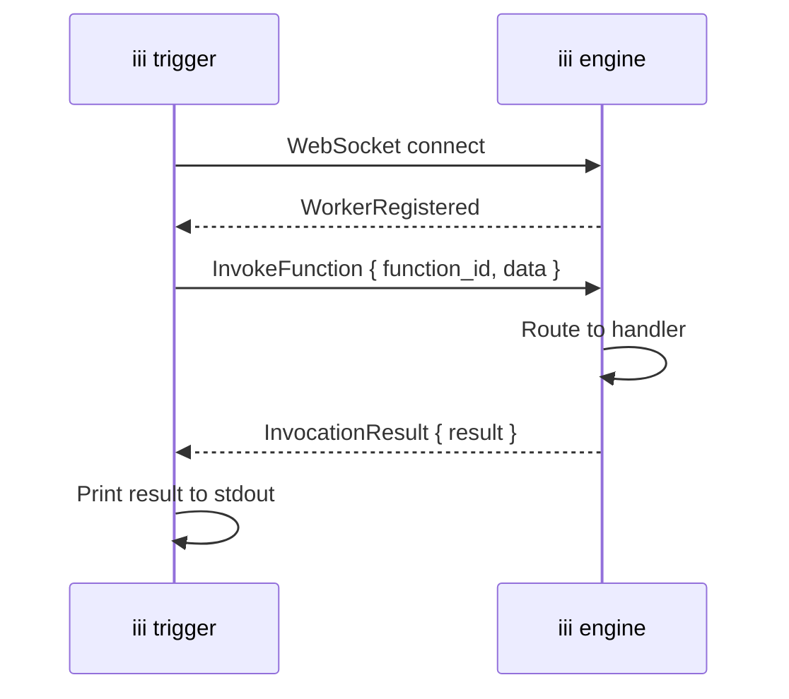

## Goal

Invoke a registered function on a running iii engine directly from the terminal, without writing application code or connecting an SDK.

## When to Use This

- Redriving dead-letter queue messages after fixing a bug
- Testing a function during development without wiring up a trigger
- Running one-off operational tasks against a live engine
- Scripting engine operations in CI/CD pipelines or shell scripts

## Command Reference

```bash
iii trigger \
  --function-id='<function_id>' \
  --payload='<json>'
```

| Flag | Required | Default | Description |
|------|----------|---------|-------------|
| `--function-id` | Yes | — | The ID of the function to invoke (e.g. `iii::queue::redrive`, `orders::process`) |
| `--payload` | Yes | — | A JSON string passed as the function's input |
| `--address` | No | `localhost` | The hostname or IP of the engine |
| `--port` | No | `49134` | The engine's WebSocket port |

## Steps

<Steps>
  <Step title="Ensure the engine is running">
    The `iii trigger` command connects to a running engine instance. If you don't have one running yet, follow the [Quickstart](../quickstart) to get started.
  </Step>
  <Step title="Identify the function ID">
    Every function registered with the engine has a unique ID. Builtin functions use the `iii::` prefix. User-defined functions use the ID you specified during registration.

    Examples of function IDs:
    - `iii::queue::redrive` — builtin DLQ redrive
    - `orders::process-payment` — a user-defined function
    - `enqueue` — the builtin topic-based enqueue function
  </Step>
  <Step title="Build the payload">
    The `--payload` flag accepts a JSON string. This JSON becomes the function's input — the same data it would receive if invoked via an SDK `trigger()` call.

    ```bash
    # Simple object
    --payload='{"queue": "payment"}'

    # Nested payload
    --payload='{"orderId": "ord_789", "amount": 149.99, "currency": "USD"}'

    # Empty payload (for functions that don't require input)
    --payload='{}'
    ```

    The CLI validates that the payload is valid JSON before connecting to the engine. Invalid JSON produces an immediate error.
  </Step>
  <Step title="Run the command">
    ```bash
    iii trigger \
      --function-id='iii::queue::redrive' \
      --payload='{"queue": "payment"}'
    ```

    The CLI connects to the engine over WebSocket, sends the invocation, and waits for the result. On success, the function's return value is printed to stdout as pretty-printed JSON:

    ```json
    {
      "queue": "payment",
      "redriven": 12
    }
    ```

    If the function returns an error, it is printed to stderr and the process exits with code 1.
  </Step>
</Steps>

## Targeting a Remote Engine

By default, `iii trigger` connects to `localhost:49134`. Use `--address` and `--port` to target a different engine instance:

```bash
iii trigger \
  --function-id='iii::queue::redrive' \
  --payload='{"queue": "payment"}' \
  --address='10.0.1.5' \
  --port=49134
```

## How It Works

The `iii trigger` command operates as a lightweight WebSocket client:



The CLI connects to the engine's WebSocket endpoint (the same protocol SDKs use), waits for the `WorkerRegistered` handshake, sends an `InvokeFunction` message with the function ID and payload, and prints the `InvocationResult` when it arrives.

<Info title="Protocol details">
  The WebSocket protocol is documented in the [Protocol reference](../advanced/protocol). The `iii trigger` command uses the same `InvokeFunction` / `InvocationResult` message pair that all SDKs use.
</Info>

## Examples

### Redrive a dead-letter queue

Move all failed messages from the `payment` queue's DLQ back to the main queue:

```bash
iii trigger \
  --function-id='iii::queue::redrive' \
  --payload='{"queue": "payment"}'
```

```json
{
  "queue": "payment",
  "redriven": 12
}
```

<Info title="DLQ guide">
  For the full workflow of inspecting and redriving failed messages, see [Use Dead Letter Queues](./dead-letter-queues#redrive-messages).
</Info>

### Invoke a user-defined function

Trigger any function registered by your workers:

```bash
iii trigger \
  --function-id='orders::process-payment' \
  --payload='{"orderId": "ord_789", "amount": 149.99, "currency": "USD"}'
```

### Publish to a topic-based queue

Use the builtin `enqueue` function to publish a message to a topic:

```bash
iii trigger \
  --function-id='enqueue' \
  --payload='{"topic": "order.created", "data": {"orderId": "ord_789"}}'
```

### Use in a shell script

```bash
#!/bin/bash
QUEUES=("payment" "email" "notifications")

for queue in "${QUEUES[@]}"; do
  echo "Redriving $queue..."
  iii trigger \
    --function-id='iii::queue::redrive' \
    --payload="{\"queue\": \"$queue\"}"
done
```

## Error Handling

| Scenario | Behavior |
|----------|----------|
| Invalid JSON in `--payload` | Error printed immediately, no connection attempted |
| Engine not running (connection refused) | Error with the target address and port |
| Function not found | Engine returns a `function_not_found` error, printed to stderr |
| Function returns an error | Error body printed to stderr, exit code 1 |
| Connection drops before result | Error indicating the connection closed unexpectedly |

## Next Steps

<CardGroup cols={2}>
  <Card title="Trigger Actions" href="./trigger-actions" icon="bolt">
    Compare synchronous, Void, and Enqueue invocation modes from SDKs
  </Card>
  <Card title="Dead Letter Queues" href="./dead-letter-queues" icon="skull">
    Inspect and redrive failed queue messages
  </Card>
  <Card title="Queue Module Reference" href="../modules/module-queue" icon="gear">
    Full reference for builtin queue functions including `iii::queue::redrive`
  </Card>
  <Card title="Protocol Reference" href="../advanced/protocol" icon="code">
    WebSocket message catalog and envelope format
  </Card>
</CardGroup>
