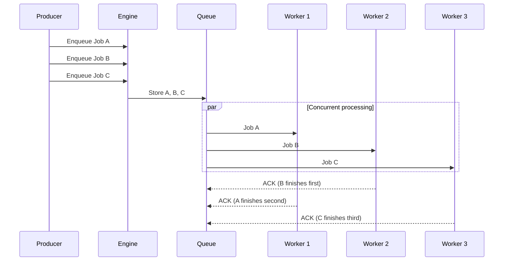
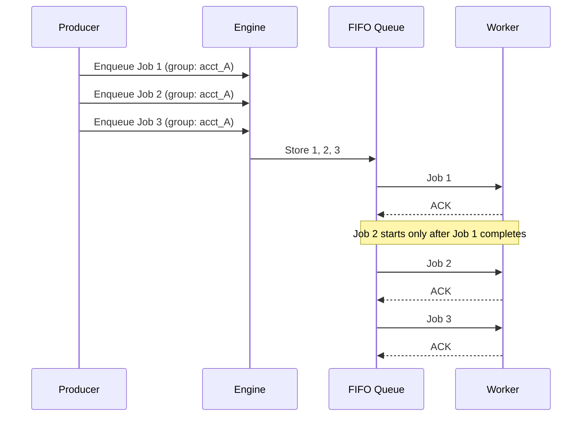
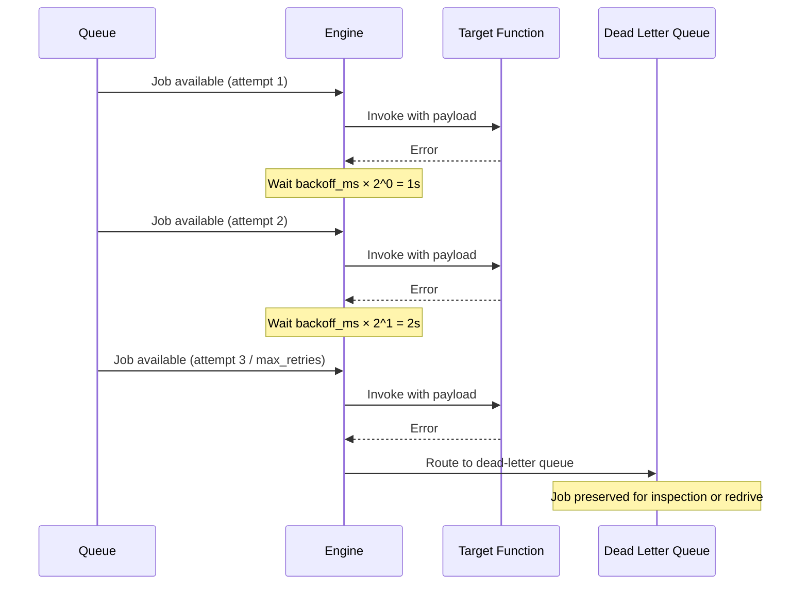
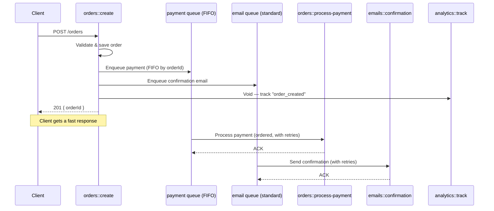
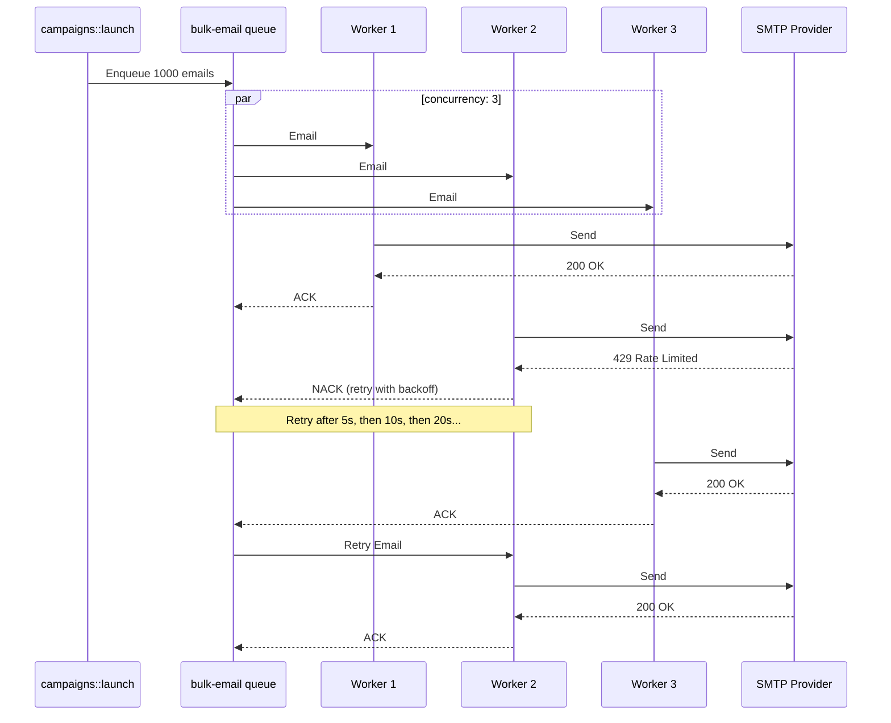

## Goal

Offload work to a named queue so it runs asynchronously with built-in retries, concurrency control, and optional FIFO ordering. Target functions receive data normally — no handler changes required.

<Info title="Trigger actions primer">
  Queues use the `Enqueue` trigger action. If you are new to trigger actions, read [Trigger Actions](./trigger-actions) first to understand the difference between synchronous, Void, and Enqueue invocations.
</Info>

## Steps

<Steps>
  <Step title="Define named queues in config">
    Declare one or more named queues under `queue_configs` in your `iii-config.yaml`. Each queue has independent retry, concurrency, and ordering settings.

    ```yaml title="iii-config.yaml"
    modules:
      - class: modules::queue::QueueModule
        config:
          queue_configs:
            default:
              max_retries: 5
              concurrency: 10
              type: standard
            payment:
              max_retries: 10
              concurrency: 2
              type: fifo
              message_group_field: transaction_id
            email:
              max_retries: 8
              concurrency: 5
              type: standard
              backoff_ms: 2000
          adapter:
            class: modules::queue::BuiltinQueueAdapter
            config:
              store_method: file_based
              file_path: ./data/queue_store
    ```

    You can define as many named queues as your system requires. Each queue name is referenced when enqueuing work.

    <Info title="Full configuration reference">
      See the [Queue module reference](../modules/module-queue#queue-configuration) for every field, type, and default value.
    </Info>
  </Step>

  <Step title="Enqueue work via trigger action">
    From any function, enqueue a job by calling `trigger()` with `TriggerAction.Enqueue` and the target queue name. The caller does not wait for the job to be processed — it receives an acknowledgement (`messageReceiptId`) once the engine accepts the job.

    <Tabs>
    <Tab title="Node / TypeScript">
    ```typescript
    import { registerWorker, TriggerAction } from 'iii-sdk'

    const iii = registerWorker(process.env.III_URL ?? 'ws://localhost:49134')

    const receipt = await iii.trigger({
      function_id: 'orders::process-payment',
      payload: { orderId: 'ord_789', amount: 149.99, currency: 'USD' },
      action: TriggerAction.Enqueue({ queue: 'payment' }),
    })

    console.log(receipt.messageReceiptId) // "msg_abc123"
    ```
    </Tab>
    <Tab title="Python">
    ```python
    from iii import register_worker, TriggerAction

    iii = register_worker("ws://localhost:49134")

    receipt = iii.trigger({
        "function_id": "orders::process-payment",
        "payload": {"orderId": "ord_789", "amount": 149.99, "currency": "USD"},
        "action": TriggerAction.Enqueue(queue="payment"),
    })

    print(receipt["messageReceiptId"])  # "msg_abc123"
    ```
    </Tab>
    <Tab title="Rust">
    ```rust
    use iii_sdk::{register_worker, InitOptions, TriggerAction, TriggerRequest};
    use serde_json::json;

    let iii = register_worker("ws://localhost:49134", InitOptions::default());

    let receipt = iii.trigger(TriggerRequest {
        function_id: "orders::process-payment".to_string(),
        payload: json!({
            "orderId": "ord_789",
            "amount": 149.99,
            "currency": "USD",
        }),
        action: Some(TriggerAction::Enqueue { queue: "payment".to_string() }),
        timeout_ms: None,
    }).await?;

    println!("{}", receipt["messageReceiptId"]); // "msg_abc123"
    ```
    </Tab>
    </Tabs>

    The target function (`orders::process-payment` in this example) receives the `payload` as its input — it does not need to know it was invoked via a queue.

    <Info title="Why Enqueue returns a receipt">
      Unlike `TriggerAction.Void()` which is fire-and-forget, `Enqueue` validates the queue exists and (for FIFO) checks the `message_group_field`. The `messageReceiptId` lets you correlate enqueue operations with DLQ entries or retry events. See [Trigger Actions](./trigger-actions#3-enqueue-named-queue) for a detailed comparison.
    </Info>
  </Step>

  <Step title="Handle the enqueue result">
    The enqueue call can fail synchronously if the queue name is unknown or FIFO validation fails. Always handle the result.

    <Tabs>
    <Tab title="Node / TypeScript">
    ```typescript
    try {
      const receipt = await iii.trigger({
        function_id: 'orders::process-payment',
        payload: { orderId: 'ord_789', amount: 149.99 },
        action: TriggerAction.Enqueue({ queue: 'payment' }),
      })
      console.log('Enqueued:', receipt.messageReceiptId)
    } catch (err) {
      if (err.enqueue_error) {
        console.error('Queue rejected job:', err.enqueue_error)
      }
    }
    ```
    </Tab>
    <Tab title="Python">
    ```python
    try:
        receipt = iii.trigger({
            "function_id": "orders::process-payment",
            "payload": {"orderId": "ord_789", "amount": 149.99},
            "action": TriggerAction.Enqueue(queue="payment"),
        })
        print("Enqueued:", receipt["messageReceiptId"])
    except Exception as e:
        print("Queue rejected job:", e)
    ```
    </Tab>
    <Tab title="Rust">
    ```rust
    match iii.trigger(TriggerRequest {
        function_id: "orders::process-payment".to_string(),
        payload: json!({ "orderId": "ord_789", "amount": 149.99 }),
        action: Some(TriggerAction::Enqueue { queue: "payment".to_string() }),
        timeout_ms: None,
    }).await {
        Ok(receipt) => println!("Enqueued: {}", receipt["messageReceiptId"]),
        Err(e) => eprintln!("Queue rejected job: {}", e),
    }
    ```
    </Tab>
    </Tabs>

    Common rejection reasons:
    - The queue name does not exist in `queue_configs`
    - A FIFO queue's `message_group_field` is missing or `null` in the payload
  </Step>

  <Step title="Use FIFO queues for ordered processing">
    When processing order matters — for example, financial transactions for the same account — use a FIFO queue. Set `type: fifo` and specify `message_group_field`, the field in your payload whose value determines the ordering group. Jobs sharing the same group value are processed strictly in order.

    ```yaml title="iii-config.yaml (excerpt)"
    queue_configs:
      payment:
        max_retries: 10
        concurrency: 2
        type: fifo
        message_group_field: transaction_id
    ```

    The payload **must** contain the field named by `message_group_field`, and its value must be non-null. The engine rejects enqueue requests that violate this.

    <Tabs>
    <Tab title="Node / TypeScript">
    ```typescript
    await iii.trigger({
      function_id: 'payments::process',
      payload: { transaction_id: 'txn-abc-123', amount: 49.99, currency: 'USD' },
      action: TriggerAction.Enqueue({ queue: 'payment' }),
    })
    ```
    </Tab>
    <Tab title="Python">
    ```python
    iii.trigger({
        "function_id": "payments::process",
        "payload": {
            "transaction_id": "txn-abc-123",
            "amount": 49.99,
            "currency": "USD",
        },
        "action": TriggerAction.Enqueue(queue="payment"),
    })
    ```
    </Tab>
    <Tab title="Rust">
    ```rust
    iii.trigger(TriggerRequest {
        function_id: "payments::process".to_string(),
        payload: json!({
            "transaction_id": "txn-abc-123",
            "amount": 49.99,
            "currency": "USD",
        }),
        action: Some(TriggerAction::Enqueue { queue: "payment".to_string() }),
        timeout_ms: None,
    }).await?;
    ```
    </Tab>
    </Tabs>
  </Step>

  <Step title="Configure retries and backoff">
    Every named queue retries failed jobs automatically. Configure `max_retries` (total delivery attempts before the job moves to the dead-letter queue) and `backoff_ms` (base delay between retries). Backoff is exponential:

    ```
    delay = backoff_ms × 2^(attempt - 1)
    ```

    | Attempt | `backoff_ms: 1000` | `backoff_ms: 2000` |
    |---------|--------------------|--------------------|
    | 1       | 1 000 ms           | 2 000 ms           |
    | 2       | 2 000 ms           | 4 000 ms           |
    | 3       | 4 000 ms           | 8 000 ms           |
    | 4       | 8 000 ms           | 16 000 ms          |
    | 5       | 16 000 ms          | 32 000 ms          |

    ```yaml title="iii-config.yaml (excerpt)"
    queue_configs:
      email:
        max_retries: 8
        backoff_ms: 2000
        concurrency: 5
        type: standard
    ```

    After all retries are exhausted, the job moves to a dead-letter queue (DLQ) where it is preserved for inspection or manual reprocessing.

    <Info title="Dead letter queues">
      See [Manage Failed Triggers](./dead-letter-queues) for DLQ configuration, inspection, and redrive.
    </Info>
  </Step>

  <Step title="Control concurrency">
    The `concurrency` field sets the maximum number of jobs the engine processes simultaneously from a single queue. This applies per-engine-instance.

    ```yaml title="iii-config.yaml (excerpt)"
    queue_configs:
      default:
        concurrency: 10    # up to 10 jobs in parallel
        type: standard
      payment:
        concurrency: 2     # ignored for ordering — FIFO uses prefetch=1
        type: fifo
        message_group_field: transaction_id
    ```

    - **Standard queues**: the engine pulls up to `concurrency` jobs simultaneously.
    - **FIFO queues**: the engine processes one job at a time (prefetch=1) to preserve ordering, regardless of the `concurrency` value.

    Use low concurrency to protect downstream systems from overload (e.g. rate-limited APIs). Use high concurrency for embarrassingly parallel work (e.g. image resizing).
  </Step>
</Steps>

## Standard vs FIFO Queues

The two queue types solve fundamentally different problems. Standard queues maximize throughput. FIFO queues guarantee ordering.

| Dimension | Standard | FIFO |
|-----------|----------|------|
| **Processing model** | Up to `concurrency` jobs in parallel | One job at a time (prefetch=1) |
| **Ordering** | No guarantees — jobs may complete in any order | Strictly ordered within a message group |
| **`message_group_field`** | Not required | Required — must be present and non-null in every payload |
| **Throughput** | High — scales with `concurrency` | Lower — trades throughput for ordering |
| **Use cases** | Email sends, image processing, notifications | Payments, ledger entries, state machines |
| **Retries** | Retried independently, other jobs continue | Retried inline — blocks the queue until success or DLQ |

### Standard queue flow

Jobs are dequeued and processed concurrently. Each job is independent.



### FIFO queue flow

Jobs within the same message group are processed one at a time, strictly in order.



### Retry and dead-letter flow

When a job fails, the engine retries it with exponential backoff. After all retries exhaust, the job moves to the DLQ.



## Real-World Scenarios

### Scenario 1: E-Commerce Order Pipeline

An order API must respond fast. Payment processing is critical and must happen in order per transaction. Email confirmation should be reliable. Analytics is best-effort.

**Queue configuration:**

```yaml title="iii-config.yaml"
modules:
  - class: modules::queue::QueueModule
    config:
      queue_configs:
        payment:
          max_retries: 10
          concurrency: 2
          type: fifo
          message_group_field: orderId
        email:
          max_retries: 5
          concurrency: 10
          type: standard
          backoff_ms: 2000
      adapter:
        class: modules::queue::BuiltinQueueAdapter
        config:
          store_method: file_based
          file_path: ./data/queue_store
```



<Tabs>
<Tab title="Node / TypeScript">
```typescript
import { registerWorker, TriggerAction, Logger } from 'iii-sdk'

const iii = registerWorker(process.env.III_URL ?? 'ws://localhost:49134')

iii.registerFunction({ id: 'orders::create' }, async (req) => {
  const logger = new Logger()
  const order = { id: crypto.randomUUID(), ...req.body }

  await iii.trigger({
    function_id: 'orders::process-payment',
    payload: { orderId: order.id, amount: order.total, currency: 'USD' },
    action: TriggerAction.Enqueue({ queue: 'payment' }),
  })

  await iii.trigger({
    function_id: 'emails::confirmation',
    payload: { email: order.email, orderId: order.id },
    action: TriggerAction.Enqueue({ queue: 'email' }),
  })

  await iii.trigger({
    function_id: 'analytics::track',
    payload: { event: 'order_created', orderId: order.id },
    action: TriggerAction.Void(),
  })

  logger.info('Order created', { orderId: order.id })
  return { status_code: 201, body: { orderId: order.id } }
})

iii.registerTrigger({
  type: 'http',
  function_id: 'orders::create',
  config: { api_path: '/orders', http_method: 'POST' },
})
```
</Tab>
<Tab title="Python">
```python
import os
import uuid

from iii import Logger, TriggerAction, register_worker

iii = register_worker(os.environ.get("III_URL", "ws://localhost:49134"))


def create_order(req):
    logger = Logger()
    order = {"id": str(uuid.uuid4()), **req.get("body", {})}

    iii.trigger({
        "function_id": "orders::process-payment",
        "payload": {"orderId": order["id"], "amount": order["total"], "currency": "USD"},
        "action": TriggerAction.Enqueue(queue="payment"),
    })

    iii.trigger({
        "function_id": "emails::confirmation",
        "payload": {"email": order["email"], "orderId": order["id"]},
        "action": TriggerAction.Enqueue(queue="email"),
    })

    iii.trigger({
        "function_id": "analytics::track",
        "payload": {"event": "order_created", "orderId": order["id"]},
        "action": TriggerAction.Void(),
    })

    logger.info("Order created", {"orderId": order["id"]})
    return {"status_code": 201, "body": {"orderId": order["id"]}}


fn = iii.register_function({"id": "orders::create"}, create_order)

iii.register_trigger({
    "type": "http",
    "function_id": fn.id,
    "config": {"api_path": "/orders", "http_method": "POST"},
})
```
</Tab>
<Tab title="Rust">
```rust
use iii_sdk::{
    register_worker, InitOptions, Logger, RegisterFunctionMessage,
    RegisterTriggerInput, TriggerAction, TriggerRequest,
};
use serde_json::{json, Value};

let iii = register_worker("ws://localhost:49134", InitOptions::default());

let iii_clone = iii.clone();
iii.register_function((
    RegisterFunctionMessage::with_id("orders::create".to_string()),
    move |req: Value| {
        let iii = iii_clone.clone();
        async move {
            let logger = Logger::new();
            let order_id = uuid::Uuid::new_v4().to_string();

            iii.trigger(TriggerRequest {
                function_id: "orders::process-payment".into(),
                payload: json!({ "orderId": order_id, "amount": req["body"]["total"], "currency": "USD" }),
                action: Some(TriggerAction::Enqueue { queue: "payment".into() }),
                timeout_ms: None,
            }).await?;

            iii.trigger(TriggerRequest {
                function_id: "emails::confirmation".into(),
                payload: json!({ "email": req["body"]["email"], "orderId": order_id }),
                action: Some(TriggerAction::Enqueue { queue: "email".into() }),
                timeout_ms: None,
            }).await?;

            iii.trigger(TriggerRequest {
                function_id: "analytics::track".into(),
                payload: json!({ "event": "order_created", "orderId": order_id }),
                action: Some(TriggerAction::Void),
                timeout_ms: None,
            }).await?;

            logger.info("Order created", Some(json!({ "orderId": order_id })));
            Ok(json!({ "status_code": 201, "body": { "orderId": order_id } }))
        }
    },
);

iii.register_trigger(RegisterTriggerInput {
    trigger_type: "http".into(),
    function_id: "orders::create".into(),
    config: json!({ "api_path": "/orders", "http_method": "POST" }),
})?;
```
</Tab>
</Tabs>

This example uses all three [trigger actions](./trigger-actions): **Enqueue** for payment (reliable, ordered) and email (reliable, parallel), and **Void** for analytics (best-effort).

### Scenario 2: Bulk Email Delivery with Rate Limiting

A marketing system sends thousands of emails. The SMTP provider has a rate limit. A standard queue with low concurrency prevents overloading the provider while retrying transient SMTP failures.

**Queue configuration:**
||||||| parent of 2e8fd855 (chore: update docs)
<Tabs>
<Tab title="Node / TypeScript">
```typescript title="process-order.ts"
import { registerWorker, Logger } from 'iii-sdk'

const iii = registerWorker(process.env.III_URL ?? 'ws://localhost:49134')

iii.registerFunction({ id: 'orders::process-order' }, async (order) => {
  const logger = new Logger()
  logger.info('Processing payment', { orderId: order.id })
  // ...payment logic...
  return { processed: true }
})
```
</Tab>
<Tab title="Python">
```python title="process_order.py"
import os

from iii import Logger, register_worker

iii = register_worker(os.environ.get("III_URL", "ws://localhost:49134"))


def process_order(order):
    logger = Logger()
    logger.info("Processing payment", {"orderId": order["id"]})
    # ...payment logic...
    return {"processed": True}


iii.register_function({"id": "orders::process-order"}, process_order)
```
</Tab>
<Tab title="Rust">
```rust title="process_order.rs"
use iii_sdk::{register_worker, InitOptions, Logger, RegisterFunctionMessage};
use serde_json::json;

let iii = register_worker(
    &std::env::var("III_URL").unwrap_or_else(|_| "ws://127.0.0.1:49134".to_string()),
    InitOptions::default(),
);

iii.register_function(
    RegisterFunctionMessage {
        id: "orders::process-order".to_string(),
        description: None,
        request_format: None,
        response_format: None,
        metadata: None,
        invocation: None,
    },
    |order| async move {
        let logger = Logger::new();
        let order_id = order["id"].as_str().unwrap_or("");
        logger.info("Processing payment", Some(json!({ "orderId": order_id })));
        // ...payment logic...
        Ok(json!({ "processed": true }))
    },
);
```
</Tab>
</Tabs>

A worker can also enqueue further work, creating processing pipelines:

<Tabs>
<Tab title="Node / TypeScript">
```typescript
iii.registerFunction({ id: 'orders::process-order' }, async (order) => {
  // ...charge the customer...

  await iii.trigger({
    function_id: 'notifications::send',
    payload: { orderId: order.id, type: 'payment-confirmed' },
    action: TriggerAction.Enqueue({ queue: 'default' }),
  })

  return { processed: true }
})
```
</Tab>
<Tab title="Python">
```python
def process_order(order):
    # ...charge the customer...

    iii.trigger({
        "function_id": "notifications::send",
        "payload": {"orderId": order["id"], "type": "payment-confirmed"},
        "action": TriggerAction.Enqueue(queue="default"),
    })

    return {"processed": True}
```
</Tab>
<Tab title="Rust">
```rust
use iii_sdk::{RegisterFunctionMessage, TriggerAction, TriggerRequest};
use serde_json::json;

iii.register_function(
    RegisterFunctionMessage {
        id: "orders::process-order".to_string(),
        description: None,
        request_format: None,
        response_format: None,
        metadata: None,
        invocation: None,
    },
    |order| async move {
        iii.trigger(TriggerRequest {
            function_id: "notifications::send".to_string(),
            payload: json!({
                "orderId": order["id"],
                "type": "payment-confirmed",
            }),
            action: Some(TriggerAction::Enqueue { queue: "default".to_string() }),
            timeout_ms: None,
        })
        .await?;

        Ok(json!({ "processed": true }))
    },
);
```
</Tab>
</Tabs>

### 4. Use FIFO queues for ordered processing

When order matters (e.g. payment transactions for the same account), use a FIFO queue. Set `type: fifo` and specify `message_group_field` — the field in your job data whose value determines the ordering group. Jobs with the same group value are processed strictly in order. The field named by `message_group_field` must be present **and non-null** in every job payload — the engine rejects enqueue requests where the field is missing or null.

```yaml title="iii-config.yaml (excerpt)"
queue_configs:
  bulk-email:
    max_retries: 5
    concurrency: 3
    type: standard
    backoff_ms: 5000
```



<Tabs>
<Tab title="Node / TypeScript">
```typescript
import { registerWorker, TriggerAction } from 'iii-sdk'

const iii = registerWorker(process.env.III_URL ?? 'ws://localhost:49134')

iii.registerFunction({ id: 'campaigns::launch' }, async (campaign) => {
  for (const recipient of campaign.recipients) {
    await iii.trigger({
      function_id: 'emails::send',
      payload: {
        to: recipient.email,
        subject: campaign.subject,
        body: campaign.body,
      },
      action: TriggerAction.Enqueue({ queue: 'bulk-email' }),
    })
  }

  return { enqueued: campaign.recipients.length }
})

iii.registerFunction({ id: 'emails::send' }, async (email) => {
  const response = await fetch('https://smtp-provider.example/send', {
    method: 'POST',
    body: JSON.stringify(email),
    headers: { 'Content-Type': 'application/json' },
  })

  if (!response.ok) {
    throw new Error(`SMTP error: ${response.status}`)
  }

  return { sent: true }
})
```
</Tab>
<Tab title="Python">
```python
import requests
from iii import TriggerAction, register_worker

iii = register_worker("ws://localhost:49134")


def launch_campaign(campaign):
    for recipient in campaign["recipients"]:
        iii.trigger({
            "function_id": "emails::send",
            "payload": {
                "to": recipient["email"],
                "subject": campaign["subject"],
                "body": campaign["body"],
            },
            "action": TriggerAction.Enqueue(queue="bulk-email"),
        })

    return {"enqueued": len(campaign["recipients"])}


def send_email(email):
    response = requests.post(
        "https://smtp-provider.example/send", json=email
    )
    response.raise_for_status()
    return {"sent": True}


iii.register_function({"id": "campaigns::launch"}, launch_campaign)
iii.register_function({"id": "emails::send"}, send_email)
```
</Tab>
<Tab title="Rust">
```rust
use iii_sdk::{
    register_worker, InitOptions, RegisterFunctionMessage,
    TriggerAction, TriggerRequest,
};
use serde_json::{json, Value};

let iii = register_worker("ws://localhost:49134", InitOptions::default());

let iii_clone = iii.clone();
iii.register_function(
    RegisterFunctionMessage {
        id: "campaigns::launch".into(), description: None,
        request_format: None, response_format: None,
        metadata: None, invocation: None,
    },
    move |campaign: Value| {
        let iii = iii_clone.clone();
        async move {
            let recipients = campaign["recipients"].as_array().unwrap();
            for recipient in recipients {
                iii.trigger(TriggerRequest {
                    function_id: "emails::send".into(),
                    payload: json!({
                        "to": recipient["email"],
                        "subject": campaign["subject"],
                        "body": campaign["body"],
                    }),
                    action: Some(TriggerAction::Enqueue { queue: "bulk-email".into() }),
                    timeout_ms: None,
                }).await?;
            }
            Ok(json!({ "enqueued": recipients.len() }))
        }
    },
);
```
</Tab>
</Tabs>

With `concurrency: 3`, at most three emails are in-flight at any time. Failed sends retry with exponential backoff (5s, 10s, 20s, 40s, 80s), protecting the SMTP provider from overload.

### Scenario 3: Financial Transaction Ledger

A banking system processes account transactions. Transactions for the same account must be applied in order to prevent balance inconsistencies. Different accounts can process in parallel.

**Queue configuration:**

```yaml title="iii-config.yaml (excerpt)"
queue_configs:
  ledger:
    max_retries: 15
    concurrency: 1
    type: fifo
    message_group_field: account_id
    backoff_ms: 500
```

```mermaid
sequenceDiagram
    participant API as transactions::submit
    participant Q as ledger queue (FIFO)
    participant W as Worker
    participant DB as Database

    API->>Q: Deposit $100 (account: acct_A)
    API->>Q: Withdraw $50 (account: acct_A)
    API->>Q: Deposit $200 (account: acct_B)

    Note over Q: acct_A jobs are ordered; acct_B is independent

    Q->>W: Deposit $100 (acct_A)
    W->>DB: UPDATE balance SET balance + 100
    DB-->>W: OK (balance: $100)
    W-->>Q: ACK

    Q->>W: Withdraw $50 (acct_A)
    W->>DB: UPDATE balance SET balance - 50
    DB-->>W: OK (balance: $50)
    W-->>Q: ACK

    Q->>W: Deposit $200 (acct_B)
    W->>DB: UPDATE balance SET balance + 200
    DB-->>W: OK
    W-->>Q: ACK
```

<Tabs>
<Tab title="Node / TypeScript">
```typescript
import { registerWorker, TriggerAction } from 'iii-sdk'

const iii = registerWorker(process.env.III_URL ?? 'ws://localhost:49134')

iii.registerFunction({ id: 'transactions::submit' }, async (req) => {
  const { account_id, type, amount } = req.body

  const receipt = await iii.trigger({
    function_id: 'ledger::apply',
    payload: { account_id, type, amount },
    action: TriggerAction.Enqueue({ queue: 'ledger' }),
  })

  return { status_code: 202, body: { receiptId: receipt.messageReceiptId } }
})

iii.registerFunction({ id: 'ledger::apply' }, async (txn) => {
  const { account_id, type, amount } = txn
  if (type === 'deposit') {
    await db.query('UPDATE accounts SET balance = balance + $1 WHERE id = $2', [amount, account_id])
  } else if (type === 'withdraw') {
    const { rows } = await db.query('SELECT balance FROM accounts WHERE id = $1', [account_id])
    if (rows[0].balance < amount) {
      throw new Error('Insufficient funds')
    }
    await db.query('UPDATE accounts SET balance = balance - $1 WHERE id = $2', [amount, account_id])
  }
  return { applied: true }
})
```
</Tab>
<Tab title="Python">
```python
from iii import TriggerAction, register_worker

iii = register_worker("ws://localhost:49134")


def submit_transaction(req):
    account_id = req["body"]["account_id"]
    txn_type = req["body"]["type"]
    amount = req["body"]["amount"]

    receipt = iii.trigger({
        "function_id": "ledger::apply",
        "payload": {"account_id": account_id, "type": txn_type, "amount": amount},
        "action": TriggerAction.Enqueue(queue="ledger"),
    })

    return {"status_code": 202, "body": {"receiptId": receipt["messageReceiptId"]}}


def apply_transaction(txn):
    account_id = txn["account_id"]
    if txn["type"] == "deposit":
        db.execute(
            "UPDATE accounts SET balance = balance + %s WHERE id = %s",
            (txn["amount"], account_id),
        )
    elif txn["type"] == "withdraw":
        balance = db.query("SELECT balance FROM accounts WHERE id = %s", (account_id,))
        if balance < txn["amount"]:
            raise ValueError("Insufficient funds")
        db.execute(
            "UPDATE accounts SET balance = balance - %s WHERE id = %s",
            (txn["amount"], account_id),
        )
    return {"applied": True}


iii.register_function({"id": "transactions::submit"}, submit_transaction)
iii.register_function({"id": "ledger::apply"}, apply_transaction)
```
</Tab>
<Tab title="Rust">
```rust
use iii_sdk::{
    register_worker, InitOptions, RegisterFunctionMessage,
    TriggerAction, TriggerRequest,
};
use serde_json::{json, Value};

let iii = register_worker("ws://localhost:49134", InitOptions::default());

let iii_clone = iii.clone();
iii.register_function(
    RegisterFunctionMessage {
        id: "transactions::submit".into(), description: None,
        request_format: None, response_format: None,
        metadata: None, invocation: None,
    },
    move |req: Value| {
        let iii = iii_clone.clone();
        async move {
            let receipt = iii.trigger(TriggerRequest {
                function_id: "ledger::apply".into(),
                payload: json!({
                    "account_id": req["body"]["account_id"],
                    "type": req["body"]["type"],
                    "amount": req["body"]["amount"],
                }),
                action: Some(TriggerAction::Enqueue { queue: "ledger".into() }),
                timeout_ms: None,
            }).await?;

            Ok(json!({
                "status_code": 202,
                "body": { "receiptId": receipt["messageReceiptId"] },
            }))
        }
    },
);
```
</Tab>
</Tabs>

Because the `ledger` queue is FIFO with `message_group_field: account_id`, the deposit for `acct_A` always completes before the withdrawal. Without FIFO ordering, the withdrawal could execute first and fail with "Insufficient funds" even though the deposit was submitted first.

## Choosing an Adapter

The queue adapter determines where messages are stored and how they are distributed. Your choice depends on your deployment topology.

| Scenario | Recommended Adapter | Why |
|----------|-------------------|-----|
| Local development | `BuiltinQueueAdapter` (`in_memory`) | Zero dependencies, fast iteration |
| Single-instance production | `BuiltinQueueAdapter` (`file_based`) | Durable across restarts, no external infra |
| Multi-instance production | `RabbitMQAdapter` | Distributes messages across engine instances |

Regardless of which adapter you choose, retry semantics, concurrency enforcement, and FIFO ordering behave identically — the engine owns these behaviors, not the adapter.

<Info title="Adapter details">
  See the [Queue module reference](../modules/module-queue#adapters) for adapter configuration and the [adapter comparison table](../modules/module-queue#adapter-comparison) for a feature matrix.
</Info>

<Info title="RabbitMQ queue naming">
  When using the RabbitMQ adapter, iii creates exchanges and queues using a predictable naming convention. For a queue named `payment`, the main queue is `iii.__fn_queue::payment`, the retry queue is `iii.__fn_queue::payment::retry.queue`, and the DLQ is `iii.__fn_queue::payment::dlq.queue`. See [Dead Letter Queues](./dead-letter-queues#dlq-naming-convention) for the full resource map. For the design rationale behind this topology, see [Queue Architecture](../modules/module-queue#queue-flow).
</Info>

## Queue Config Reference

| Field | Type | Default | Description |
|-------|------|---------|-------------|
| `max_retries` | `u32` | `3` | Maximum delivery attempts before routing to DLQ |
| `concurrency` | `u32` | `10` | Maximum concurrent workers for this queue (standard only) |
| `type` | `string` | `"standard"` | `"standard"` for concurrent processing; `"fifo"` for ordered processing |
| `message_group_field` | `string` | — | Required for FIFO — the JSON field in the payload used for ordering groups (must be non-null) |
| `backoff_ms` | `u64` | `1000` | Base retry backoff in milliseconds. Applied exponentially: `backoff_ms × 2^(attempt - 1)` |
| `poll_interval_ms` | `u64` | `100` | Worker poll interval in milliseconds |

For the full module configuration including adapter settings, see the [Queue module reference](../modules/module-queue#configuration).

## Next Steps

<CardGroup cols={2}>
  <Card title="Trigger Actions" href="./trigger-actions" icon="bolt">
    Understand synchronous, Void, and Enqueue invocation modes
  </Card>
  <Card title="Dead Letter Queues" href="./dead-letter-queues" icon="skull">
    Handle and redrive failed queue messages
  </Card>
  <Card title="Queue Module Reference" href="../modules/module-queue" icon="gear">
    Full configuration reference for queues and adapters
  </Card>
  <Card title="Queue Architecture" href="../modules/module-queue#queue-flow" icon="sitemap">
    Design rationale behind retry, dead-lettering, and multi-resource topology
  </Card>
</CardGroup>
