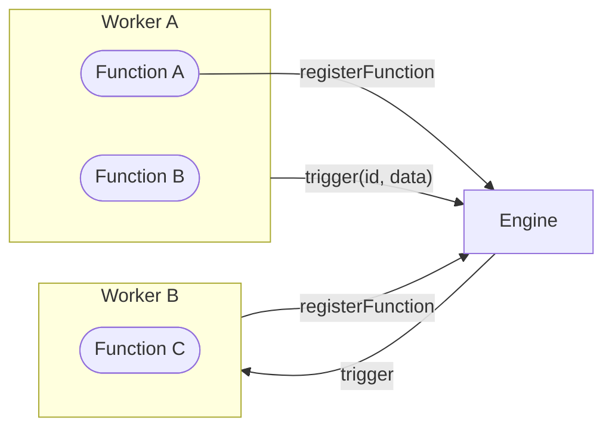

iii is built upon three core primitives: Functions, Triggers, and Workers.

A **Function** is anything that can be triggered to do work; it receives input, and optionally returns output.
It can exist anywhere be it locally, on cloud, on serverless, or even as a 3rd party HTTP endpoint. It can mutate state,
invoke other functions, modify databases, and do anything that a typical function can do. 
All application level Functions are treated the same within iii. 

A **Trigger** is what causes a Function to run — either explicitly from code, or automatically from an event source
like an HTTP request or cron job.

A **Worker** is any process that can register Functions and Triggers to run one or more tasks. They are typically
long running processes but can also be ephemeral processes, an agentic worker, or a legacy system leveraging middleware.

<Info title="Uncontrolled Endpoints">
iii's Functions are not magic. While uncontrolled 3rd party HTTP endpoints can be represented as Functions they won't have
the same access to invocation, state, and other engine functionality as other Functions do.
</Info>

## Architecture

## Ready to Dive In?

Head over to the [Functions & Triggers](../how-to/use-functions-and-triggers) HOWTO and start building
a iii powered application; or visit the [Quickstart](../quickstart) and try out a working example.

## Still want to learn more?

Check out how [Discovery](./discovery) works within iii and how it compares to other solutions.

<CardGroup cols={2}>
  <Card title="How to use Functions & Triggers" href="../how-to/use-functions-and-triggers" icon="book-open">
    Learn how to register functions, trigger them, and bind them to events.
  </Card>
  <Card title="Quickstart" href="../quickstart" icon="terminal">
    Follow the Quickstart and explore a live iii application.
  </Card>
</CardGroup>
