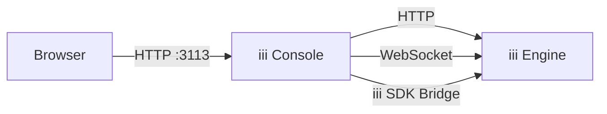

The iii Console is a standalone application that gives you full operational visibility into a running iii engine. It provides a web UI to inspect functions, triggers, state, streams, traces, and logs — all in real time.



## Quick Start

The console comes preinstalled with iii, start it with:

```bash
iii console
```

Then open your browser to [http://127.0.0.1:3113](http://127.0.0.1:3113).

<Warning title="Engine must be running">
  The console connects to a running iii engine instance. Make sure your engine is started before launching the console.
  By default it expects the engine at `127.0.0.1:3111`.
</Warning>

The root URL redirects to the **Workers** page. The sidebar includes Workers, Functions, Triggers, States, Streams, Queues, Traces, Logs, and Config. The optional Flow page appears when flow visualization is enabled.

## Workers

The Workers page lists every worker process currently connected to the engine, with live metrics (memory, CPU, event-loop lag), connection time, active invocations, and registered functions.


| Column     | Description                                                             |
|------------|-------------------------------------------------------------------------|
| Name       | Worker name or short ID if unnamed                                       |
| Runtime    | Language runtime badge (`node`, `python`, `rust`) with SDK version        |
| Isolation  | Isolation context badge (`libkrun`, `docker`, `k8s`, ...) when reported  |
| IP         | Worker's remote address                                                 |
| PID        | Worker process ID                                                       |
| Functions  | Number of functions the worker has registered                            |
| Active     | Number of currently in-flight invocations                                |
| Connected  | Time since the worker connected                                         |

The worker detail panel shows full metadata, telemetry (language, project, framework), live metrics, and the list of functions the worker has registered.


<Info title="Isolation badge">
  Workers launched via `iii worker add ./path` or `iii worker add <image>` run inside libkrun microVMs. The libkrun launcher builds the VM boot environment and injects `III_ISOLATION=libkrun` at VM boot time, so you'll see a purple `LIBKRUN` badge next to the runtime badge. The badge is descriptive (what the worker reports about its environment), not an attestation — a direct SDK connection can self-set `III_ISOLATION=docker` (or anything else) before starting. Workers that don't set the variable show no isolation badge.
</Info>

## Functions

The Functions page lists every function registered with the iii engine and lets you invoke any of them directly with custom JSON input.


All registered functions are displayed with their metadata:

| Column      | Description                                           |
|-------------|-------------------------------------------------------|
| Function ID | The fully qualified path (e.g. `users::getProfile`)   |
| Triggers    | Number and types of triggers attached to the function |
| Workers     | Worker processes that can execute the function        |
| Status      | Current function status                               |

Use the **search bar** at the top to filter functions by name.

### Invoking Functions

The detail panel includes a JSON editor for invoking functions directly. Enter a payload, click **Invoke**, and view the result inline. The console sends requests via `POST /_console/invoke`.

<Info title="How-to guide">
  See [Use the Console](../how-to/use-console#invoke-a-function) for step-by-step instructions.
</Info>

<Info title="Function must be registered">
  Only functions that are currently registered and connected via an active worker will appear in the list. If a function is missing, check that its worker process is running.
</Info>

## Triggers

The Triggers page shows every trigger registered with the engine and provides interactive tools to test each trigger type. Triggers are grouped by kind (`http`, `cron`, `event`, `state`) with a total count badge and per-type filter tabs.


| Column       | Description                                              |
|--------------|----------------------------------------------------------|
| Type         | The trigger type: `http`, `cron`, `event`, `state`, etc. |
| Function     | The function this trigger invokes                        |
| Path / Config | HTTP path, cron schedule, or event name                 |
| Status       | Active, Error, or Inactive                               |

### Testing Triggers

The console provides interactive testing tools for each trigger type:

| Trigger Type | Testing Tool |
|--------------|--------------|
| HTTP | Request builder with method selection, query params, and JSON body |
| Cron | Schedule viewer with **Trigger Now** button for immediate execution |
| Event | Event emitter with pre-filled event name and JSON payload input |
| State | Update/delete entries in **States** to fire `state:updated` / `state:deleted` triggers |
<Info title="How-to guide">
  See [Use the Console](../how-to/use-console#test-an-http-trigger) for step-by-step instructions on testing each trigger type.
</Info>

<Info title="Trigger types">
  The available trigger types depend on which workers are loaded in your engine configuration. See [Trigger Types](../architecture/trigger-types) and [Workers](../workers) for the full list.
</Info>

## States

The States page provides a browser for the engine's key-value state store. You can view, create, edit, and delete state entries organized by scope. The layout is divided into three panels: a group list on the left, an items table in the center, and a detail sidebar on the right.


The state browser displays a two-level hierarchy:

1. **Groups (Scopes)** — top-level namespaces that organize state
2. **Items** — individual key-value pairs within each group

Select a group from the left panel to see all its key-value items. Each item shows a **Key** and **Value** (rendered as formatted JSON). Complex values are displayed in a collapsible JSON viewer.

### Managing State

The console supports full CRUD operations on state entries:

| Operation | Behavior |
|-----------|----------|
| Add | Persisted via `state::set` |
| Edit | Fires `state:updated` triggers if registered |
| Delete | Fires `state:deleted` triggers if registered |

<Info title="How-to guide">
  See [Use the Console](../how-to/use-console#manage-state-entries) for step-by-step instructions.
</Info>

<Info title="State persistence">
  State persistence depends on your engine's State worker configuration. With `in_memory` storage, state is lost on engine restart. With `file_based` or `RedisAdapter`, state persists across restarts. See [State Worker](../workers/iii-state) for configuration details.
</Info>

Use the search bar to filter items by key name. For groups with many items, the browser supports pagination.

## Streams

The Streams page is a live WebSocket monitor that captures messages flowing through the engine's stream connections. It shows message counters (total, inbound, outbound, and buffer size), subscription management, and direction filter tabs.

| Column   | Description                                         |
|----------|-----------------------------------------------------|
| Name     | The stream identifier                               |
| Group    | The consumer group the stream belongs to            |
| Type     | Whether the stream is user-defined or system-internal |

Use the filter toggle to show or hide system streams. Streams update in real time via WebSocket.

<Info title="Stream worker required">
  Streams are provided by the Stream worker. Make sure `iii-stream` is included in your engine configuration. See [Stream Worker](../workers/iii-stream) for details.
</Info>

## Queues

The Queues page lists durable queue topics, subscriber counts, queued message counts, in-flight work, retry counts, and dead-letter activity.


| Column      | Description                                      |
|-------------|--------------------------------------------------|
| Topic       | Queue topic name                                 |
| Subscribers | Functions subscribed to the topic                |
| Messages    | Messages waiting to be processed                 |
| In Flight   | Messages currently being processed               |
| Retries     | Messages scheduled for retry                     |
| Dead Letters | Messages that exhausted retry handling          |

The topic detail panel has two tabs:

| Tab | Content |
|-----|---------|
| Overview | Live topic stats and a JSON publisher for sending test messages |
| Dead Letters | Failed messages with retry and delete options |

<Info title="How-to guide">
  See [Use the Console](../how-to/use-console#send-a-test-message-to-a-queue) for step-by-step instructions on testing queues and managing dead letters.
</Info>

## Traces

The Traces page provides full OpenTelemetry trace visualization with multiple view modes, advanced filtering, and detailed span inspection.


<Info title="Observability worker required">
  Trace collection requires the Observability worker with `exporter` set to `memory` or `both`. See [Observability Worker](../workers/iii-observability) for configuration.
</Info>

### Trace List

| Column    | Description                                    |
|-----------|------------------------------------------------|
| Trace ID  | Unique identifier (click to expand)            |
| Service   | The service that produced the trace            |
| Root Span | The top-level operation name                   |
| Duration  | Total trace duration                           |
| Status    | OK, Error, or Pending                          |
| Spans     | Number of spans in the trace                   |
| Timestamp | When the trace started                         |

### View Modes

The trace detail view provides five visualization modes:

| Mode | Description |
|------|-------------|
| Waterfall Chart | Timeline view with spans laid out by start time and duration. Default view for sequential/parallel flow analysis. |
| Flame Graph | Stack-based view where each span is stacked on its parent. Wider bars indicate longer duration. |
| Service Breakdown | Aggregate statistics grouped by service: total spans, average duration, error rate. |
| Trace Map | Topology graph showing service communication via parent-child span relationships. |
| Flow | Node-based execution flow showing parent-child span relationships. |


### Span Details

The span detail panel includes the following tabs:

| Tab       | Content                                             |
|-----------|-----------------------------------------------------|
| Info      | Span name, service, duration, status, trace/span IDs |
| Tags      | All span attributes as key-value pairs              |
| Logs      | Events and log entries attached to the span         |
| Errors    | Error messages, stack traces, and exception details |
| Baggage   | Trace context baggage key-value pairs               |

### Trace Filtering

| Filter       | Description                                                |
|--------------|------------------------------------------------------------|
| Trace ID     | Search by exact trace ID                                   |
| Service Name | Filter by service name (substring match)                   |
| Span Name    | Filter by span/operation name (substring match)            |
| Status       | Filter by status: OK, Error, or Pending                    |
| Duration     | Min and max duration range in milliseconds                 |
| Time Range   | Start and end time window                                  |
| Attributes   | Filter by span attributes as key-value pairs (AND logic)   |

Multiple filters are combined with AND logic. Pagination controls at the bottom allow browsing large result sets.

<Info title="How-to guide">
  See [Use the Console](../how-to/use-console#inspect-a-trace) for step-by-step instructions on inspecting traces and spans.
</Info>

## Logs

The Logs page provides a viewer for structured OpenTelemetry logs collected by the engine. Logs are displayed in reverse chronological order. Each entry shows a timestamp, severity level, service name, trace/span context, and message. A severity filter toggle, full-text search, and time-range controls let you zero in on specific log entries. The source breakdown at the bottom shows which services are contributing the most log volume.


<Info title="Observability worker required">
  Log collection requires the Observability worker with `logs_enabled: true`. See [Observability Worker](../workers/iii-observability) for configuration.
</Info>

<Info title="Console vs console output">
  The iii Console (this web UI) is separate from the engine's `logs_console_output` setting. The `logs_console_output` option controls whether OTLP logs are also printed to the engine process's stdout — it does not affect the Logs page here.
</Info>

### Log Viewer

| Column    | Description                                |
|-----------|--------------------------------------------|
| Timestamp | When the log entry was produced            |
| Severity  | Log level: DEBUG, INFO, WARN, ERROR, TRACE |
| Service   | The service that produced the log          |
| Message   | The log body/message content               |

Expanding a log entry reveals the full JSON payload, including attributes, trace/span IDs, and resource metadata.

### Log Filtering

| Filter        | Description                                         |
|---------------|-----------------------------------------------------|
| Severity      | Filter by one or more log levels                    |
| Time Range    | Start and end time window                           |
| Text Search   | Full-text search across log messages                |
| Trace ID      | Show only logs from a specific trace                |

### Log Entry Details

Each expanded log entry includes:

| Field                | Type     | Description                                      |
|----------------------|----------|--------------------------------------------------|
| `timestamp_unix_nano`| number   | Timestamp of the log entry                       |
| `severity_text`      | string   | Severity level: `INFO`, `WARN`, `ERROR`, `DEBUG`, or `TRACE` |
| `body`               | string   | The log message content                          |
| `attributes`         | object   | Structured attributes attached to the log entry  |
| `trace_id`           | string   | Distributed trace ID for correlating with traces |
| `span_id`            | string   | Span ID within the trace                         |
| `service_name`       | string   | Name of the service that produced the entry      |

<Info title="Trace correlation">
  If a log entry has a `trace_id`, you can click it to jump directly to the corresponding trace in the [Traces](#traces) section above.
</Info>

## Flow

The Flow page renders an interactive graph of your system's architecture, showing how triggers, functions, state stores, and queues connect.

<Warning title="Feature flag required">
  The Flow page is an opt-in feature. Enable it by starting the console with the `--enable-flow` flag or setting the `III_ENABLE_FLOW` environment variable.
</Warning>

```bash
iii-console --enable-flow
```

The flow diagram uses an auto-layout algorithm (Dagre) to arrange nodes and edges:

| Node Type   | Description                          | Visual           |
|-------------|--------------------------------------|-------------------|
| HTTP Trigger | HTTP endpoint triggers               | Colored by method |
| Cron Trigger | Scheduled triggers                  | Clock icon        |
| Event Trigger | Event-driven triggers              | Lightning icon    |
| Function    | Registered functions                 | Code icon         |
| State       | Key-value state stores               | Database icon     |
| Queue       | Queue nodes                          | List icon         |

Edges show the data flow direction between components — from triggers to the functions they invoke, and from functions to the state or queues they interact with.

The graph uses auto-layout (Dagre) and supports pan, zoom, and node inspection. Layout configuration is saved to the engine's state store and restored on next visit.

<Info title="How-to guide">
  See [Use the Console](../how-to/use-console#navigate-the-flow-graph) for navigation instructions.
</Info>

## Configuration

The iii Console is configured via CLI flags and environment variables. All settings have sensible defaults for local development.


### CLI Flags

```bash
iii-console [OPTIONS]
```

| Flag                   | Default         | Description                              |
|------------------------|-----------------|------------------------------------------|
| `--port, -p`           | `3113`          | Port for the console web UI              |
| `--host`               | `127.0.0.1`    | Host address to bind the console to      |
| `--engine-host`        | `127.0.0.1`    | Host address of the iii engine           |
| `--engine-port`        | `3111`          | Port of the engine's HTTP API            |
| `--ws-port`            | `3112`          | Port of the engine's WebSocket server    |
| `--bridge-port`        | `49134`         | Port of the engine's SDK bridge WebSocket |
| `--no-otel`            | `false`         | Disable OpenTelemetry export             |
| `--otel-service-name`  | `iii-console`   | Service name for console's own OTEL traces |
| `--enable-flow`        | `false`         | Enable the Flow visualization page       |

### Environment Variables

| Variable            | Equivalent Flag         | Description                    |
|---------------------|------------------------|--------------------------------|
| `OTEL_DISABLED`     | `--no-otel`            | Disable OTEL export            |
| `OTEL_SERVICE_NAME` | `--otel-service-name`  | OTEL service name              |
| `III_ENABLE_FLOW`   | `--enable-flow`        | Enable Flow visualization      |
| `III_ISOLATION`     | —                      | Reported by the SDK as the worker's isolation context in the Workers page. For libkrun workers, the libkrun launcher injects `III_ISOLATION=libkrun` into the VM boot environment. Set manually (`III_ISOLATION=docker`) for container/k8s deployments. |

### Default Ports

| Service              | Port    | Description                      |
|----------------------|---------|----------------------------------|
| iii Engine HTTP API   | `3111`  | Engine HTTP API                  |
| iii Engine WebSocket | `3112`  | Engine real-time updates         |
| iii Console UI       | `3113`  | Console web interface            |
| iii SDK Bridge       | `49134` | SDK bridge WebSocket connection  |

### Examples

```bash
iii-console

iii-console --engine-host 192.168.1.50 --engine-port 3111 --ws-port 3112

iii-console --port 8080

iii-console --enable-flow --otel-service-name my-console
```

The console includes a **Config** page (accessible from the sidebar) that displays the current runtime configuration: engine connectivity, port information, OpenTelemetry settings, and service version.
