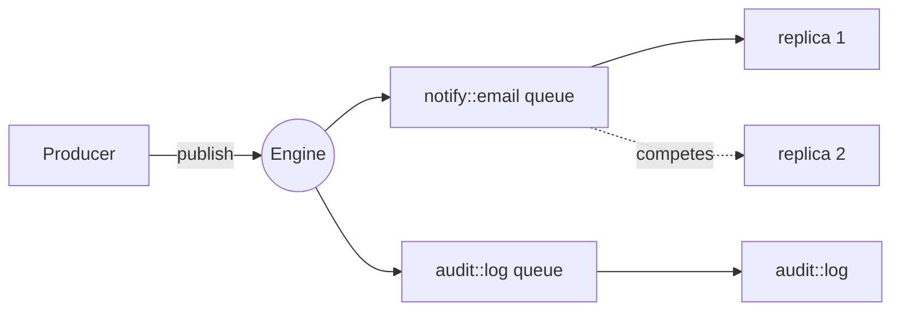
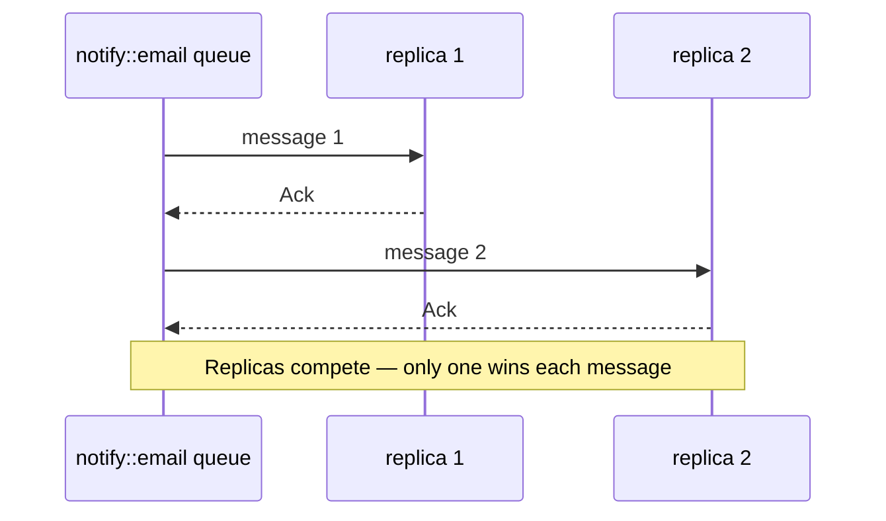
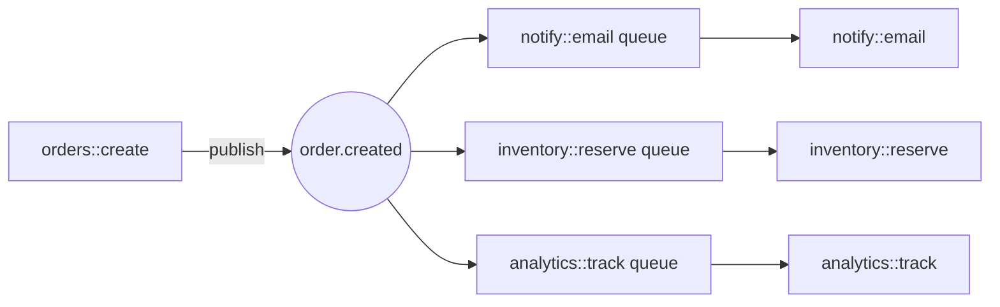

## Goal

Subscribe multiple functions to a topic so that every published message fans out to all subscribers, with each function processing its copy independently. For help deciding between topic-based and named queues, see [When to use which](../workers/iii-queue#when-to-use-which).

## Enable the Queue worker

```yaml title="iii-config.yaml"
workers:
  - name: iii-queue
    config:
      queue_configs:
        default:
          max_retries: 5
          concurrency: 10
          type: standard
      adapter:
        name: builtin
        config:
          store_method: file_based
          file_path: ./data/queue_store
```

<Info title="Full configuration reference">
  For complete configuration options please refer to [Queue worker reference](../workers/iii-queue#configuration).
</Info>

## Steps

### 1. Register consumers for a topic

Subscribe one or more functions to the same topic. Each function gets its own internal queue.

<Tabs>
<Tab title="Node / TypeScript">
```typescript
import { registerWorker } from 'iii-sdk'

const iii = registerWorker(process.env.III_URL ?? 'ws://localhost:49134')

iii.registerFunction('notify::email', async (data) => {
  await sendEmail(data.userId, `Order ${data.orderId} created`)
  return {}
})

iii.registerFunction('audit::log', async (data) => {
  await writeAuditLog('order.created', data)
  return {}
})

iii.registerTrigger({
  type: 'durable:subscriber',
  function_id: 'notify::email',
  config: { topic: 'order.created' },
})

iii.registerTrigger({
  type: 'durable:subscriber',
  function_id: 'audit::log',
  config: { topic: 'order.created' },
})
```
</Tab>
<Tab title="Python">
```python
from iii import register_worker

iii = register_worker("ws://localhost:49134")


def send_email_notification(data):
    send_email(data["userId"], f"Order {data['orderId']} created")
    return {}


def write_audit(data):
    write_audit_log("order.created", data)
    return {}


iii.register_function("notify::email", send_email_notification)
iii.register_function("audit::log", write_audit)

iii.register_trigger({
    "type": "durable:subscriber",
    "function_id": "notify::email",
    "config": {"topic": "order.created"},
})

iii.register_trigger({
    "type": "durable:subscriber",
    "function_id": "audit::log",
    "config": {"topic": "order.created"},
})
```
</Tab>
<Tab title="Rust">
```rust
use iii_sdk::{register_worker, InitOptions, RegisterFunction, RegisterTriggerInput, IIIError};
use serde_json::{json, Value};

let iii = register_worker("ws://localhost:49134", InitOptions::default());

iii.register_function(RegisterFunction::new_async(
    "notify::email",
    |data: Value| async move {
        send_email(data["userId"].as_str().unwrap_or(""), &format!("Order {} created", data["orderId"])).await?;
        Ok(json!({}))
    },
));

iii.register_function(RegisterFunction::new_async(
    "audit::log",
    |data: Value| async move {
        write_audit_log("order.created", &data).await?;
        Ok(json!({}))
    },
));

iii.register_trigger(RegisterTriggerInput {
    trigger_type: "durable:subscriber".into(),
    function_id: "notify::email".into(),
    config: json!({ "topic": "order.created" }),
    metadata: None,
})?;

iii.register_trigger(RegisterTriggerInput {
    trigger_type: "durable:subscriber".into(),
    function_id: "audit::log".into(),
    config: json!({ "topic": "order.created" }),
    metadata: None,
})?;
```
</Tab>
</Tabs>

Both `notify::email` and `audit::log` are now subscribed to `order.created`. Every message published to that topic reaches both functions.

### 2. Publish events to the topic

From any function, publish a message using the builtin `iii::durable::publish` function. The engine fans it out to every subscribed function.

<Info>
  `durable:subscriber` uses one colon (`:`) in the previous step's code because it is a trigger type, while the `iii::durable::publish` below uses two colons (`::`) because it is a function id.
</Info>


<Tabs>
<Tab title="Node / TypeScript">
```typescript
await iii.trigger({
  function_id: 'iii::durable::publish',
  payload: {
    topic: 'order.created',
    data: { orderId: 'ord_789', userId: 'usr_42', total: 149.99 },
  },
})
```
</Tab>
<Tab title="Python">
```python
iii.trigger({
    "function_id": "iii::durable::publish",
    "payload": {
        "topic": "order.created",
        "data": {"orderId": "ord_789", "userId": "usr_42", "total": 149.99},
    },
})
```
</Tab>
<Tab title="Rust">
```rust
use iii_sdk::{TriggerRequest};
use serde_json::json;

iii.trigger(TriggerRequest {
    function_id: "iii::durable::publish".into(),
    payload: json!({
        "topic": "order.created",
        "data": { "orderId": "ord_789", "userId": "usr_42", "total": 149.99 },
    }),
    action: None,
    timeout_ms: None,
}).await?;
```
</Tab>
</Tabs>

The producer does not need to know which functions are subscribed — it only knows the topic name.

### 3. Understand fan-out delivery

Topic-based queues use **fan-out per function**:

- Each distinct function subscribed to a topic receives a **copy** of every message.
- If a function has multiple replicas running, they **compete** on a shared per-function queue — only one replica processes each message.



When a function has multiple replicas, they compete on the shared per-function queue — only one replica processes each message:



This gives you pub/sub-style event distribution with the durability and retry guarantees of a queue.

### 4. Filter messages with conditions (optional)

Attach a condition function to a queue trigger to filter which messages reach the handler. The condition receives the message data and returns `true` or `false`. If `false`, the handler is not called — no error is surfaced.

<Tabs>
<Tab title="Node / TypeScript">
```typescript
iii.registerFunction('conditions::is_high_value', async (data) => data.total > 1000)

iii.registerTrigger({
  type: 'durable:subscriber',
  function_id: 'notify::vip-team',
  config: {
    topic: 'order.created',
    condition_function_id: 'conditions::is_high_value',
  },
})
```
</Tab>
<Tab title="Python">
```python
def is_high_value(data):
    return data.get("total", 0) > 1000


iii.register_function("conditions::is_high_value", is_high_value)

iii.register_trigger({
    "type": "durable:subscriber",
    "function_id": "notify::vip-team",
    "config": {
        "topic": "order.created",
        "condition_function_id": "conditions::is_high_value",
    },
})
```
</Tab>
<Tab title="Rust">
```rust
iii.register_function(RegisterFunction::new_async(
    "conditions::is_high_value",
    |data: Value| async move {
        Ok::<_, IIIError>(json!(data["total"].as_f64().unwrap_or(0.0) > 1000.0))
    },
));

iii.register_trigger(RegisterTriggerInput {
    trigger_type: "durable:subscriber".into(),
    function_id: "notify::vip-team".into(),
    config: json!({
        "topic": "order.created",
        "condition_function_id": "conditions::is_high_value",
    }),
    metadata: None,
})?;
```
</Tab>
</Tabs>

<Info title="Conditions guide">
  See [Conditions](../examples/conditions) for the full pattern including HTTP and state trigger conditions.
</Info>

## Result

Every function subscribed to a topic receives a copy of each published message. If a function has multiple replicas, they compete on a shared per-function queue — only one replica processes each message. The producer only knows the topic name; it does not need to know which functions are subscribed.

---

## Real-World Scenario

### Event Fan-Out with Topic Queues

An order system publishes `order.created` events. Multiple independent services — email notifications, inventory updates, and analytics — each need to process every order. Topic-based queues fan out each message to all subscribers with independent retries per function.



<Tabs>
<Tab title="Node / TypeScript">
```typescript
import { registerWorker } from 'iii-sdk'

const iii = registerWorker(process.env.III_URL ?? 'ws://localhost:49134')

iii.registerFunction('notify::email', async (data) => {
  await sendEmail(data.email, `Your order ${data.orderId} is confirmed!`)
  return {}
})

iii.registerFunction('inventory::reserve', async (data) => {
  for (const item of data.items) {
    await reserveStock(item.sku, item.quantity)
  }
  return {}
})

iii.registerFunction('analytics::track', async (data) => {
  await trackEvent('order_created', { orderId: data.orderId, total: data.total })
  return {}
})

iii.registerTrigger({
  type: 'durable:subscriber',
  function_id: 'notify::email',
  config: { topic: 'order.created' },
})

iii.registerTrigger({
  type: 'durable:subscriber',
  function_id: 'inventory::reserve',
  config: { topic: 'order.created' },
})

iii.registerTrigger({
  type: 'durable:subscriber',
  function_id: 'analytics::track',
  config: { topic: 'order.created' },
})

iii.registerFunction('orders::create', async (req) => {
  const order = { id: crypto.randomUUID(), ...req.body }

  await iii.trigger({
    function_id: 'iii::durable::publish',
    payload: { topic: 'order.created', data: order },
  })

  return { status_code: 201, body: { orderId: order.id } }
})
```
</Tab>
<Tab title="Python">
```python
from iii import register_worker

iii = register_worker("ws://localhost:49134")


def send_email_notification(data):
    send_email(data["email"], f"Your order {data['orderId']} is confirmed!")
    return {}


def reserve_inventory(data):
    for item in data["items"]:
        reserve_stock(item["sku"], item["quantity"])
    return {}


def track_analytics(data):
    track_event("order_created", {"orderId": data["orderId"], "total": data["total"]})
    return {}


iii.register_function("notify::email", send_email_notification)
iii.register_function("inventory::reserve", reserve_inventory)
iii.register_function("analytics::track", track_analytics)

for fid in ["notify::email", "inventory::reserve", "analytics::track"]:
    iii.register_trigger({
        "type": "durable:subscriber",
        "function_id": fid,
        "config": {"topic": "order.created"},
    })


def create_order(req):
    import uuid
    order = {"id": str(uuid.uuid4()), **req.get("body", {})}

    iii.trigger({
        "function_id": "iii::durable::publish",
        "payload": {"topic": "order.created", "data": order},
    })

    return {"status_code": 201, "body": {"orderId": order["id"]}}


iii.register_function("orders::create", create_order)
```
</Tab>
<Tab title="Rust">
```rust
use iii_sdk::{
    register_worker, InitOptions, RegisterFunction,
    RegisterTriggerInput, TriggerRequest,
};
use serde_json::{json, Value};

let iii = register_worker("ws://localhost:49134", InitOptions::default());

iii.register_function(RegisterFunction::new_async(
    "notify::email",
    |data: Value| async move {
        send_email(data["email"].as_str().unwrap_or(""), &format!("Your order {} is confirmed!", data["orderId"])).await?;
        Ok(json!({}))
    },
));

iii.register_function(RegisterFunction::new_async(
    "inventory::reserve",
    |data: Value| async move {
        for item in data["items"].as_array().unwrap_or(&vec![]) {
            reserve_stock(item["sku"].as_str().unwrap_or(""), item["quantity"].as_u64().unwrap_or(0)).await?;
        }
        Ok(json!({}))
    },
));

iii.register_function(RegisterFunction::new_async(
    "analytics::track",
    |data: Value| async move {
        track_event("order_created", &json!({ "orderId": data["orderId"], "total": data["total"] })).await?;
        Ok(json!({}))
    },
));

for fid in &["notify::email", "inventory::reserve", "analytics::track"] {
    iii.register_trigger(RegisterTriggerInput {
        trigger_type: "durable:subscriber".into(),
        function_id: fid.to_string(),
        config: json!({ "topic": "order.created" }),
        metadata: None,
    })?;
}

let iii_clone = iii.clone();
iii.register_function(RegisterFunction::new_async("orders::create", move |req: Value| {
    let iii = iii_clone.clone();
    async move {
        let order_id = uuid::Uuid::new_v4().to_string();

        iii.trigger(TriggerRequest {
            function_id: "iii::durable::publish".into(),
            payload: json!({ "topic": "order.created", "data": { "id": order_id, "items": req["body"]["items"] } }),
            action: None,
            timeout_ms: None,
        }).await?;

        Ok(json!({ "status_code": 201, "body": { "orderId": order_id } }))
    }
}));
```
</Tab>
</Tabs>

All three functions receive every `order.created` event independently. If `inventory::reserve` fails and retries, it does not affect `notify::email` or `analytics::track`.

<Info title="Adapters and configuration">
  For adapter options (builtin, RabbitMQ, Redis), scenario-based recommendations, and the full queue configuration reference, see the [Queue worker reference](../workers/iii-queue#adapter-comparison).
</Info>

## Remember

Producers publish to a topic and return immediately. The engine fans out each message to every subscribed function, with independent retries per function. If a function has multiple replicas, they compete on a shared per-function queue — only one replica processes each message.

## Next Steps

<CardGroup cols={2}>
  <Card title="Named Queues" href="./use-named-queues" icon="list-check">
    Publish and subscribe to jobs to specific functions with retries, FIFO ordering, and concurrency control
  </Card>
  <Card title="Dead Letter Queues" href="./dead-letter-queues" icon="skull">
    Handle and redrive failed queue messages
  </Card>
  <Card title="Queue Worker Reference" href="../workers/iii-queue" icon="gear">
    Full configuration reference for queues and adapters
  </Card>
  <Card title="Conditions" href="../examples/conditions" icon="filter">
    Filter queue messages with condition functions
  </Card>
</CardGroup>
