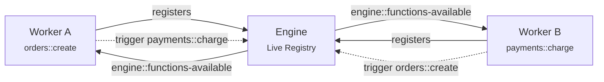

Discovery in iii is part of the runtime itself, not a sidecar service or an SDK-only convenience feature.

When a worker connects, the engine adds its functions and triggers to a live registry. When a worker disconnects or unregisters a function, the registry changes immediately. That same registry powers two different capabilities:

- read access through built-in engine functions such as `engine::functions::list`, `engine::workers::list`, `engine::triggers::list`, and `engine::trigger-types::list`
- change notifications through built-in trigger types such as `engine::functions-available`

That split is deliberate. A worker can read the current topology on demand, or subscribe to topology changes, using the same primitives it already uses everywhere else: `trigger()` for request/response and `register_trigger` for event delivery.

## Architecture

## Why This Matters

In traditional distributed systems, services need to know where other services live. This knowledge typically comes from one of several places:

- **Configuration files** — hardcoded URLs or hostnames that must be updated and redeployed whenever services move
- **DNS-based discovery** — services register with DNS and others look them up, but DNS caching creates propagation delays
- **Service registries** — dedicated infrastructure (Consul, etcd, ZooKeeper) that services connect to separately from their actual communication path
- **Service meshes** — infrastructure that operates at the network layer, intercepting traffic between services without knowledge of the application semantics

Each approach trades off complexity, latency, and operational burden. Most require explicit registration, health checking, and some form of polling or TTL-based invalidation.

iii takes a different approach: the engine itself is the registry, and it exposes that registry directly through the same invocation model the rest of the platform uses.

## What This Enables

Traditional architectures require coordination when the system topology changes. Adding a new service means updating every service that needs to call it — changing config files, updating client libraries, or waiting for DNS to propagate.

With a central registry inside the engine, topology changes are automatic:

- **Workers scale independently** — Scale horizontally and vertically only where you need it
- **New functionality is immediately available** — Connect a new worker with new functions and they're immediately available to the entire system
- **Workers remove services cleanly** — Disconnect a worker and its functions disappear from the registry, no stale references

<CardGroup cols={2}>
  <Card title="How to use Functions & Triggers" href="../how-to/use-functions-and-triggers" icon="book-open">
    Learn how to register functions, trigger them, and bind them to events.
  </Card>
</CardGroup>
