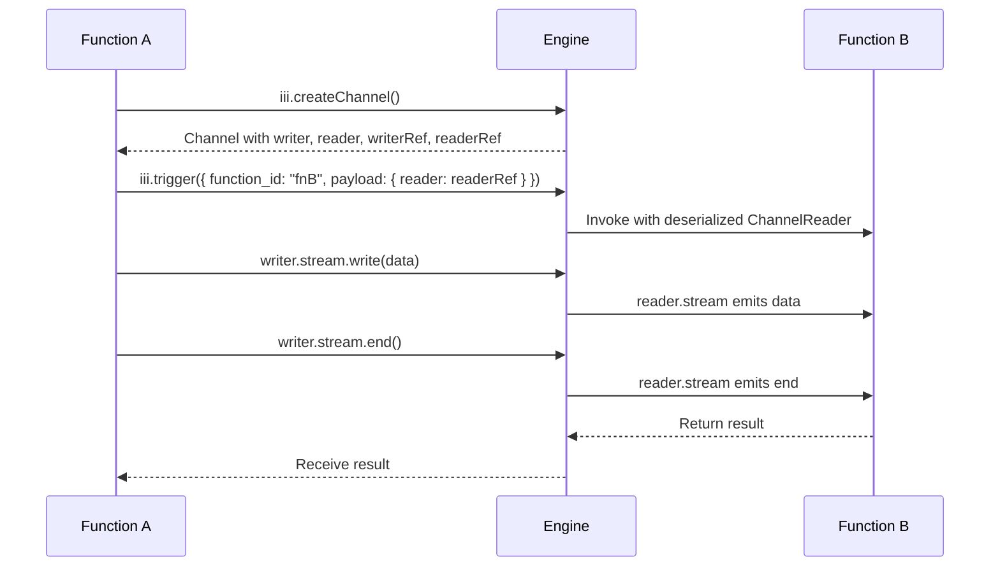
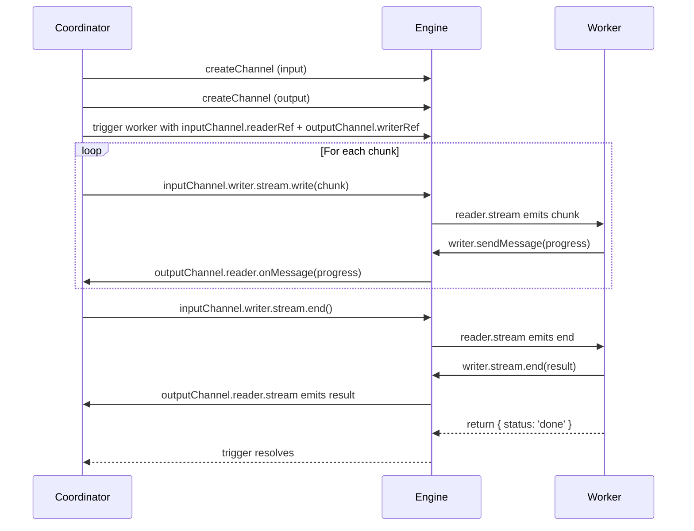

Channels provide WebSocket-backed pipes for moving data between workers without turning every payload into a trigger invocation.

## Model

| Concept | Description |
|---------|-------------|
| Channel | A named connection endpoint managed by the worker manager. |
| Reader | Receives bytes or messages from a channel. |
| Writer | Sends bytes or messages into a channel. |
| Direction | Defines whether a worker reads, writes, or does both. |

Use channels when the payload is large, binary, or naturally stream-shaped. Use triggers when the payload is a discrete event that should invoke a function.

<Info title="Worker reference">
  Channel endpoints are served by the [Worker Manager](/workers/iii-worker-manager). For SDK APIs, see the Node, Python, and Rust API references.
</Info>
Data channels provide a streaming primitive for moving binary data between functions — even when those functions run in different worker processes. Instead of serializing an entire payload into a single invocation message, channels let producers write data incrementally while consumers read it as a stream.

## Why Channels Exist

Function invocations in iii pass data as JSON-serializable messages. This works well for structured payloads, but breaks down when dealing with large binary blobs (files, media, datasets) or data that is produced over time (progress updates, partial results). Channels solve this by giving each side a Node.js stream backed by a WebSocket connection through the engine.

A channel has two ends:

- A **writer** that exposes a `Writable` stream for sending data.
- A **reader** that exposes a `Readable` stream for receiving data.

Each end also has a **ref** — a small, serializable object (`StreamChannelRef`) that can be passed as a field inside `iii.trigger()` data. When the receiving function deserializes the ref, the SDK automatically connects it to the engine and materializes the corresponding `ChannelWriter` or `ChannelReader`.

## How Channels Work



Function A creates a channel, passes the `readerRef` to Function B through a regular function call, then writes data to the writer stream. The engine routes the data through a WebSocket-backed pipe to Function B, where it arrives on the reader stream. When Function A ends the writer, Function B's reader emits `end`.

## Creating a Channel

<Tabs>
<Tab title="Node / TypeScript">
```typescript
const channel = await iii.createChannel()
```
</Tab>
<Tab title="Python">
```python
channel = iii_client.create_channel()          # default buffer_size=64
channel = iii_client.create_channel(buffer_size=128)  # custom buffer size
```
</Tab>
<Tab title="Rust">
```rust
let channel = iii.create_channel(None).await?;
```
</Tab>
</Tabs>

The returned object contains both local stream objects and their serializable counterparts:

| Property | Node / TypeScript | Python | Rust |
|----------|-------------------|--------|------|
| Writer (local) | `channel.writer` (`ChannelWriter`) | `channel.writer` (`ChannelWriter`) | `channel.writer` (`ChannelWriter`) |
| Reader (local) | `channel.reader` (`ChannelReader`) | `channel.reader` (`ChannelReader`) | `channel.reader` (`ChannelReader`) |
| Writer ref (serializable) | `channel.writerRef` | `channel.writer_ref` | `channel.writer_ref` |
| Reader ref (serializable) | `channel.readerRef` | `channel.reader_ref` | `channel.reader_ref` |

Pass a ref as a field in `iii.trigger()` data to hand the other end of the channel to another function. The SDK on the receiving side automatically materializes the ref into a `ChannelWriter` or `ChannelReader`.

The `StreamChannelRef` is a plain object that survives JSON serialization:

```typescript
type StreamChannelRef = {
  channel_id: string
  access_key: string
  direction: 'read' | 'write'
}
```

## ChannelWriter

`ChannelWriter` wraps a WebSocket connection and exposes:

| Capability | Node / TypeScript | Python | Rust |
|-----------|-------------------|--------|------|
| Write binary data | `writer.stream.write(data)` | `writer.stream.write(data)` (sync, fire-and-forget) or `await writer.write(data)` (async) | `writer.write(&data).await` |
| Send text message | `writer.sendMessage(msg)` | `writer.send_message(msg)` (sync, fire-and-forget) or `await writer.send_message_async(msg)` (async) | `writer.send_message(&msg).await` |
| Close | `writer.stream.end()` | `writer.close()` (sync, fire-and-forget) or `await writer.close_async()` (async) | `writer.close().await` |
| Access writable stream | `writer.stream` | `writer.stream` (`WritableStream`) | N/A |

Data written to the writer is automatically chunked into 64 KB frames and sent over the WebSocket. The writer lazily connects to the engine on first write, so creating a channel is cheap even if the writer is not used immediately.

The Python `ChannelWriter` provides both sync and async APIs. The sync methods (`send_message()`, `close()`) are fire-and-forget wrappers that queue work on the event loop. The `writer.stream` property exposes a `WritableStream` with sync `write(data)` and `end(data?)` methods that mirror Node.js `Writable` semantics.

## ChannelReader

`ChannelReader` wraps a WebSocket connection and exposes:

| Capability | Node / TypeScript | Python | Rust |
|-----------|-------------------|--------|------|
| Read as stream | `for await (const chunk of reader.stream)` | `async for chunk in reader` | `reader.next_binary().await` / `reader.read_all().await` |
| Read all at once | Collect chunks manually | `await reader.read_all()` | `reader.read_all().await` |
| Listen for text messages | `reader.onMessage(callback)` | `reader.on_message(callback)` | `reader.on_message(callback).await` |
| Access readable stream | `reader.stream` | `reader.stream` (`ReadableStream`) | N/A |

The Python `ChannelReader` implements `__aiter__`, so use `async for chunk in reader` to iterate over binary chunks. Text messages received on the same WebSocket are dispatched to callbacks registered via `reader.on_message(callback)` where `callback` is `Callable[[str], Any]` -- it receives the raw text message string.

Backpressure is handled automatically by pausing the WebSocket when the stream buffer is full. The reader connects lazily, establishing the WebSocket when reading begins.

## Example: One-Way Data Streaming

In this pattern a sender function creates a channel, writes data to it, and passes the reader ref to a processor function. The processor reads the stream, computes a result, and returns it.

<Tabs>
<Tab title="Node / TypeScript">
```typescript
const processor = iii.registerFunction(
  { id: 'data.processor' },
  async (input: { label: string; reader: ChannelReader }) => {
    const chunks: Buffer[] = []
    for await (const chunk of input.reader.stream) {
      chunks.push(Buffer.isBuffer(chunk) ? chunk : Buffer.from(chunk))
    }

    const records = JSON.parse(Buffer.concat(chunks).toString('utf-8'))
    const sum = records.reduce((acc: number, r: { value: number }) => acc + r.value, 0)

    return {
      label: input.label,
      count: records.length,
      sum,
      average: sum / records.length,
    }
  },
)

const sender = iii.registerFunction(
  { id: 'data.sender' },
  async (input: { records: { name: string; value: number }[] }) => {
    const channel = await iii.createChannel()

    const writePromise = new Promise<void>((resolve, reject) => {
      const payload = Buffer.from(JSON.stringify(input.records))
      channel.writer.stream.end(payload, (err?: Error | null) => {
        if (err) reject(err)
        else resolve()
      })
    })

    const result = await iii.trigger({
      function_id: 'data.processor',
      payload: { label: 'metrics-batch', reader: channel.readerRef },
    })

    await writePromise
    return result
  },
)
```
</Tab>
<Tab title="Python">
```python
import json
from iii import register_worker
from iii.channels import ChannelReader

iii_client = register_worker("ws://localhost:49134")

def processor_handler(input_data):
    reader: ChannelReader = input_data["reader"]
    label = input_data["label"]

    raw = reader.read_all()
    records = json.loads(raw.decode("utf-8"))

    total = sum(r["value"] for r in records)

    return {
        "label": label,
        "messages": [
            {"type": "stat", "key": "count", "value": len(records)},
            {"type": "stat", "key": "sum", "value": total},
            {"type": "stat", "key": "average", "value": total / len(records)},
            {"type": "stat", "key": "min", "value": min(r["value"] for r in records)},
            {"type": "stat", "key": "max", "value": max(r["value"] for r in records)},
        ],
    }

def sender_handler(input_data):
    records = input_data["records"]
    channel = iii_client.create_channel()

    payload = json.dumps(records).encode("utf-8")
    channel.writer.write(payload)
    channel.writer.close()

    result = iii_client.trigger({
        "function_id": "data.processor",
        "payload": {"label": "metrics-batch", "reader": channel.reader_ref.model_dump()},
    })

    return result

iii_client.register_function("data.processor", processor_handler)
iii_client.register_function("data.sender", sender_handler)
```
</Tab>
<Tab title="Rust">
```rust
use iii_sdk::{III, IIIError, ChannelReader, extract_channel_refs, ChannelDirection, RegisterFunctionMessage, TriggerRequest};
use serde_json::{json, Value};

let iii_for_processor = iii.clone();
iii.register_function((RegisterFunctionMessage::with_id("data.processor".into()), move |input: Value| {
    let iii = iii_for_processor.clone());

    async move {
        let label = input["label"].as_str().unwrap_or_default().to_string();

        let refs = extract_channel_refs(&input);
        let reader_ref = refs.iter()
            .find(|(k, r)| k == "reader" && matches!(r.direction, ChannelDirection::Read))
            .map(|(_, r)| r.clone())
            .expect("missing reader channel ref");

        let reader = ChannelReader::new(iii.address(), &reader_ref);
        let raw = reader.read_all().await
            .map_err(|e| IIIError::Handler(e.to_string()))?;
        let records: Vec<Value> = serde_json::from_slice(&raw)
            .map_err(|e| IIIError::Handler(e.to_string()))?;

        let values: Vec<f64> = records.iter()
            .filter_map(|r| r["value"].as_f64())
            .collect();

        let sum: f64 = values.iter().sum();
        let count = values.len();

        Ok(json!({
            "label": label,
            "messages": [
                {"type": "stat", "key": "count", "value": count},
                {"type": "stat", "key": "sum", "value": sum},
                {"type": "stat", "key": "average", "value": sum / count as f64},
                {"type": "stat", "key": "min", "value": values.iter().cloned().fold(f64::INFINITY, f64::min)},
                {"type": "stat", "key": "max", "value": values.iter().cloned().fold(f64::NEG_INFINITY, f64::max)},
            ],
        }))
    }
});

let iii_for_sender = iii.clone();
iii.register_function((RegisterFunctionMessage::with_id("data.sender".into()), move |input: Value| {
    let iii = iii_for_sender.clone());

    async move {
        let records = input["records"].clone();
        let channel = iii.create_channel(None).await
            .map_err(|e| IIIError::Handler(e.to_string()))?;

        let payload = serde_json::to_vec(&records)
            .map_err(|e| IIIError::Handler(e.to_string()))?;
        channel.writer.write(&payload).await
            .map_err(|e| IIIError::Handler(e.to_string()))?;
        channel.writer.close().await
            .map_err(|e| IIIError::Handler(e.to_string()))?;

        let result = iii.trigger(TriggerRequest::new("data.processor", json!({
            "label": "metrics-batch",
            "reader": channel.reader_ref,
        }))).await.map_err(|e| IIIError::Handler(e.to_string()))?;

        Ok(result)
    }
});
```
</Tab>
</Tabs>

The sender writes all records as a single JSON buffer and immediately ends the stream. The processor reads until the stream closes, parses the JSON, and returns computed statistics.

## Example: Bidirectional Streaming with Progress

When two functions need to exchange data in both directions, create two channels — one for input, one for output. The writer's `sendMessage()` method provides a side channel for progress updates or metadata that doesn't mix with the binary data stream.

<Tabs>
<Tab title="Node / TypeScript">
```typescript
const worker = iii.registerFunction(
  { id: 'stream.worker' },
  async (input: { reader: ChannelReader; writer: ChannelWriter }) => {
    const { reader, writer } = input
    const chunks: Buffer[] = []
    let chunkCount = 0

    for await (const chunk of reader.stream) {
      chunks.push(Buffer.isBuffer(chunk) ? chunk : Buffer.from(chunk))
      chunkCount++
      writer.sendMessage(
        JSON.stringify({ type: 'progress', chunks_received: chunkCount }),
      )
    }

    const fullData = Buffer.concat(chunks).toString('utf-8')
    const words = fullData.split(/\s+/).filter(Boolean)

    writer.sendMessage(
      JSON.stringify({
        type: 'complete',
        word_count: words.length,
        byte_count: Buffer.concat(chunks).length,
      }),
    )

    writer.stream.end(
      Buffer.from(JSON.stringify({ words: words.slice(0, 5), total: words.length })),
    )

    return { status: 'done' }
  },
)

const coordinator = iii.registerFunction(
  { id: 'stream.coordinator' },
  async (input: { text: string; chunkSize: number }) => {
    const inputChannel = await iii.createChannel()
    const outputChannel = await iii.createChannel()

    const messages: unknown[] = []
    outputChannel.reader.onMessage(msg => {
      messages.push(JSON.parse(msg))
    })

    const textBuf = Buffer.from(input.text)
    const writePromise = new Promise<void>((resolve, reject) => {
      let offset = 0
      const writeNext = () => {
        while (offset < textBuf.length) {
          const end = Math.min(offset + input.chunkSize, textBuf.length)
          const chunk = textBuf.subarray(offset, end)
          offset = end

          if (!inputChannel.writer.stream.write(chunk)) {
            inputChannel.writer.stream.once('drain', writeNext)
            return
          }
        }
        inputChannel.writer.stream.end((err?: Error | null) => {
          if (err) reject(err)
          else resolve()
        })
      }
      writeNext()
    })

    const triggerPromise = iii.trigger({
      function_id: 'stream.worker',
      payload: {
        reader: inputChannel.readerRef,
        writer: outputChannel.writerRef,
      },
    })

    const resultChunks: Buffer[] = []
    for await (const chunk of outputChannel.reader.stream) {
      resultChunks.push(Buffer.isBuffer(chunk) ? chunk : Buffer.from(chunk))
    }

    await writePromise
    const workerResult = await triggerPromise
    const binaryResult = JSON.parse(Buffer.concat(resultChunks).toString('utf-8'))

    return { messages, binaryResult, workerResult }
  },
)
```
</Tab>
<Tab title="Python">
```python
import json
from iii import register_worker
from iii.channels import ChannelReader, ChannelWriter

iii_client = register_worker("ws://localhost:49134")

async def worker_handler(input_data):
    reader: ChannelReader = input_data["reader"]
    writer: ChannelWriter = input_data["writer"]

    chunks = []
    chunk_count = 0
    async for chunk in reader:
        chunks.append(chunk)
        chunk_count += 1
        writer.send_message(json.dumps({
            "type": "progress",
            "chunks_received": chunk_count,
        }))

    full_data = b"".join(chunks).decode("utf-8")
    words = full_data.split()

    writer.send_message(json.dumps({
        "type": "complete",
        "word_count": len(words),
        "byte_count": len(b"".join(chunks)),
    }))

    result_json = json.dumps({"words": words[:5], "total": len(words)}).encode("utf-8")
    await writer.write(result_json)
    writer.close()

    return {"status": "done"}

def coordinator_handler(input_data):
    text = input_data["text"]
    chunk_size = input_data["chunkSize"]

    input_channel = iii_client.create_channel()
    output_channel = iii_client.create_channel()

    messages = []
    output_channel.reader.on_message(lambda msg: messages.append(json.loads(msg)))

    iii_client.trigger({
        "function_id": "stream.worker",
        "payload": {
            "reader": input_channel.reader_ref.model_dump(),
            "writer": output_channel.writer_ref.model_dump(),
        },
    })

    text_bytes = text.encode("utf-8")
    offset = 0
    while offset < len(text_bytes):
        end = min(offset + chunk_size, len(text_bytes))
        input_channel.writer.write(text_bytes[offset:end])
        offset = end
    input_channel.writer.close()

    result_data = output_channel.reader.read_all()
    binary_result = json.loads(result_data.decode("utf-8"))

    return {"messages": messages, "binaryResult": binary_result}

iii_client.register_function("stream.worker", worker_handler)
iii_client.register_function("stream.coordinator", coordinator_handler)
```
</Tab>
<Tab title="Rust">
```rust
use std::sync::Arc;
use tokio::sync::Mutex;
use iii_sdk::{III, IIIError, ChannelReader, ChannelWriter, extract_channel_refs, ChannelDirection, RegisterFunctionMessage, TriggerRequest};
use serde_json::{json, Value};

let iii_for_worker = iii.clone();
iii.register_function((RegisterFunctionMessage::with_id("stream.worker".into()), move |input: Value| {
    let iii = iii_for_worker.clone());

    async move {
        let refs = extract_channel_refs(&input);

        let reader_ref = refs.iter()
            .find(|(k, r)| k == "reader" && matches!(r.direction, ChannelDirection::Read))
            .map(|(_, r)| r.clone()).expect("missing reader");
        let writer_ref = refs.iter()
            .find(|(k, r)| k == "writer" && matches!(r.direction, ChannelDirection::Write))
            .map(|(_, r)| r.clone()).expect("missing writer");

        let reader = ChannelReader::new(iii.address(), &reader_ref);
        let writer = ChannelWriter::new(iii.address(), &writer_ref);

        let mut chunks: Vec<Vec<u8>> = Vec::new();
        let mut chunk_count = 0;

        while let Some(chunk) = reader.next_binary().await
            .map_err(|e| IIIError::Handler(e.to_string()))? {
            chunks.push(chunk);
            chunk_count += 1;
            writer.send_message(&serde_json::to_string(&json!({
                "type": "progress", "chunks_received": chunk_count,
            })).unwrap()).await.map_err(|e| IIIError::Handler(e.to_string()))?;
        }

        let full_data: Vec<u8> = chunks.iter().flatten().copied().collect();
        let text = String::from_utf8_lossy(&full_data);
        let words: Vec<&str> = text.split_whitespace().collect();

        writer.send_message(&serde_json::to_string(&json!({
            "type": "complete",
            "word_count": words.len(),
            "byte_count": full_data.len(),
        })).unwrap()).await.map_err(|e| IIIError::Handler(e.to_string()))?;

        let result_json = serde_json::to_vec(&json!({
            "words": &words[..5.min(words.len())],
            "total": words.len(),
        })).map_err(|e| IIIError::Handler(e.to_string()))?;
        writer.write(&result_json).await.map_err(|e| IIIError::Handler(e.to_string()))?;
        writer.close().await.map_err(|e| IIIError::Handler(e.to_string()))?;

        Ok(json!({"status": "done"}))
    }
});

let iii_for_coord = iii.clone();
iii.register_function((RegisterFunctionMessage::with_id("stream.coordinator".into()), move |input: Value| {
    let iii = iii_for_coord.clone());

    async move {
        let text = input["text"].as_str().unwrap_or_default().to_string();
        let chunk_size = input["chunkSize"].as_u64().unwrap_or(10) as usize;

        let input_channel = iii.create_channel(None).await
            .map_err(|e| IIIError::Handler(e.to_string()))?;
        let output_channel = iii.create_channel(None).await
            .map_err(|e| IIIError::Handler(e.to_string()))?;

        let messages: Arc<Mutex<Vec<Value>>> = Arc::new(Mutex::new(Vec::new()));
        let msgs_clone = messages.clone();
        output_channel.reader.on_message(move |msg| {
            if let Ok(parsed) = serde_json::from_str::<Value>(&msg) {
                let msgs = msgs_clone.clone();
                tokio::spawn(async move { msgs.lock().await.push(parsed); });
            }
        }).await;

        let text_bytes = text.as_bytes().to_vec();
        let writer = input_channel.writer;
        let write_handle = tokio::spawn(async move {
            let mut offset = 0;
            while offset < text_bytes.len() {
                let end = (offset + chunk_size).min(text_bytes.len());
                writer.write(&text_bytes[offset..end]).await.expect("channel write");
                offset = end;
            }
            writer.close().await.expect("channel close");
        });

        let trigger_handle = {
            let iii = iii.clone();
            let reader_ref = input_channel.reader_ref.clone();
            let writer_ref = output_channel.writer_ref.clone();
            tokio::spawn(async move {
                iii.trigger(TriggerRequest::new("stream.worker", json!({
                    "reader": reader_ref,
                    "writer": writer_ref,
                }))).await
            })
        };

        let result_data = output_channel.reader.read_all().await
            .map_err(|e| IIIError::Handler(e.to_string()))?;

        write_handle.await.map_err(|e| IIIError::Handler(e.to_string()))?;
        let worker_result = trigger_handle.await
            .map_err(|e| IIIError::Handler(e.to_string()))?
            .map_err(|e| IIIError::Handler(e.to_string()))?;

        let binary_result: Value = serde_json::from_slice(&result_data)
            .map_err(|e| IIIError::Handler(e.to_string()))?;

        let collected = messages.lock().await.clone();

        Ok(json!({
            "messages": collected,
            "binaryResult": binary_result,
            "workerResult": worker_result,
        }))
    }
});
```
</Tab>
</Tabs>

The coordinator creates two channels: one for input (sending text chunks to the worker) and one for output (receiving binary results back). The worker reads from the input channel, sends progress updates via `sendMessage()`, and writes the final result to the output channel's stream. Meanwhile, the coordinator listens for text messages on the output channel's reader and reads the binary result from the output reader stream.


