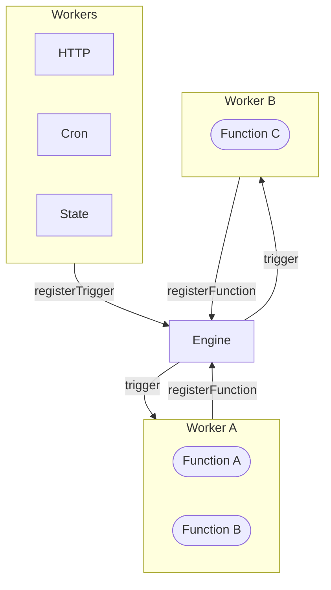

The iii engine is the runtime that connects workers, stores registrations, and routes invocations.

## Responsibilities

| Area | Description |
|------|-------------|
| Worker connections | Accepts WebSocket connections from SDK workers and managed workers. |
| Function registry | Tracks which connected workers can execute each function ID. |
| Trigger registry | Stores trigger bindings and trigger type metadata. |
| Invocation routing | Sends each function invocation to an eligible worker and returns the result. |
| Built-in workers | Starts configured built-in workers such as `iii-http`, `iii-queue`, `iii-state`, `iii-stream`, and `iii-observability`. |
| Configuration | Loads `iii-config.yaml` or built-in defaults. |

## Ports

| Port | Default | Purpose |
|------|---------|---------|
| HTTP API | `3111` | HTTP triggers, health, and console proxy requests. |
| Streams | `3112` | Stream and browser-facing WebSocket APIs. |
| Worker WebSocket | `49134` | SDK worker and managed worker connections. |

<Info title="Engine and SDK versions">
  Engine and SDK patch versions can differ. Keep them on the same minor version line, for example `0.11.x`, unless a release note says otherwise.
</Info>
The Engine is the central orchestrator of a iii system. It maintains a registry of every connected Worker and every registered Function, and routes `trigger()` calls to the correct Worker — regardless of language, location, or runtime.



## Responsibilities

| Responsibility | Description |
|----------------|-------------|
| **Function registry** | Tracks all `registerFunction` calls across connected Workers |
| **Worker registry** | Tracks connected Workers, their status, and metadata |
| **Trigger dispatch** | Receives `trigger()` (sync or fire-and-forget via `TriggerAction.Void()`) and routes to the correct Worker |
| **Worker orchestration** | Loads and initializes Workers from `iii-config.yaml` |
| **Worker cleanup** | When a Worker disconnects, automatically removes all its registered functions and triggers |

## Configuration

The Engine is configured via `iii-config.yaml` at the root of your project.

### Ports

The Engine uses two separate ports:

| Port | Default | Purpose |
|------|---------|---------|
| Engine WebSocket | `49134` | Workers connect here via the SDK |
| HTTP API | `3111` | HTTP endpoints registered by the HTTP module |

```yaml
workers:
  - name: iii-worker-manager
    config:
      port: 49134  # WebSocket protocol port — workers connect here

  - name: iii-http
    config:
      port: 3111   # HTTP port for registered endpoints

  - name: iii-state
    config:
      adapter:
        name: kv
        config:
          store_method: file_based
          file_path: ./data/state

  - name: iii-queue
    config:
      adapter:
        name: builtin

  - name: iii-observability
    config:
      exporter: memory
```

## Discovery

The Engine exposes built-in functions for querying the current system state:

```typescript
// All registered functions across all workers
const { functions } = await iii.trigger({
  function_id: 'engine::functions::list',
  payload: {},
})

// All connected workers and their status
const { workers } = await iii.trigger({
  function_id: 'engine::workers::list',
  payload: {},
})
```

## Worker Disconnect Cleanup

When a Worker disconnects — whether cleanly or due to a crash — the Engine automatically:

- Removes all functions the Worker registered
- Cancels all in-flight invocations routed to that Worker
- Unregisters all triggers bound to that Worker's functions
- Fires the `engine::workers-available` trigger to notify other Workers

Workers reconnect automatically via the SDK's built-in reconnection logic. On reconnect, all `registerFunction` and `registerTrigger` calls are re-sent automatically.

## Config Hot-Reload

The Engine watches its config file for changes and automatically reloads when the file is modified. Only workers whose `WorkerEntry` actually changed are touched — unchanged workers keep running without interruption.

If the new config is valid, the reload applies atomically. If the new config is invalid, **the engine exits with an error** showing exactly what is wrong — the operator must fix the config and restart. This prevents running with a stale config unknowingly.

| Phase | Behavior |
|-------|----------|
| **Parse & normalize** | Re-reads the config file, expands env vars, auto-injects mandatory workers, rejects duplicate names |
| **Diff** | Compares each `WorkerEntry` (name, image, config) against the running set. Unchanged workers are skipped entirely |
| **Validate** | Dry-runs `create` + `initialize` on every added and changed worker without starting background tasks. Any failure rolls back the staged workers and exits |
| **Commit** | Promotes validated replacements for changed workers, then shuts down and removes the old instances; drops removed workers; promotes validated additions |

Unchanged workers keep running through the reload — no blip, no dropped invocations. Only workers whose config entries genuinely changed are destroyed and recreated.

Every reload cycle emits a `reload:` log line sequence that operators can grep for:

```
reload: config changed, reloading from iii-config.yaml
reload: diff +1 added, -0 removed, ~2 changed, =8 unchanged
reload: success
```

Failure paths log `reload: FATAL: ...` with the specific error (including file path, line/column for parse errors, and worker name for validation errors) and then exit the engine process.

<Info title="Limitations">
  When the engine is started with `--use-default-config` there is no file to watch, so hot-reload is disabled. In-flight invocations on changed or removed workers are not drained — they are dropped when the old worker is destroyed. A bad config causes the engine to exit — configure your process supervisor to NOT auto-restart on this exit code.
</Info>

## Architecture Agnostic

iii makes no distinction between cloud providers, colocated servers, serverless functions, or different languages. A Function registered on Worker A can `trigger()` a Function on Worker B without knowing where Worker B is running.

<Info title="See also">
  For deployment options and production configuration, see [Deployment](/advanced/deployment).
</Info>
