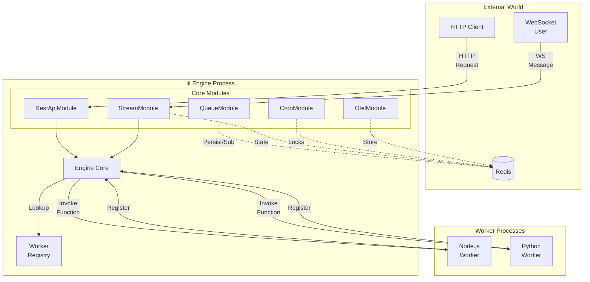

iii has three application primitives:

| Primitive | Role |
|-----------|------|
| **Worker** | A process that connects to the engine and registers capabilities. Workers can be built in, such as `iii-http`, or external SDK processes. |
| **Function** | A named handler that can be invoked directly or by a trigger. Function IDs use the `::` separator, for example `orders::validate`. |
| **Trigger** | A binding that tells iii when to invoke a function. HTTP requests, cron schedules, queue messages, state changes, logs, and stream events are all triggers. |

The engine owns connection management, routing, configuration, and protocol handling. Workers provide the actual capability surface.

<CardGroup cols={2}>
  <Card title="Engine" href="/architecture/engine" icon="server">
    Engine runtime, routing, and configuration.
  </Card>
  <Card title="Workers" href="/architecture/workers" icon="boxes">
    Built-in and external worker model.
  </Card>
  <Card title="Trigger Types" href="/architecture/trigger-types" icon="bolt">
    Trigger registration and call semantics.
  </Card>
  <Card title="Queues" href="/architecture/queues" icon="list-ordered">
    Topic-based and named queue models.
  </Card>
</CardGroup>
An iii system is made up of four components working together: the **Engine**, **Workers**, **Modules**, and **Context**.

