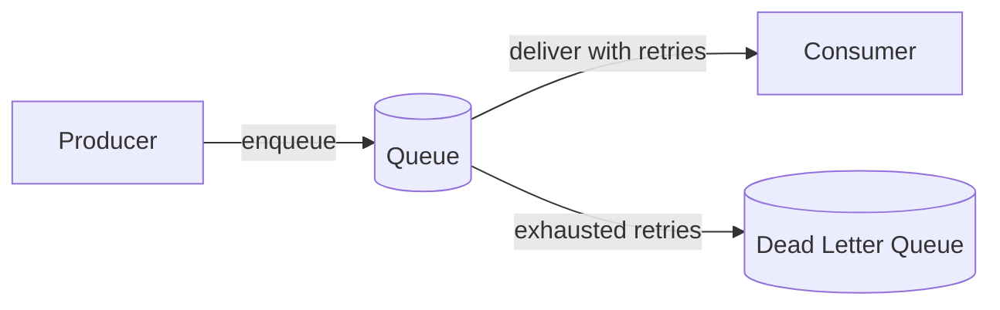
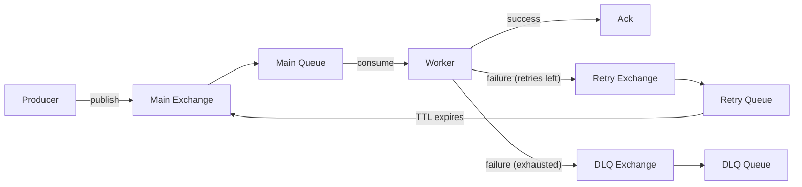

iii has two queue models.

| Model | Producer | Consumer |
|-------|----------|----------|
| Topic-based queue | Calls `iii::durable::publish` with a topic and data. | Registers a `durable:subscriber` trigger for a topic. |
| Named queue | Invokes a function with `TriggerAction.Enqueue({ queue })`. | The target function processes jobs from the named queue. |

## Topic-based queues

Topic-based queues fan out each message to every subscribed function. If one function has multiple replicas, those replicas compete on that function's queue so only one replica handles each copy.

```typescript
iii.registerTrigger({
  type: 'durable:subscriber',
  function_id: 'orders::process',
  config: { topic: 'order.created' },
})
```

## Named queues

Named queues route invocations to a specific function through a queue. No trigger registration is required.

```typescript
await iii.trigger({
  function_id: 'orders::process',
  payload: order,
  action: TriggerAction.Enqueue({ queue: 'orders' }),
})
```

Both models support retries and dead-letter handling through the `iii-queue` worker.
## What Are Queues

A queue sits between the code that **produces** work and the code that **processes** it. Instead of calling a function and waiting for it to finish, you hand the work to a queue. The queue stores the message, delivers it to a consumer, retries on failure, and routes permanently failed messages to a dead-letter queue (DLQ) for later inspection.



This separation solves three problems:

1. **Speed** — the producer responds immediately instead of blocking on slow downstream work.
2. **Reliability** — transient failures (network blips, service restarts) are retried automatically instead of being lost.
3. **Load control** — concurrency limits prevent consumers from overwhelming downstream systems.

## When to Use Queues

| Scenario | Use a queue? | Why |
|----------|-------------|-----|
| HTTP handler must respond fast, but downstream work is slow | **Yes** | Enqueue the work and return `202 Accepted` immediately |
| Multiple functions must react to the same event | **Yes** | Topic-based queues fan out to every subscriber |
| Work must survive process restarts | **Yes** | Queues persist messages and retry on failure |
| External API has rate limits | **Yes** | Concurrency control throttles parallel requests |
| Transactions for the same entity must be ordered | **Yes** | FIFO queues guarantee per-group ordering |
| You need the function's return value right now | **No** | Use a [synchronous trigger](/how-to/trigger-actions#1-synchronous-no-action) instead |
| The work is non-critical and losing it is acceptable | **Maybe** | [TriggerAction.Void()](/how-to/trigger-actions#2-void-fire-and-forget) is simpler if you don't need retries |

<Info title="How-to guide">
  For step-by-step instructions on setting up queues, see [Use Queues](/how-to/use-queues).
</Info>

## RabbitMQ Resource Topology

When you define a single named queue in `iii-config.yaml` and use the RabbitMQ adapter, iii creates six RabbitMQ objects behind the scenes: three exchanges and three queues. If you have ever opened the RabbitMQ Management UI after starting an iii engine and wondered why a queue called `payment` turned into half a dozen resources, this section explains the reasoning.

## Three Lifecycle Stages

Every job that enters a named queue can pass through up to three distinct stages during its lifetime. Each stage has different retention semantics and routing needs, which is why each one maps to its own exchange + queue pair.



**Stage 1 — Main processing.** The producer publishes a job to the main exchange, which routes it to the main queue. A worker consumes the job and invokes the target function. If the function succeeds, the job is acknowledged and removed. This is the happy path.

**Stage 2 — Delayed retry.** If the function fails and the job still has retries remaining, the engine needs to re-attempt the job after a delay (exponential backoff). The job is routed to the retry exchange, which delivers it to the retry queue. The retry queue holds the job for a configured TTL, after which RabbitMQ automatically dead-letters it back to the main exchange for another attempt. This creates a loop: main → retry → main, repeating until the job succeeds or retries are exhausted.

**Stage 3 — Dead-letter queue.** If retries are exhausted, the job is routed to the DLQ exchange and stored in the DLQ queue. It sits there indefinitely until an operator inspects it, fixes the root cause, and redrives it back to the main queue. Nothing is silently discarded.

## Why Exchanges AND Queues

RabbitMQ's routing model requires messages to flow through an exchange before reaching a queue. You cannot publish directly to a queue in a way that supports dead-letter exchange (DLX) routing, binding rules, or topology decoupling. This is a broker-level architectural constraint, not a choice iii makes.

Because each of the three lifecycle stages is a separate routing destination, and each destination requires an exchange + queue pair, the math is straightforward: **3 stages x 2 resources = 6 RabbitMQ objects** per named queue.

| Stage | Exchange | Queue |
|-------|----------|-------|
| Main processing | `iii.__fn_queue::<name>` | `iii.__fn_queue::<name>.queue` |
| Delayed retry | `iii.__fn_queue::<name>::retry` | `iii.__fn_queue::<name>::retry.queue` |
| Dead-letter | `iii.__fn_queue::<name>::dlq` | `iii.__fn_queue::<name>::dlq.queue` |

<Info title="Full resource map">
  For the complete naming convention and examples, see the [Queue module reference — Queue naming in RabbitMQ](/modules/module-queue#queue-naming-in-rabbitmq).
</Info>

## The Delayed Retry Problem

The retry stage is the piece that surprises most developers. If RabbitMQ had a built-in "deliver this message again in N seconds" primitive, a separate retry queue would be unnecessary. But it does not. The two naive alternatives are both harmful:

- **`nack` with `requeue=true`**: The message goes straight back to the head of the main queue with zero delay. The worker picks it up immediately, fails again, requeues again — creating a tight failure loop that burns CPU and floods logs while giving the downstream system no time to recover.

- **Sleep in the worker**: The worker thread blocks for the backoff duration. During that time it cannot process other jobs. With a 30-second backoff and 10 workers, a burst of 10 failures blocks all processing for half a minute.

The industry-standard solution is the **TTL + dead-letter-exchange bounce**. The retry queue is declared with two key properties:

- `x-message-ttl` — how long a message sits in the retry queue before expiring (the backoff delay).
- `x-dead-letter-exchange` — where expired messages go. This points back to the main exchange.

When a job fails, the engine acknowledges the original delivery (removing it from the main queue), then publishes a copy to the retry exchange with an incremented attempt counter. The retry queue holds the message for the TTL duration. When the TTL expires, RabbitMQ's built-in DLX mechanism routes the message back to the main exchange, where it re-enters the main queue for another attempt.

The worker never sleeps. The main queue stays unblocked. Backoff timing is handled entirely by the broker's TTL mechanism, which is efficient and does not consume application resources.

## Dead-Letter Queues as a Safety Net

When a job exhausts all retries, two things could happen: discard it silently, or preserve it. iii chooses preservation.

The DLQ stores the original payload, the error from the last attempt, a timestamp, and job metadata. This gives operators everything they need to diagnose the failure, fix the root cause, and redrive the messages back to the main queue for reprocessing. Without a DLQ, transient infrastructure issues (a database outage, a third-party API down for maintenance) would cause permanent data loss.

The DLQ exchange exists as a separate resource because the main queue's `x-dead-letter-exchange` property points to it. When the engine `nack`s a message with `requeue=false` after all retries are exhausted, RabbitMQ routes it to the DLQ automatically through this DLX binding.

<Info title="DLQ operations">
  For instructions on inspecting and redriving DLQ messages, see [Manage Failed Triggers](/how-to/dead-letter-queues).
</Info>

## Redriving DLQ Messages

Once the root cause of a failure is fixed, the messages sitting in the DLQ need to go back to the main queue for reprocessing. iii exposes this as a builtin function: `iii::queue::redrive`.

The redrive operation iterates over every message in the DLQ for a given named queue, resets the attempt counter to zero, and republishes each message to the main exchange. The original payload, function ID, and metadata are preserved — only the attempt counter changes. After the redrive, the messages re-enter the normal processing lifecycle with a fresh set of retries.

You invoke the redrive function using the [`iii trigger`](/how-to/trigger-functions-from-cli) CLI command against a running engine:

```bash
iii trigger \
  --function-id='iii::queue::redrive' \
  --payload='{"queue": "payment"}'
```

The function returns the queue name and the number of messages that were moved back:

```json
{
  "queue": "payment",
  "redriven": 12
}
```

The `iii trigger` command connects to the engine over WebSocket, sends an `InvokeFunction` message, waits for the `InvocationResult`, and prints the result to stdout. It accepts `--address` (default `localhost`) and `--port` (default `49134`) arguments for targeting remote engines.

Because `iii::queue::redrive` is a regular registered function, it can also be invoked programmatically from any SDK using `trigger({ function_id: 'iii::queue::redrive', payload: { queue: 'payment' } })`. The CLI is a convenience for operators who need a quick command-line tool.

## Industry Context

This topology is not unique to iii. The TTL + DLX pattern is the standard approach to delayed retry on RabbitMQ, used by frameworks across the ecosystem:

- **Celery** (Python) uses the same TTL + DLX bounce for retry with countdown/backoff when RabbitMQ is the broker.
- **MassTransit** (.NET) creates `_error` and `_skipped` queues alongside every main queue, plus retry exchanges for delayed redelivery.
- **Spring AMQP** (Java) documents the DLX-based retry pattern as the recommended approach for non-blocking retries.

Other brokers bake these concerns into the platform itself, which is why their topology looks simpler from the outside:

- **AWS SQS** has native visibility timeout (retry delay) and a built-in DLQ — you configure two queues, but the retry delay is handled internally by the broker.
- **Google Cloud Pub/Sub** supports dead-letter topics as a first-class concept — one subscription + one dead-letter topic.
- **Azure Service Bus** includes a sub-queue per queue for dead-lettering, with a built-in lock duration that acts as a retry delay.

RabbitMQ is a lower-level, more flexible broker. It gives you the primitives (exchanges, queues, bindings, TTL, DLX) and lets you compose them into whatever delivery pattern you need. The trade-off is that patterns like delayed retry require explicit topology setup. iii handles this automatically so you do not have to.

## The Builtin Adapter

The builtin adapter implements the same three-stage lifecycle entirely in-process, without creating any external resources. Jobs move through the same conceptual stages — main processing, delayed retry with backoff, and dead-lettering — but the "queues" are in-memory data structures (or file-backed, depending on `store_method`).

The conceptual model is identical across all adapters. Only the transport differs. This means you can develop locally with the builtin adapter and deploy to production with RabbitMQ, and the retry and DLQ behavior stays the same.

<Info title="Choosing an adapter">
  For a feature comparison of all queue adapters and scenario-based recommendations, see the [adapter comparison](/modules/module-queue#adapter-comparison).
</Info>

## Related

<CardGroup cols={3}>
  <Card title="Use Queues" href="/how-to/use-queues" icon="list-check">
    Configure named queues with retries, concurrency, and FIFO ordering
  </Card>
  <Card title="Dead Letter Queues" href="/how-to/dead-letter-queues" icon="skull">
    Inspect and redrive failed queue messages
  </Card>
  <Card title="Queue Worker Reference" href="/modules/module-queue" icon="gear">
    Full configuration reference for queues and adapters
  </Card>
</CardGroup>
