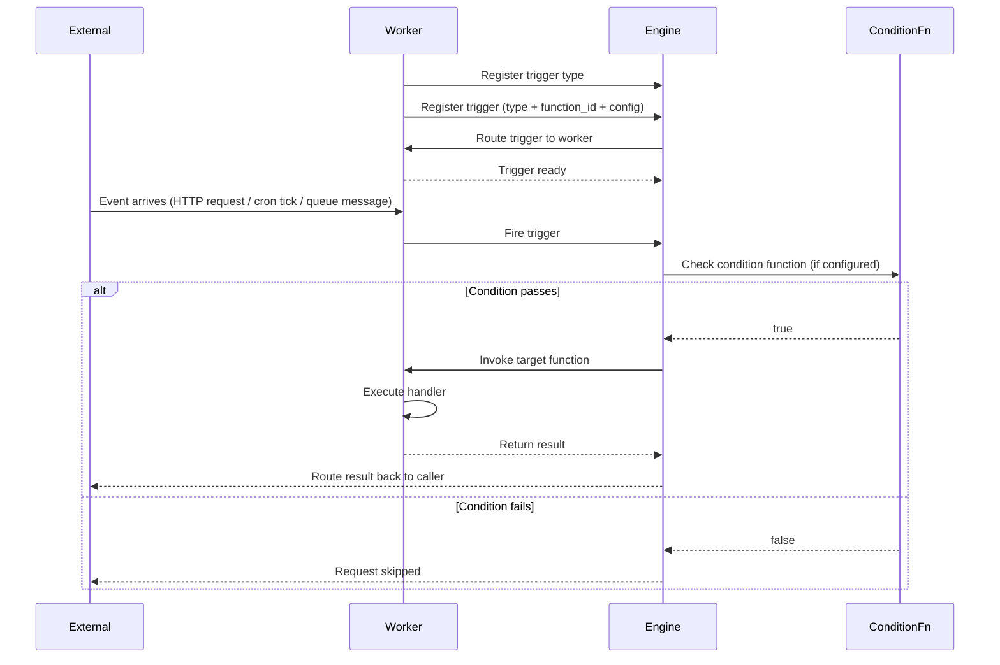
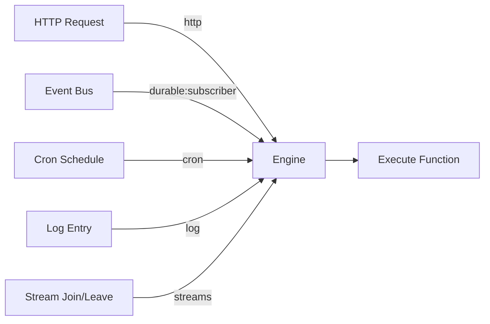
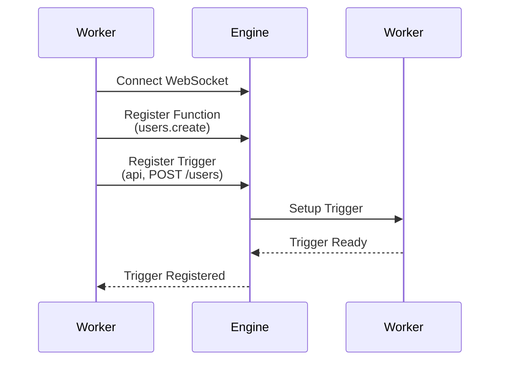
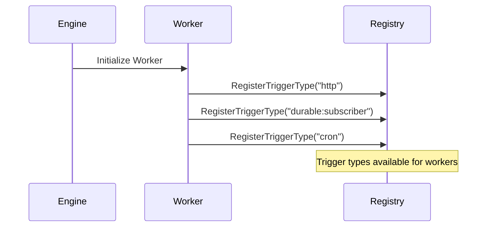
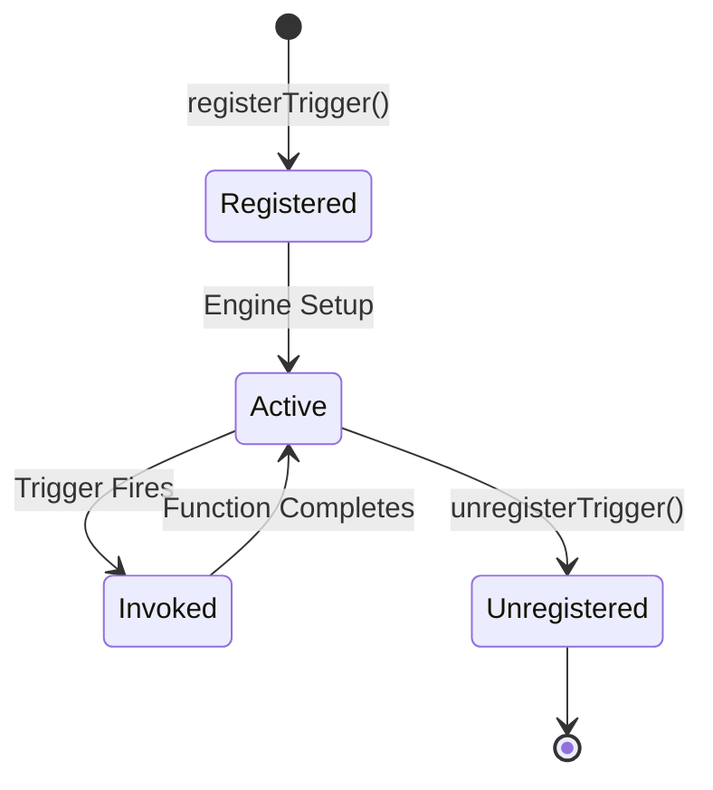

Triggers are entrypoints into a iii system. Each trigger defines the conditions that cause it to fire, a payload it accepts, and a function that it will invoke. When a trigger fires, the function is invoked with that payload.

## Trigger Components

A trigger consists of three parts:

1. **Trigger Type**: The mechanism that initiates execution (http, durable:subscriber, cron, log, stream)
2. **Configuration**: Type-specific settings (path, schedule, topics)
3. **Function ID**: The function to invoke when triggered

<Tabs>
<Tab title="Node / TypeScript">
```typescript
iii.registerTrigger({
  type: 'http',
  function_id: fn.id,
  config: {
    api_path: '/users',
    http_method: 'POST',
  },
})
```
</Tab>
<Tab title="Python">
```python
iii.register_trigger({
    'type': 'http',
    'function_id': fn.id,
    'config': {'api_path': '/users', 'http_method': 'POST'},
})
```
</Tab>
<Tab title="Rust">
```rust
use iii_sdk::RegisterTriggerInput;
use serde_json::json;

iii.register_trigger(RegisterTriggerInput { trigger_type: "http".into(), function_id: "users::create".into(), config: json!({
    "api_path": "/users",
    "http_method": "POST"
}), metadata: None })?;
```
</Tab>
</Tabs>

## Trigger Pipeline



## Core Trigger Types



### HTTP Trigger (`http`)

Executes functions in response to HTTP requests.

**Provided by**: [HTTP Worker](/modules/module-http)

**Configuration:**

<Tabs>
<Tab title="Node / TypeScript">
```typescript
{
  type: 'http',
  function_id: fn.id,
  config: {
    api_path: '/users/:id',
    http_method: 'GET'
  }
}
```
</Tab>
<Tab title="Python">
```python
{
    'type': 'http',
    'function_id': fn.id,
    'config': {
        'api_path': '/users/:id',
        'http_method': 'GET',
    },
}
```
</Tab>
<Tab title="Rust">
```rust
json!({
    "type": "http",
    "function_id": "users.get",
    "config": {
        "api_path": "/users/:id",
        "http_method": "GET"
    }
})
```
</Tab>
</Tabs>

**Input**: `ApiRequest` with path params, query params, body, headers

**Output**: `ApiResponse` with status_code, body, headers

**Conditions**: Optional. Add `condition_function_id` to config with a function ID. The engine invokes it before the handler; if it returns `false`, the handler function is not called. See [Trigger Conditions](#trigger-conditions).

**Path Parameters**: Extract values from URL

```typescript
// Trigger: api_path: '/users/:userId/posts/:postId'
// Request: GET /users/123/posts/456
// Handler receives: { path_params: { userId: '123', postId: '456' } }
```

<Card title="HTTP Worker" href="/modules/module-http" icon="globe">
  Learn more about the API trigger
</Card>

#### The `http` Utility Function

The simple `ApiResponse` return pattern works well for JSON endpoints, but some use cases require full control over the response lifecycle — streaming a file download, sending Server-Sent Events, or setting headers incrementally. The `http()` utility function enables this.

When you wrap your handler with an HTTP wrapper, it receives two arguments instead of one: the original request and a response object that gives you imperative control over the outgoing response:

<Tabs>
<Tab title="Node / TypeScript">
```typescript
import { http } from 'iii-sdk'
import type { HttpRequest, HttpResponse } from 'iii-sdk'

const fn = iii.registerFunction(
  'api.example',
  http(async (req: HttpRequest, response: HttpResponse) => {
    response.status(200)
    response.headers({ 'content-type': 'application/json' })
    response.stream.end(Buffer.from(JSON.stringify({ ok: true })))
  }),
)
```
</Tab>
<Tab title="Python">
```python
from iii import register_worker, http
from iii.types import HttpRequest, HttpResponse

@http
async def handler(req: HttpRequest, response: HttpResponse):
    await response.status(200)
    await response.headers({"content-type": "application/json"})
    await response.writer.write(json.dumps({"ok": True}).encode("utf-8"))
    await response.writer.close_async()

fn_ref = iii_client.register_function("api.example", handler)
```
</Tab>
<Tab title="Rust">

In Rust, the HTTP handler receives the raw `Value` input. You extract channel refs to obtain a `ChannelWriter` for the response and use `send_message` to set status and headers:

```rust
use iii_sdk::{III, IIIError, ChannelWriter, extract_channel_refs, ChannelDirection, RegisterFunctionMessage};
use serde_json::{json, Value};

iii.register_function((RegisterFunctionMessage::with_id("api.example".into()), move |input: Value| {
    let iii = iii.clone());

    async move {
        let refs = extract_channel_refs(&input);
        let writer_ref = refs.iter()
            .find(|(_, r)| matches!(r.direction, ChannelDirection::Write))
            .map(|(_, r)| r.clone())
            .expect("missing writer ref");

        let writer = ChannelWriter::new(iii.address(), &writer_ref);

        writer.send_message(&serde_json::to_string(
            &json!({"type": "set_status", "status_code": 200})
        ).unwrap()).await.map_err(|e| IIIError::Handler(e.to_string()))?;

        writer.send_message(&serde_json::to_string(
            &json!({"type": "set_headers", "headers": {"content-type": "application/json"}})
        ).unwrap()).await.map_err(|e| IIIError::Handler(e.to_string()))?;

        writer.write(b"{\"ok\":true}").await.map_err(|e| IIIError::Handler(e.to_string()))?;
        writer.close().await.map_err(|e| IIIError::Handler(e.to_string()))?;

        Ok(Value::Null)
    }
});
```
</Tab>
</Tabs>

The response object provides these capabilities across all SDKs:

| Capability | Node / TypeScript | Python | Rust |
|-----------|-------------------|--------|------|
| Set status code | `response.status(code)` | `await response.status(code)` | `writer.send_message(set_status json)` |
| Set headers | `response.headers(map)` | `await response.headers(map)` | `writer.send_message(set_headers json)` |
| Write body data | `response.stream.write(data)` | `response.stream.write(data)` (sync) or `await response.writer.write(data)` (async) | `writer.write(&data).await` |
| Access writable stream | `response.stream` | `response.stream` (`WritableStream`) | N/A (use writer directly) |
| Access channel writer | N/A | `response.writer` (`ChannelWriter`) | `writer` |
| Close response | `response.stream.end()` / `response.close()` | `response.close()` (sync) or `await response.writer.close_async()` (async) | `writer.close().await` |

In Python, the `http` wrapper can be used as a decorator (`@http`) on an `async def` handler. The wrapped handler must be an async function that accepts `(req: HttpRequest, response: HttpResponse)` and optionally returns an `ApiResponse`. Import it with `from iii import http`.

Under the hood, the wrapper unwraps the internal request, constructs the response object that maps `status()` and `headers()` calls to control messages sent over the underlying channel, and exposes the channel's writable stream directly. This means you can pipe file streams, write SSE frames, or send any binary data through the response stream.

<Info>
Use the HTTP wrapper when you need streaming responses. For simple JSON endpoints, returning a response dict/object directly is simpler and sufficient.
</Info>

#### File Download

Use the HTTP wrapper to stream a file to the client without buffering the entire file in memory:

<Tabs>
<Tab title="Node / TypeScript">
```typescript
import * as fs from 'node:fs'
import { pipeline } from 'node:stream/promises'
import { http } from 'iii-sdk'
import type { HttpRequest, HttpResponse } from 'iii-sdk'

const fn = iii.registerFunction(
  'api.download.pdf',
  http(async (_req: HttpRequest, response: HttpResponse) => {
    const fileStream = fs.createReadStream('/path/to/report.pdf')

    response.status(200)
    response.headers({ 'content-type': 'application/pdf' })

    await pipeline(fileStream, response.stream)
  }),
)

iii.registerTrigger({
  type: 'http',
  function_id: fn.id,
  config: {
    api_path: '/download/report',
    http_method: 'GET',
  },
})
```

`pipeline()` handles backpressure and error propagation between the file read stream and the response write stream automatically.
</Tab>
<Tab title="Python">
```python
from pathlib import Path
from iii import http
from iii.types import HttpRequest, HttpResponse

@http
async def handler(req: HttpRequest, response: HttpResponse):
    pdf_data = Path("/path/to/report.pdf").read_bytes()

    await response.status(200)
    await response.headers({"content-type": "application/pdf"})
    await response.writer.write(pdf_data)
    await response.writer.close_async()

fn_ref = iii_client.register_function("api.download.pdf", handler)
iii_client.register_trigger({
    "type": "http",
    "function_id": "api.download.pdf",
    "config": {
        "api_path": "download/report",
        "http_method": "GET",
    },
})
```
</Tab>
<Tab title="Rust">
```rust
use iii_sdk::{III, IIIError, ChannelWriter, extract_channel_refs, ChannelDirection, RegisterFunctionMessage, RegisterTriggerInput};
use serde_json::{json, Value};

let iii_for_handler = iii.clone();
iii.register_function((RegisterFunctionMessage::with_id("api.download.pdf".into()), move |input: Value| {
    let iii = iii_for_handler.clone());

    async move {
        let pdf_data = std::fs::read("/path/to/report.pdf")
            .map_err(|e| IIIError::Handler(e.to_string()))?;

        let refs = extract_channel_refs(&input);
        let writer_ref = refs.iter()
            .find(|(_, r)| matches!(r.direction, ChannelDirection::Write))
            .map(|(_, r)| r.clone())
            .expect("missing writer ref");

        let writer = ChannelWriter::new(iii.address(), &writer_ref);

        writer.send_message(&serde_json::to_string(
            &json!({"type": "set_status", "status_code": 200})
        ).unwrap()).await.map_err(|e| IIIError::Handler(e.to_string()))?;

        writer.send_message(&serde_json::to_string(
            &json!({"type": "set_headers", "headers": {"content-type": "application/pdf"}})
        ).unwrap()).await.map_err(|e| IIIError::Handler(e.to_string()))?;

        writer.write(&pdf_data).await.map_err(|e| IIIError::Handler(e.to_string()))?;
        writer.close().await.map_err(|e| IIIError::Handler(e.to_string()))?;

        Ok(Value::Null)
    }
});

iii.register_trigger(RegisterTriggerInput { trigger_type: "http".into(), function_id: "api.download.pdf".into(), config: json!({
    "api_path": "download/report",
    "http_method": "GET",
}), metadata: None })?;
```
</Tab>
</Tabs>

#### Server-Sent Events (SSE)

SSE lets you push events from the server to the client over a single HTTP connection. Set the appropriate headers and write SSE frames to the response stream:

<Tabs>
<Tab title="Node / TypeScript">
```typescript
import { http } from 'iii-sdk'
import type { HttpRequest, HttpResponse } from 'iii-sdk'

const fn = iii.registerFunction(
  'api.events',
  http(async (_req: HttpRequest, response: HttpResponse) => {
    response.status(200)
    response.headers({
      'content-type': 'text/event-stream',
      'cache-control': 'no-cache',
      connection: 'keep-alive',
    })

    const events = [
      { id: '1', type: 'message', data: 'Hello, world!' },
      { id: '2', type: 'update', data: JSON.stringify({ count: 42 }) },
      { id: '3', type: 'done', data: 'goodbye' },
    ]

    for (const event of events) {
      let frame = ''
      frame += `id: ${event.id}\n`
      frame += `event: ${event.type}\n`
      for (const line of event.data.split('\n')) {
        frame += `data: ${line}\n`
      }
      frame += '\n'

      response.stream.write(Buffer.from(frame))
    }

    response.stream.end()
  }),
)

iii.registerTrigger({
  type: 'http',
  function_id: fn.id,
  config: {
    api_path: '/events',
    http_method: 'GET',
  },
})
```
</Tab>
<Tab title="Python">
```python
import time
import json
from iii import http
from iii.types import HttpRequest, HttpResponse

@http
async def handler(req: HttpRequest, response: HttpResponse):
    await response.status(200)
    await response.headers({
        "content-type": "text/event-stream",
        "cache-control": "no-cache",
        "connection": "keep-alive",
    })

    events = [
        {"id": "1", "type": "message", "data": "Hello, world!"},
        {"id": "2", "type": "update", "data": json.dumps({"count": 42})},
        {"id": "3", "type": "done", "data": "goodbye"},
    ]

    for event in events:
        frame = ""
        frame += f"id: {event['id']}\n"
        frame += f"event: {event['type']}\n"
        for line in event["data"].split("\n"):
            frame += f"data: {line}\n"
        frame += "\n"

        await response.writer.write(frame.encode("utf-8"))
        time.sleep(0.05)

    await response.writer.close_async()

fn_ref = iii_client.register_function("api.events", handler)
iii_client.register_trigger({
    "type": "http",
    "function_id": "api.events",
    "config": {
        "api_path": "/events",
        "http_method": "GET",
    },
})
```
</Tab>
<Tab title="Rust">
```rust
use std::time::Duration;
use iii_sdk::{III, IIIError, ChannelWriter, extract_channel_refs, ChannelDirection, RegisterFunctionMessage, RegisterTriggerInput};
use serde_json::{json, Value};

let events = vec![
    json!({"id": "1", "type": "message", "data": "Hello, world!"}),
    json!({"id": "2", "type": "update", "data": serde_json::to_string(&json!({"count": 42})).unwrap()}),
    json!({"id": "3", "type": "done", "data": "goodbye"}),
];

let iii_for_handler = iii.clone();
iii.register_function((RegisterFunctionMessage::with_id("api.events".into()), move |input: Value| {
    let iii = iii_for_handler.clone());

    let events = events.clone();
    async move {
        let refs = extract_channel_refs(&input);
        let writer_ref = refs.iter()
            .find(|(_, r)| matches!(r.direction, ChannelDirection::Write))
            .map(|(_, r)| r.clone())
            .expect("missing writer ref");

        let writer = ChannelWriter::new(iii.address(), &writer_ref);

        writer.send_message(&serde_json::to_string(
            &json!({"type": "set_status", "status_code": 200})
        ).unwrap()).await.map_err(|e| IIIError::Handler(e.to_string()))?;

        writer.send_message(&serde_json::to_string(&json!({
            "type": "set_headers", "headers": {
                "content-type": "text/event-stream",
                "cache-control": "no-cache",
                "connection": "keep-alive",
            }
        })).unwrap()).await.map_err(|e| IIIError::Handler(e.to_string()))?;

        for event in &events {
            let mut frame = String::new();
            frame.push_str(&format!("id: {}\n", event["id"].as_str().unwrap()));
            frame.push_str(&format!("event: {}\n", event["type"].as_str().unwrap()));
            for line in event["data"].as_str().unwrap().split('\n') {
                frame.push_str(&format!("data: {line}\n"));
            }
            frame.push('\n');

            writer.write(frame.as_bytes()).await
                .map_err(|e| IIIError::Handler(e.to_string()))?;
            tokio::time::sleep(Duration::from_millis(50)).await;
        }

        writer.close().await.map_err(|e| IIIError::Handler(e.to_string()))?;
        Ok(Value::Null)
    }
});

iii.register_trigger(RegisterTriggerInput { trigger_type: "http".into(), function_id: "api.events".into(), config: json!({
    "api_path": "/events",
    "http_method": "GET",
}), metadata: None })?;
```
</Tab>
</Tabs>

Each SSE frame follows the standard format: `id`, `event`, and `data` fields separated by newlines, with a blank line marking the end of a frame. Multi-line data values are split across multiple `data:` lines.

---

### Queue Trigger (`queue`)

Executes functions when events are published to subscribed topics.

**Provided by**: [Queue Worker](/modules/module-queue)

**Configuration:**

<Tabs>
<Tab title="Node / TypeScript">
```typescript
{
  type: 'durable:subscriber',
  function_id: fn.id,
  config: {
    topic: 'user.created'
  }
}
```
</Tab>
<Tab title="Python">
```python
{
    'type': 'durable:subscriber',
    'function_id': fn.id,
    'config': {
        'topic': 'user.created',
    },
}
```
</Tab>
<Tab title="Rust">
```rust
json!({
    "type": "durable:subscriber",
    "function_id": "users.on_created",
    "config": {
        "topic": "user.created"
    }
})
```
</Tab>
</Tabs>

**Input**: Event payload (any JSON data)

**Output**: Function result (optional, fire-and-forget pattern supported)

**Conditions**: Optional. Add `condition_function_id` to config. See [Trigger Conditions](#trigger-conditions).

**Multiple Topics**: Register separate triggers for each topic.

<Card title="Queue Worker" href="/modules/module-queue" icon="bolt">
  Learn more about the Queue trigger
</Card>

---

### Cron Trigger (`cron`)

Executes functions on a time-based schedule using cron expressions.

**Provided by**: [Cron Worker](/modules/module-cron)

**Configuration:**

<Tabs>
<Tab title="Node / TypeScript">
```typescript
{
  type: 'cron',
  function_id: fn.id,
  config: {
    expression: '0 2 * * *'
  }
}
```
</Tab>
<Tab title="Python">
```python
{
    'type': 'cron',
    'function_id': fn.id,
    'config': {
        'expression': '0 2 * * *',
    },
}
```
</Tab>
<Tab title="Rust">
```rust
json!({
    "type": "cron",
    "function_id": "reports.daily",
    "config": {
        "expression": "0 2 * * *"
    }
})
```
</Tab>
</Tabs>

**Input**: Cron execution context (timestamp, trigger info)

**Output**: Function result

**Conditions**: Optional. Add `condition_function_id` to config. See [Trigger Conditions](#trigger-conditions).

**Cron Expression**: Standard 5-field format (minute hour day month weekday)

<Card title="Cron Worker" href="/modules/module-cron" icon="clock">
  Learn more about the Cron trigger
</Card>

---

### Log Trigger (`log`)

Executes functions when log entries match specified criteria.

**Provided by**: [Observability Worker](/modules/module-observability)

**Configuration:**

<Tabs>
<Tab title="Node / TypeScript">
```typescript
{
  type: 'log',
  function_id: fn.id,
  config: {
    level: 'error'
  }
}
```
</Tab>
<Tab title="Python">
```python
{
    'type': 'log',
    'function_id': fn.id,
    'config': {
        'level': 'error',
    },
}
```
</Tab>
<Tab title="Rust">
```rust
json!({
    "type": "log",
    "function_id": "alerts.on_error",
    "config": {
        "level": "error"
    }
})
```
</Tab>
</Tabs>

**Input**: Log entry with trace_id, message, level, function_name, date

**Output**: Function result (useful for alerting, metrics)

**Log Levels**: `info`, `warn`, `error`, `debug` (omit to receive all levels)

<Card title="Observability Worker" href="/modules/module-observability" icon="file-text">
  Learn more about the Log trigger
</Card>

---

### Stream Triggers (`stream:join`, `stream:leave`)

Executes functions when clients connect to or disconnect from streams.

**Provided by**: [Stream Worker](/modules/module-stream)

**Configuration:**

```typescript
{
  type: 'stream:join',
  function_id: fn.id,
  config: {}
}

{
  type: 'stream:leave',
  function_id: fn.id,
  config: {}
}
```

**Input**: Subscription info with stream_name, group_id, item_id, context

**Output**: Function result (useful for access control, analytics)

**Conditions**: Optional. Add `condition_function_id` to config for stream:join/stream:leave. See [Trigger Conditions](#trigger-conditions).

<Card title="Stream Worker" href="/modules/module-stream" icon="chart-line">
  Learn more about Stream triggers
</Card>

## Trigger Type Comparison

| Trigger Type      | Use Case              | Synchronous | Multiple Subscribers    |
| ----------------- | --------------------- | ----------- | ----------------------- |
| **http**          | HTTP endpoints        | ✓ Yes       | ✗ No (1:1 mapping)      |
| **queue**         | Pub/sub messaging     | ✗ No        | ✓ Yes                   |
| **cron**          | Scheduled tasks       | ✗ No        | ✗ No (distributed lock) |
| **log**           | Log monitoring        | ✗ No        | ✓ Yes                   |
| **stream:join**  | Stream connections    | ✗ No        | ✓ Yes                   |
| **stream:leave** | Stream disconnections | ✗ No        | ✓ Yes                   |

## Registering Triggers

Triggers are registered by workers after establishing a connection to the engine:



**Step 1: Register Function**

First, register the function that will be invoked:

<Tabs>
<Tab title="Node / TypeScript">
```typescript
const fn = iii.registerFunction('users.create', async (data) => {
  return { id: '123', ...data }
})
```
</Tab>
<Tab title="Python">
```python
def create_user(data):
    return {'id': '123', **data}

fn = iii.register_function("users.create", create_user)
```
</Tab>
<Tab title="Rust">
```rust
use iii_sdk::RegisterFunctionMessage;
use serde_json::{json, Value};

iii.register_function((RegisterFunctionMessage::with_id("users.create".into()), |data: Value| async move {
    Ok(json!({"id": "123", "name": data["name"]}))
}));

```
</Tab>
</Tabs>

**Step 2: Register Trigger**

Then, register a trigger that routes to that function:

<Tabs>
<Tab title="Node / TypeScript">
```typescript
iii.registerTrigger({
  type: 'http',
  function_id: fn.id,
  config: {
    api_path: '/users',
    http_method: 'POST',
  },
})
```
</Tab>
<Tab title="Python">
```python
iii.register_trigger({
    'type': 'http',
    'function_id': fn.id,
    'config': {'api_path': '/users', 'http_method': 'POST'},
})
```
</Tab>
<Tab title="Rust">
```rust
use iii_sdk::RegisterTriggerInput;
use serde_json::json;

iii.register_trigger(RegisterTriggerInput { trigger_type: "http".into(), function_id: "users.create".into(), config: json!({
    "api_path": "/users",
    "http_method": "POST"
}), metadata: None })?;
```
</Tab>
</Tabs>

**Step 3: Trigger Active**

The engine sets up the trigger in the appropriate module. When an HTTP POST request comes to `/users`, the `users.create` function will be invoked.

Trigger types are registered by core modules during engine initialization:



## Multiple Triggers to One Function

A single function can have multiple triggers:

<Tabs>
<Tab title="Node / TypeScript">
```typescript
const fn = iii.registerFunction('users.notify', async (data) => {
  await sendNotification(data)
})

iii.registerTrigger({
  type: 'http',
  function_id: fn.id,
  config: { api_path: '/notify', http_method: 'POST' },
})

iii.registerTrigger({
  type: 'durable:subscriber',
  function_id: fn.id,
  config: { topic: 'user.created' },
})

iii.registerTrigger({
  type: 'cron',
  function_id: fn.id,
  config: { expression: '0 9 * * *' },
})
```
</Tab>
<Tab title="Python">
```python
def notify(data):
    send_notification(data)

fn = iii.register_function("users.notify", notify)

iii.register_trigger({
    'type': 'http',
    'function_id': fn.id,
    'config': {'api_path': '/notify', 'http_method': 'POST'},
})

iii.register_trigger({
    'type': 'durable:subscriber',
    'function_id': fn.id,
    'config': {'topic': 'user.created'},
})

iii.register_trigger({
    'type': 'cron',
    'function_id': fn.id,
    'config': {'expression': '0 9 * * *'},
})
```
</Tab>
<Tab title="Rust">
```rust
use iii_sdk::{RegisterFunctionMessage, RegisterTriggerInput};
use serde_json::json;

iii.register_function((RegisterFunctionMessage::with_id("users.notify".into()), |data: Value| async move {
    send_notification(&data).await;
    Ok(json!({}))
});

iii.register_trigger(RegisterTriggerInput { trigger_type: "http".into(), function_id: "users.notify".into(), config: json!({
    "api_path": "/notify",
    "http_method": "POST"
}), metadata: None })?;

iii.register_trigger(RegisterTriggerInput { trigger_type: "durable:subscriber".into(), function_id: "users.notify".into(), config: json!({
    "topic": "user.created"
}), metadata: None })?;

iii.register_trigger(RegisterTriggerInput { trigger_type: "cron".into(), function_id: "users.notify".into(), config: json!({
    "expression": "0 9 * * *"
}), metadata: None })?;
```
</Tab>
</Tabs>

**Use Case**: Send notifications via API calls, events, or scheduled jobs using the same logic.

## Trigger Conditions

Triggers can optionally use a **condition function** to decide whether the handler should run. The engine invokes the condition with the trigger payload before the main handler. If it returns `false`, the handler is not invoked.

**Supported trigger types**: http, durable:subscriber, cron, stream, state

### How It Works

1. Register a condition function that receives the same input as the handler and returns a boolean.
2. Add `condition_function_id` to the trigger config with the condition function's ID.
3. When the trigger fires, the engine calls the condition first. Only if it returns truthy does the handler run.

### Example: HTTP Trigger with Condition

<Tabs>
<Tab title="Node / TypeScript">
```typescript
const conditionFn = iii.registerFunction(
  'conditions::requireVerified',
  async (req) => req.headers?.['x-verified'] === 'true',
)

const fn = iii.registerFunction('api::verifiedOnly', async (req) => ({
  status_code: 200,
  body: { message: 'Verified request' },
}))

iii.registerTrigger({
  type: 'http',
  function_id: fn.id,
  config: {
    api_path: '/verified',
    http_method: 'POST',
    condition_function_id: conditionFn.id,
  },
})
```
</Tab>
<Tab title="Python">
```python
def require_verified(req):
    return req.get('headers', {}).get('x-verified') == 'true'

condition_fn = iii.register_function("conditions::requireVerified", require_verified)

def verified_only(req):
    return {'status_code': 200, 'body': {'message': 'Verified request'}}

fn = iii.register_function("api::verifiedOnly", verified_only)

iii.register_trigger({
    'type': 'http',
    'function_id': fn.id,
    'config': {
        'api_path': '/verified',
        'http_method': 'POST',
        'condition_function_id': condition_fn.id,
    },
})
```
</Tab>
<Tab title="Rust">
```rust
use iii_sdk::{RegisterFunctionMessage, RegisterTriggerInput};
use serde_json::json;

iii.register_function((RegisterFunctionMessage::with_id("conditions::requireVerified".into()), |req: Value| async move {
    let verified = req["headers"]["x-verified"].as_str() == Some("true"));

    Ok(json!(verified))
});

iii.register_function((RegisterFunctionMessage::with_id("api::verifiedOnly".into()), |_req: Value| async move {
    Ok(json!({"status_code": 200, "body": {"message": "Verified request"}}))
}));

iii.register_trigger(RegisterTriggerInput { trigger_type: "http".into(), function_id: "api::verifiedOnly".into(), config: json!({
    "api_path": "/verified",
    "http_method": "POST",
    "condition_function_id": "conditions::requireVerified"
}), metadata: None })?;
```
</Tab>
</Tabs>

### Example: Queue Trigger with Condition

<Tabs>
<Tab title="Node / TypeScript">
```typescript
const conditionFn = iii.registerFunction(
  'conditions::highValue',
  async (data) => (data?.amount ?? 0) > 1000,
)

const fn = iii.registerFunction('orders::processHighValue', async (order) => {
  await processHighValueOrder(order)
  return {}
})

iii.registerTrigger({
  type: 'durable:subscriber',
  function_id: fn.id,
  config: {
    topic: 'order.placed',
    condition_function_id: conditionFn.id,
  },
})
```
</Tab>
<Tab title="Python">
```python
def high_value(data):
    return (data.get('amount', 0)) > 1000

condition_fn = iii.register_function("conditions::highValue", high_value)

def process_high_value(order):
    process_high_value_order(order)
    return {}

fn = iii.register_function("orders::processHighValue", process_high_value)

iii.register_trigger({
    'type': 'durable:subscriber',
    'function_id': fn.id,
    'config': {
        'topic': 'order.placed',
        'condition_function_id': condition_fn.id,
    },
})
```
</Tab>
<Tab title="Rust">
```rust
use iii_sdk::{RegisterFunctionMessage, RegisterTriggerInput};
use serde_json::json;

iii.register_function((RegisterFunctionMessage::with_id("conditions::highValue".into()), |data: Value| async move {
    let amount = data["amount"].as_f64().unwrap_or(0.0));

    Ok(json!(amount > 1000.0))
});

iii.register_function((RegisterFunctionMessage::with_id("orders::processHighValue".into()), |order: Value| async move {
    process_high_value_order(&order).await;
    Ok(json!({}))
});

iii.register_trigger(RegisterTriggerInput { trigger_type: "durable:subscriber".into(), function_id: "orders::processHighValue".into(), config: json!({
    "topic": "order.placed",
    "condition_function_id": "conditions::highValue"
}), metadata: None })?;
```
</Tab>
</Tabs>

### Example: State Trigger with Condition

<Tabs>
<Tab title="Node / TypeScript">
```typescript
const conditionFn = iii.registerFunction(
  'conditions::profileChanged',
  async (event) => event.event_type === 'updated' && event.key === 'profile',
)

const fn = iii.registerFunction('state::onProfileUpdate', async (event) => {
  console.log('Profile updated:', event.new_value)
  return {}
})

iii.registerTrigger({
  type: 'state',
  function_id: fn.id,
  config: {
    scope: 'users',
    condition_function_id: conditionFn.id,
  },
})
```
</Tab>
<Tab title="Python">
```python
def profile_changed(event):
    return event.get('event_type') == 'updated' and event.get('key') == 'profile'

condition_fn = iii.register_function("conditions::profileChanged", profile_changed)

def on_profile_update(event):
    print('Profile updated:', event.get('new_value'))
    return {}

fn = iii.register_function("state::onProfileUpdate", on_profile_update)

iii.register_trigger({
    'type': 'state',
    'function_id': fn.id,
    'config': {
        'scope': 'users',
        'condition_function_id': condition_fn.id,
    },
})
```
</Tab>
<Tab title="Rust">
```rust
use iii_sdk::{RegisterFunctionMessage, RegisterTriggerInput};
use serde_json::json;

iii.register_function((RegisterFunctionMessage::with_id("conditions::profileChanged".into()), |event: Value| async move {
    let is_updated = event["event_type"].as_str() == Some("updated"));

    let is_profile = event["key"].as_str() == Some("profile");
    Ok(json!(is_updated && is_profile))
});

iii.register_function((RegisterFunctionMessage::with_id("state::onProfileUpdate".into()), |event: Value| async move {
    println!("Profile updated: {:?}", event["new_value"]));

    Ok(json!({}))
});

iii.register_trigger(RegisterTriggerInput { trigger_type: "state".into(), function_id: "state::onProfileUpdate".into(), config: json!({
    "scope": "users",
    "condition_function_id": "conditions::profileChanged"
}), metadata: None })?;
```
</Tab>
</Tabs>

### Config Key

All trigger types use `condition_function_id` in the trigger config to reference the condition function.

## Trigger Lifecycle



### Unregistering Triggers

Remove triggers dynamically. `registerTrigger` returns a trigger object with `unregister()`:

```typescript
const fn = iii.registerFunction('api.temp', async () => ({ status_code: 200, body: {} }))
const trigger = iii.registerTrigger({
  type: 'http',
  function_id: fn.id,
  config: { api_path: '/temp', http_method: 'GET' },
})

trigger.unregister()
```

## Usage Patterns

### Webhook Handler

<Tabs>
<Tab title="Node / TypeScript">
```typescript
const fn = iii.registerFunction('webhooks.github', async (req) => {
  const event = req.headers?.['x-github-event']
  const payload = req.body

  await processGitHubWebhook(event, payload)

  return { status_code: 200, body: { received: true } }
})

iii.registerTrigger({
  type: 'http',
  function_id: fn.id,
  config: {
    api_path: '/webhooks/github',
    http_method: 'POST',
  },
})
```
</Tab>
<Tab title="Python">
```python
def github_webhook(req):
    event = req.get('headers', {}).get('x-github-event')
    payload = req.get('body')

    process_github_webhook(event, payload)

    return {'status_code': 200, 'body': {'received': True}}

fn = iii.register_function("webhooks.github", github_webhook)

iii.register_trigger({
    'type': 'http',
    'function_id': fn.id,
    'config': {
        'api_path': '/webhooks/github',
        'http_method': 'POST',
    },
})
```
</Tab>
<Tab title="Rust">
```rust
use iii_sdk::{RegisterFunctionMessage, RegisterTriggerInput};
use serde_json::json;

iii.register_function((RegisterFunctionMessage::with_id("webhooks.github".into()), |req: Value| async move {
    let event = req["headers"]["x-github-event"].as_str().unwrap_or(""));

    let payload = &req["body"];

    process_github_webhook(event, payload).await;

    Ok(json!({"status_code": 200, "body": {"received": true}}))
});

iii.register_trigger(RegisterTriggerInput { trigger_type: "http".into(), function_id: "webhooks.github".into(), config: json!({
    "api_path": "/webhooks/github",
    "http_method": "POST"
}), metadata: None })?;
```
</Tab>
</Tabs>

### Event Chain

<Tabs>
<Tab title="Node / TypeScript">
```typescript
import { TriggerAction } from 'iii-sdk'

const processFn = iii.registerFunction('orders.process', async (order) => {
  await saveOrder(order)
  iii.trigger({
    function_id: 'iii::durable::publish',
    payload: { topic: 'order.processed', data: order },
    action: TriggerAction.Void(),
  })
})

iii.registerTrigger({
  type: 'durable:subscriber',
  function_id: processFn.id,
  config: { topic: 'order.placed' },
})

const confirmFn = iii.registerFunction('orders.sendConfirmation', async (order) => {
  await sendEmail(order.email, 'Order confirmed')
})

iii.registerTrigger({
  type: 'durable:subscriber',
  function_id: confirmFn.id,
  config: { topic: 'order.processed' },
})
```
</Tab>
<Tab title="Python">
```python
from iii import TriggerAction

def process_order(order):
    save_order(order)
    iii.trigger({
        'function_id': 'iii::durable::publish',
        'payload': {
            'topic': 'order.processed',
            'data': order,
        },
        'action': TriggerAction.Void(),
    })

process_fn = iii.register_function("orders.process", process_order)

iii.register_trigger({
    'type': 'durable:subscriber',
    'function_id': process_fn.id,
    'config': {'topic': 'order.placed'},
})

def send_confirmation(order):
    send_email(order['email'], 'Order confirmed')

confirm_fn = iii.register_function("orders.sendConfirmation", send_confirmation)

iii.register_trigger({
    'type': 'durable:subscriber',
    'function_id': confirm_fn.id,
    'config': {'topic': 'order.processed'},
})
```
</Tab>
<Tab title="Rust">
```rust
use iii_sdk::{TriggerAction, TriggerRequest, RegisterFunctionMessage, RegisterTriggerInput};

let iii_clone = iii.clone();
iii.register_function((RegisterFunctionMessage::with_id("orders.process".into()), move |order: Value| {
    let iii = iii_clone.clone());

    async move {
        save_order(&order).await;
        iii.trigger(
            TriggerRequest::new("iii::durable::publish", json!({
                "topic": "order.processed",
                "data": order,
            }))
            .action(TriggerAction::void()),
        )
        .await?;
        Ok(json!(null))
    }
});

iii.register_trigger(RegisterTriggerInput { trigger_type: "durable:subscriber".into(), function_id: "orders.process".into(), config: json!({
    "topic": "order.placed"
}), metadata: None })?;

iii.register_function((RegisterFunctionMessage::with_id("orders.sendConfirmation".into()), |order: Value| async move {
    send_email(order["email"].as_str().unwrap_or(""), "Order confirmed").await;
    Ok(json!(null))
});

iii.register_trigger(RegisterTriggerInput { trigger_type: "durable:subscriber".into(), function_id: "orders.sendConfirmation".into(), config: json!({
    "topic": "order.processed"
}), metadata: None })?;
```
</Tab>
</Tabs>

### Scheduled Cleanup

<Tabs>
<Tab title="Node / TypeScript">
```typescript
const fn = iii.registerFunction('maintenance.cleanup', async () => {
  const deleted = await deleteOldRecords()
  logger.info(`Deleted ${deleted} old records`)
})

iii.registerTrigger({
  type: 'cron',
  function_id: fn.id,
  config: {
    expression: '0 3 * * *',
  },
})
```
</Tab>
<Tab title="Python">
```python
def cleanup():
    deleted = delete_old_records()
    logger.info(f'Deleted {deleted} old records')

fn = iii.register_function("maintenance.cleanup", cleanup)

iii.register_trigger({
    'type': 'cron',
    'function_id': fn.id,
    'config': {
        'expression': '0 3 * * *',
    },
})
```
</Tab>
<Tab title="Rust">
```rust
use iii_sdk::{RegisterFunctionMessage, RegisterTriggerInput};
use serde_json::json;

iii.register_function((RegisterFunctionMessage::with_id("maintenance.cleanup".into()), |_: Value| async move {
    let deleted = delete_old_records().await;
    info!("Deleted {} old records", deleted);
    Ok(json!(null))
});

iii.register_trigger(RegisterTriggerInput { trigger_type: "cron".into(), function_id: "maintenance.cleanup".into(), config: json!({
    "expression": "0 3 * * *"
}), metadata: None })?;
```
</Tab>
</Tabs>

## Best Practices

<AccordionGroup>
  <Accordion title="Use Descriptive Trigger IDs">
    Provide unique IDs for easier management:

    ```typescript
    const trigger = iii.registerTrigger({
      type: 'http',
      function_id: fn.id,
      config: { api_path: '/users', http_method: 'POST' }
    })
    ```

  </Accordion>

  <Accordion title="Match Function Capabilities">
    Ensure trigger configuration matches what the function expects:

    ```typescript
    const fn = iii.registerFunction('users.create', async ({ name, email }) => { /* ... */ })

    iii.registerTrigger({
      type: 'http',
      function_id: fn.id,
      config: { api_path: '/users', http_method: 'POST' }
    })
    ```

  </Accordion>

  <Accordion title="Namespace Your Paths">
    Use consistent path patterns:

    ```typescript
    // Good: Organized, versioned
    api_path: '/api/v1/users'
    api_path: '/api/v1/orders'

    // Avoid: Inconsistent
    api_path: '/getUsers'
    api_path: '/order-list'
    ```

  </Accordion>

  <Accordion title="Handle Trigger Errors">
    Functions should handle errors gracefully:

    ```typescript
    iii.registerFunction('api.create', async (req) => {
      try {
        const result = await createResource(req.body)
        return { status_code: 201, body: result }
      } catch (error) {
        return {
          status_code: 400,
          body: { error: error.message }
        }
      }
    })
    ```

  </Accordion>
</AccordionGroup>

## Custom Trigger Types

Modules can register custom trigger types by implementing the trigger interface:

```rust
pub struct CustomWorker {
    // Worker state
}

impl CoreWorker for CustomWorker {
    fn name(&self) -> &str {
        "custom"
    }

    async fn register_trigger_type(&self, registry: &TriggerRegistry) {
        registry.register("custom:trigger", CustomTriggerHandler);
    }
}
```

## Next Steps

<Card title="Modules" href="/modules" icon="cubes">
  Explore modules that provide trigger types
</Card>
