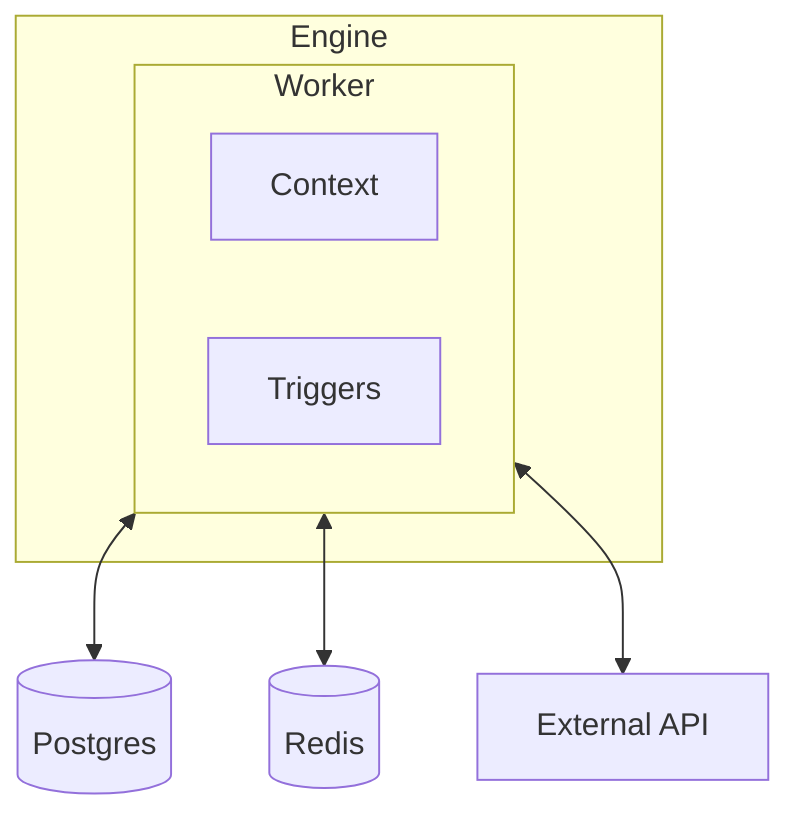

Workers are the units that add capability to a iii system.

## Worker types

| Type | Examples | Description |
|------|----------|-------------|
| Built-in workers | `iii-http`, `iii-queue`, `iii-state`, `iii-stream`, `iii-cron`, `iii-observability` | Rust workers shipped with the engine and enabled in `config.yaml`. |
| External workers | Node.js, Python, Rust, browser workers | SDK processes that connect to the engine and register application functions. |
| Managed workers | Local directories or OCI images added with `iii worker add` | Workers started and supervised by the iii worker manager. |

## Configuration

Built-in and managed workers are configured under the `workers` key:

```yaml
workers:
  - name: iii-http
    config:
      port: 3111

  - name: iii-queue
```

External SDK workers usually configure only their engine address:

```typescript
const iii = registerWorker(process.env.III_URL ?? 'ws://localhost:49134')
```

<Info title="Terminology">
  Older docs and configs may use "module" for built-in workers. In current iii, "worker" is the canonical term.
</Info>
Workers are the interface between the Engine and the rest of the application. They are responsible for establishing connections to services, implementing trigger types, and supplying application Context.

Every capability in iii (HTTP endpoints, cron scheduling, state management, queues, streams, observability) is implemented as a Worker. This modular architecture means the Engine itself stays small and focused on orchestration, while Workers handle all external concerns.



## Built-in Workers

| Worker | Provides | Config key |
|--------|----------|------------|
| [HTTP](/workers/iii-http) | HTTP trigger type, request/response handling | `rest_api` |
| [Queue](/workers/iii-queue) | Async message processing with retries | `queue` |
| [Cron](/workers/iii-cron) | Scheduled task execution | `cron` |
| [State](/workers/iii-state) | Key-value state storage with atomic updates | `state` |
| [Stream](/workers/iii-stream) | Real-time data streams with WebSocket push | `stream` |
| [PubSub](/workers/iii-pubsub) | Publish/subscribe messaging | `pubsub` |
| [Observability](/workers/iii-observability) | Structured logging, tracing, and metrics | `observability` |
| [Exec](/workers/iii-exec) | Shell command execution | `exec` |
| [Bridge](/workers/iii-bridge) | WebSocket bridge for SDK connections | `bridge` |

## How Workers Work

A Worker has two responsibilities:

1. **Register trigger types**: A Worker can introduce new ways to invoke Functions. For example, the HTTP worker registers the `http` trigger type, and the Cron worker registers the `cron` trigger type.

2. **Supply Context**: A Worker can add capabilities to the Context object that gets passed to every Function. For example, the State worker adds `state::get`, `state::set`, and other state operations.

Workers are configured in `config.yaml` (the engine default). Use `-c iii-config.yaml` to specify a custom path:

```yaml
workers:
  - name: iii-http
    config:
      port: 3111
      host: 0.0.0.0
  - name: iii-state
    config:
      adapter:
        name: kv
        config:
          store_method: in_memory
  - name: iii-queue
    config:
      adapter:
        name: builtin
        config:
          store_method: in_memory
```

<Info title="Custom Workers">
  You can build your own Workers to integrate any service or infrastructure. See [Custom Workers](/advanced/custom-modules) for a detailed guide.
</Info>
