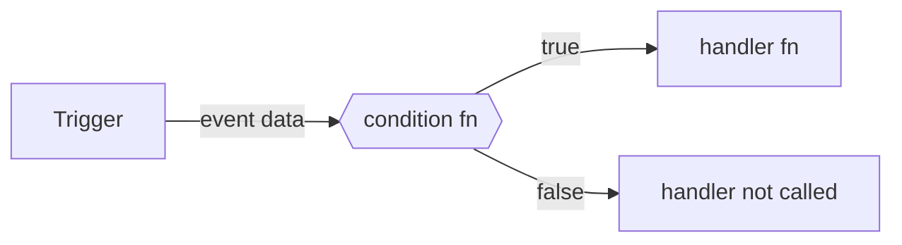

Conditions are regular iii functions that the engine calls **before** a trigger's handler runs. Attach a condition to any trigger by adding the condition function's ID to the trigger config. If the condition returns `false`, the handler function is not called.



<Info>
  Condition functions are registered with `registerFunction` / `register_function` like any other function. They receive the same event data as the handler and must return a boolean.
</Info>

## HTTP trigger condition

The condition function receives the full API request. If it returns `false`, the engine responds with `422 Unprocessable Entity` and the handler function is not called.

<Tabs>
  <Tab title="Node / TypeScript">

```typescript
import { registerWorker, Logger, TriggerAction } from 'iii-sdk'

const iii = registerWorker(process.env.III_URL ?? 'ws://localhost:49134')

iii.registerFunction(
  { id: 'conditions::is_premium' },
  async (req: ApiRequest<{ amount: number }>) => {
    return (req.body?.amount ?? 0) > 1000
  },
)

iii.registerFunction(
  { id: 'orders::premium', description: 'Processes premium orders' },
  async (req: ApiRequest<{ amount: number; description: string }>) => {
    const logger = new Logger()
    logger.info('Processing premium order', { amount: req.body?.amount })
    return { status_code: 200, body: { message: 'Premium order processed' } }
  },
)

iii.registerTrigger({
  type: 'http',
  function_id: 'orders::premium',
  config: {
    api_path: '/orders/premium',
    http_method: 'POST',
    condition_function_id: 'conditions::is_premium',
  },
})
```

  </Tab>
  <Tab title="Python">

```python
from iii import register_worker, InitOptions, ApiRequest, ApiResponse, Logger, TriggerAction

iii = register_worker(address="ws://localhost:49134", options=InitOptions(worker_name="orders-worker"))

def is_premium(data) -> bool:
    req = ApiRequest(**data) if isinstance(data, dict) else data
    return (req.body or {}).get("amount", 0) > 1000

def orders_premium(data) -> ApiResponse:
    logger = Logger()
    req = ApiRequest(**data) if isinstance(data, dict) else data
    logger.info("Processing premium order", {"amount": (req.body or {}).get("amount")})
    return ApiResponse(status_code=200, body={"message": "Premium order processed"})

iii.register_function("conditions::is_premium", is_premium)
iii.register_function("orders::premium", orders_premium)

iii.register_trigger({
    "type": "http",
    "function_id": "orders::premium",
    "config": {
        "api_path": "/orders/premium",
        "http_method": "POST",
        "condition_function_id": "conditions::is_premium",
    },
})
```

  </Tab>
  <Tab title="Rust">

```rust
use iii_sdk::{register_worker, InitOptions, Logger, TriggerRequest, TriggerAction, RegisterFunctionMessage, RegisterTriggerInput};
use serde_json::json;

#[tokio::main]
async fn main() -> Result<(), Box<dyn std::error::Error>> {
    let iii = register_worker("ws://127.0.0.1:49134", InitOptions::default());

    iii.register_function((RegisterFunctionMessage::with_id("conditions::is_premium".into()), |input| async move {
        let amount = input["body"]["amount"].as_f64().unwrap_or(0.0));

        Ok(json!(amount > 1000.0))
    });

    iii.register_function((RegisterFunctionMessage::with_id("orders::premium".into()), |input| async move {
        let logger = Logger();

        let amount = input["body"]["amount"].as_f64().unwrap_or(0.0);
        logger.info("Processing premium order", Some(json!({ "amount": amount })));
        Ok(json!({ "status_code": 200, "body": { "message": "Premium order processed" } }))
    });

    iii.register_trigger(RegisterTriggerInput { trigger_type: "http".into(), function_id: "orders::premium".into(), config: json!({
        "api_path": "/orders/premium",
        "http_method": "POST",
        "condition_function_id": "conditions::is_premium",
    }), metadata: None })?;

    Ok(())
}
```

  </Tab>
</Tabs>

## Queue trigger condition

The condition function receives the queue message data. If it returns `false`, the handler function is not called — no error is raised.

<Tabs>
  <Tab title="Node / TypeScript">

```typescript
iii.registerFunction(
  { id: 'conditions::is_high_value' },
  async (data: { amount: number }) => {
    return data.amount > 1000
  },
)

iii.registerFunction(
  { id: 'orders::high_value', description: 'Processes high-value orders from queue' },
  async (data: { amount: number; description: string }) => {
    const logger = new Logger()
    logger.info('Processing high-value order', { amount: data.amount })

    await iii.trigger({
      function_id: 'iii::durable::publish',
      payload: { topic: 'order.processed', data: { ...data, processedAt: new Date().toISOString() } },
      action: TriggerAction.Void(),
    })
  },
)

iii.registerTrigger({
  type: 'durable:subscriber',
  function_id: 'orders::high_value',
  config: { topic: 'order.created', condition_function_id: 'conditions::is_high_value' },
})
```

  </Tab>
  <Tab title="Python">

```python
from datetime import datetime, timezone
from iii import Logger

def is_high_value(data) -> bool:
    if isinstance(data, dict):
        return data.get("amount", 0) > 1000
    return False

def orders_high_value(data: dict) -> None:
    logger = Logger()
    amount = data.get("amount", 0)
    logger.info("Processing high-value order", {"amount": amount})

    if amount <= 1000:
        logger.info("Low-value order — skipping", {"amount": amount})
        return

    iii.trigger({
        "function_id": "iii::durable::publish",
        "payload": {"topic": "order.processed", "data": {**data, "processedAt": datetime.now(timezone.utc).isoformat()}},
        "action": TriggerAction.Void(),
    })


iii.register_function("conditions::is_high_value", is_high_value)
iii.register_function("orders::high_value", orders_high_value)

iii.register_trigger({
    "type": "durable:subscriber",
    "function_id": "orders::high_value",
    "config": {"topic": "order.created", "condition_function_id": "conditions::is_high_value"},
})
```

  </Tab>
  <Tab title="Rust">

```rust
use iii_sdk::{Logger, TriggerRequest, TriggerAction, RegisterFunctionMessage, RegisterTriggerInput};
use serde_json::json;

iii.register_function((RegisterFunctionMessage::with_id("conditions::is_high_value".into()), |input| async move {
    let amount = input["amount"].as_f64().unwrap_or(0.0));

    Ok(json!(amount > 1000.0))
});

iii.register_function((RegisterFunctionMessage::with_id("orders::high_value".into()), |input| async move {
    let logger = Logger();

    let amount = input["amount"].as_f64().unwrap_or(0.0);
    logger.info("Processing high-value order", Some(json!({ "amount": amount })));

    iii.trigger(TriggerRequest::new("iii::durable::publish", json!({
        "topic": "order.processed",
        "data": { "amount": amount, "processedAt": chrono::Utc::now().to_rfc3339() },
    })).action(TriggerAction::void())).await?;

    Ok(json!(null))
});

iii.register_trigger(RegisterTriggerInput { trigger_type: "durable:subscriber".into(), function_id: "orders::high_value".into(), config: json!({
    "topic": "order.created",
    "condition_function_id": "conditions::is_high_value",
}), metadata: None })?;
```

  </Tab>
</Tabs>

## State trigger condition

The condition receives the full state event, including the event type (`created`, `updated`, `deleted`), scope, key, and both old and new values.

<Tabs>
  <Tab title="Node / TypeScript">

```typescript
iii.registerFunction(
  { id: 'conditions::is_update' },
  async (event: { event_type: string; scope: string; key: string; old_value: unknown; new_value: unknown }) => {
    return event.event_type === 'updated'
  },
)

iii.registerFunction(
  { id: 'orders::on_update', description: 'Reacts to order state updates' },
  async (event) => {
    const logger = new Logger()
    logger.info('Order updated', { scope: event.scope, key: event.key })
  },
)

iii.registerTrigger({
  type: 'state',
  function_id: 'orders::on_update',
  config: { scope: 'orders', condition_function_id: 'conditions::is_update' },
})
```

  </Tab>
  <Tab title="Python">

```python
from iii import Logger

def is_update(event) -> bool:
    if isinstance(event, dict):
        return event.get("event_type") == "updated"
    return False

def orders_on_update(event: dict) -> None:
    logger = Logger()
    logger.info("Order updated", {"scope": event.get("scope"), "key": event.get("key")})

iii.register_function("conditions::is_update", is_update)
iii.register_function("orders::on_update", orders_on_update)

iii.register_trigger({
    "type": "state",
    "function_id": "orders::on_update",
    "config": {"scope": "orders", "condition_function_id": "conditions::is_update"},
})
```

  </Tab>
  <Tab title="Rust">

```rust
use iii_sdk::{Logger, RegisterFunctionMessage, RegisterTriggerInput};
use serde_json::json;

iii.register_function((RegisterFunctionMessage::with_id("conditions::is_update".into()), |input| async move {
    let event_type = input["event_type"].as_str().unwrap_or(""));

    Ok(json!(event_type == "updated"))
});

iii.register_function((RegisterFunctionMessage::with_id("orders::on_update".into()), |input| async move {
    let logger = Logger();

    logger.info("Order updated", Some(json!({
        "scope": input["scope"],
        "key": input["key"],
    })));
    Ok(json!(null))
});

iii.register_trigger(RegisterTriggerInput { trigger_type: "state".into(), function_id: "orders::on_update".into(), config: json!({
    "scope": "orders",
    "condition_function_id": "conditions::is_update",
}), metadata: None })?;
```

  </Tab>
</Tabs>

## Key concepts

- Condition functions are registered with `registerFunction` / `register_function` like any other function. They receive the same event data as the handler and must return `true` or `false`.
- Add `condition_function_id` to the trigger config with the condition function's ID. This key is the same for all trigger types.
- When a condition returns `false`:
  - **HTTP** — the engine responds with `422 Unprocessable Entity`; the handler function is not called.
  - **Queue / Cron** — the handler function is not called; no error is surfaced.
  - **State / Stream** — the handler function is not called.
- If a condition function errors, the engine logs the error and does not call the handler (HTTP returns `500 Internal Server Error`).
- A single condition function can be shared across multiple triggers.
