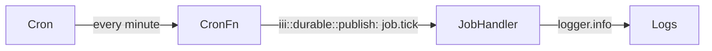

The `cron` trigger type fires a registered function on a schedule. The handler receives `{trigger, job_id, scheduled_time, actual_time}` as its payload. Work is typically fanned out by calling `iii::durable::publish` to downstream queue handlers.



## Minimal cron function

<Tabs>
  <Tab title="Node / TypeScript">

```typescript
import { registerWorker, Logger, TriggerAction } from 'iii-sdk'

const iii = registerWorker(process.env.III_URL ?? 'ws://localhost:49134')

iii.registerFunction(
  { id: 'cron::periodic_job', description: 'Fires on schedule and enqueues work' },
  async () => {
    const logger = new Logger()
    logger.info('Periodic job fired')

    await iii.trigger({
      function_id: 'iii::durable::publish',
      payload: {
        topic: 'job.tick',
        data: { firedAt: new Date().toISOString(), message: 'Periodic job executed' },
      },
      action: TriggerAction.Void(),
    })
  },
)

iii.registerTrigger({
  type: 'cron',
  function_id: 'cron::periodic_job',
  config: { expression: '0 * * * * * *' }, // every minute
})
```

  </Tab>
  <Tab title="Python">

```python
from datetime import datetime, timezone
from iii import register_worker, InitOptions, Logger, TriggerAction

iii = register_worker(address="ws://localhost:49134", options=InitOptions(worker_name="cron-worker"))

def periodic_job(_data) -> None:
    logger = Logger()
    logger.info("Periodic job fired")

    iii.trigger({
        "function_id": "iii::durable::publish",
        "payload": {
            "topic": "job.tick",
            "data": {
                "firedAt": datetime.now(timezone.utc).isoformat(),
                "message": "Periodic job executed",
            },
        },
        "action": TriggerAction.Void(),
    })


iii.register_function("cron::periodic_job", periodic_job)
iii.register_trigger({
    "type": "cron",
    "function_id": "cron::periodic_job",
    "config": {"expression": "0 * * * * * *"},  # every minute
})
```

  </Tab>
  <Tab title="Rust">

```rust
use iii_sdk::{register_worker, InitOptions, Logger, TriggerRequest, TriggerAction, RegisterFunctionMessage, RegisterTriggerInput};
use serde_json::json;

let iii = register_worker("ws://127.0.0.1:49134", InitOptions::default());

iii.register_function((RegisterFunctionMessage::with_id("cron::periodic_job".into()), |_input| async move {
    let logger = Logger::new();

    logger.info("Periodic job fired", None);

    iii.trigger(TriggerRequest::new("iii::durable::publish", json!({
        "topic": "job.tick",
        "data": {
            "firedAt": chrono::Utc::now().to_rfc3339(),
            "message": "Periodic job executed",
        },
    })).action(TriggerAction::void())).await?;

    Ok(json!(null))
});

iii.register_trigger(RegisterTriggerInput { trigger_type: "cron".into(), function_id: "cron::periodic_job".into(), config: json!({
    "expression": "0 * * * * * *",
}), metadata: None })?;
```

  </Tab>
</Tabs>

## Downstream queue handler

The function that consumes the cron's emitted event:

<Tabs>
  <Tab title="Node / TypeScript">

```typescript
iii.registerFunction(
  { id: 'job::handle_tick', description: 'Processes the periodic job event' },
  async (data: { firedAt: string; message: string }) => {
    const logger = new Logger()
    logger.info('Periodic job processed', { firedAt: data.firedAt, message: data.message })
  },
)

iii.registerTrigger({
  type: 'durable:subscriber',
  function_id: 'job::handle_tick',
  config: { topic: 'job.tick' },
})
```

  </Tab>
  <Tab title="Python">

```python
from iii import Logger

def handle_tick(data: dict) -> None:
    logger = Logger()
    logger.info("Periodic job processed", {
        "firedAt": data.get("firedAt"),
        "message": data.get("message"),
    })

iii.register_function("job::handle_tick", handle_tick)
iii.register_trigger({"type": "durable:subscriber", "function_id": "job::handle_tick", "config": {"topic": "job.tick"}})
```

  </Tab>
  <Tab title="Rust">

```rust
use iii_sdk::{Logger, RegisterFunctionMessage, RegisterTriggerInput};
use serde_json::json;

iii.register_function((RegisterFunctionMessage::with_id("job::handle_tick".into()), |input| async move {
    let logger = Logger::new();

    logger.info("Periodic job processed", Some(input));
    Ok(json!(null))
});

iii.register_trigger(RegisterTriggerInput { trigger_type: "durable:subscriber".into(), function_id: "job::handle_tick".into(), config: json!({ "topic": "job.tick" }), metadata: None })?;
```

  </Tab>
</Tabs>

## State sweep cron

A common pattern: read all records in a state scope, filter them by a business rule, and emit events for those that need action.

<Tabs>
  <Tab title="Node / TypeScript">

```typescript
iii.registerFunction(
  { id: 'cron::orders_sweep', description: 'Checks for overdue orders every 5 minutes' },
  async () => {
    const logger = new Logger()

    const orders = await iii.trigger<{
      id: string
      shipDate: string
      complete: boolean
      status: string
    }[]>({ function_id: 'state::list', payload: { scope: 'orders' } })

    let swept = 0

    for (const order of orders ?? []) {
      if (!order.complete && new Date() > new Date(order.shipDate)) {
        logger.warn('Order overdue', { orderId: order.id, shipDate: order.shipDate })

        await iii.trigger({
          function_id: 'iii::durable::publish',
          payload: {
            topic: 'notification',
            data: {
              orderId: order.id,
              templateId: 'order-audit-warning',
              status: order.status,
              shipDate: order.shipDate,
            },
          },
          action: TriggerAction.Void(),
        })

        swept++
      }
    }

    logger.info('Sweep complete', { checked: orders?.length ?? 0, swept })
  },
)

iii.registerTrigger({
  type: 'cron',
  function_id: 'cron::orders_sweep',
  config: { expression: '0 */5 * * * * *' },
})
```

  </Tab>
  <Tab title="Python">

```python
from datetime import datetime, timezone
from iii import Logger, TriggerAction

def orders_sweep(_data) -> None:
    logger = Logger()
    orders = iii.trigger({"function_id": "state::list", "payload": {"scope": "orders"}}) or []
    swept = 0

    for order in orders:
        complete = order.get("complete", False)
        ship_date_str = order.get("shipDate") or order.get("ship_date", "2099-01-01T00:00:00Z")

        try:
            ship_date = datetime.fromisoformat(ship_date_str.replace("Z", "+00:00"))
        except ValueError:
            continue

        if not complete and datetime.now(timezone.utc) > ship_date:
            logger.warn("Order overdue", {"orderId": order.get("id")})

            iii.trigger({
                "function_id": "iii::durable::publish",
                "payload": {
                    "topic": "notification",
                    "data": {
                        "orderId": order.get("id"),
                        "templateId": "order-audit-warning",
                        "status": order.get("status"),
                    },
                },
                "action": TriggerAction.Void(),
            })
            swept += 1

    logger.info("Sweep complete", {"checked": len(orders), "swept": swept})

iii.register_function("cron::orders_sweep", orders_sweep)
iii.register_trigger({"type": "cron", "function_id": "cron::orders_sweep", "config": {"expression": "0 */5 * * * * *"}})
```

  </Tab>
  <Tab title="Rust">

```rust
use iii_sdk::{Logger, TriggerRequest, TriggerAction, RegisterFunctionMessage, RegisterTriggerInput};
use serde_json::json;

iii.register_function((RegisterFunctionMessage::with_id("cron::orders_sweep".into()), |_input| async move {
    let logger = Logger::new();

    let orders_val = iii.trigger(TriggerRequest::new("state::list", json!({ "scope": "orders" }))).await?;
    let orders = orders_val.as_array().cloned().unwrap_or_default();
    let mut swept = 0usize;

    for order in &orders {
        let complete = order["complete"].as_bool().unwrap_or(false);
        let ship_date_str = order["shipDate"].as_str().unwrap_or("2099-01-01T00:00:00Z");

        if let Ok(ship_date) = chrono::DateTime::parse_from_rfc3339(ship_date_str) {
            if !complete && chrono::Utc::now() > ship_date {
                logger.warn("Order overdue", Some(json!({ "orderId": order["id"] })));

                iii.trigger(TriggerRequest::new("iii::durable::publish", json!({
                    "topic": "notification",
                    "data": {
                        "orderId": order["id"],
                        "templateId": "order-audit-warning",
                    },
                })).action(TriggerAction::void())).await?;

                swept += 1;
            }
        }
    }

    logger.info("Sweep complete", Some(json!({
        "checked": orders.len(),
        "swept": swept,
    })));

    Ok(json!(null))
});

iii.register_trigger(RegisterTriggerInput { trigger_type: "cron".into(), function_id: "cron::orders_sweep".into(), config: json!({ "expression": "0 */5 * * * * *" }), metadata: None })?;
```

  </Tab>
</Tabs>

## Cron expression format

iii supports six- or seven-field cron expressions: `second minute hour day month weekday [year]` (year is optional).

```
┌──────────── second (0-59)
│ ┌────────── minute (0-59)
│ │ ┌──────── hour (0-23)
│ │ │ ┌────── day of month (1-31)
│ │ │ │ ┌──── month (1-12)
│ │ │ │ │ ┌── day of week (0-7, Sun=0 or 7)
│ │ │ │ │ │ ┌ year (optional)
│ │ │ │ │ │ │
* * * * * * *
```

| Expression | Meaning |
|---|---|
| `0 * * * * *` | Every minute (6-field) |
| `0 0 * * * *` | Every hour (6-field) |
| `0 * * * * * *` | Every minute (7-field) |
| `0 0 * * * * *` | Every hour (7-field) |
| `0 0 9 * * 1-5 *` | 09:00 on weekdays |
| `0 */5 * * * * *` | Every 5 minutes |
| `*/5 * * * * * *` | Every 5 seconds |

## Key concepts

- Cron handlers receive `{trigger, job_id, scheduled_time, actual_time}` as their payload.
- Keep cron handlers lightweight. Use `iii::durable::publish` to fan out work to queue handlers that can run in parallel.
- Combine `state::list` with cron for periodic sweeps over accumulated data — the state sweep pattern above is the idiomatic approach.
