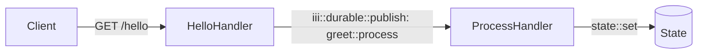

This example shows the two-step pattern at the heart of most iii workflows: an **HTTP handler** accepts a request and publishes an event to the queue, then a **queue handler** processes that event in the background and persists the result to state.



## Worker setup

Every iii worker starts by initialising the SDK and connecting to the engine.

<Tabs>
  <Tab title="Node / TypeScript">

```typescript
// worker.ts
import { registerWorker, Logger } from 'iii-sdk'

const iii = await registerWorker(process.env.III_URL ?? 'ws://localhost:49134')
```

  </Tab>
  <Tab title="Python">

```python
# worker.py
from iii import register_worker, InitOptions, ApiRequest, ApiResponse

iii = register_worker(
    address="ws://localhost:49134",
    options=InitOptions(worker_name="hello-worker"),
)
```

  </Tab>
  <Tab title="Rust">

```rust
// main.rs
use iii_sdk::{register_worker, InitOptions, Logger};
use serde_json::json;

#[tokio::main]
async fn main() -> Result<(), Box<dyn std::error::Error>> {
    let iii = register_worker("ws://127.0.0.1:49134", InitOptions::default());
    // ... register functions and triggers ...
    // The connection thread keeps the process alive.
    // Call iii.shutdown() when you're ready to stop.
    Ok(())
}
```

  </Tab>
</Tabs>

## Step 1 — HTTP handler

Registers a function and binds it to an HTTP trigger. Returns immediately after publishing to the queue.

<Tabs>
  <Tab title="Node / TypeScript">

```typescript
await iii.registerFunction(
  { id: 'hello::api', description: 'Receives hello request' },
  async (req: ApiRequest) => {
    const logger = new Logger()
    const appName = 'III App'
    const requestId = Math.random().toString(36).substring(7)

    logger.info('Hello API called', { appName, requestId })

    await iii.trigger({
      function_id: 'greet::process',
      payload: {
        requestId,
        appName,
        greetingPrefix: process.env.GREETING_PREFIX ?? 'Hello',
        timestamp: new Date().toISOString(),
      },
      action: TriggerAction.Enqueue({ queue: 'default' }),
    })

    return {
      status_code: 200,
      body: {
        message: 'Hello request received! Processing in background.',
        status: 'processing',
        appName,
      },
    } satisfies ApiResponse
  },
)

await iii.registerTrigger({
  type: 'http',
  function_id: 'hello::api',
  config: { api_path: '/hello', http_method: 'GET' },
})
```

  </Tab>
  <Tab title="Python">

```python
import os
import random
import string
from datetime import datetime, timezone
from iii import Logger

def hello_api(data) -> ApiResponse:
    logger = Logger()
    req = ApiRequest(**data) if isinstance(data, dict) else data
    app_name = "III App"
    request_id = "".join(random.choices(string.ascii_lowercase + string.digits, k=7))

    logger.info("Hello API called", {"appName": app_name, "requestId": request_id})

    iii.trigger({
        "function_id": "iii::durable::publish",
        "payload": {
            "topic": "greet::process",
            "data": {
                "requestId": request_id,
                "appName": app_name,
                "greetingPrefix": os.environ.get("GREETING_PREFIX", "Hello"),
                "timestamp": datetime.now(timezone.utc).isoformat(),
            },
        },
    })

    return ApiResponse(
        status_code=200,
        body={
            "message": "Hello request received! Processing in background.",
            "status": "processing",
            "appName": app_name,
        },
    )

iii.register_function("hello::api", hello_api)
iii.register_trigger({
    "type": "http",
    "function_id": "hello::api",
    "config": {"api_path": "/hello", "http_method": "GET"},
})
```

  </Tab>
  <Tab title="Rust">

```rust
use iii_sdk::{Logger, TriggerAction, TriggerRequest, types::ApiRequest, RegisterFunctionMessage, RegisterTriggerInput};

iii.register_function((RegisterFunctionMessage::with_id("hello::api".into()), |input| async move {
    let logger = Logger();

    let app_name = "III App";
    let request_id = uuid::Uuid::new_v4().to_string();

    logger.info("Hello API called", Some(json!({
        "appName": app_name,
        "requestId": request_id,
    })));

    iii.trigger(
        TriggerRequest::new("greet::process", json!({
            "requestId": request_id,
            "appName": app_name,
            "greetingPrefix": std::env::var("GREETING_PREFIX").unwrap_or_else(|_| "Hello".to_string()),
            "timestamp": chrono::Utc::now().to_rfc3339(),
        }))
        .action(TriggerAction::enqueue("default")),
    )
    .await?;

    Ok(json!({
        "status_code": 200,
        "body": {
            "message": "Hello request received! Processing in background.",
            "status": "processing",
            "appName": app_name,
        },
    }))
});

iii.register_trigger(RegisterTriggerInput { trigger_type: "http".into(), function_id: "hello::api".into(), config: json!({
    "api_path": "/hello",
    "http_method": "GET",
}), metadata: None })?;
```

  </Tab>
</Tabs>

## Step 2 — Queue handler

Consumes the event, builds the greeting, and persists it to state.

<Tabs>
  <Tab title="Node / TypeScript">

```typescript
await iii.registerFunction(
  { id: 'greet::process', description: 'Processes greeting in background' },
  async (data) => {
    const logger = new Logger()
    const { requestId, appName, greetingPrefix, timestamp } = data as {
      requestId: string
      appName: string
      greetingPrefix: string
      timestamp: string
    }

    logger.info('Processing greeting', { requestId, appName })

    const greeting = `${greetingPrefix} ${appName}!`

    await iii.trigger({
      function_id: 'state::set',
      payload: {
        scope: 'greetings',
        key: requestId,
        value: {
          greeting,
          processedAt: new Date().toISOString(),
          originalTimestamp: timestamp,
        },
      },
    })

    logger.info('Greeting processed', { requestId, greeting })
  },
)
```

  </Tab>
  <Tab title="Python">

```python
from datetime import datetime, timezone
from iii import Logger

def greet_process(data: dict) -> None:
    logger = Logger()
    request_id = data.get("requestId", "unknown")
    app_name = data.get("appName", "III App")
    greeting_prefix = data.get("greetingPrefix", "Hello")
    timestamp = data.get("timestamp", "")

    logger.info("Processing greeting", {"requestId": request_id, "appName": app_name})

    greeting = f"{greeting_prefix} {app_name}!"

    iii.trigger({
        "function_id": "state::set",
        "payload": {
            "scope": "greetings",
            "key": request_id,
            "data": {
                "greeting": greeting,
                "processedAt": datetime.now(timezone.utc).isoformat(),
                "originalTimestamp": timestamp,
            },
        },
    })

    logger.info("Greeting processed", {"requestId": request_id, "greeting": greeting})

iii.register_function("greet::process", greet_process)
iii.register_trigger({
    "type": "durable:subscriber",
    "function_id": "greet::process",
    "config": {"topic": "greet::process"},
})
```

  </Tab>
  <Tab title="Rust">

```rust
iii.register_function((RegisterFunctionMessage::with_id("greet::process".into()), |input| async move {
    let logger = Logger();

    let request_id = input["requestId"].as_str().unwrap_or("unknown");
    let app_name = input["appName"].as_str().unwrap_or("III App");
    let prefix = input["greetingPrefix"].as_str().unwrap_or("Hello");
    let timestamp = input["timestamp"].as_str().unwrap_or("");

    logger.info("Processing greeting", Some(json!({
        "requestId": request_id,
        "appName": app_name,
    })));

    let greeting = format!("{} {}!", prefix, app_name);

    iii.trigger(
        TriggerRequest::new("state::set", json!({
            "scope": "greetings",
            "key": request_id,
            "value": {
                "greeting": greeting,
                "processedAt": chrono::Utc::now().to_rfc3339(),
                "originalTimestamp": timestamp,
            },
        }))
        .action(TriggerAction::void()),
    )
    .await?;

    logger.info("Greeting processed", Some(json!({ "requestId": request_id })));

    Ok(json!(null))
});

iii.register_trigger(RegisterTriggerInput { trigger_type: "durable:subscriber".into(), function_id: "greet::process".into(), config: json!({
    "topic": "greet::process",
}), metadata: None })?;
```

  </Tab>
</Tabs>

## Connect and run

<Info title="All SDKs connect automatically">
  Every SDK establishes the WebSocket connection when you call `registerWorker()`. The process stays alive automatically while connected. Call `shutdown()` when you want to stop the worker.
</Info>

## Test it

```bash
curl http://localhost:3111/hello
# {"message":"Hello request received! Processing in background.","status":"processing","appName":"III App"}
```

## Key concepts

- `iii.registerFunction` pairs a string ID with an async handler. The ID is referenced by all triggers bound to that function.
- `iii.registerTrigger` binds a trigger type + config to a function ID. A function can have multiple triggers.
- `iii.trigger({ function_id, payload, action: TriggerAction.Enqueue({ queue }) })` enqueues work to a named queue. The target function receives the payload as its input.
- `iii.trigger({ function_id: 'state::set', payload: { scope, key, value }, action: TriggerAction.Void() })` persists data to the engine's key-value store.
