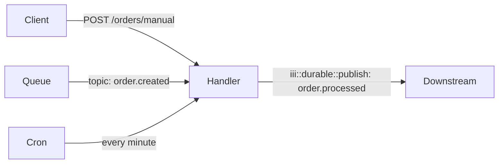

A single function can be bound to as many triggers as needed. Just call `registerTrigger` / `register_trigger` multiple times with the same `function_id`. Inside the handler, inspect the input shape to dispatch to the right branch.



## Register one function, three triggers

<Tabs>
  <Tab title="Node / TypeScript">

```typescript
import { registerWorker, Logger, TriggerAction } from 'iii-sdk'

const iii = registerWorker(process.env.III_URL ?? 'ws://localhost:49134')

iii.registerFunction(
  { id: 'orders::handle', description: 'Handles orders from API, queue, or cron' },
  async (input) => {
    const logger = new Logger()

    // HTTP trigger — input is an ApiRequest shape
    if (input && typeof input === 'object' && 'path_params' in input) {
      const req = input as ApiRequest<{ amount: number; description: string }>
      const orderId = `order-${Date.now()}`

      logger.info('Processing manual order via API', { amount: req.body?.amount })

      await iii.trigger({
        function_id: 'state::set',
        payload: {
          scope: 'orders',
          key: orderId,
          value: { id: orderId, ...req.body, source: 'api', createdAt: new Date().toISOString() },
        },
        action: TriggerAction.Void(),
      })

      await iii.trigger({
        function_id: 'iii::durable::publish',
        payload: { topic: 'order.processed', data: { orderId, source: 'api' } },
        action: TriggerAction.Void(),
      })

      return { status_code: 200, body: { message: 'Order processed', orderId } }
    }

    // Queue trigger — input is the event payload
    if (input && typeof input === 'object' && 'amount' in input) {
      const { amount, description } = input as { amount: number; description: string }
      const orderId = `order-${Date.now()}`

      logger.info('Processing order from queue', { amount })

      await iii.trigger({
        function_id: 'state::set',
        payload: {
          scope: 'orders',
          key: orderId,
          value: { id: orderId, amount, description, source: 'queue', createdAt: new Date().toISOString() },
        },
        action: TriggerAction.Void(),
      })

      await iii.trigger({
        function_id: 'iii::durable::publish',
        payload: { topic: 'order.processed', data: { orderId, amount, source: 'queue' } },
        action: TriggerAction.Void(),
      })

      return
    }

    // Cron trigger — input is null/empty
    logger.info('Processing scheduled order batch')

    const pendingOrders = await iii.trigger<{ id: string; amount: number }[]>({
      function_id: 'state::list',
      payload: { scope: 'pending-orders' },
    })

    for (const order of pendingOrders ?? []) {
      await iii.trigger({
        function_id: 'iii::durable::publish',
        payload: { topic: 'order.processed', data: { orderId: order.id, amount: order.amount, source: 'cron' } },
        action: TriggerAction.Void(),
      })
    }

    logger.info('Batch complete', { count: pendingOrders?.length ?? 0 })
  },
)

// Bind all three trigger types to the same function ID
iii.registerTrigger({
  type: 'http',
  function_id: 'orders::handle',
  config: { api_path: '/orders/manual', http_method: 'POST' },
})

iii.registerTrigger({
  type: 'durable:subscriber',
  function_id: 'orders::handle',
  config: { topic: 'order.created' },
})

iii.registerTrigger({
  type: 'cron',
  function_id: 'orders::handle',
  config: { expression: '* * * * * * *' },
})
```

  </Tab>
  <Tab title="Python">

```python
from iii import register_worker, InitOptions, Logger, ApiRequest, ApiResponse, TriggerAction

iii = register_worker(address="ws://localhost:49134", options=InitOptions(worker_name="orders-worker"))
logger = Logger()

def orders_handle(data) -> dict | None:
    # HTTP trigger — data has 'path_params', 'body', etc.
    if isinstance(data, dict) and "path_params" in data:
        req = ApiRequest(**data)
        order_id = f"order-{int(__import__('time').time() * 1000)}"

        logger.info("Processing manual order via API", {"amount": req.body.get("amount")})

        iii.trigger({
            "function_id": "state::set",
            "payload": {
                "scope": "orders",
                "key": order_id,
                "data": {**req.body, "id": order_id, "source": "api"},
            },
            "action": TriggerAction.Void(),
        })
        iii.trigger({
            "function_id": "iii::durable::publish",
            "payload": {
                "topic": "order.processed",
                "data": {"orderId": order_id, "source": "api"},
            },
            "action": TriggerAction.Void(),
        })

        return ApiResponse(
            statusCode=200, body={"message": "Order processed", "orderId": order_id}
        ).model_dump(by_alias=True)

    # Queue trigger — data is the event payload dict
    if isinstance(data, dict) and "amount" in data:
        amount = data.get("amount", 0)
        order_id = f"order-{int(__import__('time').time() * 1000)}"

        logger.info("Processing order from queue", {"amount": amount})

        iii.trigger({
            "function_id": "state::set",
            "payload": {
                "scope": "orders",
                "key": order_id,
                "data": {**data, "id": order_id, "source": "queue"},
            },
            "action": TriggerAction.Void(),
        })
        iii.trigger({
            "function_id": "iii::durable::publish",
            "payload": {
                "topic": "order.processed",
                "data": {"orderId": order_id, "source": "queue"},
            },
            "action": TriggerAction.Void(),
        })
        return None

    # Cron trigger — data is None or empty
    logger.info("Processing scheduled order batch")

    pending = iii.trigger({
        "function_id": "state::list",
        "payload": {"scope": "pending-orders"},
    }) or []
    for order in pending:
        iii.trigger({
            "function_id": "iii::durable::publish",
            "payload": {
                "topic": "order.processed",
                "data": {"orderId": order["id"], "source": "cron"},
            },
            "action": TriggerAction.Void(),
        })

    logger.info("Batch complete", {"count": len(pending)})
    return None

iii.register_function("orders::handle", orders_handle)

iii.register_trigger({"type": "http", "function_id": "orders::handle",
                      "config": {"api_path": "/orders/manual", "http_method": "POST"}})
iii.register_trigger({"type": "durable:subscriber", "function_id": "orders::handle",
                      "config": {"topic": "order.created"}})
iii.register_trigger({"type": "cron", "function_id": "orders::handle",
                      "config": {"expression": "* * * * * * *"}})
```

  </Tab>
  <Tab title="Rust">

```rust
use iii_sdk::{
    register_worker, InitOptions, Logger, RegisterFunctionMessage,
    RegisterTriggerInput, TriggerAction, TriggerRequest,
};
use serde_json::{json, Value};

let iii = register_worker("ws://localhost:49134", InitOptions::default());

let iii_clone = iii.clone();
iii.register_function(
    RegisterFunctionMessage::with_id("orders::handle".into()).with_description("Handles orders from API, queue, or cron".into()),
    move |input: Value| {
        let iii = iii_clone.clone();
        async move {
            let logger = Logger::new();

            // HTTP trigger — try to parse as ApiRequest
            if input.get("path_params").is_some() {
                let order_id = format!("order-{}", chrono::Utc::now().timestamp_millis());

                logger.info("Processing manual order via API", Some(json!({
                    "amount": input["body"]["amount"]
                })));

                iii.trigger(TriggerRequest {
                    function_id: "state::set".into(),
                    payload: json!({
                        "scope": "orders",
                        "key": order_id,
                        "value": { "id": order_id, "source": "api", "amount": input["body"]["amount"] },
                    }),
                    action: Some(TriggerAction::Void),
                    timeout_ms: None,
                }).await?;

                iii.trigger(TriggerRequest {
                    function_id: "iii::durable::publish".into(),
                    payload: json!({
                        "topic": "order.processed",
                        "data": { "orderId": order_id, "source": "api" },
                    }),
                    action: Some(TriggerAction::Void),
                    timeout_ms: None,
                }).await?;

                return Ok(json!({ "status_code": 200, "body": { "orderId": order_id } }));
            }

            // Queue trigger — input has "amount"
            if input.get("amount").is_some() {
                let amount = input["amount"].as_f64().unwrap_or(0.0);
                let order_id = format!("order-{}", chrono::Utc::now().timestamp_millis());

                logger.info("Processing order from queue", Some(json!({ "amount": amount })));

                iii.trigger(TriggerRequest {
                    function_id: "iii::durable::publish".into(),
                    payload: json!({
                        "topic": "order.processed",
                        "data": { "orderId": order_id, "source": "queue" },
                    }),
                    action: Some(TriggerAction::Void),
                    timeout_ms: None,
                }).await?;

                return Ok(json!(null));
            }

            // Cron trigger
            logger.info("Processing scheduled batch", None);

            let pending = iii.trigger(TriggerRequest {
                function_id: "state::list".into(),
                payload: json!({ "scope": "pending-orders" }),
                action: None,
                timeout_ms: None,
            }).await?;
            let orders = pending.as_array().cloned().unwrap_or_default();

            for order in &orders {
                iii.trigger(TriggerRequest {
                    function_id: "iii::durable::publish".into(),
                    payload: json!({
                        "topic": "order.processed",
                        "data": { "orderId": order["id"], "source": "cron" },
                    }),
                    action: Some(TriggerAction::Void),
                    timeout_ms: None,
                }).await?;
            }

            logger.info("Batch complete", Some(json!({ "count": orders.len() })));
            Ok(json!(null))
        }
    },
);

iii.register_trigger(RegisterTriggerInput {
    trigger_type: "http".into(),
    function_id: "orders::handle".into(),
    config: json!({ "api_path": "/orders/manual", "http_method": "POST" }),
    metadata: None,
})?;
iii.register_trigger(RegisterTriggerInput {
    trigger_type: "durable:subscriber".into(),
    function_id: "orders::handle".into(),
    config: json!({ "topic": "order.created" }),
    metadata: None,
})?;
iii.register_trigger(RegisterTriggerInput {
    trigger_type: "cron".into(),
    function_id: "orders::handle".into(),
    config: json!({ "expression": "* * * * * * *" }),
    metadata: None,
})?;
```

  </Tab>
</Tabs>

## Dual-trigger shorthand

When you only need two trigger types, the pattern is identical — just skip the third `registerTrigger` call.

<Tabs>
  <Tab title="Node / TypeScript">

```typescript
iii.registerTrigger({ type: 'durable:subscriber', function_id: 'my::fn', config: { topic: 'events' } })
iii.registerTrigger({ type: 'http', function_id: 'my::fn', config: { api_path: '/events', http_method: 'POST' } })
```

  </Tab>
  <Tab title="Python">

```python
iii.register_trigger({"type": "durable:subscriber", "function_id": "my::fn", "config": {"topic": "events"}})
iii.register_trigger({"type": "http", "function_id": "my::fn", "config": {"api_path": "/events", "http_method": "POST"}})
```

  </Tab>
  <Tab title="Rust">

```rust
iii.register_trigger(RegisterTriggerInput {
    trigger_type: "durable:subscriber".into(),
    function_id: "my::fn".into(),
    config: json!({ "topic": "events" }),
    metadata: None,
})?;
iii.register_trigger(RegisterTriggerInput {
    trigger_type: "http".into(),
    function_id: "my::fn".into(),
    config: json!({ "api_path": "/events", "http_method": "POST" }),
    metadata: None,
})?;
```

  </Tab>
</Tabs>

## Key concepts

- There is no framework-level `ctx.match()` — distinguish trigger types by inspecting the input shape at runtime.
- HTTP trigger input always has `path_params`, `query_params`, `body`, and `headers` fields.
- Queue trigger input is the raw event payload you published with `iii::durable::publish`.
- Cron trigger input is `null` / `None` / `json!(null)` — the invocation itself is the signal.
- Registering the same `function_id` with multiple triggers is intentional and supported; the engine dispatches independently.
