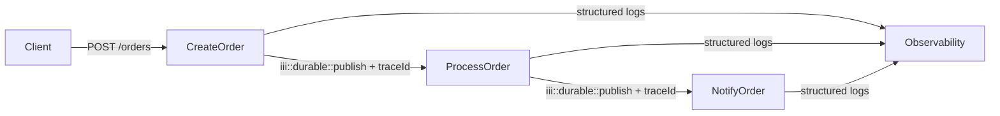

Every iii function invocation receives a `traceId` (via `new Logger()`) that is automatically propagated to downstream queue handlers. All logs emitted through the context logger are structured JSON and correlated to the active trace.



## Multi-step workflow with trace correlation

<Tabs>
  <Tab title="Node / TypeScript">

```typescript
import {registerWorker, Logger, TriggerAction} from 'iii-sdk'

const iii = registerWorker(process.env.III_URL ?? 'ws://localhost:49134', {
  otel: {
    enabled: true,
    serviceName: 'orders-service',
    metricsEnabled: true,
  },
})

// Step 1 — HTTP handler
iii.registerFunction(
  { id: 'orders::create', description: 'Creates an order and starts the processing pipeline' },
  async (req: ApiRequest<{ customerId: string; amount: number; items: string[] }>) => {
    const logger = new Logger()
    const { customerId, amount, items } = req.body ?? {}

    if (!customerId || !amount) {
      return { status_code: 400, body: { error: 'customerId and amount are required' } }
    }

    const orderId = `order-${Date.now()}`

    logger.info('Order created', {
      orderId,
      customerId,
      amount,
      traceId: currentTraceId(), // same traceId will appear in downstream logs
    })

    await iii.trigger({
      function_id: 'state::set',
      payload: {
        scope: 'orders',
        key: orderId,
        value: { id: orderId, customerId, amount, items, status: 'created', createdAt: new Date().toISOString() },
      },
      action: TriggerAction.Void(),
    })

    await iii.trigger({
      function_id: 'iii::durable::publish',
      payload: { topic: 'order.process', data: { orderId, amount, customerId, items } },
      action: TriggerAction.Void(),
    })

    return { status_code: 201, body: { orderId, status: 'processing' } }
  },
)

iii.registerTrigger({
  type: 'http',
  function_id: 'orders::create',
  config: { api_path: '/orders', http_method: 'POST' },
})
```

  </Tab>
  <Tab title="Python">

```python
from datetime import datetime, timezone
from iii import register_worker, InitOptions, ApiRequest, ApiResponse, Logger, TriggerAction, current_trace_id

iii = register_worker(address="ws://localhost:49134", options=InitOptions(worker_name="orders-service"))

def create_order(data) -> ApiResponse:
    logger = Logger()
    req = ApiRequest(**data) if isinstance(data, dict) else data
    body = req.body or {}
    customer_id = body.get("customerId")
    amount = body.get("amount")

    if not customer_id or not amount:
        return ApiResponse(status_code=400, body={"error": "customerId and amount are required"})

    order_id = f"order-{int(__import__('time').time() * 1000)}"

    logger.info("Order created", {
        "orderId": order_id,
        "customerId": customer_id,
        "amount": amount,
        "traceId": current_trace_id(),  # same traceId will appear in downstream logs
    })

    iii.trigger({
        "function_id": "state::set",
        "payload": {
            "scope": "orders",
            "key": order_id,
            "value": {
                "id": order_id,
                "customerId": customer_id,
                "amount": amount,
                "status": "created",
                "createdAt": datetime.now(timezone.utc).isoformat(),
            },
        },
        "action": TriggerAction.Void(),
    })

    iii.trigger({
        "function_id": "iii::durable::publish",
        "payload": {"topic": "order.process", "data": {"orderId": order_id, "amount": amount, "customerId": customer_id}},
        "action": TriggerAction.Void(),
    })

    return ApiResponse(status_code=201, body={"orderId": order_id, "status": "processing"})

iii.register_function("orders::create", create_order)
iii.register_trigger({
    "type": "http", "function_id": "orders::create",
    "config": {"api_path": "/orders", "http_method": "POST"},
})
```

  </Tab>
  <Tab title="Rust">

```rust
use iii_sdk::{register_worker, InitOptions, Logger, TriggerRequest, TriggerAction, types::ApiRequest, RegisterFunctionMessage, RegisterTriggerInput};
use serde_json::json;

let iii = register_worker("ws://localhost:49134", InitOptions::default());

iii.register_function((RegisterFunctionMessage::with_id("orders::create".into()), |input| async move {
    let logger = Logger();

    let req: ApiRequest = serde_json::from_value(input)?;

    let customer_id = req.body["customerId"].as_str().unwrap_or("").to_string();
    let amount = req.body["amount"].as_f64().unwrap_or(0.0);

    if customer_id.is_empty() || amount == 0.0 {
        return Ok(json!({
            "status_code": 400,
            "body": { "error": "customerId and amount are required" },
        }));
    }

    let order_id = format!("order-{}", chrono::Utc::now().timestamp_millis());

    logger.info("Order created", Some(json!({
        "orderId": order_id,
        "customerId": customer_id,
        "amount": amount,
        "traceId": current_trace_id(), // same traceId propagated to downstream handlers
    })));

    iii.trigger(TriggerRequest::new("state::set", json!({
        "scope": "orders",
        "key": order_id,
        "value": {
            "id": order_id,
            "customerId": customer_id,
            "amount": amount,
            "status": "created",
            "createdAt": chrono::Utc::now().to_rfc3339(),
        },
    })).action(TriggerAction::void())).await?;

    iii.trigger(TriggerRequest::new("iii::durable::publish", json!({
        "topic": "order.process",
        "data": { "orderId": order_id, "amount": amount, "customerId": customer_id },
    })).action(TriggerAction::void())).await?;

    Ok(json!({ "status_code": 201, "body": { "orderId": order_id, "status": "processing" } }))
});

iii.register_trigger(RegisterTriggerInput { trigger_type: "http".into(), function_id: "orders::create".into(), config: json!({
    "api_path": "/orders",
    "http_method": "POST",
}), metadata: None })?;
```

  </Tab>
</Tabs>

## Step 2 — Queue processor

<Tabs>
  <Tab title="Node / TypeScript">

```typescript
iii.registerFunction(
  { id: 'order::process', description: 'Processes a created order' },
  async (data: { orderId: string; amount: number; customerId: string }) => {
    const logger = new Logger()
    const { orderId, amount, customerId } = data

    logger.info('Processing order', { orderId, amount, customerId, traceId: currentTraceId() })

    await iii.trigger({
      function_id: 'state::set',
      payload: {
        scope: 'orders',
        key: orderId,
        value: { status: 'processed', processedAt: new Date().toISOString() },
      },
      action: TriggerAction.Void(),
    })

    await iii.trigger({
      function_id: 'iii::durable::publish',
      payload: { topic: 'order.notify', data: { orderId, customerId, amount, status: 'processed' } },
      action: TriggerAction.Void(),
    })

    logger.info('Order processed', { orderId, traceId: currentTraceId() })
  },
)

iii.registerTrigger({
  type: 'durable:subscriber',
  function_id: 'order::process',
  config: { topic: 'order.process' },
})
```

  </Tab>
  <Tab title="Python">

```python
from iii import Logger, current_trace_id

def process_order(data: dict) -> None:
    logger = Logger()
    order_id = data.get("orderId")
    amount = data.get("amount")
    customer_id = data.get("customerId")

    logger.info("Processing order", {
        "orderId": order_id,
        "amount": amount,
        "traceId": current_trace_id(),
    })

    iii.trigger({
        "function_id": "state::set",
        "payload": {
            "scope": "orders",
            "key": order_id,
            "value": {
                "status": "processed",
                "processedAt": datetime.now(timezone.utc).isoformat(),
            },
        },
        "action": TriggerAction.Void(),
    })

    iii.trigger({
        "function_id": "iii::durable::publish",
        "payload": {"topic": "order.notify", "data": {"orderId": order_id, "customerId": customer_id, "amount": amount, "status": "processed"}},
        "action": TriggerAction.Void(),
    })

    logger.info("Order processed", {"orderId": order_id, "traceId": current_trace_id()})

iii.register_function("order::process", process_order)
iii.register_trigger({"type": "durable:subscriber", "function_id": "order::process", "config": {"topic": "order.process"}})
```

  </Tab>
  <Tab title="Rust">

```rust
use iii_sdk::{Logger, TriggerRequest, TriggerAction, RegisterFunctionMessage, RegisterTriggerInput};
use serde_json::json;

iii.register_function((RegisterFunctionMessage::with_id("order::process".into()), |input| async move {
    let logger = Logger();

    let order_id = input["orderId"].as_str().unwrap_or("unknown");

    logger.info("Processing order", Some(json!({
        "orderId": order_id,
        "traceId": current_trace_id(),
    })));

    iii.trigger(TriggerRequest::new("iii::durable::publish", json!({
        "topic": "order.notify",
        "data": { "orderId": order_id, "customerId": input["customerId"] },
    })).action(TriggerAction::void())).await?;

    logger.info("Order processed", Some(json!({ "orderId": order_id })));
    Ok(json!(null))
});

iii.register_trigger(RegisterTriggerInput { trigger_type: "durable:subscriber".into(), function_id: "order::process".into(), config: json!({ "topic": "order.process" }), metadata: None })?;
```

  </Tab>
</Tabs>

## Step 3 — Notification

<Tabs>
  <Tab title="Node / TypeScript">

```typescript
iii.registerFunction(
  { id: 'order::notify', description: 'Sends order notification' },
  async (data: { orderId: string; customerId: string; status: string; amount: number }) => {
    const logger = new Logger()
    const { orderId, customerId, status, amount } = data

    logger.info('Sending order notification', {
      orderId,
      customerId,
      status,
      amount,
      traceId: currentTraceId(),
    })

    // integrate with your notification service here
    logger.info('Order notification sent', { orderId, traceId: currentTraceId() })
  },
)

iii.registerTrigger({
  type: 'durable:subscriber',
  function_id: 'order::notify',
  config: { topic: 'order.notify' },
})
```

  </Tab>
  <Tab title="Python">

```python
from iii import Logger, current_trace_id

def notify_order(data: dict) -> None:
    logger = Logger()
    order_id = data.get("orderId")
    customer_id = data.get("customerId")

    logger.info("Sending order notification", {
        "orderId": order_id,
        "customerId": customer_id,
        "traceId": current_trace_id(),
    })

    # integrate with your notification service here
    logger.info("Order notification sent", {"orderId": order_id, "traceId": current_trace_id()})

iii.register_function("order::notify", notify_order)
iii.register_trigger({"type": "durable:subscriber", "function_id": "order::notify", "config": {"topic": "order.notify"}})
```

  </Tab>
  <Tab title="Rust">

```rust
use iii_sdk::{Logger, RegisterFunctionMessage, RegisterTriggerInput};
use serde_json::json;

iii.register_function((RegisterFunctionMessage::with_id("order::notify".into()), |input| async move {
    let logger = Logger();

    let order_id = input["orderId"].as_str().unwrap_or("unknown");

    logger.info("Sending order notification", Some(json!({
        "orderId": order_id,
        "traceId": current_trace_id(),
    })));

    // integrate with your notification service here
    logger.info("Order notification sent", Some(json!({ "orderId": order_id })));
    Ok(json!(null))
});

iii.register_trigger(RegisterTriggerInput { trigger_type: "durable:subscriber".into(), function_id: "order::notify".into(), config: json!({ "topic": "order.notify" }), metadata: None })?;
```

  </Tab>
</Tabs>

## OpenTelemetry setup

<Tabs>
  <Tab title="Node / TypeScript">

```typescript
// Pass otel config to registerWorker()
const iii = registerWorker('ws://localhost:49134', {
  otel: {
    enabled: true,
    serviceName: 'my-service',
    serviceVersion: '1.0.0',
    metricsEnabled: true,
    metricsExportIntervalMs: 10000,
    reconnectionConfig: {
      maxRetries: 10,
    },
  },
})
```

The iii SDK exports traces and metrics automatically via the engine's OpenTelemetry pipeline (OTLP over the WebSocket). No separate exporter configuration is required.

  </Tab>
  <Tab title="Python">

```python
# OTel is handled by the engine — just pass the worker name in InitOptions
from iii import register_worker, InitOptions, Logger, current_trace_id

iii = register_worker(address="ws://localhost:49134", options=InitOptions(worker_name="my-service"))

# Traces are automatically correlated via current_trace_id()
# Access trace_id in any handler:
logger = Logger()
print(current_trace_id())
```

  </Tab>
  <Tab title="Rust">

```toml
# Cargo.toml — enable the telemetry feature
[dependencies]
iii-sdk = { version = "0.11", features = ["telemetry"] }
```

```rust
use iii_sdk::{register_worker, InitOptions, Logger};
use serde_json::json;

// Initialize OTLP before connecting
iii_sdk::telemetry::init_otlp("my-service").await?;

let iii = register_worker("ws://127.0.0.1:49134", InitOptions::default());

// current_trace_id() is available in every handler
let logger = Logger();
logger.info("My message", Some(json!({ "traceId": current_trace_id() })));
```

  </Tab>
</Tabs>

## Logger methods

| Method | TypeScript | Python | Rust |
|---|---|---|---|
| Info | `logger.info(msg, metadata?)` | `logger.info(msg, fields?)` | `logger.info(msg, Some(json!({...})))` |
| Warning | `logger.warn(msg, metadata?)` | `logger.warn(msg, fields?)` | `logger.warn(msg, None)` |
| Error | `logger.error(msg, metadata?)` | `logger.error(msg, fields?)` | `logger.error(msg, None)` |
| Debug | `logger.debug(msg, metadata?)` | `logger.debug(msg, fields?)` | `logger.debug(msg, None)` |

## Key concepts

- `currentTraceId()` / `current_trace_id()` is the W3C trace-context ID for the current invocation. It is automatically propagated to all downstream workers when you emit an event — no manual header passing is needed.
- All logs are emitted as structured JSON via the engine's `log.info` / `log.warn` / `log.error` functions.
- The Node.js SDK supports OTel configuration directly in `registerWorker()`. Python and Rust use the engine's built-in OTLP pipeline.
- Log every step at entry and exit with the `traceId` to make multi-step flows fully observable.
