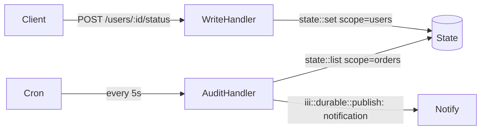

State in iii is a distributed key-value store addressed by `scope` (group) + `key` (item ID). Any worker can read and write state by triggering `state::get`, `state::set`, `state::delete`, and `state::list` through the engine.



## Writing state

<Tabs>
  <Tab title="Node / TypeScript">

```typescript
import { registerWorker, Logger, TriggerAction } from 'iii-sdk'

const iii = registerWorker(process.env.III_URL ?? 'ws://localhost:49134')

iii.registerFunction(
  { id: 'users::update_status', description: 'Update user status in state' },
  async (req: ApiRequest<{ status: string }>) => {
    const logger = new Logger()
    const userId = req.path_params?.id

    if (!userId) {
      return { status_code: 400, body: { error: 'Missing user ID' } }
    }

    const { status = 'active' } = req.body ?? {}

    // Write to state — addressed by scope + key
    await iii.trigger({
      function_id: 'state::set',
      payload: { scope: 'users', key: userId, value: { status, updatedAt: new Date().toISOString() } },
      action: TriggerAction.Void(),
    })

    logger.info(`Updated user ${userId} status to ${status}`)

    return { status_code: 200, body: { userId, status } }
  },
)

iii.registerTrigger({
  type: 'http',
  function_id: 'users::update_status',
  config: { api_path: '/users/:id/status', http_method: 'POST' },
})
```

  </Tab>
  <Tab title="Python">

```python
from datetime import datetime, timezone
from iii import register_worker, InitOptions, ApiRequest, ApiResponse, Logger, TriggerAction

iii = register_worker(address="ws://localhost:49134", options=InitOptions(worker_name="state-worker"))

def update_user_status(data) -> ApiResponse:
    logger = Logger()
    req = ApiRequest(**data) if isinstance(data, dict) else data
    user_id = req.path_params.get("id") if req.path_params else None

    if not user_id:
        return ApiResponse(status_code=400, body={"error": "Missing user ID"})

    new_status = (req.body or {}).get("status", "active")

    # Write to state — addressed by scope + key
    iii.trigger({
        "function_id": "state::set",
        "payload": {"scope": "users", "key": user_id, "value": {"status": new_status, "updatedAt": datetime.now(timezone.utc).isoformat()}},
        "action": TriggerAction.Void(),
    })

    logger.info(f"Updated user {user_id} status to {new_status}")

    return ApiResponse(status_code=200, body={"userId": user_id, "status": new_status})

iii.register_function("users::update_status", update_user_status)
iii.register_trigger({
    "type": "http", "function_id": "users::update_status",
    "config": {"api_path": "/users/:id/status", "http_method": "POST"},
})
```

  </Tab>
  <Tab title="Rust">

```rust
use iii_sdk::{register_worker, InitOptions, Logger, TriggerRequest, TriggerAction, RegisterFunctionMessage, RegisterTriggerInput, types::ApiRequest};
use serde_json::json;

let iii = register_worker("ws://localhost:49134", InitOptions::default());

iii.register_function(
    RegisterFunctionMessage::with_id("users::update_status".into()).with_description("Update user status in state".into()),
    |input| async move {
        let logger = Logger::new();
        let req: ApiRequest = serde_json::from_value(input)?;
        let user_id = req.path_params.get("id").cloned().unwrap_or_default();

        if user_id.is_empty() {
            return Ok(json!({ "status_code": 400, "body": { "error": "Missing user ID" } }));
        }

        let new_status = req.body["status"].as_str().unwrap_or("active").to_string();

        // Write to state — addressed by scope + key
        iii.trigger(TriggerRequest {
            function_id: "state::set".into(),
            payload: json!({
                "scope": "users",
                "key": user_id,
                "value": {
                    "status": new_status,
                    "updatedAt": chrono::Utc::now().to_rfc3339(),
                },
            }),
            action: Some(TriggerAction::Void),
            timeout_ms: None,
        }).await?;

        logger.info(&format!("Updated user {} status to {}", user_id, new_status), None);

        Ok(json!({ "status_code": 200, "body": { "userId": user_id, "status": new_status } }))
    },
);

iii.register_trigger(RegisterTriggerInput {
    trigger_type: "http".into(),
    function_id: "users::update_status".into(),
    config: json!({ "api_path": "/users/:id/status", "http_method": "POST" }),
    metadata: None,
})?;
```

  </Tab>
</Tabs>

## Reading state

<Tabs>
  <Tab title="Node / TypeScript">

```typescript
iii.registerFunction(
  { id: 'users::get_status', description: 'Read user status from state' },
  async (req: ApiRequest) => {
    const logger = new Logger()
    const userId = req.path_params?.id

    if (!userId) {
      return { status_code: 400, body: { error: 'Missing user id' } }
    }

    const user = await iii.trigger<{ status: string } | null>({
      function_id: 'state::get',
      payload: { scope: 'users', key: userId },
    })

    if (!user) {
      return { status_code: 404, body: { error: 'User not found' } }
    }

    logger.info('Got user status', { userId, status: user.status })
    return { status_code: 200, body: user }
  },
)

iii.registerTrigger({
  type: 'http',
  function_id: 'users::get_status',
  config: { api_path: '/users/:id/status', http_method: 'GET' },
})
```

  </Tab>
  <Tab title="Python">

```python
def get_user_status(data) -> ApiResponse:
    logger = Logger()
    req = ApiRequest(**data) if isinstance(data, dict) else data
    user_id = req.path_params.get("id") if req.path_params else None

    user = iii.trigger({"function_id": "state::get", "payload": {"scope": "users", "key": user_id}}) if user_id else None

    if not user:
        return ApiResponse(status_code=404, body={"error": "User not found"})

    logger.info("Got user status", {"userId": user_id, "status": user.get("status")})
    return ApiResponse(status_code=200, body=user)

iii.register_function("users::get_status", get_user_status)
iii.register_trigger({
    "type": "http", "function_id": "users::get_status",
    "config": {"api_path": "/users/:id/status", "http_method": "GET"},
})
```

  </Tab>
  <Tab title="Rust">

```rust
iii.register_function(
    RegisterFunctionMessage::with_id("users::get_status".into()).with_description("Read user status from state".into()),
    |input| async move {
        let logger = Logger::new();
        let req: ApiRequest = serde_json::from_value(input)?;
        let user_id = req.path_params.get("id").cloned().unwrap_or_default();

        let user = iii.trigger(TriggerRequest {
            function_id: "state::get".into(),
            payload: json!({ "scope": "users", "key": user_id }),
            action: None,
            timeout_ms: None,
        }).await?;

        if user.is_null() {
            return Ok(json!({ "status_code": 404, "body": { "error": "User not found" } }));
        }

        logger.info("Got user status", Some(json!({ "userId": user_id })));
        Ok(json!({ "status_code": 200, "body": user }))
    },
);

iii.register_trigger(RegisterTriggerInput {
    trigger_type: "http".into(),
    function_id: "users::get_status".into(),
    config: json!({ "api_path": "/users/:id/status", "http_method": "GET" }),
    metadata: None,
})?;
```

  </Tab>
</Tabs>

## Batch read with state::list

`state::list` returns all keys in a scope — useful in cron jobs that sweep over accumulated data.

<Tabs>
  <Tab title="Node / TypeScript">

```typescript
iii.registerFunction(
  { id: 'cron::orders_audit', description: 'Checks for overdue orders' },
  async () => {
    const logger = new Logger()

    const orders = await iii.trigger<{ id: string; shipDate: string; complete: boolean; status: string }[]>({
      function_id: 'state::list',
      payload: { scope: 'orders' },
    })

    for (const order of orders ?? []) {
      if (!order.complete && new Date() > new Date(order.shipDate)) {
        logger.warn('Order overdue', { orderId: order.id })

        await iii.trigger({
          function_id: 'iii::durable::publish',
          payload: { topic: 'notification', data: { orderId: order.id, templateId: 'order-audit-warning', status: order.status } },
          action: TriggerAction.Void(),
        })
      }
    }
  },
)

iii.registerTrigger({
  type: 'cron',
  function_id: 'cron::orders_audit',
  config: { expression: '0 */5 * * * * *' },
})
```

  </Tab>
  <Tab title="Python">

```python
from datetime import datetime, timezone
from iii import Logger, TriggerAction

def orders_audit(_data) -> None:
    logger = Logger()
    orders = iii.trigger({"function_id": "state::list", "payload": {"scope": "orders"}}) or []

    for order in orders:
        ship_date_str = order.get("shipDate") or order.get("ship_date", "2099-01-01T00:00:00Z")
        complete = order.get("complete", False)

        try:
            ship_date = datetime.fromisoformat(ship_date_str.replace("Z", "+00:00"))
        except ValueError:
            continue

        if not complete and datetime.now(timezone.utc) > ship_date:
            logger.warn("Order overdue", {"orderId": order.get("id")})

            iii.trigger({
                "function_id": "iii::durable::publish",
                "payload": {"topic": "notification", "data": {"orderId": order.get("id"), "templateId": "order-audit-warning"}},
                "action": TriggerAction.Void(),
            })


iii.register_function("cron::orders_audit", orders_audit)
iii.register_trigger({"type": "cron", "function_id": "cron::orders_audit", "config": {"expression": "0 */5 * * * * *"}})
```

  </Tab>
  <Tab title="Rust">

```rust
iii.register_function(
    RegisterFunctionMessage::with_id("cron::orders_audit".into()).with_description("Checks for overdue orders".into()),
    |_input| async move {
        let logger = Logger::new();

        let orders_val = iii.trigger(TriggerRequest {
            function_id: "state::list".into(),
            payload: json!({ "scope": "orders" }),
            action: None,
            timeout_ms: None,
        }).await?;
        let orders = orders_val.as_array().cloned().unwrap_or_default();

        for order in &orders {
            let complete = order["complete"].as_bool().unwrap_or(false);
            let ship_date_str = order["shipDate"].as_str().unwrap_or("2099-01-01T00:00:00Z");

            if let Ok(ship_date) = chrono::DateTime::parse_from_rfc3339(ship_date_str) {
                if !complete && chrono::Utc::now() > ship_date {
                    logger.warn("Order overdue", Some(json!({ "orderId": order["id"] })));

                    iii.trigger(TriggerRequest {
                        function_id: "iii::durable::publish".into(),
                        payload: json!({
                            "topic": "notification",
                            "data": { "orderId": order["id"], "templateId": "order-audit-warning" },
                        }),
                        action: Some(TriggerAction::Void),
                        timeout_ms: None,
                    }).await?;
                }
            }
        }

        Ok(json!(null))
    },
);

iii.register_trigger(RegisterTriggerInput {
    trigger_type: "cron".into(),
    function_id: "cron::orders_audit".into(),
    config: json!({ "expression": "0 */5 * * * * *" }),
    metadata: None,
})?;
```

  </Tab>
</Tabs>

## State API reference

| Operation | TypeScript | Python | Rust |
|---|---|---|---|
| Write | `await iii.trigger({ function_id: 'state::set', payload: { scope, key, value }, action: TriggerAction.Void() })` | `iii.trigger({'function_id': 'state::set', 'payload': {...}, 'action': TriggerAction.Void()})` | `iii.trigger(TriggerRequest { function_id: "state::set".into(), payload: json!({...}), action: Some(TriggerAction::Void), timeout_ms: None }).await?` |
| Read one | `await iii.trigger({ function_id: 'state::get', payload: { scope, key } })` | `iii.trigger({'function_id': 'state::get', 'payload': {...}})` | `iii.trigger(TriggerRequest { function_id: "state::get".into(), payload: json!({...}), action: None, timeout_ms: None }).await?` |
| Read all in scope | `await iii.trigger({ function_id: 'state::list', payload: { scope } })` | `iii.trigger({'function_id': 'state::list', 'payload': {...}})` | `iii.trigger(TriggerRequest { function_id: "state::list".into(), payload: json!({...}), action: None, timeout_ms: None }).await?` |
| Delete | `await iii.trigger({ function_id: 'state::delete', payload: { scope, key }, action: TriggerAction.Void() })` | `iii.trigger({'function_id': 'state::delete', 'payload': {...}, 'action': TriggerAction.Void()})` | `iii.trigger(TriggerRequest { function_id: "state::delete".into(), payload: json!({...}), action: Some(TriggerAction::Void), timeout_ms: None }).await?` |

## Key concepts

- State is addressed by `scope` (equivalent to groupId in streams) and `key` (item ID). Use `scope` as a logical namespace (`"users"`, `"orders"`) and `key` as the unique identifier within it.
- `state::list` returns **all items** in a scope as an array. Use it sparingly in hot paths; it's best suited for cron-driven batch sweeps.
- State is separate from named streams. Streams have real-time WebSocket push; state does not.
- Unlike streams, state has no `update` semantics — to modify a record, read it first then write the merged result back with `state::set`.
