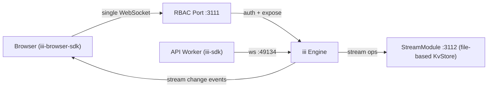

<Frame caption="Todo App">
  
</Frame>

This example builds a full-stack todo app where the browser connects to the iii engine over a **single WebSocket**. That one connection handles function invocations (create, toggle, delete, list) and delivers real-time stream change events back to the UI — no polling, no separate event channel.



## Engine configuration

The `iii-config.yaml` defines the engine modules:

```yaml title="iii-config.yaml"
modules:
  - class: modules::worker::WorkerModule
    config:
      port: 49134

  - class: modules::worker::WorkerModule
    config:
      host: 0.0.0.0
      port: 3111
      rbac:
        auth_function_id: todo-project::auth-function
        expose_functions:
          - match("todos::create")
          - match("todos::list")
          - match("todos::get")
          - match("todos::delete")
          - match("todos::toggle")

  - class: modules::shell::ExecModule
    config:
      exec:
        - pnpm dev

  - class: modules::stream::StreamModule
    config:
      port: 3112
      host: 0.0.0.0
      adapter:
        class: modules::stream::adapters::KvStore
        config:
          store_method: file_based
          file_path: ./data/stream_store
```

| Module | Port | Purpose |
| --- | --- | --- |
| **WorkerModule** | 49134 | Internal port. The API worker connects here to register functions. |
| **WorkerModule (RBAC)** | 3111 | Public-facing port. The browser connects here. RBAC controls which functions are exposed and runs an auth function on every new connection. |
| **ExecModule** | — | Runs `pnpm dev` to start the API worker process. |
| **StreamModule** | 3112 | Manages stream state with a file-based KvStore adapter. The engine routes `stream::get`, `stream::set`, `stream::delete`, and `stream::list` to this module. |

The RBAC configuration on port `3111` references `todo-project::auth-function` and explicitly lists the five functions the browser is allowed to call. See [Worker RBAC](/docs/how-to/worker-rbac) for the full reference.

## Backend

### Worker setup

The API worker connects to the engine's internal port and exports a shared logger:

```typescript title="src/iii.ts"
import { Logger, registerWorker } from 'iii-sdk'

export const iii = registerWorker(process.env.III_URL ?? 'ws://localhost:49134', {
  workerName: 'api-worker',
})

export const logger = new Logger()
```

### Auth function (RBAC)

The auth function runs on every new WebSocket connection to the RBAC port. It creates a session ID and uses `function_registration_prefix` so each browser session gets its own namespace — the engine automatically prefixes function IDs registered by that session, preventing collisions.

```typescript title="src/lib/rbac.ts"
import type { AuthInput, AuthResult } from 'iii-sdk'
import { logger } from '../iii.ts'
import { fn } from './decorators.ts'

fn('todo-project::auth-function', async (input: AuthInput): Promise<AuthResult> => {
  const sessionId = crypto.randomUUID()
  logger.info('New session created', { sessionId, ip: input.ip_address })

  return {
    allowed_functions: [],
    forbidden_functions: [],
    allow_trigger_type_registration: false,
    allow_function_registration: true,
    allowed_trigger_types: ['stream'],
    context: { session_id: sessionId },
    function_registration_prefix: sessionId,
  }
})
```

### Stream wrapper

The `TodoStream` class provides a typed interface over the engine's built-in stream operations. Each method triggers the corresponding `stream::*` function:

```typescript title="src/routes/todos.stream.ts"
import type {
  DeleteResult, IStream, StreamDeleteInput, StreamGetInput,
  StreamListGroupsInput, StreamListInput, StreamSetInput,
  StreamSetResult, StreamUpdateInput, StreamUpdateResult,
} from 'iii-sdk/stream'
import { iii } from '../iii.ts'

export interface Todo {
  id: string
  title: string
  completed: boolean
}

const mutateArgs = (args: any) => ({ ...args, stream_name: 'todo' })

export class TodoStream implements IStream<Todo> {
  async get(args: Omit<StreamGetInput, 'stream_name'>): Promise<Todo | null> {
    return iii.trigger({ function_id: 'stream::get', payload: mutateArgs(args) })
  }

  async set(args: Omit<StreamSetInput, 'stream_name'>): Promise<StreamSetResult<Todo>> {
    return iii.trigger({ function_id: 'stream::set', payload: mutateArgs(args) })
  }

  async list(args: Omit<StreamListInput, 'stream_name'>): Promise<Todo[]> {
    return iii.trigger({ function_id: 'stream::list', payload: mutateArgs(args) })
  }

  async update(args: Omit<StreamUpdateInput, 'stream_name'>): Promise<StreamUpdateResult<Todo> | null> {
    return iii.trigger({ function_id: 'stream::update', payload: mutateArgs(args) })
  }

  async delete(args: Omit<StreamDeleteInput, 'stream_name'>): Promise<DeleteResult> {
    return iii.trigger({ function_id: 'stream::delete', payload: mutateArgs(args) })
  }
}

export const todosStream = new TodoStream()
```

### Functions

All functions are registered with `fn()`, a thin wrapper around `iii.registerFunction`. There are no HTTP routes — the browser calls these functions directly over the WebSocket connection.

<Tabs>
  <Tab title="create">

```typescript title="src/routes/todos.create.ts"
import { fn } from '../lib/decorators.ts'
import { type Todo, todosStream } from './todos.stream.ts'

export const createTodo = fn(
  'todos::create',
  async (req: { title: string }): Promise<Todo> => {
    const id = crypto.randomUUID()
    const result = await todosStream.set({
      group_id: 'todos',
      item_id: id,
      data: { id, title: req.title, completed: false },
    })

    return result.new_value
  },
  { description: 'Create a new todo' },
)
```

  </Tab>
  <Tab title="list">

```typescript title="src/routes/todos.list.ts"
import { logger } from '../iii.ts'
import { fn } from '../lib/decorators.ts'
import { type Todo, todosStream } from './todos.stream.ts'

export const listTodos = fn(
  'todos::list',
  async (): Promise<{ items: Todo[] }> => {
    logger.info('Listing todos')
    const items = await todosStream.list({ group_id: 'todos' })
    return { items }
  },
  { description: 'List all todos' },
)
```

  </Tab>
  <Tab title="get">

```typescript title="src/routes/todos.get.ts"
import { logger } from '../iii.ts'
import { fn } from '../lib/decorators.ts'
import { type Todo, todosStream } from './todos.stream.ts'

export const getTodo = fn(
  'todos::get',
  async (req: { id: string }): Promise<Todo | null> => {
    logger.info('Getting todo', { id: req.id })
    const item = await todosStream.get({ group_id: 'todos', item_id: req.id })
    return item ?? null
  },
  { description: 'Get a single TODO by ID' },
)
```

  </Tab>
  <Tab title="toggle">

```typescript title="src/routes/todos.toggle.ts"
import { logger } from '../iii.ts'
import { fn } from '../lib/decorators.ts'
import { type Todo, todosStream } from './todos.stream.ts'

export const toggleTodo = fn(
  'todos::toggle',
  async (req: { id: string }): Promise<Todo | null> => {
    logger.info('Toggling todo', { id: req.id })

    const item = await todosStream.get({ group_id: 'todos', item_id: req.id })
    if (!item) {
      logger.warn('Todo not found', { id: req.id })
      return null
    }

    const result = await todosStream.update({
      group_id: 'todos',
      item_id: req.id,
      ops: [{ type: 'set', path: 'completed', value: !item.completed }],
    })

    return result?.new_value ?? null
  },
  { description: 'Toggle a todo completed status' },
)
```

  </Tab>
  <Tab title="delete">

```typescript title="src/routes/todos.delete.ts"
import { logger } from '../iii.ts'
import { fn } from '../lib/decorators.ts'
import { todosStream } from './todos.stream.ts'

export const deleteTodo = fn(
  'todos::delete',
  async (req: { id: string }): Promise<{ id: string; deleted: boolean }> => {
    logger.info('Deleting todo', { id: req.id })
    const result = await todosStream.delete({ group_id: 'todos', item_id: req.id })
    return { id: req.id, deleted: result.old_value !== null }
  },
  { description: 'Delete a TODO by ID' },
)
```

  </Tab>
</Tabs>

## Frontend

### Connection

The browser connects to the RBAC port using `iii-browser-sdk`. This single connection is used for both triggering functions and receiving real-time stream updates:

```typescript title="src/lib/iii.ts"
import { registerWorker } from 'iii-browser-sdk'

export const iii = registerWorker('ws://localhost:3111')
```

### Real-time hook

The `useTodos` hook manages the full lifecycle — initial fetch, live updates, and CRUD operations — all through the same WebSocket connection:

```typescript title="src/hooks/use-todos.ts"
import type { StreamChangeEvent } from 'iii-browser-sdk/stream'
import { useCallback, useEffect, useMemo, useState } from 'react'
import { iii } from '../lib/iii'

export interface Todo {
  id: string
  title: string
  completed: boolean
}

export function useTodos() {
  const [todos, setTodos] = useState<Todo[]>([])

  useEffect(() => {
    void iii
      .trigger<Record<string, never>, { items: Todo[] }>({
        function_id: 'todos::list',
        payload: {},
      })
      .then(({ items }) => setTodos(items))

    const funcRef = iii.registerFunction(
      { id: 'ui::on-todo-change' },
      async (input: StreamChangeEvent) => {
        const todo = input.event.data as Todo

        switch (input.event.type) {
          case 'create':
            setTodos((prev) => [...prev, todo])
            break
          case 'update':
            setTodos((prev) => prev.map((t) => (t.id === input.id ? todo : t)))
            break
          case 'delete':
            setTodos((prev) => prev.filter((t) => t.id !== input.id))
            break
        }

        return {}
      },
    )

    const trigger = iii.registerTrigger({
      type: 'stream',
      function_id: funcRef.id,
      config: { stream_name: 'todo', group_id: 'todos' },
    })

    return () => {
      trigger.unregister()
      funcRef.unregister()
    }
  }, [])

  const addTodo = useCallback(async (title: string) => {
    await iii.trigger({ function_id: 'todos::create', payload: { title } })
  }, [])

  const toggleTodo = useCallback(async (id: string) => {
    await iii.trigger({ function_id: 'todos::toggle', payload: { id } })
  }, [])

  const deleteTodo = useCallback(async (id: string) => {
    await iii.trigger({ function_id: 'todos::delete', payload: { id } })
  }, [])

  const clearCompleted = useCallback(async () => {
    const completed = todos.filter((t) => t.completed)
    await Promise.all(
      completed.map(({ id }) =>
        iii.trigger({ function_id: 'todos::delete', payload: { id } }),
      ),
    )
  }, [todos])

  const remaining = useMemo(() => todos.filter((t) => !t.completed).length, [todos])
  const completedCount = useMemo(() => todos.filter((t) => t.completed).length, [todos])

  return { todos, addTodo, toggleTodo, deleteTodo, clearCompleted, remaining, completedCount }
}
```

The hook does three things on mount:

1. **Fetches** the current list by triggering `todos::list`.
2. **Subscribes** to real-time changes by registering a local function (`ui::on-todo-change`) and binding it to a `stream` trigger on the `todo` stream. The engine pushes `StreamChangeEvent` payloads (create, update, delete) whenever the stream changes.
3. **Cleans up** by unregistering both the function and the trigger on unmount.

All CRUD operations (`addTodo`, `toggleTodo`, `deleteTodo`) call `iii.trigger` with the corresponding function ID. The response arrives over the same connection, and the stream trigger delivers the update to all connected clients.

## Key concepts

- **Single connection** — The browser opens one WebSocket to the RBAC port. Function calls and real-time stream events flow over the same connection.
- **No HTTP routes** — The API worker registers plain iii functions. The browser invokes them directly via `iii.trigger`. There is no REST layer.
- **RBAC** — The engine's WorkerModule supports auth functions, expose lists, and middleware. This example uses a simple auth function that creates a session. See [Worker RBAC](/docs/how-to/worker-rbac) for the full reference.
- **Engine-managed streams** — The `StreamModule` handles persistence (file-based KvStore in this example). The API worker reads and writes through `stream::*` function triggers — no custom stream implementation required.
- **Session isolation** — The auth function returns a `function_registration_prefix`. The engine prefixes every function registered by that browser session, so multiple clients can register `ui::on-todo-change` without colliding.
