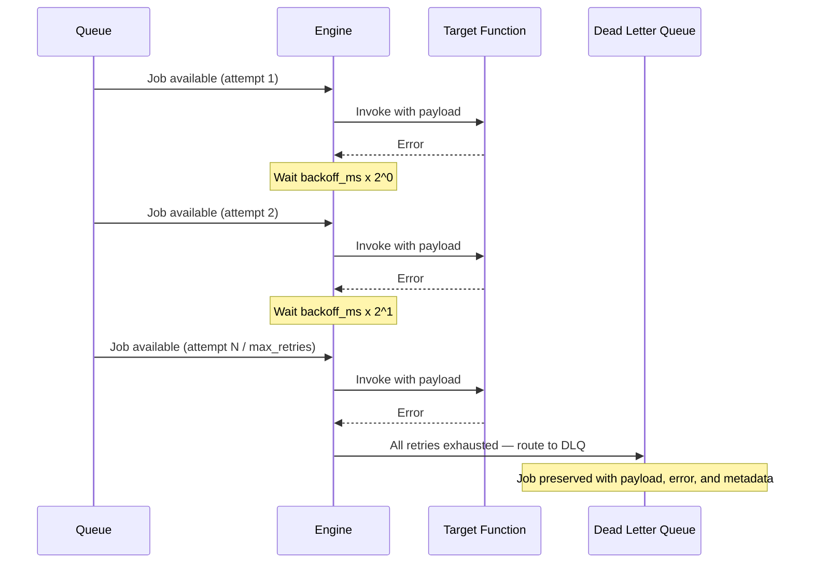
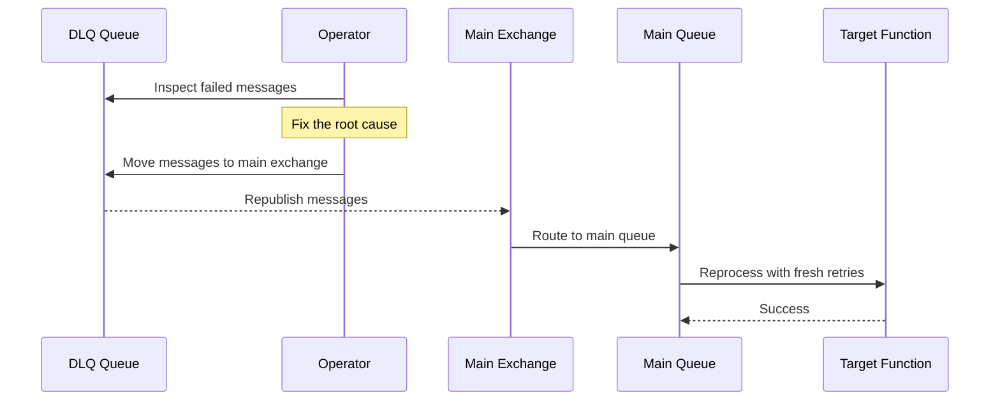

## Goal

Understand where failed jobs end up after all retries are exhausted, inspect them, and redrive them back to the main queue once the underlying issue is fixed.

<Info title="Queues primer">
  DLQs are part of the named-queue system. If you haven't configured queues yet, read [Use Queues](./use-queues) first.
</Info>

## What is a Dead Letter Queue?

When a job fails and exhausts all `max_retries` attempts, the engine moves it to a **Dead Letter Queue (DLQ)** — a separate holding area where failed jobs are preserved for inspection. iii creates a DLQ automatically for every named queue you define in `iii-config.yaml`. No extra configuration is needed.

Each DLQ entry contains:

- The **original payload** sent to the function
- The **error** from the last failed attempt
- A **timestamp** of when the job was moved to the DLQ
- The **job metadata** (function ID, queue name, attempt count)

Jobs in the DLQ are not retried automatically. They sit there until you inspect them, fix the root cause, and explicitly redrive them back to the main queue.

<Info title="Queue architecture">
  DLQs are one of three lifecycle stages every named queue uses internally. For the full design rationale — including why retry and DLQ each need separate exchanges and queues — see [Queue Architecture](/architecture/queues).
</Info>

## How Jobs Reach the DLQ



## DLQ Naming Convention

iii creates DLQ resources automatically when it sets up queue topology. The naming depends on the adapter you are using.

### RabbitMQ adapter

For each named queue, the engine creates a full topology of exchanges and queues in RabbitMQ. Here is the complete resource map for a queue named `payment`:

| Resource | Name |
|----------|------|
| Main exchange | `iii.__fn_queue::payment` |
| Main queue | `iii.__fn_queue::payment.queue` |
| Retry exchange | `iii.__fn_queue::payment::retry` |
| Retry queue | `iii.__fn_queue::payment::retry.queue` |
| **DLQ exchange** | **`iii.__fn_queue::payment::dlq`** |
| **DLQ queue** | **`iii.__fn_queue::payment::dlq.queue`** |

The general pattern:

| Resource | Format |
|----------|--------|
| DLQ exchange | `iii.__fn_queue::<queue_name>::dlq` |
| DLQ queue | `iii.__fn_queue::<queue_name>::dlq.queue` |

The main queue is configured with `x-dead-letter-exchange` pointing to the DLQ exchange. When the engine `nack`s a message with `requeue=false` after all retries are exhausted, RabbitMQ routes it to the DLQ automatically.

### Builtin adapter

The builtin adapter stores DLQ entries in its internal KV store under the key:

```
queue:__fn_queue::<queue_name>:dlq
```

This key is not accessible via external tooling. Use engine logs to monitor DLQ activity — the engine emits a warning with the message `"Job exhausted, moved to DLQ"` every time a job is dead-lettered.

## Inspect DLQ Messages

<Tabs>
<Tab title="RabbitMQ Management UI">
  The RabbitMQ Management UI provides the easiest way to inspect DLQ messages.

  <Steps>
    <Step title="Open the Management UI">
      Navigate to `http://localhost:15672` (or your RabbitMQ host) and log in.
    </Step>
    <Step title="Find the DLQ queue">
      Go to the **Queues and Streams** tab. Search for the DLQ queue name — for example, `iii.__fn_queue::payment::dlq.queue`. The **Messages** column shows how many failed jobs are waiting.
    </Step>
    <Step title="Inspect messages">
      Click on the DLQ queue, expand the **Get messages** section, set **Ack mode** to `Nack message requeue true` (so messages stay in the queue), and click **Get Message(s)** to view the payload and headers.
    </Step>
  </Steps>
</Tab>
<Tab title="rabbitmqadmin CLI">
  The `rabbitmqadmin` CLI tool lets you inspect DLQ messages from the terminal.

  **List all queues and their message counts:**

  ```bash
  rabbitmqadmin list queues name messages
  ```

  Filter for DLQ queues specifically:

  ```bash
  rabbitmqadmin list queues name messages | grep dlq
  ```

  **Peek at messages in a DLQ (without consuming them):**

  ```bash
  rabbitmqadmin get queue="iii.__fn_queue::payment::dlq.queue" count=10 ackmode=ack_requeue_true
  ```

  This retrieves up to 10 messages and requeues them so they remain in the DLQ.

  **Get the message count for a specific DLQ:**

  ```bash
  rabbitmqadmin show overview | grep -A5 "payment"
  # or use the API directly:
  curl -s -u guest:guest http://localhost:15672/api/queues/%2f/iii.__fn_queue%3A%3Apayment%3A%3Adlq.queue | jq '.messages'
  ```

  <Info title="Installing rabbitmqadmin">
    `rabbitmqadmin` ships with the RabbitMQ Management plugin. Download it from `http://localhost:15672/cli/rabbitmqadmin` after enabling the plugin.
  </Info>
</Tab>
<Tab title="Builtin adapter">
  The builtin adapter stores DLQ data in its internal KV store. There is no external tool to inspect it directly.

  **Monitor engine logs** for DLQ entries:

  ```
  WARN queue="__fn_queue::payment" job_id="msg_abc123" attempts=10 "Job exhausted, moved to DLQ"
  ```

  Each log entry includes the queue name, job ID, and the number of attempts made before the job was dead-lettered.

  <Warning title="No external DLQ inspection for builtin adapter">
    The builtin adapter is designed for local development and single-instance deployments. For production systems where DLQ inspection and redrive are important, use the [RabbitMQ adapter](/modules/module-queue#modulesqueuerabbitmqadapter).
  </Warning>
</Tab>
</Tabs>

## Redrive Messages

Once you have identified and fixed the root cause of the failures, you can redrive DLQ messages back to the main queue for reprocessing. The redrive resets the attempt counter so the job gets a fresh set of retries.



### Using the CLI

The [`iii trigger`](/how-to/trigger-functions-from-cli) command invokes the builtin `iii::queue::redrive` function, which moves all messages from a queue's DLQ back to the main queue. Each message gets its attempt counter reset to zero, giving it a fresh set of retries.

```bash
iii trigger \
  --function-id='iii::queue::redrive' \
  --payload='{"queue": "payment"}'
```

The command connects to a running engine over WebSocket, sends the invocation, and prints the result:

```json
{
  "queue": "payment",
  "redriven": 12
}
```

By default, `iii trigger` connects to `localhost:49134`. Use `--address` and `--port` to target a different engine instance:

```bash
iii trigger \
  --function-id='iii::queue::redrive' \
  --payload='{"queue": "payment"}' \
  --address='localhost' \
  --port=49134
```

### Using the SDK

Because `iii::queue::redrive` is a registered function, you can also invoke it programmatically from any SDK:

<Tabs>
<Tab title="Node / TypeScript">
```typescript
const result = await iii.trigger({
  function_id: 'iii::queue::redrive',
  payload: { queue: 'payment' },
})

console.log(result) // { queue: "payment", redriven: 12 }
```
</Tab>
<Tab title="Python">
```python
result = iii.trigger({
    "function_id": "iii::queue::redrive",
    "payload": {"queue": "payment"},
})

print(result)  # {"queue": "payment", "redriven": 12}
```
</Tab>
<Tab title="Rust">
```rust
let result = iii.trigger(TriggerRequest {
    function_id: "iii::queue::redrive".into(),
    payload: json!({ "queue": "payment" }),
    action: None,
    timeout_ms: None,
}).await?;

println!("{}", result); // {"queue": "payment", "redriven": 12}
```
</Tab>
</Tabs>

<Info title="Architecture deep dive">
  For the full design rationale behind the three-stage queue topology (main, retry, DLQ) and how redrive fits into it, see [Queue Architecture](/architecture/queues#redriving-dlq-messages).
</Info>

## Best Practices

- **Monitor DLQ depth.** A growing DLQ signals a systemic issue. Set up alerts on DLQ queue message counts in your monitoring system.
- **Investigate before redriving.** Always inspect the failed messages and understand the error before redriving. Blind redrives waste compute and can mask recurring bugs.
- **Fix first, redrive second.** Deploy the fix for the root cause, verify it works on new messages, then redrive the DLQ.
- **Check message validity.** Some failed messages may be stale or no longer relevant (e.g. an expired promotion, a cancelled order). Discard those instead of redriving.
- **Redrive in small batches.** If the DLQ has a large number of messages, redrive in batches to avoid overwhelming downstream systems.

## Next Steps

<CardGroup cols={2}>
  <Card title="Use Queues" href="/how-to/use-queues" icon="list-check">
    Configure named queues with retries, concurrency, and FIFO ordering
  </Card>
  <Card title="Queue Module Reference" href="/modules/module-queue" icon="gear">
    Full configuration reference for queues and adapters
  </Card>
  <Card title="Adapters" href="/advanced/adapters" icon="plug">
    Understand the adapter pattern and choose the right backend
  </Card>
  <Card title="Trigger Actions" href="/how-to/trigger-actions" icon="bolt">
    Compare synchronous, Void, and Enqueue invocation modes
  </Card>
</CardGroup>
