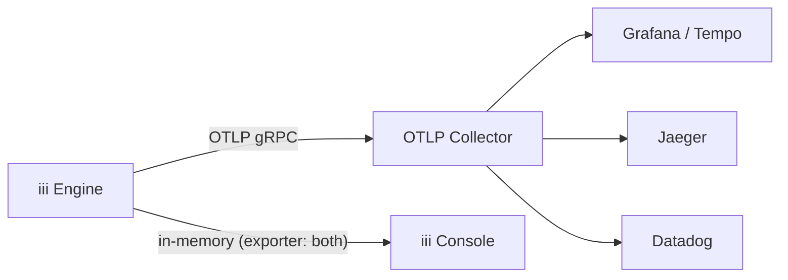

## Goal

Make your iii application fully observable: correlate every log entry to the exact trace that produced it, inspect execution timelines to find bottlenecks, and optionally export all telemetry to third-party tools like Grafana, Jaeger, or Datadog.

## Why use the iii Logger

Every iii SDK ships a `Logger` class that emits logs as OpenTelemetry LogRecords. Each log call automatically captures the active **trace ID** and **span ID**, linking the log entry to the distributed trace that produced it.

Language-native logging functions — `console.log` in Node, `print()` in Python, `tracing::info!` in Rust — write to stdout but are **not connected to traces**. This means you cannot find them in the iii Console's trace detail view, and they are invisible to any OTLP-based observability backend.

| Approach | Where it appears | Trace correlation |
|---|---|---|
| `console.log("Order created")` | stdout only | None |
| `print("Order created")` | stdout only | None |
| `tracing::info!("Order created")` | stdout only | None |
| `logger.info("Order created", { orderId })` | stdout, iii Console, OTLP backends | Automatic — linked to the active trace and span |

<Warning>
  Avoid using `console.log`, `print()`, or `tracing::info!` for application logs. These bypass the OpenTelemetry pipeline and will not appear in the iii Console or any connected observability tool.
</Warning>

## Trace-correlated logs in iii Console

When you use the iii Logger, every log entry is attached to the trace that was active when the log was emitted. In the iii Console, clicking a trace in the waterfall chart opens a detail drawer. The **Logs** tab shows every log entry from that exact execution — with severity, timestamp, message, and any structured data you attached.


This is the core value of using the iii Logger: you can go from a slow trace in the waterfall chart directly to the logs that explain what happened, without grepping through stdout or cross-referencing timestamps manually.

## Using the Logger

<Steps>
  <Step title="Import and instantiate">

Create a `Logger` instance in your function handler. No configuration is required — trace context is injected automatically.

<Tabs>
<Tab title="Node / TypeScript">
```typescript
import { Logger } from 'iii-sdk'

const logger = new Logger()

logger.info('Worker connected')
```
</Tab>
<Tab title="Python">
```python
from iii import Logger

logger = Logger()

logger.info("Worker connected")
```
</Tab>
<Tab title="Rust">
```rust
use iii_sdk::Logger;

let logger = Logger::new();

logger.info("Worker connected", None);
```
</Tab>
</Tabs>

  </Step>

  <Step title="Attach structured data">

Pass a second argument with key-value data. Structured data becomes filterable attributes in the iii Console and in any OTLP-compatible backend.

<Tabs>
<Tab title="Node / TypeScript">
```typescript
logger.info('Order processed', { orderId: 'ord_123', amount: 49.99, currency: 'USD' })
logger.warn('Retry attempt', { attempt: 3, maxRetries: 5, endpoint: '/api/charge' })
logger.error('Payment failed', { orderId: 'ord_123', gateway: 'stripe', errorCode: 'card_declined' })
logger.debug('Cache lookup', { key: 'user:42', hit: false })
```
</Tab>
<Tab title="Python">
```python
logger.info("Order processed", {"order_id": "ord_123", "amount": 49.99, "currency": "USD"})
logger.warn("Retry attempt", {"attempt": 3, "max_retries": 5, "endpoint": "/api/charge"})
logger.error("Payment failed", {"order_id": "ord_123", "gateway": "stripe", "error_code": "card_declined"})
logger.debug("Cache lookup", {"key": "user:42", "hit": False})
```
</Tab>
<Tab title="Rust">
```rust
use serde_json::json;

logger.info("Order processed", Some(json!({ "order_id": "ord_123", "amount": 49.99, "currency": "USD" })));
logger.warn("Retry attempt", Some(json!({ "attempt": 3, "max_retries": 5, "endpoint": "/api/charge" })));
logger.error("Payment failed", Some(json!({ "order_id": "ord_123", "gateway": "stripe", "error_code": "card_declined" })));
logger.debug("Cache lookup", Some(json!({ "key": "user:42", "hit": false })));
```
</Tab>
</Tabs>

<Info>
  Prefer key-value objects over string interpolation. Structured fields let you filter, aggregate, and build dashboards — string-interpolated messages do not.
</Info>

  </Step>

  <Step title="Use inside a function handler">

The Logger works anywhere inside a function handler. Trace context is captured from the active invocation automatically.

<Tabs>
<Tab title="Node / TypeScript">
```typescript
import { registerWorker, Logger } from 'iii-sdk'

const iii = registerWorker(process.env.III_URL ?? 'ws://localhost:49134')

iii.registerFunction('orders::create', async (req) => {
  const logger = new Logger()
  const { customerId, amount } = req.body
  const orderId = `order-${Date.now()}`

  logger.info('Order created', { orderId, customerId, amount })

  // ... business logic ...

  logger.info('Order processing complete', { orderId })
  return { status_code: 201, body: { orderId } }
})
```
</Tab>
<Tab title="Python">
```python
import os
from iii import register_worker, Logger

iii = register_worker(os.environ.get("III_URL", "ws://localhost:49134"))


def create_order(req):
    logger = Logger()
    body = req.get("body", {})
    customer_id = body.get("customerId")
    amount = body.get("amount")
    order_id = f"order-{int(__import__('time').time() * 1000)}"

    logger.info("Order created", {"order_id": order_id, "customer_id": customer_id, "amount": amount})

    # ... business logic ...

    logger.info("Order processing complete", {"order_id": order_id})
    return {"status_code": 201, "body": {"orderId": order_id}}


iii.register_function("orders::create", create_order)
```
</Tab>
<Tab title="Rust">
```rust
use iii_sdk::{register_worker, InitOptions, Logger, RegisterFunction};
use serde_json::{json, Value};

let iii = register_worker("ws://127.0.0.1:49134", InitOptions::default());

let reg = RegisterFunction::new_async("orders::create", |req: Value| async move {
    let logger = Logger::new();
    let customer_id = req["body"]["customerId"].as_str().unwrap_or("");
    let amount = req["body"]["amount"].as_f64().unwrap_or(0.0);
    let order_id = format!("order-{}", chrono::Utc::now().timestamp_millis());

    logger.info("Order created", Some(json!({ "orderId": order_id, "customerId": customer_id, "amount": amount })));

    // ... business logic ...

    logger.info("Order processing complete", Some(json!({ "orderId": order_id })));
    Ok(json!({ "status_code": 201, "body": { "orderId": order_id } }))
});
iii.register_function(reg);
```
</Tab>
</Tabs>

  </Step>
</Steps>

### Logger API reference

All three SDKs expose the same four methods:

| Method | Node / TypeScript | Python | Rust |
|---|---|---|---|
| Info | `logger.info(msg, data?)` | `logger.info(msg, data=None)` | `logger.info(msg, Option<Value>)` |
| Warning | `logger.warn(msg, data?)` | `logger.warn(msg, data=None)` | `logger.warn(msg, Option<Value>)` |
| Error | `logger.error(msg, data?)` | `logger.error(msg, data=None)` | `logger.error(msg, Option<Value>)` |
| Debug | `logger.debug(msg, data?)` | `logger.debug(msg, data=None)` | `logger.debug(msg, Option<Value>)` |

When OpenTelemetry is not initialized (e.g. in unit tests), the Logger falls back to `console.*` (Node), Python `logging` (Python), or `tracing::*` (Rust) — your logs still appear in stdout.

## Configuring observability

The iii engine's Observability worker (`iii-observability`) controls how traces, logs, and metrics are collected and exported. There are two main configurations depending on your environment.

### Local development

For local development, use the `memory` exporter. Traces and logs are stored in the engine's memory and can be inspected through the iii Console. This is the simplest setup and requires no external infrastructure.

```yaml title="iii-config.yaml"
workers:
  - name: iii-observability
    config:
      enabled: true
      exporter: memory
      logs_enabled: true
      memory_max_spans: 1000
```

| Field | Purpose | Default |
|---|---|---|
| `exporter` | Where to send traces: `memory`, `otlp`, or `both` | `otlp` |
| `memory_max_spans` | Max spans kept in memory | `1000` |
| `logs_enabled` | Enable structured log storage | `true` (always initialized) |
| `logs_max_count` | Max log entries kept in memory | `1000` |
| `logs_console_output` | Also print logs to the terminal via tracing | `true` |

<Info>
  With `exporter: memory`, all data lives in the engine process. This is ideal for development — no collector, no database, just start the engine and open the console.
</Info>

### Exporting to third-party tools

For production or when you want to send telemetry to an external system (Grafana, Jaeger, Datadog, or any OTLP-compatible collector), use the `otlp` exporter with an `endpoint`.

```yaml title="iii-config.yaml"
workers:
  - name: iii-observability
    config:
      enabled: true
      exporter: otlp
      endpoint: "http://collector.example.com:4317"
      service_name: my-service
      service_version: 1.0.0
      metrics_enabled: true
      logs_enabled: true
      logs_exporter: otlp
```

To keep local visibility through iii Console **and** export to a collector simultaneously, use `exporter: both`:

```yaml title="iii-config.yaml"
workers:
  - name: iii-observability
    config:
      enabled: true
      exporter: both
      endpoint: "http://collector.example.com:4317"
      service_name: my-service
      logs_enabled: true
      logs_exporter: both
```



<Info>
  The `endpoint` field can also be set via the `OTEL_EXPORTER_OTLP_ENDPOINT` environment variable. See the [Observability worker reference](/workers/worker-observability) for the full list of configuration fields and environment variable overrides.
</Info>

## Using iii Console

The iii Console is a web UI for inspecting traces, logs, metrics, and more. It comes included with every iii installation — no separate setup required. It connects to a running iii engine and gives you full operational visibility.

### Launch

Start the console while your engine is running:

```bash
iii-console
```

Open [http://localhost:3113](http://localhost:3113) in your browser.

<Warning>
  The console connects to a running iii engine instance. Make sure your engine is started before launching the console. By default it expects the engine at `127.0.0.1:3111`.
</Warning>

### Inspecting traces

Navigate to the **Traces** page to see all collected traces. Each trace shows its root operation, duration, service name, span count, and status.

Click on a trace to open the detail view with four visualization modes:

- **Waterfall Chart** — timeline showing every span by start time and duration. Best for understanding sequential and parallel flow.
- **Flame Graph** — stack-based view where wider bars mean longer duration. Best for spotting time-consuming operations.
- **Service Breakdown** — aggregate stats per service (total spans, average duration, error rate). Best for identifying bottleneck services.
- **Trace Map** — topology graph showing cross-service communication patterns.
- **Flow** — node graph showing parent-child span relationships for the selected trace.


### Inspecting logs per trace

Click on any span in the trace view to open the detail drawer. Switch to the **Logs** tab to see every log entry that was emitted during that span's execution. Each entry includes the severity level, timestamp, message, and structured attributes.


You can also use the dedicated **Logs** page for a full log viewer with severity filters, full-text search, and time-range controls. If a log entry has a `trace_id`, you can click it to jump directly to the corresponding trace.

### Identifying bottlenecks

Use the waterfall chart to spot long-running spans. Switch to the flame graph to see which operations consume the most time relative to the total trace duration. The service breakdown view aggregates performance stats so you can identify which service needs optimization.

For more details on all console features, see the [Console reference](/console/index).

## Result

Your iii application is now fully observable:

- **Structured logs** are correlated to distributed traces automatically — no manual wiring.
- **Local visibility** is available through iii Console with the `memory` exporter — no external infrastructure needed.
- **Third-party export** sends traces, logs, and metrics to any OTLP-compatible backend via the `otlp` or `both` exporter.
- **Bottleneck identification** is possible through waterfall, flame graph, and service breakdown views in the console.

## Next steps

<CardGroup cols={2}>
  <Card title="Console" href="/console/index" icon="desktop">
    Full iii Console feature reference
  </Card>
  <Card title="OpenTelemetry Integration" href="/advanced/telemetry" icon="signal">
    Custom spans, metrics, and telemetry utilities
  </Card>
  <Card title="Observability Worker" href="/workers/worker-observability" icon="gear">
    Full configuration reference for traces, logs, metrics, alerts, and sampling
  </Card>
  <Card title="Observability Example" href="/examples/observability" icon="code">
    End-to-end multi-step workflow with trace correlation
  </Card>
</CardGroup>
