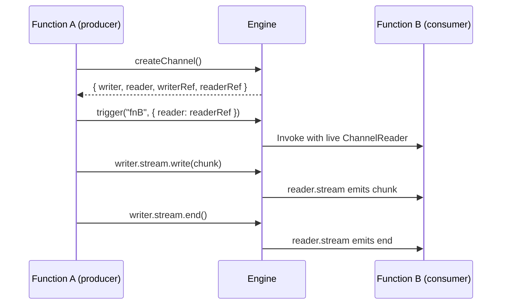
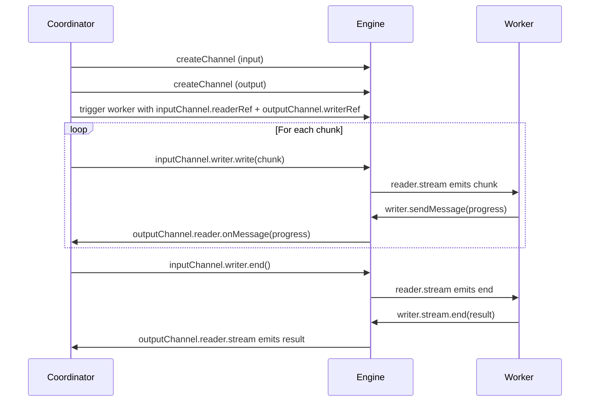

## Goal

Stream binary data between functions that may run in different worker processes. Channels give you Node.js-style readable and writable streams backed by WebSocket connections through the engine, so you can move large payloads incrementally instead of cramming everything into a single JSON message.

## What Are Channels

Channels are a streaming primitive built into the iii engine. They let one function **write** data while another function **reads** it — in real time, across process and language boundaries.

Every channel has two ends:

- A **writer** — exposes a `Writable` stream for sending binary data.
- A **reader** — exposes a `Readable` stream for receiving binary data.

Each end also has a **ref** — a small, JSON-serializable token (`StreamChannelRef`) that you embed inside a `trigger()` payload. When the receiving function deserializes the ref, the SDK automatically connects it to the engine and materializes a live `ChannelWriter` or `ChannelReader`.



Function A creates a channel, sends `readerRef` to Function B through a normal `trigger()` call, then writes chunks to the writer stream. The engine pipes each chunk over WebSocket to Function B's reader stream. When A ends the writer, B's reader emits `end`.

<Info title="Architecture deep-dive">
  For internal details on the WebSocket framing, backpressure handling, and lazy connection behavior, see the [Channels architecture](/architecture/channels) reference.
</Info>

## Why Channels Are Necessary

Function invocations in iii pass data as JSON messages. This works for structured payloads, but falls apart when you need to:

- **Transfer large binary data** — files, images, PDFs, datasets. Serializing a 100 MB file as a JSON field is impractical and blows up memory.
- **Stream data incrementally** — progress updates, partial results, or data that is produced over time. JSON messages are all-or-nothing.
- **Stream HTTP responses** — serving file downloads, SSE streams, or chunked responses to HTTP clients requires writing data progressively to the response body.
- **Pipeline processing** — chaining producer and consumer functions where the consumer starts processing before the producer finishes.

Channels solve all of these by giving each side a real stream backed by the engine's WebSocket infrastructure.

## When to Use Channels

| Scenario | Use channels? | Why |
|----------|:---:|-----|
| Serving a file download from an HTTP endpoint | Yes | Stream the file to the HTTP response without buffering the entire file in memory |
| Processing a large CSV upload | Yes | Read the uploaded body as a stream and parse rows incrementally |
| Sending progress updates during a long-running task | Yes | Use `sendMessage()` on the writer for text-based progress alongside binary data |
| Piping data between a producer and consumer function | Yes | The consumer can start working before the producer finishes |
| Returning a small JSON result from a function | No | A regular `trigger()` return value is simpler and sufficient |
| Passing a config object to another function | No | Put it in the `trigger()` payload directly |
| Fire-and-forget notifications | No | Use `TriggerAction.Void()` or a queue instead |

**Rule of thumb:** if your data is small enough to fit comfortably in a JSON payload (< 1 MB) and you don't need incremental delivery, use a regular `trigger()` call. Use channels when you need streaming, binary data, or when the payload is too large to serialize at once.

## Steps

<Steps>
  <Step title="Create a channel">
    Call `createChannel()` on the SDK instance. This returns a channel object containing both local stream objects and their serializable refs.

    <Tabs>
    <Tab title="Node / TypeScript">
    ```typescript
    const channel = await iii.createChannel()

    // channel.writer    — ChannelWriter (local writable stream)
    // channel.reader    — ChannelReader (local readable stream)
    // channel.writerRef — StreamChannelRef (serializable, pass to another function)
    // channel.readerRef — StreamChannelRef (serializable, pass to another function)
    ```
    </Tab>
    <Tab title="Python">
    ```python
    channel = iii_client.create_channel()

    # channel.writer      — ChannelWriter (local writable stream)
    # channel.reader      — ChannelReader (local readable stream)
    # channel.writer_ref  — StreamChannelRef (serializable)
    # channel.reader_ref  — StreamChannelRef (serializable)
    ```
    </Tab>
    <Tab title="Rust">
    ```rust
    let channel = iii.create_channel(None).await?;

    // channel.writer      — ChannelWriter
    // channel.reader      — ChannelReader
    // channel.writer_ref  — StreamChannelRef (serializable)
    // channel.reader_ref  — StreamChannelRef (serializable)
    ```
    </Tab>
    </Tabs>

    Creating a channel is cheap — the WebSocket connection is established lazily on first read or write.
  </Step>

  <Step title="Pass the ref to another function">
    Embed a ref (either `readerRef` or `writerRef`) inside the `trigger()` payload. The SDK on the receiving side automatically materializes it into a live `ChannelReader` or `ChannelWriter`.

    <Tabs>
    <Tab title="Node / TypeScript">
    ```typescript
    const result = await iii.trigger({
      function_id: 'files::process',
      payload: { filename: 'report.csv', reader: channel.readerRef },
    })
    ```
    </Tab>
    <Tab title="Python">
    ```python
    result = iii_client.trigger({
        "function_id": "files::process",
        "payload": {
            "filename": "report.csv",
            "reader": channel.reader_ref.model_dump(),
        },
    })
    ```
    </Tab>
    <Tab title="Rust">
    ```rust
    let result = iii.trigger(TriggerRequest::new("files::process", json!({
        "filename": "report.csv",
        "reader": channel.reader_ref,
    }))).await?;
    ```
    </Tab>
    </Tabs>

    The ref is a plain JSON object with three fields — `channel_id`, `access_key`, and `direction` — so it survives serialization across languages and processes.
  </Step>

  <Step title="Write data to the channel">
    Use the writer's stream to send binary data. Data is automatically chunked into 64 KB frames over the WebSocket.

    <Tabs>
    <Tab title="Node / TypeScript">
    ```typescript
    channel.writer.stream.write(Buffer.from('first chunk'))
    channel.writer.stream.write(Buffer.from('second chunk'))
    channel.writer.stream.end() // signals completion
    ```
    </Tab>
    <Tab title="Python">
    ```python
    channel.writer.write(b"first chunk")
    channel.writer.write(b"second chunk")
    channel.writer.close()  # signals completion
    ```
    </Tab>
    <Tab title="Rust">
    ```rust
    channel.writer.write(b"first chunk").await?;
    channel.writer.write(b"second chunk").await?;
    channel.writer.close().await?; // signals completion
    ```
    </Tab>
    </Tabs>
  </Step>

  <Step title="Read data from the channel">
    On the receiving side, iterate over the reader stream to consume chunks as they arrive.

    <Tabs>
    <Tab title="Node / TypeScript">
    ```typescript
    const chunks: Buffer[] = []
    for await (const chunk of input.reader.stream) {
      chunks.push(Buffer.isBuffer(chunk) ? chunk : Buffer.from(chunk))
    }
    const data = Buffer.concat(chunks)
    ```
    </Tab>
    <Tab title="Python">
    ```python
    chunks = []
    async for chunk in input_data["reader"]:
        chunks.append(chunk)
    data = b"".join(chunks)
    ```
    </Tab>
    <Tab title="Rust">
    ```rust
    let data = reader.read_all().await?;
    ```
    </Tab>
    </Tabs>
  </Step>
</Steps>

## Real-World Examples

### Example 1: File Download via HTTP Endpoint

A common use case is serving file downloads from an HTTP endpoint. The `http()` helper gives you a `response` object with a writable stream — pipe data directly to it without buffering the entire file in memory.

<Tabs>
<Tab title="Node / TypeScript">
```typescript
import { registerWorker, http } from 'iii-sdk'
import type { HttpRequest, HttpResponse } from 'iii-sdk'
import * as fs from 'node:fs'
import { pipeline } from 'node:stream/promises'

const iii = registerWorker(process.env.III_URL ?? 'ws://localhost:49134')

iii.registerFunction(
  'files::download',
  http(async (req: HttpRequest, res: HttpResponse) => {
    const filePath = `/data/reports/${req.path_params.filename}`

    res.status(200)
    res.headers({
      'content-type': 'application/octet-stream',
      'content-disposition': `attachment; filename="${req.path_params.filename}"`,
    })

    await pipeline(fs.createReadStream(filePath), res.stream)
  }),
)

iii.registerTrigger({
  type: 'http',
  function_id: 'files::download',
  config: { api_path: '/files/:filename', http_method: 'GET' },
})
```
</Tab>
<Tab title="Python">
```python
import os
from iii import register_worker
from iii.utils import http
from iii.types import HttpRequest, HttpResponse

iii = register_worker(os.environ.get("III_URL", "ws://localhost:49134"))


@http
async def download_file(req: HttpRequest, response: HttpResponse):
    filename = req.path_params.get("filename")
    file_path = f"/data/reports/{filename}"

    with open(file_path, "rb") as f:
        await response.status(200)
        await response.headers({"content-type": "application/pdf"})
        await response.writer.write(f.read())
        await response.writer.close_async()

iii.register_function("files::download", download_file)

iii.register_trigger({
    "type": "http",
    "function_id": "files::download",
    "config": {"api_path": "/files/:filename", "http_method": "GET"},
})
```
</Tab>
</Tabs>

The `http()` wrapper in Node/TypeScript gives you direct access to the underlying channel writer as `res.stream`, so the file streams byte-by-byte from disk to the HTTP client without ever being fully buffered in memory.

```bash
curl -O http://localhost:3111/files/quarterly-report.pdf
```

### Example 2: Server-Sent Events (SSE) Streaming

Channels power SSE endpoints where you push events to the client over time. Write each SSE frame to the response stream and the client receives them as they arrive.

<Tabs>
<Tab title="Node / TypeScript">
```typescript
import { registerWorker, http } from 'iii-sdk'
import type { HttpRequest, HttpResponse } from 'iii-sdk'

const iii = registerWorker(process.env.III_URL ?? 'ws://localhost:49134')

iii.registerFunction(
  'events::stream',
  http(async (_req: HttpRequest, res: HttpResponse) => {
    res.status(200)
    res.headers({
      'content-type': 'text/event-stream',
      'cache-control': 'no-cache',
      'connection': 'keep-alive',
    })

    for (let i = 1; i <= 5; i++) {
      const frame = `id: ${i}\nevent: progress\ndata: ${JSON.stringify({ step: i, total: 5 })}\n\n`
      res.stream.write(Buffer.from(frame))
      await new Promise((r) => setTimeout(r, 1000))
    }

    const done = `id: 6\nevent: done\ndata: ${JSON.stringify({ message: 'complete' })}\n\n`
    res.stream.write(Buffer.from(done))
    res.stream.end()
  }),
)

iii.registerTrigger({
  type: 'http',
  function_id: 'events::stream',
  config: { api_path: '/events/stream', http_method: 'GET' },
})
```
</Tab>
</Tabs>

The client connects and receives events as they're written:

```bash
curl -N http://localhost:3111/events/stream
# id: 1
# event: progress
# data: {"step":1,"total":5}
#
# id: 2
# event: progress
# data: {"step":2,"total":5}
# ...
```

### Example 3: Streaming Data Between Functions

When one function produces data and another processes it, channels let the consumer start working before the producer finishes. This is the classic pipeline pattern.

<Tabs>
<Tab title="Node / TypeScript">
```typescript
import { registerWorker } from 'iii-sdk'
import type { ChannelReader } from 'iii-sdk'

const iii = registerWorker(process.env.III_URL ?? 'ws://localhost:49134')

iii.registerFunction(
  'pipeline::consumer',
  async (input: { label: string; reader: ChannelReader }) => {
    const chunks: Buffer[] = []
    for await (const chunk of input.reader.stream) {
      chunks.push(Buffer.isBuffer(chunk) ? chunk : Buffer.from(chunk))
    }

    const records = JSON.parse(Buffer.concat(chunks).toString('utf-8'))
    const total = records.reduce((sum: number, r: { value: number }) => sum + r.value, 0)

    return { label: input.label, count: records.length, total }
  },
)

iii.registerFunction(
  'pipeline::producer',
  async (input: { records: { name: string; value: number }[] }) => {
    const channel = await iii.createChannel()

    const writePromise = new Promise<void>((resolve, reject) => {
      channel.writer.stream.end(
        Buffer.from(JSON.stringify(input.records)),
        (err?: Error | null) => (err ? reject(err) : resolve()),
      )
    })

    const result = await iii.trigger({
      function_id: 'pipeline::consumer',
      payload: { label: 'batch-001', reader: channel.readerRef },
    })

    await writePromise
    return result
  },
)
```
</Tab>
<Tab title="Python">
```python
import json
from iii import register_worker
from iii.channels import ChannelReader

iii_client = register_worker("ws://localhost:49134")


def consumer_handler(input_data):
    reader: ChannelReader = input_data["reader"]
    raw = reader.read_all()
    records = json.loads(raw.decode("utf-8"))
    total = sum(r["value"] for r in records)

    return {
        "label": input_data["label"],
        "count": len(records),
        "total": total,
    }


def producer_handler(input_data):
    records = input_data["records"]
    channel = iii_client.create_channel()

    payload = json.dumps(records).encode("utf-8")
    channel.writer.write(payload)
    channel.writer.close()

    result = iii_client.trigger({
        "function_id": "pipeline::consumer",
        "payload": {
            "label": "batch-001",
            "reader": channel.reader_ref.model_dump(),
        },
    })

    return result


iii_client.register_function("pipeline::consumer", consumer_handler)
iii_client.register_function("pipeline::producer", producer_handler)
```
</Tab>
<Tab title="Rust">
```rust
use iii_sdk::{III, IIIError, ChannelReader, ChannelDirection, RegisterFunction, TriggerRequest, extract_channel_refs};
use serde_json::{json, Value};

let iii_for_consumer = iii.clone();
let consumer_reg = RegisterFunction::new_async("pipeline::consumer", move |input: Value| {
    let iii = iii_for_consumer.clone();
    async move {
        let label = input["label"].as_str().unwrap_or_default().to_string();
        let refs = extract_channel_refs(&input);
        let reader_ref = refs.iter()
            .find(|(k, r)| k == "reader" && matches!(r.direction, ChannelDirection::Read))
            .map(|(_, r)| r.clone())
            .expect("missing reader channel ref");

        let reader = ChannelReader::new(iii.address(), &reader_ref);
        let raw = reader.read_all().await
            .map_err(|e| IIIError::Handler(e.to_string()))?;
        let records: Vec<Value> = serde_json::from_slice(&raw)
            .map_err(|e| IIIError::Handler(e.to_string()))?;

        let total: f64 = records.iter()
            .filter_map(|r| r["value"].as_f64())
            .sum();

        Ok(json!({ "label": label, "count": records.len(), "total": total }))
    }
});
iii.register_function(consumer_reg);

let iii_for_producer = iii.clone();
let producer_reg = RegisterFunction::new_async("pipeline::producer", move |input: Value| {
    let iii = iii_for_producer.clone();
    async move {
        let records = input["records"].clone();
        let channel = iii.create_channel(None).await
            .map_err(|e| IIIError::Handler(e.to_string()))?;

        let payload = serde_json::to_vec(&records)
            .map_err(|e| IIIError::Handler(e.to_string()))?;
        channel.writer.write(&payload).await
            .map_err(|e| IIIError::Handler(e.to_string()))?;
        channel.writer.close().await
            .map_err(|e| IIIError::Handler(e.to_string()))?;

        let result = iii.trigger(TriggerRequest {
            function_id: "pipeline::consumer".to_string(),
            payload: json!({
                "label": "batch-001",
                "reader": channel.reader_ref,
            }),
            action: None,
            timeout_ms: Some(30000),
        }).await.map_err(|e| IIIError::Handler(e.to_string()))?;

        Ok(result)
    }
});
iii.register_function(producer_reg);
```
</Tab>
</Tabs>

### Example 4: Bidirectional Streaming with Progress

When two functions need to exchange data in both directions, create two channels. The writer's `sendMessage()` method provides a side-channel for text-based progress or metadata that doesn't mix with the binary stream.

<Tabs>
<Tab title="Node / TypeScript">
```typescript
import { registerWorker } from 'iii-sdk'
import type { ChannelReader, ChannelWriter } from 'iii-sdk'

const iii = registerWorker(process.env.III_URL ?? 'ws://localhost:49134')

iii.registerFunction(
  'transform::worker',
  async (input: { reader: ChannelReader; writer: ChannelWriter }) => {
    const chunks: Buffer[] = []
    let count = 0

    for await (const chunk of input.reader.stream) {
      chunks.push(Buffer.isBuffer(chunk) ? chunk : Buffer.from(chunk))
      count++
      input.writer.sendMessage(JSON.stringify({ type: 'progress', chunks: count }))
    }

    const result = Buffer.concat(chunks).toString('utf-8').toUpperCase()
    input.writer.stream.end(Buffer.from(result))

    return { status: 'done' }
  },
)

iii.registerFunction(
  'transform::coordinator',
  async (input: { text: string }) => {
    const inputChannel = await iii.createChannel()
    const outputChannel = await iii.createChannel()

    const progress: unknown[] = []
    outputChannel.reader.onMessage((msg) => progress.push(JSON.parse(msg)))

    inputChannel.writer.stream.end(Buffer.from(input.text))

    const triggerPromise = iii.trigger({
      function_id: 'transform::worker',
      payload: {
        reader: inputChannel.readerRef,
        writer: outputChannel.writerRef,
      },
    })

    const resultChunks: Buffer[] = []
    for await (const chunk of outputChannel.reader.stream) {
      resultChunks.push(Buffer.isBuffer(chunk) ? chunk : Buffer.from(chunk))
    }

    await triggerPromise
    return {
      result: Buffer.concat(resultChunks).toString('utf-8'),
      progress,
    }
  },
)
```
</Tab>
</Tabs>



The coordinator creates two channels — one for input, one for output. The worker reads input, sends progress updates via `sendMessage()`, and writes the transformed result to the output channel. The coordinator collects both progress messages and the binary result.

## API Quick Reference

### `createChannel()`

Returns an object with four properties:

| Property | Type | Description |
|----------|------|-------------|
| `writer` | `ChannelWriter` | Local writable stream for sending data |
| `reader` | `ChannelReader` | Local readable stream for receiving data |
| `writerRef` | `StreamChannelRef` | Serializable token — pass to another function so it can write |
| `readerRef` | `StreamChannelRef` | Serializable token — pass to another function so it can read |

### `ChannelWriter`

| Capability | Node / TypeScript | Python | Rust |
|-----------|-------------------|--------|------|
| Write binary data | `writer.stream.write(data)` | `writer.write(data)` | `writer.write(&data).await` |
| Send text message | `writer.sendMessage(msg)` | `writer.send_message(msg)` | `writer.send_message(&msg).await` |
| Close | `writer.stream.end()` | `writer.close()` | `writer.close().await` |

### `ChannelReader`

| Capability | Node / TypeScript | Python | Rust |
|-----------|-------------------|--------|------|
| Read as stream | `for await (const chunk of reader.stream)` | `async for chunk in reader` | `reader.next_binary().await` |
| Read all at once | Collect chunks manually | `reader.read_all()` | `reader.read_all().await` |
| Listen for text messages | `reader.onMessage(callback)` | `reader.on_message(callback)` | `reader.on_message(callback).await` |

### `StreamChannelRef`

A plain JSON object that survives serialization:

```typescript
type StreamChannelRef = {
  channel_id: string
  access_key: string
  direction: 'read' | 'write'
}
```

## Common Pitfalls

<Warning title="Always close the writer">
  If you forget to call `writer.stream.end()` (or `writer.close()` in Python/Rust), the reader will hang waiting for more data. Always end the writer when you're done.
</Warning>

<Warning title="Don't pass the local stream object in a trigger payload">
  Only pass `readerRef` or `writerRef` (the serializable tokens) inside `trigger()` payloads. The local `reader` and `writer` objects are not serializable and cannot cross process boundaries.
</Warning>

<Warning title="Handle backpressure">
  If you write data faster than the reader consumes it, backpressure is handled automatically — the WebSocket pauses when the buffer is full. In Node.js, respect the `false` return from `writer.stream.write()` and wait for the `drain` event before writing more.
</Warning>

## Next Steps

<CardGroup cols={2}>
  <Card title="Channels Architecture" href="/architecture/channels" icon="sitemap">
    Internal design: WebSocket framing, backpressure, and lazy connections
  </Card>
  <Card title="Expose an HTTP Endpoint" href="/how-to/expose-http-endpoint" icon="globe">
    Register a function as a REST API endpoint
  </Card>
  <Card title="Use Functions & Triggers" href="/how-to/use-functions-and-triggers" icon="bolt">
    Learn how to register and trigger functions across languages
  </Card>
  <Card title="Stream Real-Time Data" href="/how-to/stream-realtime-data" icon="signal-stream">
    Push real-time updates to connected clients
  </Card>
</CardGroup>
