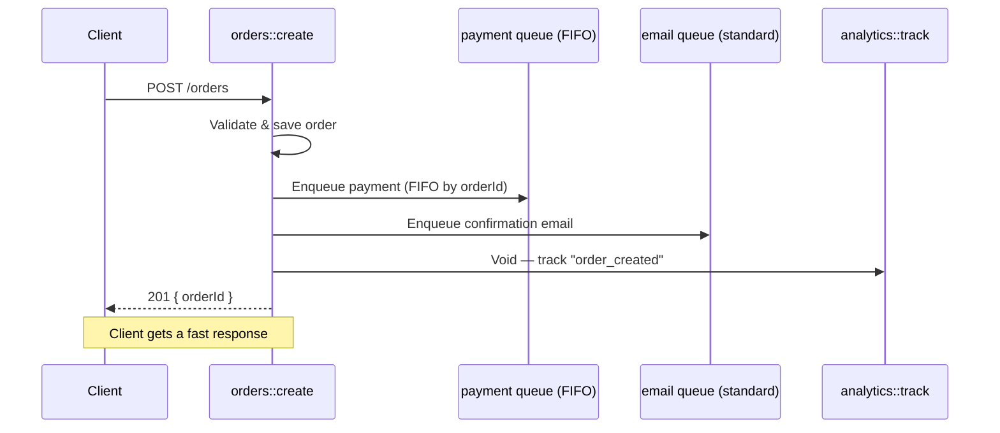
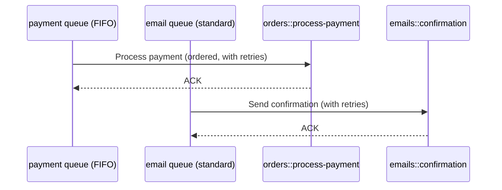
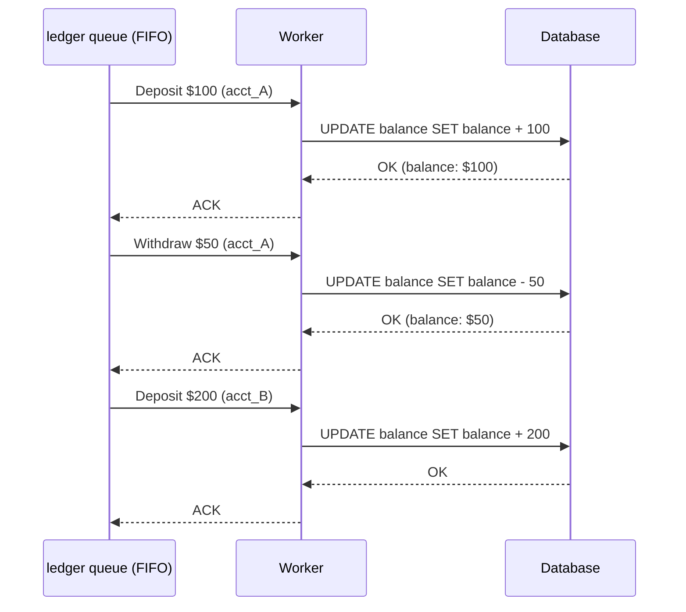
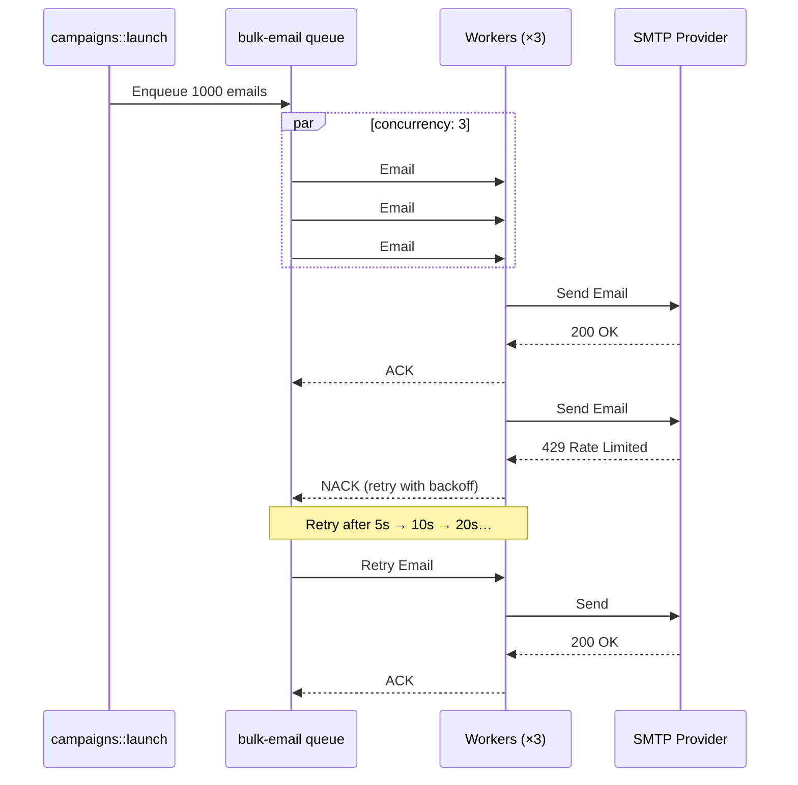

## Goal

Enqueue jobs to a specific function by name with configurable retries, concurrency limits, FIFO ordering, and dead-letter support. All named queues are defined centrally in `iii-config.yaml`. For help deciding between named and topic-based queues, see [When to use which](/workers/iii-queue#when-to-use-which).

<Info title="Trigger actions primer">
  Named queues use the `Enqueue` trigger action. Refer to [Trigger Actions](./trigger-actions) to learn more.
</Info>

## Enable the Queue worker

```yaml title="iii-config.yaml"
workers:
  - name: iii-queue
    config:
      queue_configs:
        default:
          max_retries: 5
          concurrency: 10
          type: standard
      adapter:
        name: builtin
        config:
          store_method: file_based
          file_path: ./data/queue_store
```

<Info title="Full configuration reference">
  For complete configuration options please refer to [Queue worker reference](/workers/iii-queue#configuration).
</Info>

## Steps

### 1. Define named queues in config

Declare one or more named queues under `queue_configs`. Each queue has independent retry, concurrency, and ordering settings.

```yaml title="iii-config.yaml"
workers:
  - name: iii-queue
    config:
      queue_configs:
        default:
          max_retries: 5
          concurrency: 10
          type: standard
        payment:
          max_retries: 10
          concurrency: 2
          type: fifo
          message_group_field: orderId
        email:
          max_retries: 8
          backoff_ms: 2000
          concurrency: 5
          type: standard
      adapter:
        name: builtin
        config:
          store_method: file_based
          file_path: ./data/queue_store
```

<Info title="Full configuration reference">
  FIFO queues enforce ordering in a queue and they require a `message_group_field` to order on. Queues can also set `backoff_ms` for exponential retry delays. See more on this in the steps below.
  
  For full configuration options refer to the [Queue worker reference](/workers/iii-queue#queue-configuration).
</Info>

### 2. Enqueue work via trigger action

From any function, enqueue a job by calling `trigger()` with `TriggerAction.Enqueue` and the target queue name. The caller receives an acknowledgement (`messageReceiptId`) once the engine accepts the job — it does not wait for processing.

<Tabs>
<Tab title="Node / TypeScript">
```typescript
import { registerWorker, TriggerAction } from 'iii-sdk'

const iii = registerWorker(process.env.III_URL ?? 'ws://localhost:49134')

const receipt = await iii.trigger({
  function_id: 'orders::process-payment',
  payload: { orderId: 'ord_789', amount: 149.99, currency: 'USD' },
  action: TriggerAction.Enqueue({ queue: 'payment' }),
})

console.log(receipt.messageReceiptId)
```
</Tab>
<Tab title="Python">
```python
from iii import register_worker, TriggerAction

iii = register_worker("ws://localhost:49134")

receipt = iii.trigger({
    "function_id": "orders::process-payment",
    "payload": {"orderId": "ord_789", "amount": 149.99, "currency": "USD"},
    "action": TriggerAction.Enqueue(queue="payment"),
})

print(receipt["messageReceiptId"])
```
</Tab>
<Tab title="Rust">
```rust
use iii_sdk::{register_worker, InitOptions, TriggerAction, TriggerRequest};
use serde_json::json;

let iii = register_worker("ws://localhost:49134", InitOptions::default());

let receipt = iii.trigger(TriggerRequest {
    function_id: "orders::process-payment".to_string(),
    payload: json!({
        "orderId": "ord_789",
        "amount": 149.99,
        "currency": "USD",
    }),
    action: Some(TriggerAction::Enqueue { queue: "payment".to_string() }),
    timeout_ms: None,
}).await?;

println!("{}", receipt["messageReceiptId"]);
```
</Tab>
</Tabs>

The target function receives the `payload` as its input — it does not need to know it was invoked via a queue.

### 3. Handle the enqueue result

The enqueue call can fail synchronously if the queue name is unknown or FIFO validation fails. Always handle the result.

<Tabs>
<Tab title="Node / TypeScript">
```typescript
try {
  const receipt = await iii.trigger({
    function_id: 'orders::process-payment',
    payload: { orderId: 'ord_789', amount: 149.99 },
    action: TriggerAction.Enqueue({ queue: 'payment' }),
  })
  console.log('Enqueued:', receipt.messageReceiptId)
} catch (err) {
  if (err.enqueue_error) {
    console.error('Queue rejected job:', err.enqueue_error)
  }
}
```
</Tab>
<Tab title="Python">
```python
try:
    receipt = iii.trigger({
        "function_id": "orders::process-payment",
        "payload": {"orderId": "ord_789", "amount": 149.99},
        "action": TriggerAction.Enqueue(queue="payment"),
    })
    print("Enqueued:", receipt["messageReceiptId"])
except Exception as e:
    print("Queue rejected job:", e)
```
</Tab>
<Tab title="Rust">
```rust
match iii.trigger(TriggerRequest {
    function_id: "orders::process-payment".to_string(),
    payload: json!({ "orderId": "ord_789", "amount": 149.99 }),
    action: Some(TriggerAction::Enqueue { queue: "payment".to_string() }),
    timeout_ms: None,
}).await {
    Ok(receipt) => println!("Enqueued: {}", receipt["messageReceiptId"]),
    Err(e) => eprintln!("Queue rejected job: {}", e),
}
```
</Tab>
</Tabs>

Common rejection reasons:
- The queue name does not exist in `queue_configs`
- A FIFO queue's `message_group_field` is missing or `null` in the payload

### 4. Use FIFO queues for ordered processing

When processing order matters — for example, financial transactions for the same account — set `type: fifo` and specify `message_group_field`. Jobs sharing the same group value are processed strictly in order.

```yaml title="iii-config.yaml (excerpt)"
queue_configs:
  payment:
    max_retries: 10
    concurrency: 2
    type: fifo
    message_group_field: transaction_id
```

The payload **must** contain the field named by `message_group_field`, and its value must be non-null.

<Tabs>
<Tab title="Node / TypeScript">
```typescript
await iii.trigger({
  function_id: 'payments::process',
  payload: { transaction_id: 'txn-abc-123', amount: 49.99, currency: 'USD' },
  action: TriggerAction.Enqueue({ queue: 'payment' }),
})
```
</Tab>
<Tab title="Python">
```python
iii.trigger({
    "function_id": "payments::process",
    "payload": {
        "transaction_id": "txn-abc-123",
        "amount": 49.99,
        "currency": "USD",
    },
    "action": TriggerAction.Enqueue(queue="payment"),
})
```
</Tab>
<Tab title="Rust">
```rust
iii.trigger(TriggerRequest {
    function_id: "payments::process".to_string(),
    payload: json!({
        "transaction_id": "txn-abc-123",
        "amount": 49.99,
        "currency": "USD",
    }),
    action: Some(TriggerAction::Enqueue { queue: "payment".to_string() }),
    timeout_ms: None,
}).await?;
```
</Tab>
</Tabs>

### 5. Configure retries and backoff

Every named queue retries failed jobs automatically. Backoff is exponential:

```
delay = backoff_ms × 2^(attempt - 1)
```

| Attempt | `backoff_ms: 1000` | `backoff_ms: 2000` |
|---------|--------------------|--------------------|
| 1       | 1 000 ms           | 2 000 ms           |
| 2       | 2 000 ms           | 4 000 ms           |
| 3       | 4 000 ms           | 8 000 ms           |
| 4       | 8 000 ms           | 16 000 ms          |
| 5       | 16 000 ms          | 32 000 ms          |

```yaml title="iii-config.yaml (excerpt)"
queue_configs:
  email:
    max_retries: 8
    backoff_ms: 2000
    concurrency: 5
    type: standard
```

After all retries are exhausted, the job moves to a dead-letter queue (DLQ).

<Info title="Dead letter queues">
  See [Manage Failed Triggers](./dead-letter-queues) for DLQ inspection and redrive.
</Info>

### 6. Control concurrency

The `concurrency` field sets the maximum number of jobs the engine processes simultaneously from a single queue (per engine instance).

```yaml title="iii-config.yaml (excerpt)"
queue_configs:
  default:
    concurrency: 10
    type: standard
  payment:
    concurrency: 2
    type: fifo
    message_group_field: transaction_id
```

- **Standard queues**: the engine pulls up to `concurrency` jobs simultaneously.
- **FIFO queues**: the engine processes one job at a time (prefetch=1) to preserve ordering, regardless of the `concurrency` value.

Use low concurrency to protect rate-limited APIs. Use high concurrency for embarrassingly parallel work like image resizing.

## Result

Jobs are enqueued and acknowledged immediately — the caller receives a `messageReceiptId` without waiting for processing. The engine delivers each job to the target function, retries failures with exponential backoff, and routes exhausted jobs to the dead-letter queue. Standard queues process jobs concurrently; FIFO queues guarantee per-group ordering.

<Info title="Standard vs FIFO queues">
  For a detailed comparison of standard and FIFO queue behavior — including processing model, ordering guarantees, and flow diagrams — see the [Queue worker reference](/workers/iii-queue#standard-vs-fifo-queues). For retry and dead-letter flow, see [Retry and dead-letter flow](/workers/iii-queue#retry-and-dead-letter-flow).
</Info>

---

## Real-World Scenarios

### HTTP API to Queue Pipeline

The most common pattern — an HTTP endpoint accepts a request, responds immediately, and offloads the actual work to a queue. This keeps API response times fast regardless of how long downstream processing takes.

```yaml title="iii-config.yaml"
workers:
  - name: iii-queue
    config:
      queue_configs:
        payment:
          max_retries: 10
          concurrency: 2
          type: fifo
          message_group_field: orderId
        email:
          max_retries: 5
          concurrency: 10
          type: standard
          backoff_ms: 2000
      adapter:
        name: builtin
        config:
          store_method: file_based
          file_path: ./data/queue_store
```

The API validates the request, fans work out to queues, and returns immediately:



Behind the scenes, each queue delivers to its consumer independently:



<Tabs>
<Tab title="Node / TypeScript">
```typescript
import { registerWorker, TriggerAction, Logger } from 'iii-sdk'

const iii = registerWorker(process.env.III_URL ?? 'ws://localhost:49134')

iii.registerFunction('orders::create', async (req) => {
  const logger = new Logger()
  const order = { id: crypto.randomUUID(), ...req.body }

  await iii.trigger({
    function_id: 'orders::process-payment',
    payload: { orderId: order.id, amount: order.total, currency: 'USD' },
    action: TriggerAction.Enqueue({ queue: 'payment' }),
  })

  await iii.trigger({
    function_id: 'emails::confirmation',
    payload: { email: order.email, orderId: order.id },
    action: TriggerAction.Enqueue({ queue: 'email' }),
  })

  await iii.trigger({
    function_id: 'analytics::track',
    payload: { event: 'order_created', orderId: order.id },
    action: TriggerAction.Void(),
  })

  logger.info('Order created', { orderId: order.id })
  return { status_code: 201, body: { orderId: order.id } }
})

iii.registerTrigger({
  type: 'http',
  function_id: 'orders::create',
  config: { api_path: '/orders', http_method: 'POST' },
})
```
</Tab>
<Tab title="Python">
```python
import os
import uuid

from iii import Logger, TriggerAction, register_worker

iii = register_worker(os.environ.get("III_URL", "ws://localhost:49134"))


def create_order(req):
    logger = Logger()
    order = {"id": str(uuid.uuid4()), **req.get("body", {})}

    iii.trigger({
        "function_id": "orders::process-payment",
        "payload": {"orderId": order["id"], "amount": order["total"], "currency": "USD"},
        "action": TriggerAction.Enqueue(queue="payment"),
    })

    iii.trigger({
        "function_id": "emails::confirmation",
        "payload": {"email": order["email"], "orderId": order["id"]},
        "action": TriggerAction.Enqueue(queue="email"),
    })

    iii.trigger({
        "function_id": "analytics::track",
        "payload": {"event": "order_created", "orderId": order["id"]},
        "action": TriggerAction.Void(),
    })

    logger.info("Order created", {"orderId": order["id"]})
    return {"status_code": 201, "body": {"orderId": order["id"]}}


fn = iii.register_function("orders::create", create_order)

iii.register_trigger({
    "type": "http",
    "function_id": fn.id,
    "config": {"api_path": "/orders", "http_method": "POST"},
})
```
</Tab>
<Tab title="Rust">
```rust
use iii_sdk::{
    register_worker, InitOptions, Logger, RegisterFunction,
    RegisterTriggerInput, TriggerAction, TriggerRequest,
};
use serde_json::{json, Value};

let iii = register_worker("ws://localhost:49134", InitOptions::default());

let iii_clone = iii.clone();
let reg = RegisterFunction::new_async("orders::create", move |req: Value| {
    let iii = iii_clone.clone();
    async move {
        let logger = Logger::new();
        let order_id = uuid::Uuid::new_v4().to_string();

        iii.trigger(TriggerRequest {
            function_id: "orders::process-payment".into(),
            payload: json!({ "orderId": order_id, "amount": req["body"]["total"], "currency": "USD" }),
            action: Some(TriggerAction::Enqueue { queue: "payment".into() }),
            timeout_ms: None,
        }).await?;

        iii.trigger(TriggerRequest {
            function_id: "emails::confirmation".into(),
            payload: json!({ "email": req["body"]["email"], "orderId": order_id }),
            action: Some(TriggerAction::Enqueue { queue: "email".into() }),
            timeout_ms: None,
        }).await?;

        iii.trigger(TriggerRequest {
            function_id: "analytics::track".into(),
            payload: json!({ "event": "order_created", "orderId": order_id }),
            action: Some(TriggerAction::Void),
            timeout_ms: None,
        }).await?;

        logger.info("Order created", Some(json!({ "orderId": order_id })));
        Ok(json!({ "status_code": 201, "body": { "orderId": order_id } }))
    }
});
iii.register_function(reg);

iii.register_trigger(RegisterTriggerInput {
    trigger_type: "http".into(),
    function_id: "orders::create".into(),
    config: json!({ "api_path": "/orders", "http_method": "POST" }),
    metadata: None,
})?;
```
</Tab>
</Tabs>

This example uses all three [trigger actions](./trigger-actions): **Enqueue** for payment (reliable, ordered) and email (reliable, parallel), and **Void** for analytics (best-effort).

### Financial Transaction Ledger (FIFO)

Transactions for the same account must be applied in order to prevent balance inconsistencies. Different accounts can process in parallel.

```yaml title="iii-config.yaml (excerpt)"
queue_configs:
  ledger:
    max_retries: 15
    concurrency: 1
    type: fifo
    message_group_field: account_id
    backoff_ms: 500
```

Three transactions arrive — two for the same account, one for a different account. The FIFO queue groups them by `account_id`:

```mermaid
sequenceDiagram
    participant API as transactions::submit
    participant Q as ledger queue (FIFO)

    API->>Q: Deposit $100 (account: acct_A)
    API->>Q: Withdraw $50 (account: acct_A)
    API->>Q: Deposit $200 (account: acct_B)

    Note over Q: acct_A jobs are ordered; acct_B is independent
```

The worker processes `acct_A` jobs strictly in order, while `acct_B` proceeds independently:



<Tabs>
<Tab title="Node / TypeScript">
```typescript
import { registerWorker, TriggerAction } from 'iii-sdk'

const iii = registerWorker(process.env.III_URL ?? 'ws://localhost:49134')

iii.registerFunction('transactions::submit', async (req) => {
  const { account_id, type, amount } = req.body

  const receipt = await iii.trigger({
    function_id: 'ledger::apply',
    payload: { account_id, type, amount },
    action: TriggerAction.Enqueue({ queue: 'ledger' }),
  })

  return { status_code: 202, body: { receiptId: receipt.messageReceiptId } }
})

iii.registerFunction('ledger::apply', async (txn) => {
  const { account_id, type, amount } = txn
  if (type === 'deposit') {
    await db.query('UPDATE accounts SET balance = balance + $1 WHERE id = $2', [amount, account_id])
  } else if (type === 'withdraw') {
    const { rows } = await db.query('SELECT balance FROM accounts WHERE id = $1', [account_id])
    if (rows[0].balance < amount) {
      throw new Error('Insufficient funds')
    }
    await db.query('UPDATE accounts SET balance = balance - $1 WHERE id = $2', [amount, account_id])
  }
  return { applied: true }
})
```
</Tab>
<Tab title="Python">
```python
from iii import TriggerAction, register_worker

iii = register_worker("ws://localhost:49134")


def submit_transaction(req):
    account_id = req["body"]["account_id"]
    txn_type = req["body"]["type"]
    amount = req["body"]["amount"]

    receipt = iii.trigger({
        "function_id": "ledger::apply",
        "payload": {"account_id": account_id, "type": txn_type, "amount": amount},
        "action": TriggerAction.Enqueue(queue="ledger"),
    })

    return {"status_code": 202, "body": {"receiptId": receipt["messageReceiptId"]}}


def apply_transaction(txn):
    account_id = txn["account_id"]
    if txn["type"] == "deposit":
        db.execute(
            "UPDATE accounts SET balance = balance + %s WHERE id = %s",
            (txn["amount"], account_id),
        )
    elif txn["type"] == "withdraw":
        balance = db.query("SELECT balance FROM accounts WHERE id = %s", (account_id,))
        if balance < txn["amount"]:
            raise ValueError("Insufficient funds")
        db.execute(
            "UPDATE accounts SET balance = balance - %s WHERE id = %s",
            (txn["amount"], account_id),
        )
    return {"applied": True}


iii.register_function("transactions::submit", submit_transaction)
iii.register_function("ledger::apply", apply_transaction)
```
</Tab>
<Tab title="Rust">
```rust
use iii_sdk::{
    register_worker, InitOptions, RegisterFunction,
    TriggerAction, TriggerRequest,
};
use serde_json::{json, Value};

let iii = register_worker("ws://localhost:49134", InitOptions::default());

let iii_clone = iii.clone();
let reg = RegisterFunction::new_async("transactions::submit", move |req: Value| {
    let iii = iii_clone.clone();
    async move {
        let receipt = iii.trigger(TriggerRequest {
            function_id: "ledger::apply".into(),
            payload: json!({
                "account_id": req["body"]["account_id"],
                "type": req["body"]["type"],
                "amount": req["body"]["amount"],
            }),
            action: Some(TriggerAction::Enqueue { queue: "ledger".into() }),
            timeout_ms: None,
        }).await?;

        Ok(json!({
            "status_code": 202,
            "body": { "receiptId": receipt["messageReceiptId"] },
        }))
    }
});
iii.register_function(reg);
```
</Tab>
</Tabs>

Because the `ledger` queue is FIFO with `message_group_field: account_id`, the deposit for `acct_A` always completes before the withdrawal. Without FIFO ordering, the withdrawal could execute first and fail with "Insufficient funds" even though the deposit was submitted first.

### Bulk Email with Rate Limiting

A marketing system sends thousands of emails. The SMTP provider has a rate limit. A standard queue with low concurrency prevents overloading the provider while retrying transient failures.

```yaml title="iii-config.yaml (excerpt)"
queue_configs:
  bulk-email:
    max_retries: 5
    concurrency: 3
    type: standard
    backoff_ms: 5000
```

Three workers pull from the queue concurrently. When one hits a rate limit, it retries with exponential backoff while the others continue:



<Tabs>
<Tab title="Node / TypeScript">
```typescript
import { registerWorker, TriggerAction } from 'iii-sdk'

const iii = registerWorker(process.env.III_URL ?? 'ws://localhost:49134')

iii.registerFunction('campaigns::launch', async (campaign) => {
  for (const recipient of campaign.recipients) {
    await iii.trigger({
      function_id: 'emails::send',
      payload: {
        to: recipient.email,
        subject: campaign.subject,
        body: campaign.body,
      },
      action: TriggerAction.Enqueue({ queue: 'bulk-email' }),
    })
  }

  return { enqueued: campaign.recipients.length }
})

iii.registerFunction('emails::send', async (email) => {
  const response = await fetch('https://smtp-provider.example/send', {
    method: 'POST',
    body: JSON.stringify(email),
    headers: { 'Content-Type': 'application/json' },
  })

  if (!response.ok) {
    throw new Error(`SMTP error: ${response.status}`)
  }

  return { sent: true }
})
```
</Tab>
<Tab title="Python">
```python
import requests
from iii import TriggerAction, register_worker

iii = register_worker("ws://localhost:49134")


def launch_campaign(campaign):
    for recipient in campaign["recipients"]:
        iii.trigger({
            "function_id": "emails::send",
            "payload": {
                "to": recipient["email"],
                "subject": campaign["subject"],
                "body": campaign["body"],
            },
            "action": TriggerAction.Enqueue(queue="bulk-email"),
        })

    return {"enqueued": len(campaign["recipients"])}


def send_email(email):
    response = requests.post(
        "https://smtp-provider.example/send", json=email
    )
    response.raise_for_status()
    return {"sent": True}


iii.register_function("campaigns::launch", launch_campaign)
iii.register_function("emails::send", send_email)
```
</Tab>
<Tab title="Rust">
```rust
use iii_sdk::{
    register_worker, InitOptions, RegisterFunction,
    TriggerAction, TriggerRequest,
};
use serde_json::{json, Value};

let iii = register_worker("ws://localhost:49134", InitOptions::default());

let iii_clone = iii.clone();
let reg = RegisterFunction::new_async("campaigns::launch", move |campaign: Value| {
    let iii = iii_clone.clone();
    async move {
        let recipients = campaign["recipients"].as_array().unwrap();
        for recipient in recipients {
            iii.trigger(TriggerRequest {
                function_id: "emails::send".into(),
                payload: json!({
                    "to": recipient["email"],
                    "subject": campaign["subject"],
                    "body": campaign["body"],
                }),
                action: Some(TriggerAction::Enqueue { queue: "bulk-email".into() }),
                timeout_ms: None,
            }).await?;
        }
        Ok(json!({ "enqueued": recipients.len() }))
    }
});
iii.register_function(reg);
```
</Tab>
</Tabs>

With `concurrency: 3`, at most three emails are in-flight at any time. Failed sends retry with exponential backoff (5s, 10s, 20s, 40s, 80s), protecting the SMTP provider from overload.

<Info title="Adapters and configuration">
  For adapter options (builtin, RabbitMQ, Redis), scenario-based recommendations, and the full queue configuration reference, see the [Queue worker reference](/workers/iii-queue#adapter-comparison).
</Info>

## Remember

Jobs are enqueued and acknowledged immediately — the caller receives a `messageReceiptId` without waiting for processing. The engine delivers each job to the target function, retries failures with exponential backoff, and routes permanently failed jobs to a dead-letter queue. Standard queues process jobs concurrently; FIFO queues guarantee per-group ordering.

## Next Steps

<CardGroup cols={2}>
  <Card title="Topic-Based Queues" href="/how-to/use-topic-queues" icon="tower-broadcast">
    Fan out messages to multiple subscribers with durable pub-sub
  </Card>
  <Card title="Trigger Actions" href="/how-to/trigger-actions" icon="bolt">
    Understand synchronous, Void, and Enqueue invocation modes
  </Card>
  <Card title="Dead Letter Queues" href="/how-to/dead-letter-queues" icon="skull">
    Handle and redrive failed queue messages
  </Card>
  <Card title="Queue Worker Reference" href="/workers/iii-queue" icon="gear">
    Full configuration reference for queues and adapters
  </Card>
</CardGroup>
