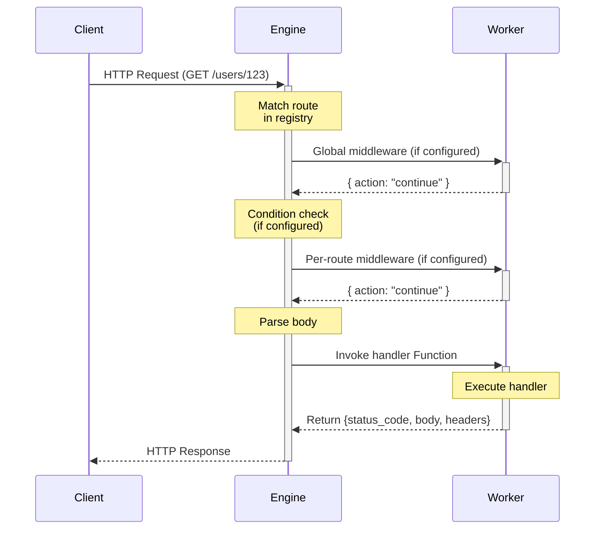

The HTTP Module exposes registered functions as HTTP endpoints.

```
modules::api::RestApiModule
```

## Sample Configuration

```yaml
- class: modules::api::RestApiModule
  config:
    port: 3111
    host: 0.0.0.0
    cors:
      allowed_origins:
        - http://localhost:3000
        - http://localhost:5173
      allowed_methods:
        - GET
        - POST
        - PUT
        - DELETE
        - OPTIONS
```

## Configuration

<ResponseField name="port" type="number">
  The port to listen on. Defaults to `3111`.
</ResponseField>

<ResponseField name="host" type="string">
  The host to listen on. Defaults to `0.0.0.0`.
</ResponseField>

<ResponseField name="default_timeout" type="number">
  The default timeout in milliseconds for request processing. Defaults to `30000`.
</ResponseField>

<ResponseField name="concurrency_request_limit" type="number">
  The maximum number of concurrent requests the server will handle. Defaults to `1024`.
</ResponseField>

<ResponseField name="cors" type="Cors">
  The CORS configuration.

  <Expandable title="Cors">
    <ResponseField name="allowed_origins" type="string[]" required>
      The allowed origins.
    </ResponseField>
    <ResponseField name="allowed_methods" type="string[]" required>
      The allowed methods.
    </ResponseField>
  </Expandable>
</ResponseField>

<ResponseField name="body_limit" type="number">
  Maximum request body size in bytes. Defaults to `1048576` (1 MB).
</ResponseField>

<ResponseField name="trust_proxy" type="boolean">
  When `true`, the engine trusts proxy headers such as `X-Forwarded-For` for client IP resolution. Defaults to `false`.
</ResponseField>

<ResponseField name="request_id_header" type="string">
  Header name used to propagate or generate a request ID. Defaults to `x-request-id`.
</ResponseField>

<ResponseField name="ignore_trailing_slash" type="boolean">
  When `true`, routes with and without a trailing slash are treated as equivalent. Defaults to `false`.
</ResponseField>

<ResponseField name="not_found_function" type="string">
  Function ID to invoke when no route matches a request. When unset, the engine returns a default 404 response.
</ResponseField>

## Trigger Type

This module adds a new Trigger Type: `http`.

<Expandable title="Trigger Config">
  <ResponseField name="api_path" type="string" required>
    The path of the API.
  </ResponseField>
  <ResponseField name="http_method" type="string" required>
    The HTTP method of the API.
  </ResponseField>
  <ResponseField name="condition_function_id" type="string">
    Function ID for conditional execution. The engine invokes it with the request; if it returns `false`, the handler function is not called.
  </ResponseField>
  <ResponseField name="middleware_function_ids" type="string[]">
    Function IDs for per-route middleware. The engine invokes each in order before the handler. Each must return `{ action: "continue" }` or `{ action: "respond", response }`.
  </ResponseField>
</Expandable>

### Sample code

```typescript
const fn = iii.registerFunction({ id: 'api.getUsers' }, handler)
iii.registerTrigger({
  type: 'http',
  function_id: fn.id,
  config: {
    api_path: '/api/v1/users',
    http_method: 'GET',
  },
})
```

## Request & Response Objects

### ApiRequest

When an API trigger fires, the function receives an `ApiRequest` object:

<ResponseField name="path" type="string">
  The request path.
</ResponseField>

<ResponseField name="method" type="string">
  The HTTP method of the request (e.g., `GET`, `POST`).
</ResponseField>

<ResponseField name="path_params" type="Record&lt;string, string&gt;">
  Variables extracted from the URL path (e.g., `/users/:id`).
</ResponseField>

<ResponseField name="query_params" type="Record&lt;string, string&gt;">
  URL query string parameters.
</ResponseField>

<ResponseField name="body" type="any">
  The parsed request body (JSON).
</ResponseField>

<ResponseField name="headers" type="Record&lt;string, string&gt;">
  HTTP request headers.
</ResponseField>

<ResponseField name="trigger" type="object">
  Metadata about the trigger that fired the function.

  <Expandable title="TriggerMetadata">
    <ResponseField name="type" type="string">
      The trigger type (e.g., `http`).
    </ResponseField>
    <ResponseField name="path" type="string">
      The matched route path pattern.
    </ResponseField>
    <ResponseField name="method" type="string">
      The HTTP method.
    </ResponseField>
  </Expandable>
</ResponseField>

<ResponseField name="context" type="object">
  Request context object. Populated by middleware and available to handler functions.
</ResponseField>

### ApiResponse

Functions must return an `ApiResponse` object:

<ResponseField name="status_code" type="number">
  HTTP status code (e.g., 200, 404, 500).
</ResponseField>

<ResponseField name="body" type="any">
  The response payload.
</ResponseField>

<ResponseField name="headers" type="string[]">
  HTTP response headers as `"Header-Name: value"` strings (e.g., `["Content-Type: application/json"]`). Optional.
</ResponseField>

## Middleware

The HTTP module supports middleware functions that run before the handler. There are two types:

- **Per-route middleware** — attached to a specific trigger via `middleware_function_ids` in trigger config
- **Global middleware** — configured in `iii-config.yaml`, runs on all HTTP routes

### Global Middleware Configuration

<ResponseField name="middleware" type="MiddlewareConfig[]">
  List of global middleware functions. Each runs on every HTTP request, before conditions and per-route middleware.

  <Expandable title="MiddlewareConfig">
    <ResponseField name="function_id" type="string" required>
      Function ID of the middleware to invoke.
    </ResponseField>
    <ResponseField name="phase" type="string">
      Lifecycle phase. Currently only `preHandler` is supported. Defaults to `preHandler`.
    </ResponseField>
    <ResponseField name="priority" type="number">
      Execution order. Lower values run first. Defaults to `0`.
    </ResponseField>
  </Expandable>
</ResponseField>

```yaml
- class: modules::api::RestApiModule
  config:
    port: 3111
    middleware:
      - function_id: "global::rate-limiter"
        phase: preHandler
        priority: 5
      - function_id: "global::auth"
        phase: preHandler
        priority: 10
```

### Middleware Function Contract

Middleware functions receive a lightweight request object (no body):

<ResponseField name="phase" type="string">
  The phase in which the middleware is executing (`preHandler`).
</ResponseField>

<ResponseField name="request" type="object">
  Request metadata: `path_params`, `query_params`, `headers`, `method`. Does not include `body`.
</ResponseField>

<ResponseField name="context" type="object">
  Empty context object for future use.
</ResponseField>

Middleware must return one of:

- `{ action: "continue" }` — proceed to the next middleware or handler.
- `{ action: "respond", response: { status_code, body, headers } }` — short-circuit and return a response immediately. Remaining middleware and the handler are skipped.

### Execution Order

```
1. Route match
2. Global middleware (from config, sorted by priority)
3. Condition check (if configured)
4. Per-route middleware (from trigger config, in order)
5. Body parsing
6. Handler function
```

See the [HTTP Middleware how-to guide](/how-to/use-http-middleware) for full examples.

## Request Lifecycle



## Example Handler

```typescript
import { registerWorker } from 'iii-sdk'
import type { ApiRequest, ApiResponse } from 'iii-sdk'

const iii = registerWorker('ws://localhost:49134')

async function getUser(req: ApiRequest): Promise<ApiResponse> {
  const userId = req.path_params?.id
  const user = await database.findUser(userId)
  return {
    status_code: 200,
    body: { user },
    headers: { 'Content-Type': 'application/json' },
  }
}

const fn = iii.registerFunction({ id: 'api.getUser' }, getUser)
iii.registerTrigger({
  type: 'http',
  function_id: fn.id,
  config: {
    api_path: '/users/:id',
    http_method: 'GET',
  },
})
```
