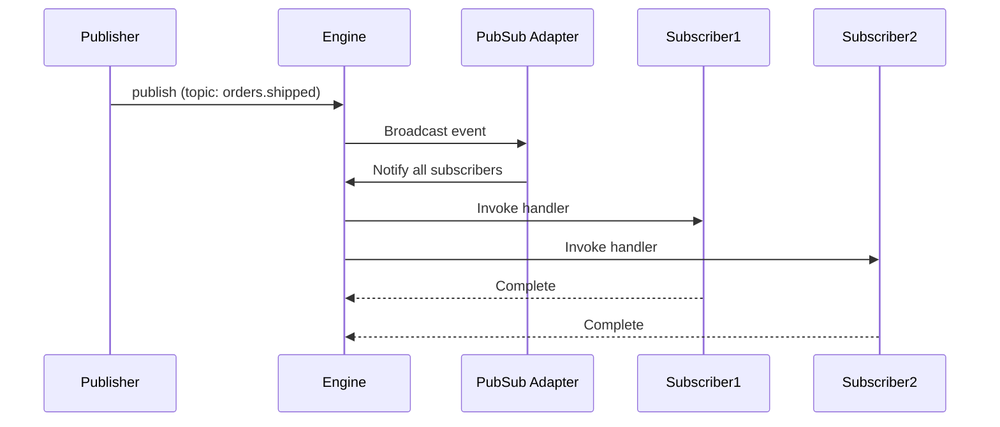

Topic-based publish/subscribe messaging for broadcasting events to multiple subscribers in real time.

```
iii-pubsub
```

## Sample Configuration

```yaml
- name: iii-pubsub
  config:
    adapter:
      name: local
```

## Configuration

<ResponseField name="adapter" type="Adapter">
  The adapter to use for pub/sub distribution. Defaults to `local` (in-memory) when not specified.
</ResponseField>

## Adapters

### local

In-memory pub/sub using broadcast channels. Messages are delivered only to subscribers running in the same engine process. No external dependencies required.

```yaml
name: local
```

### redis

Uses Redis Pub/Sub as the backend. Enables event delivery across multiple engine instances.

```yaml
name: redis
config:
  redis_url: ${REDIS_URL:redis://localhost:6379}
```

#### Configuration

<ResponseField name="redis_url" type="string">
  The URL of the Redis instance to use.
</ResponseField>

## Functions

<ResponseField name="publish" type="function">
  Publish an event to a topic. All functions subscribed to that topic will be invoked with the payload.

  <AccordionGroup>
    <Accordion iconName="settings" title="Parameters">
      <ResponseField name="topic" type="string" required>
        The topic to publish to. Must not be empty.
      </ResponseField>
      <ResponseField name="data" type="any" required>
        The event payload to broadcast. Can be any JSON-serializable value.
      </ResponseField>
    </Accordion>
    <Accordion title="Returns">
      <ResponseField name="result" type="null">
        Returns `null` on success.
      </ResponseField>
    </Accordion>
  </AccordionGroup>
</ResponseField>

## Trigger Type

This worker adds a new Trigger Type: `subscribe`.

<Expandable title="Trigger Config">
  <ResponseField name="topic" type="string" required>
    The topic to subscribe to. The function will be invoked whenever an event is published to this topic.
  </ResponseField>
</Expandable>

### Subscribe Event Payload

The handler receives the raw value passed as `data` to the `publish` call. No envelope is added.

<ResponseField name="payload" type="any">
  The exact value published to the topic. Shape is determined entirely by the publisher.
</ResponseField>

### Sample Code

<Tabs>
<Tab title="TypeScript">
```typescript
const fn = iii.registerFunction(
  { id: 'notifications::onOrderShipped' },
  async (data) => {
    console.log('Order shipped:', data)
    return {}
  },
)

iii.registerTrigger({
  type: 'subscribe',
  function_id: fn.id,
  config: { topic: 'orders.shipped' },
})

await iii.trigger({
  function_id: 'publish',
  payload: {
    topic: 'orders.shipped',
    data: { orderId: 'abc-123', address: '123 Main St' },
  },
  action: TriggerAction.Void(),
})
```
</Tab>
<Tab title="Python">
```python
def on_order_shipped(data):
    print('Order shipped:', data)
    return {}

iii.register_function("notifications::onOrderShipped", on_order_shipped)
iii.register_trigger({'type': 'subscribe', 'function_id': 'notifications::onOrderShipped', 'config': {'topic': 'orders.shipped'}})

iii.trigger({
    'function_id': 'publish',
    'payload': {
        'topic': 'orders.shipped',
        'data': {'orderId': 'abc-123', 'address': '123 Main St'},
    },
})
```
</Tab>
<Tab title="Rust">
```rust
iii.register_function(
    RegisterFunctionMessage::with_id("notifications::onOrderShipped".into()),
    |data| async move {
        println!("Order shipped: {:?}", data);
        Ok(json!({}))
    },
);

iii.register_trigger(RegisterTriggerInput {
    trigger_type: "subscribe".into(),
    function_id: "notifications::onOrderShipped".into(),
    config: json!({ "topic": "orders.shipped" }),
    metadata: None,
})?;

iii.trigger(TriggerRequest {
    function_id: "publish".into(),
    payload: json!({
        "topic": "orders.shipped",
        "data": { "orderId": "abc-123", "address": "123 Main St" }
    }),
    action: Some(TriggerAction::Void),
    timeout_ms: None,
}).await?;
```
</Tab>
</Tabs>

### Usage Example: Fanout Notification

One publisher triggers two independent subscribers on the same topic:

<Tabs>
<Tab title="TypeScript">
```typescript
const emailFn = iii.registerFunction(
  { id: 'notifications::sendEmailAlert' },
  async (data) => {
    await sendEmail(data.userId, `Order ${data.orderId} shipped`)
    return {}
  },
)

const pushFn = iii.registerFunction(
  { id: 'notifications::sendPushAlert' },
  async (data) => {
    await sendPushNotification(data.userId, `Order ${data.orderId} shipped`)
    return {}
  },
)

iii.registerTrigger({
  type: 'subscribe',
  function_id: emailFn.id,
  config: { topic: 'orders.shipped' },
})

iii.registerTrigger({
  type: 'subscribe',
  function_id: pushFn.id,
  config: { topic: 'orders.shipped' },
})

await iii.trigger({
  function_id: 'publish',
  payload: {
    topic: 'orders.shipped',
    data: { orderId: 'abc-123', userId: 'user-456' },
  },
})
```
</Tab>
<Tab title="Python">
```python
def send_email_alert(data):
    send_email(data['userId'], f"Order {data['orderId']} shipped")
    return {}

def send_push_alert(data):
    send_push_notification(data['userId'], f"Order {data['orderId']} shipped")
    return {}

iii.register_function("notifications::sendEmailAlert", send_email_alert)
iii.register_function("notifications::sendPushAlert", send_push_alert)

iii.register_trigger({'type': 'subscribe', 'function_id': 'notifications::sendEmailAlert', 'config': {'topic': 'orders.shipped'}})
iii.register_trigger({'type': 'subscribe', 'function_id': 'notifications::sendPushAlert', 'config': {'topic': 'orders.shipped'}})

iii.trigger({
    'function_id': 'publish',
    'payload': {
        'topic': 'orders.shipped',
        'data': {'orderId': 'abc-123', 'userId': 'user-456'},
    },
})
```
</Tab>
<Tab title="Rust">
```rust
use iii_sdk::{RegisterFunctionMessage, RegisterTriggerInput, TriggerRequest};
use serde_json::json;

iii.register_function(
    RegisterFunctionMessage::with_id("notifications::sendEmailAlert".into()),
    |data| async move {
        let order_id = data["orderId"].as_str().unwrap_or("");
        let user_id = data["userId"].as_str().unwrap_or("");
        send_email(user_id, &format!("Order {} shipped", order_id)).await?;
        Ok(json!({}))
    },
);

iii.register_function(
    RegisterFunctionMessage::with_id("notifications::sendPushAlert".into()),
    |data| async move {
        let order_id = data["orderId"].as_str().unwrap_or("");
        let user_id = data["userId"].as_str().unwrap_or("");
        send_push_notification(user_id, &format!("Order {} shipped", order_id)).await?;
        Ok(json!({}))
    },
);

iii.register_trigger(RegisterTriggerInput {
    trigger_type: "subscribe".into(),
    function_id: "notifications::sendEmailAlert".into(),
    config: json!({ "topic": "orders.shipped" }),
    metadata: None,
})?;
iii.register_trigger(RegisterTriggerInput {
    trigger_type: "subscribe".into(),
    function_id: "notifications::sendPushAlert".into(),
    config: json!({ "topic": "orders.shipped" }),
    metadata: None,
})?;

iii.trigger(TriggerRequest {
    function_id: "publish".into(),
    payload: json!({
        "topic": "orders.shipped",
        "data": { "orderId": "abc-123", "userId": "user-456" }
    }),
    action: None,
    timeout_ms: None,
}).await?;
```
</Tab>
</Tabs>

## PubSub vs Queue

| Feature | PubSub | Queue (topic-based) |
|---|---|---|
| Delivery | Broadcast to all subscribers | Fan-out to each subscribed function; replicas of the same function compete |
| Persistence | No (fire-and-forget) | Yes (with retries and DLQ) |
| Ordering | Not guaranteed | FIFO within topic |
| Best for | Real-time notifications, fire-and-forget fanout | Reliable fanout with retries and dead-letter support |

## PubSub Flow


