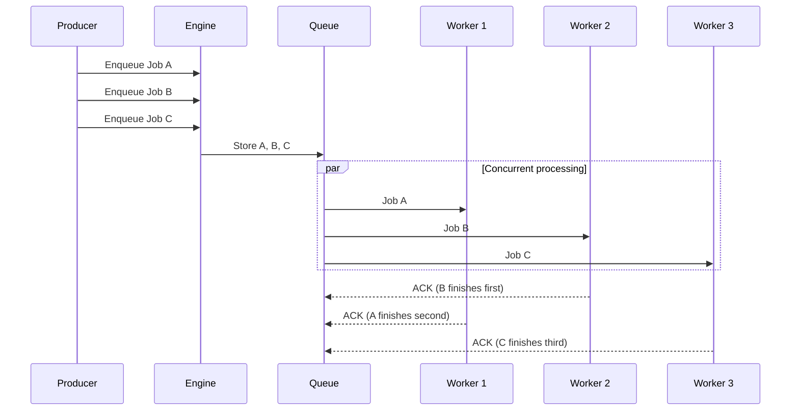
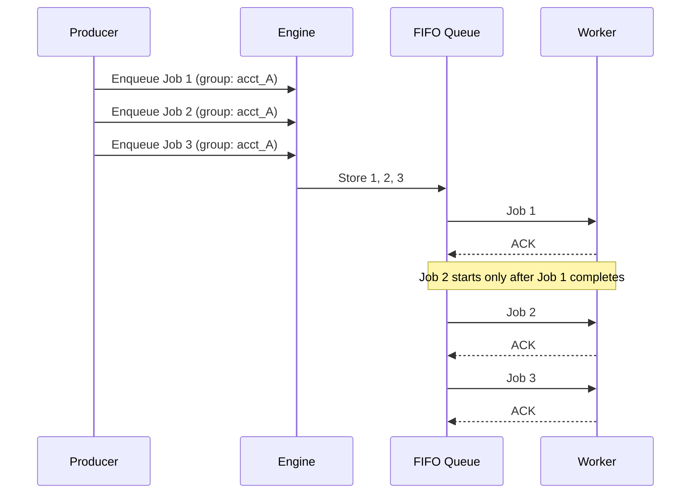
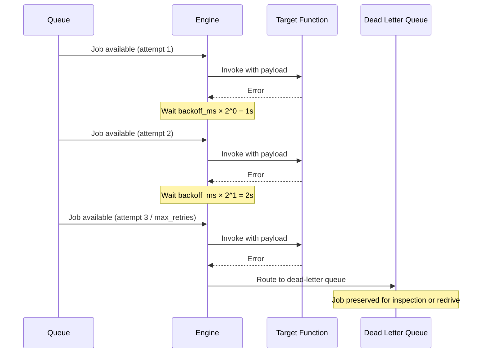
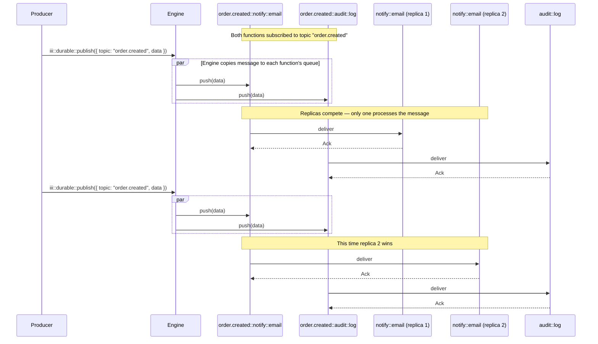

A worker for asynchronous job processing. It supports two modes: **topic-based queues** (register a consumer per topic, emit events) and **named queues** (enqueue function calls via `TriggerAction.Enqueue`, no trigger registration).

```
iii-queue
```

<Info title="How-to guidance">
  For step-by-step instructions, see [Use Topic-Based Queues](../how-to/use-topic-queues) and [Use Named Queues](../how-to/use-named-queues). For DLQ management, see [Manage Failed Triggers](../how-to/dead-letter-queues).
</Info>

## Queue Modes

### Topic-based queues

Register consumers for a topic and emit events to it. Messages are delivered using **fan-out per function**: every distinct function subscribed to a topic receives a copy of each message. When multiple replicas of the same function are running, they compete on a shared per-function queue — only one replica processes each message.

1. **Register a consumer** with `registerTrigger({ type: 'durable:subscriber', function_id: 'my::handler', config: { topic: 'order.created' } })`. This subscribes the handler to that topic.
2. **Emit events** by calling `trigger({ function_id: 'iii::durable::publish', payload: { topic: 'order.created', data: payload } })` or `trigger({ function_id: 'iii::durable::publish', payload: { topic, data }, action: TriggerAction.Void() })` for fire-and-forget. The `iii::durable::publish` function fans out the payload to every subscribed function.
3. **Action on the trigger**: the handler receives the `data` as its input. Optional `queue_config` on the trigger controls per-subscriber retries and concurrency.

The producer knows the topic name; consumers register to receive it. Queue settings can live at the trigger registration site.

<Info title="Fan-out delivery model">
  If functions `A` and `B` both subscribe to topic `order.created`, each message published to that topic is delivered to **both** `A` and `B`. If function `A` has 3 replicas running, only one replica of `A` processes each message — they compete on a shared queue. This gives you pub/sub-style fan-out with the durability and retry guarantees of a queue.
</Info>

### Named queues

Define queues in `iii-config.yaml`, then enqueue function calls directly. No trigger registration needed.

1. **Define queues** in `queue_configs` (see [Configuration](#configuration)).
2. **Enqueue a function call** with `trigger({ function_id: 'orders::process', payload, action: TriggerAction.Enqueue({ queue: 'payment' }) })`. The engine routes the job to the named queue and invokes the function when a worker consumes it.
3. **Action on the trigger**: the target function receives `payload` as its input. Retries, concurrency, and FIFO are configured centrally in `iii-config.yaml`.

The producer targets the function and queue explicitly. Queue configuration is centralized. For a hands-on walkthrough, see [Use Named Queues](../how-to/use-named-queues).

### When to use which

| | Topic-based | Named queues |
|---|---|---|
| **Producer** | Calls `trigger({ function_id: 'iii::durable::publish', payload: { topic, data } })` | Calls `trigger({ function_id, payload, action: TriggerAction.Enqueue({ queue }) })` |
| **Consumer** | Registers `registerTrigger({ type: 'durable:subscriber', config: { topic } })` | No registration — function is the target |
| **Delivery** | Fan-out: each subscribed function gets every message; replicas compete | Single target function per enqueue call |
| **Config** | Optional `queue_config` on trigger | `queue_configs` in `iii-config.yaml` |
| **Use case** | Durable pub/sub with retries and fan-out | Direct function invocation with retries, FIFO, DLQ |

Both modes are valid. Named queues offer config-driven retries, concurrency, and FIFO ordering.

<Info title="Trigger actions">
  Named queues use the `Enqueue` trigger action. For a full comparison of synchronous, Void, and Enqueue invocation modes, see [Trigger Actions](../how-to/trigger-actions).
</Info>

## Sample Configuration

```yaml
- name: iii-queue
  config:
    queue_configs:
      default:
        max_retries: 5
        concurrency: 5
        type: standard
      payment:
        max_retries: 10
        concurrency: 2
        type: fifo
        message_group_field: transaction_id
    adapter:
      name: builtin
      config:
        store_method: file_based
        file_path: ./data/queue_store
```

## Configuration

<ResponseField name="queue_configs" type="map[string, FunctionQueueConfig]" required>
  A map of named queue configurations. Each key is the queue name referenced in `TriggerAction.Enqueue({ queue: 'name' })`. Define a queue named `default` in config for the common case; reference it as `TriggerAction.Enqueue({ queue: 'default' })`.
</ResponseField>

<ResponseField name="adapter" type="Adapter">
  The transport adapter for queue persistence and distribution. Defaults to `builtin` when not specified.
</ResponseField>

## Queue Configuration

Each entry in `queue_configs` defines an independent named queue with its own retry, concurrency, and ordering settings.

<ResponseField name="max_retries" type="u32">
  Maximum delivery attempts before routing the job to the dead-letter queue. Defaults to `3`.
</ResponseField>

<ResponseField name="concurrency" type="u32">
  Maximum number of jobs processed simultaneously from this queue. Defaults to `10`. For FIFO queues, the engine overrides this to `prefetch=1` to guarantee ordering — see the note below.
</ResponseField>

<ResponseField name="type" type="string">
  Delivery mode: `standard` (concurrent, default) or `fifo` (ordered within a message group).
</ResponseField>

<ResponseField name="message_group_field" type="string">
  Required when `type` is `fifo`. The JSON field in the job payload whose value determines the ordering group. Jobs with the same group value are processed strictly in order. The field must be present and non-null in every enqueued payload.
</ResponseField>

<ResponseField name="backoff_ms" type="u64">
  Base retry backoff in milliseconds. Applied with exponential scaling: `backoff_ms × 2^(attempt − 1)`. Defaults to `1000`.
</ResponseField>

<ResponseField name="poll_interval_ms" type="u64">
  Worker poll interval in milliseconds. Defaults to `100`.
</ResponseField>

<Warning title="FIFO and concurrency">
  When `type` is `fifo`, the engine sets `prefetch=1` regardless of the `concurrency` value. This ensures only one job is in-flight at a time, which is required for strict ordering. FIFO queues also retry failed jobs inline (blocking the queue) rather than in parallel.
</Warning>

## Standard vs FIFO Queues

| Dimension | Standard | FIFO |
|-----------|----------|------|
| **Processing model** | Up to `concurrency` jobs in parallel | One job at a time (prefetch=1) |
| **Ordering** | No guarantees — jobs may complete in any order | Strictly ordered within a message group |
| **`message_group_field`** | Not required | Required — must be present and non-null in every payload |
| **Throughput** | High — scales with `concurrency` | Lower — trades throughput for ordering |
| **Use cases** | Email sends, image processing, notifications | Payments, ledger entries, state machines |
| **Retries** | Retried independently, other jobs continue | Retried inline — blocks the queue until success or DLQ |

### Standard queue flow

Jobs are dequeued and processed concurrently. Each job is independent.



### FIFO queue flow

Jobs within the same message group are processed one at a time, strictly in order.



## Adapters

### builtin

Built-in in-process queue. No external dependencies. Suitable for single-instance deployments — messages are not shared across engine instances.

```yaml
name: builtin
config:
  store_method: file_based   # in_memory | file_based
  file_path: ./data/queue_store  # required when store_method is file_based
```

<ResponseField name="store_method" type="string">
  Persistence strategy: `in_memory` (lost on restart) or `file_based` (durable across restarts). Defaults to `in_memory`.
</ResponseField>

<ResponseField name="file_path" type="string">
  Path to the queue store directory. Required when `store_method` is `file_based`.
</ResponseField>

### redis

Uses Redis as the queue backend for topic-based pub/sub. Enables message distribution across multiple engine instances.

<Warning title="Limited named queue support">
  The Redis adapter supports publishing to named queues but does not implement named queue consumption, retries, or dead-letter queues. It is suitable for topic-based pub/sub only. For full named queue support in multi-instance deployments, use the [RabbitMQ adapter](#rabbitmq).
</Warning>

```yaml
name: redis
config:
  redis_url: ${REDIS_URL:redis://localhost:6379}
```

<ResponseField name="redis_url" type="string">
  The URL of the Redis instance to connect to.
</ResponseField>

### rabbitmq

Uses RabbitMQ as the queue backend. Supports durable delivery, retries, and dead-letter queues across multiple engine instances.

The engine owns consumer loops, retry acknowledgement, and backoff logic — RabbitMQ is used as a transport only. Retry uses explicit ack + republish to a retry exchange with an `x-attempt` header, keeping compatibility with both classic and quorum queues.

```yaml
name: rabbitmq
config:
  amqp_url: ${RABBITMQ_URL:amqp://localhost:5672}
```

<ResponseField name="amqp_url" type="string">
  The AMQP URL of the RabbitMQ instance to connect to.
</ResponseField>

#### Queue naming in RabbitMQ

For each named queue defined in `queue_configs`, iii creates the following RabbitMQ resources:

| Resource | Format | Example (`payment`) |
|----------|--------|---------------------|
| Main exchange | `iii.__fn_queue::<name>` | `iii.__fn_queue::payment` |
| Main queue | `iii.__fn_queue::<name>.queue` | `iii.__fn_queue::payment.queue` |
| Retry exchange | `iii.__fn_queue::<name>::retry` | `iii.__fn_queue::payment::retry` |
| Retry queue | `iii.__fn_queue::<name>::retry.queue` | `iii.__fn_queue::payment::retry.queue` |
| DLQ exchange | `iii.__fn_queue::<name>::dlq` | `iii.__fn_queue::payment::dlq` |
| DLQ queue | `iii.__fn_queue::<name>::dlq.queue` | `iii.__fn_queue::payment::dlq.queue` |

<Info title="Why so many resources?">
  Each named queue creates six RabbitMQ objects to support delayed retry and dead-lettering. For the design rationale, see [Queue Architecture](/architecture/queues).
</Info>

#### Topic-based queue naming in RabbitMQ

For topic-based queues, iii uses a **fanout exchange** per topic. Each subscribed function gets its own queue and DLQ bound to the exchange:

| Resource | Format | Example (topic `order.created`, function `notify::email`) |
|----------|--------|-----------------------------------------------------------|
| Fanout exchange | `iii.<topic>.exchange` | `iii.order.created.exchange` |
| Per-function queue | `iii.<topic>.<function_id>.queue` | `iii.order.created.notify::email.queue` |
| Per-function DLQ | `iii.<topic>.<function_id>.dlq` | `iii.order.created.notify::email.dlq` |

RabbitMQ's fanout exchange natively delivers a copy of each published message to every bound queue, providing fan-out delivery.

## Adapter Comparison

| | builtin | rabbitmq | redis |
|---|---|---|---|
| **Retries** | Yes | Yes | No |
| **Dead-letter queue** | Yes | Yes | No |
| **FIFO ordering** | Yes | Yes | No |
| **Named queue consumption** | Yes | Yes | No (publish only) |
| **Topic-based pub/sub** | Yes | Yes | Yes |
| **Multi-instance** | No | Yes | Yes |
| **External dependency** | None | RabbitMQ | Redis |

### Choosing an adapter

| Scenario | Recommended Adapter | Why |
|----------|-------------------|-----|
| Local development | `builtin` (`in_memory`) | Zero dependencies, fast iteration |
| Single-instance production | `builtin` (`file_based`) | Durable across restarts, no external infra |
| Multi-instance production | `rabbitmq` | Distributes messages across engine instances |

Regardless of which adapter you choose, retry semantics, concurrency enforcement, and FIFO ordering behave identically — the engine owns these behaviors, not the adapter.

<Info title="How-to guide">
  For step-by-step queue setup, see [Use Named Queues](../how-to/use-named-queues) and [Use Topic-Based Queues](../how-to/use-topic-queues).
</Info>

## Builtin Functions

The queue worker registers the following functions automatically when it initializes. These are callable via `trigger()` from any SDK or via the `iii trigger` CLI command.

### iii::durable::publish

Publishes a message to a topic-based queue. The message is fanned out to every distinct function subscribed to that topic. Replicas of the same function compete on a shared per-function queue.

| Field | Type | Description |
|-------|------|-------------|
| `topic` | `string` | The topic to publish to (required, non-empty) |
| `data` | `any` | The payload delivered to each subscribed function |

Returns `null` on success.

### iii::queue::redrive

Moves all messages from a named queue's dead-letter queue back to the main queue. Each message gets its attempt counter reset to zero.

**Input:**

| Field | Type | Description |
|-------|------|-------------|
| `queue` | `string` | The named queue whose DLQ should be redriven (required, non-empty) |

**Output:**

| Field | Type | Description |
|-------|------|-------------|
| `queue` | `string` | The queue name that was redriven |
| `redriven` | `number` | The number of messages moved back to the main queue |

**CLI example:**

```bash
iii trigger \
  --function-id='iii::queue::redrive' \
  --payload='{"queue": "payment"}'
```

<Info title="DLQ operations">
  For a complete guide on inspecting DLQ messages before redriving, see [Manage Failed Triggers](../how-to/dead-letter-queues).
</Info>

## Queue Flow

### Retry and dead-letter flow

When a job fails, the engine retries it with exponential backoff. After all retries exhaust, the job moves to the DLQ.



### Topic-based queue flow (fan-out)

When a message is published to a topic, the engine fans it out to every distinct function subscribed to that topic. Replicas of the same function compete on their shared per-function queue.


