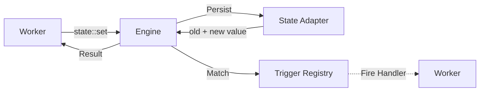
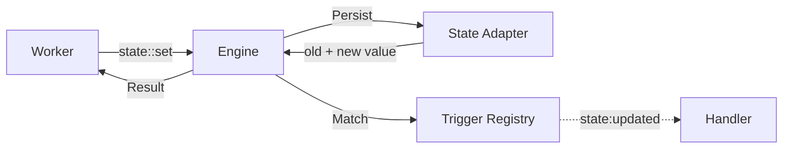

Distributed key-value state storage with scope-based organization and reactive triggers that fire on any state change.

```
iii-state
```

## Architecture



State is server-side key-value storage with trigger-based reactivity. Unlike streams, state does not push updates to WebSocket clients — it fires triggers that workers handle server-side.

## Sample Configuration

```yaml
- name: iii-state
  config:
    adapter:
      name: kv
      config:
        store_method: file_based
        file_path: ./data/state_store
        save_interval_ms: 5000
```

## Configuration

<ResponseField name="adapter" type="Adapter">
  The adapter to use for state persistence and distribution. Defaults to `kv` when not specified.
</ResponseField>

## Adapters

### kv

Built-in key-value store. Supports both in-memory and file-based persistence.

```yaml
name: kv
config:
  store_method: file_based
  file_path: ./data/state_store
  save_interval_ms: 5000
```

#### Configuration

<ResponseField name="store_method" type="string">
  Storage method. Options: `in_memory` (lost on restart) or `file_based` (persisted to disk).
</ResponseField>

<ResponseField name="file_path" type="string">
  Directory path for file-based storage. Each scope is stored as a separate file.
</ResponseField>

<ResponseField name="save_interval_ms" type="number">
  Interval in milliseconds between automatic disk saves. Defaults to `5000`.
</ResponseField>

### redis

Uses Redis as the state backend.

```yaml
name: redis
config:
  redis_url: ${REDIS_URL:redis://localhost:6379}
```

#### Configuration

<ResponseField name="redis_url" type="string">
  The URL of the Redis instance to use.
</ResponseField>

### bridge

Forwards state operations to a remote III Engine instance via the Bridge Client.

```yaml
name: bridge
```

## Functions

<ResponseField name="state::set" type="function">
  Set a value in state. Fires a `state:created` trigger if the key did not exist, or `state:updated` if it did.

  <AccordionGroup>
    <Accordion iconName="settings" title="Parameters">
      <ResponseField name="scope" type="string" required>
        The scope (namespace) to organize state within.
      </ResponseField>
      <ResponseField name="key" type="string" required>
        The key to store the value under.
      </ResponseField>
      <ResponseField name="value" type="any" required>
        The value to store. Can be any JSON-serializable value. Also accepted as `data` (backward-compatible alias).
      </ResponseField>
    </Accordion>
    <Accordion title="Returns">
      <ResponseField name="old_value" type="any">
        The previous value, or `null` if the key did not exist.
      </ResponseField>
      <ResponseField name="new_value" type="any">
        The value that was stored.
      </ResponseField>
    </Accordion>
  </AccordionGroup>
</ResponseField>

<ResponseField name="state::get" type="function">
  Get a value from state.

  <AccordionGroup>
    <Accordion iconName="settings" title="Parameters">
      <ResponseField name="scope" type="string" required>
        The scope to read from.
      </ResponseField>
      <ResponseField name="key" type="string" required>
        The key to retrieve.
      </ResponseField>
    </Accordion>
    <Accordion title="Returns">
      <ResponseField name="value" type="any">
        The stored value, or `null` if the key does not exist.
      </ResponseField>
    </Accordion>
  </AccordionGroup>
</ResponseField>

<ResponseField name="state::delete" type="function">
  Delete a value from state. Fires a `state:deleted` trigger.

  <AccordionGroup>
    <Accordion iconName="settings" title="Parameters">
      <ResponseField name="scope" type="string" required>
        The scope to delete from.
      </ResponseField>
      <ResponseField name="key" type="string" required>
        The key to delete.
      </ResponseField>
    </Accordion>
    <Accordion title="Returns">
      <ResponseField name="value" type="any">
        The deleted value, or `null` if the key did not exist.
      </ResponseField>
    </Accordion>
  </AccordionGroup>
</ResponseField>

<ResponseField name="state::update" type="function">
  Atomically update a value using one or more operations. Fires `state:created` or `state:updated` depending on whether the key existed.

  <AccordionGroup>
    <Accordion iconName="settings" title="Parameters">
      <ResponseField name="scope" type="string" required>
        The scope to update within.
      </ResponseField>
      <ResponseField name="key" type="string" required>
        The key to update.
      </ResponseField>
      <ResponseField name="ops" type="UpdateOp[]" required>
        Array of update operations applied in order. Each operation is a tagged object with a `type` field and a `path`. Use `path: ""` (or omit `path`) to target the root value.

        | Operation | Shape | Description |
        |-----------|-------|-------------|
        | `set` | `{ "type": "set", "path": "status", "value": "active" }` | Set a field or replace the root value. |
        | `merge` | `{ "type": "merge", "path": ["sessions", "abc"], "value": { "ts": "chunk" } }` | Shallow-merge an object at the root or at any nested path. |
        | `increment` | `{ "type": "increment", "path": "count", "by": 1 }` | Add `by` to a numeric field. |
        | `decrement` | `{ "type": "decrement", "path": "count", "by": 1 }` | Subtract `by` from a numeric field. |
        | `append` | `{ "type": "append", "path": ["sessions", "abc", "events"], "value": { "kind": "chunk" } }` | Push one element to an array (or concatenate a string) at the root, a first-level field, or any nested path. |
        | `remove` | `{ "type": "remove", "path": "status" }` | Remove a field from the current object. |

        For `set`, `increment`, `decrement`, and `remove`, paths are first-level field names. For example, `user.name` updates the field named `user.name`; it does not traverse into `{ "user": { "name": ... } }`.

        For `merge` and `append`, `path` accepts either a single string (legacy / first-level field) or an array of literal segments for nested traversal:

        ```json
        // Root merge / append (existing behavior, unchanged).
        { "type": "merge", "path": "", "value": { "status": "active" } }
        { "type": "append", "path": "", "value": "first" }

        // First-level merge / append into the field named "session-abc".
        { "type": "merge", "path": "session-abc", "value": { "author": "alice" } }
        { "type": "append", "path": "events", "value": { "kind": "chunk" } }

        // Nested merge / append: walks the segments, auto-creating
        // missing or non-object intermediates along the way.
        { "type": "merge", "path": ["sessions", "abc"], "value": { "ts": "chunk" } }
        { "type": "append", "path": ["sessions", "abc", "events"], "value": { "kind": "chunk" } }
        ```

        Each array element is a *literal* key. `["a.b"]` writes a single key named `"a.b"`, not `a → b`.

        For root operations (no path), the SDK encoders omit the `path` field from the wire payload entirely (e.g. `{ "type": "append", "value": "first" }`) rather than emitting `"path": null`. Servers accept either form on input — `null`, missing, and empty string all route to the root.

        **Append at a nested missing leaf is always an array.** When `append` walks to a missing leaf at the end of an array-form path, it creates `[value]` regardless of the value's type — including string values, which would be kept as a string under the legacy single-string path's string-concat tier. This is the core fix for [issue #1552](https://github.com/iii-hq/iii/issues/1552).

        **Append walks through array intermediates by replacing them with objects.** When the path traverses an existing non-object intermediate (array, scalar, or null), the engine replaces it with a fresh `{}` and continues — mirroring `merge`'s `walk_or_create` semantics. So `{"a": [1,2,3]}` + `append(["a", "b"], 42)` yields `{"a": {"b": [42]}}` (the prior array at `a` is dropped). Callers that need to preserve the array should pre-check with `state.get` rather than relying on append to error.

        **Note on `append.type_mismatch` for nested paths:** the structured `append.type_mismatch` error for object/scalar leaves shipped in #1555 for the single-string-path case. The nested-path form added here returns the same error code with the same shape, so consumers parsing `errors[]` need no new branches. Callers using `path: ""` or `path: "field"` against array, string, null, or missing-field leaves are unaffected.

        Validation: invalid update inputs are rejected with a structured error in the response's `errors` array. Reasons include path depth > 32 segments, segment > 256 bytes, value depth > 16, > 1024 top-level keys, type mismatches, non-object targets, or any segment / top-level key matching `__proto__` / `constructor` / `prototype`. Successfully applied ops still reflect in `new_value`.
      </ResponseField>
    </Accordion>
    <Accordion title="Returns">
      <ResponseField name="old_value" type="any">
        The value before the operations were applied, or `null` if the key did not exist.
      </ResponseField>
      <ResponseField name="new_value" type="any">
        The value after all operations were applied.
      </ResponseField>
      <ResponseField name="errors" type="UpdateOpError[]">
        Per-op validation errors. Field is omitted when empty. Each entry has `op_index`, `code`, `message`, and an optional `doc_url`.
      </ResponseField>
    </Accordion>
  </AccordionGroup>
</ResponseField>

## Error codes

Each `state::update` op may add an entry to the response `errors` array. Operations are best-effort: successfully applied ops still reflect in `new_value`, and failed ops are skipped.

| Code | Triggered when | Fix |
|------|----------------|-----|
| `set.target_not_object` | `set` tried to write a field while the current value is not an object | Set the root to an object first, or use `path: ""` to replace the root. |
| `append.target_not_object` | `append` used a field path while the current value is not an object | Set the root to an object first, or append at `path: ""`. |
| `append.type_mismatch` | `append` targeted an incompatible existing value, such as appending to a number or appending a non-string to a string | Match the appended value to the existing field type, or initialize the field to an array, string, or null. |
| `increment.target_not_object` | `increment` used a field path while the current value is not an object | Set the root to an object first. |
| `increment.not_number` | `increment` targeted an existing field that is not a number | Initialize the field as a number first, for example with `set` to `0`. |
| `decrement.target_not_object` | `decrement` used a field path while the current value is not an object | Set the root to an object first. |
| `decrement.not_number` | `decrement` targeted an existing field that is not a number | Initialize the field as a number first, for example with `set` to `0`. |
| `remove.target_not_object` | `remove` used a field path while the current value is not an object | Set the root to an object first. Removing a missing field from an object remains silent. |
| `<op>.path.proto_polluted` | A path segment is `__proto__`, `constructor`, or `prototype` | Use a different field name. |
| `<op>.path.segment_too_long` | A path segment is longer than 256 bytes | Shorten the field name or merge path segment. |
| `merge.path.too_deep` | A nested merge path has more than 32 segments | Reduce the nested path depth. |
| `merge.path.empty_segment` | A nested merge path array contains an empty segment | Remove the empty segment. |
| `append.path.too_deep` | A nested append path has more than 32 segments | Reduce the nested path depth. |
| `append.path.empty_segment` | A nested append path array contains an empty segment | Remove the empty segment. |
| `merge.value.not_an_object` | `merge` value is not a JSON object | Pass an object as the merge value. |
| `merge.value.too_deep` | `merge` value has JSON nesting deeper than 16 levels | Flatten the value. |
| `merge.value.too_many_keys` | `merge` value has more than 1024 top-level keys | Split the write into smaller updates. |
| `merge.value.proto_polluted` | A top-level key in the merge value is `__proto__`, `constructor`, or `prototype` | Use a different key name. |

Each error includes `op_index`, `code`, and `message`; `doc_url` is optional.

```json
{
  "old_value": { "name": "Ada" },
  "new_value": { "name": "Ada" },
  "errors": [
    {
      "op_index": 0,
      "code": "increment.not_number",
      "message": "Expected number at path 'name', got string.",
      "doc_url": "https://iii.dev/docs/workers/iii-state#error-codes"
    }
  ]
}
```

```json
{
  "old_value": {},
  "new_value": {},
  "errors": [
    {
      "op_index": 0,
      "code": "set.path.proto_polluted",
      "message": "Path segment '__proto__' is not allowed (prototype pollution).",
      "doc_url": "https://iii.dev/docs/workers/iii-state#error-codes"
    }
  ]
}
```

<ResponseField name="state::list" type="function">
  List all values within a scope.

  <AccordionGroup>
    <Accordion iconName="settings" title="Parameters">
      <ResponseField name="scope" type="string" required>
        The scope to list entries from.
      </ResponseField>
    </Accordion>
    <Accordion title="Returns">
      A flat JSON array of all stored values within the scope: `any[]`.
    </Accordion>
  </AccordionGroup>
</ResponseField>

<ResponseField name="state::list_groups" type="function">
  List all scopes that contain state data.

  <AccordionGroup>
    <Accordion title="Returns">
      An object with a single `groups` field:
      <ResponseField name="groups" type="string[]">
        A sorted, deduplicated array of all scope names that contain at least one key.
      </ResponseField>
    </Accordion>
  </AccordionGroup>
</ResponseField>

## Trigger Type

This worker adds a new Trigger Type: `state`.

When a state value is created, updated, or deleted, all registered `state` triggers are evaluated and fired if they match.

<Expandable title="Trigger Config">
  <ResponseField name="scope" type="string">
    Only fire for state changes within this scope. When omitted, fires for all scopes.
  </ResponseField>
  <ResponseField name="key" type="string">
    Only fire for state changes to this specific key. When omitted, fires for all keys.
  </ResponseField>
  <ResponseField name="condition_function_id" type="string">
    Function ID for conditional execution. The engine invokes it with the state event; if it returns `false`, the handler function is not called.
  </ResponseField>
</Expandable>

### State Event Payload

When the trigger fires, the handler receives a state event object:

<ResponseField name="type" type="string">
  Always `"state"`.
</ResponseField>

<ResponseField name="event_type" type="string">
  The kind of change: `"state:created"`, `"state:updated"`, or `"state:deleted"`.
</ResponseField>

<ResponseField name="scope" type="string">
  The scope where the change occurred.
</ResponseField>

<ResponseField name="key" type="string">
  The key that changed.
</ResponseField>

<ResponseField name="old_value" type="any">
  The previous value before the change, or `null` for newly created keys.
</ResponseField>

<ResponseField name="new_value" type="any">
  The new value after the change. `null` for deleted keys.
</ResponseField>

### Sample Code

<Tabs>
<Tab title="Node / TypeScript">
```typescript
const fn = iii.registerFunction(
  { id: 'state::onUserUpdated' },
  async (event) => {
    console.log('State changed:', event.event_type, event.key)
    console.log('Previous:', event.old_value)
    console.log('Current:', event.new_value)
    return {}
  },
)

iii.registerTrigger({
  type: 'state',
  function_id: fn.id,
  config: { scope: 'users', key: 'profile' },
})
```
</Tab>
<Tab title="Python">
```python
def on_user_updated(event):
    print('State changed:', event['event_type'], event['key'])
    print('Previous:', event.get('old_value'))
    print('Current:', event.get('new_value'))
    return {}

iii.register_function("state::onUserUpdated", on_user_updated)
iii.register_trigger({'type': 'state', 'function_id': 'state::onUserUpdated', 'config': {'scope': 'users', 'key': 'profile'}})
```
</Tab>
<Tab title="Rust">
```rust
use iii_sdk::RegisterFunctionMessage;

iii.register_function(
    RegisterFunctionMessage::with_id("state::onUserUpdated".into()),
    |event| async move {
        println!("State changed: {} {}", event["event_type"], event["key"]);
        println!("Previous: {:?}", event.get("old_value"));
        println!("Current: {:?}", event.get("new_value"));
        Ok(json!({}))
    },
);

iii.register_trigger(RegisterTriggerInput {
    trigger_type: "state".into(),
    function_id: "state::onUserUpdated".into(),
    config: json!({
        "scope": "users",
        "key": "profile"
    }),
    metadata: None,
})?;
```
</Tab>
</Tabs>

### Usage Example: User Profile with Reactive Sync

Store user profiles in state and react when they change:

<Tabs>
<Tab title="Node / TypeScript">
```typescript
await iii.trigger({
  function_id: 'state::set',
  payload: {
    scope: 'users',
    key: 'user-123',
    value: { name: 'Alice', email: 'alice@example.com', preferences: { theme: 'dark' } },
  },
  action: TriggerAction.Void(),
})

const profile = await iii.trigger({
  function_id: 'state::get',
  payload: { scope: 'users', key: 'user-123' },
})

await iii.trigger({
  function_id: 'state::set',
  payload: {
    scope: 'users',
    key: 'user-123',
    value: { name: 'Alice', email: 'alice@example.com', preferences: { theme: 'light' } },
  },
  action: TriggerAction.Void(),
})

const allUsers = await iii.trigger({
  function_id: 'state::list',
  payload: { scope: 'users' },
})
const scopes = await iii.trigger({
  function_id: 'state::list_groups',
  payload: {},
})
```
</Tab>
<Tab title="Python">
```python
iii.trigger({
    'function_id': 'state::set',
    'payload': {
        'scope': 'users',
        'key': 'user-123',
        'value': {'name': 'Alice', 'email': 'alice@example.com', 'preferences': {'theme': 'dark'}},
    },
    'action': {'type': 'void'},
})

profile = iii.trigger({
    'function_id': 'state::get',
    'payload': {'scope': 'users', 'key': 'user-123'},
})

iii.trigger({
    'function_id': 'state::set',
    'payload': {
        'scope': 'users',
        'key': 'user-123',
        'value': {'name': 'Alice', 'email': 'alice@example.com', 'preferences': {'theme': 'light'}},
    },
    'action': {'type': 'void'},
})

all_users = iii.trigger({
    'function_id': 'state::list',
    'payload': {'scope': 'users'},
})
scopes = iii.trigger({
    'function_id': 'state::list_groups',
    'payload': {},
})
```
</Tab>
<Tab title="Rust">
```rust
use iii_sdk::{TriggerRequest, TriggerAction};
use serde_json::json;

iii.trigger(TriggerRequest {
    function_id: "state::set".into(),
    payload: json!({
        "scope": "users",
        "key": "user-123",
        "value": { "name": "Alice", "email": "alice@example.com", "preferences": { "theme": "dark" } }
    }),
    action: Some(TriggerAction::Void),
    timeout_ms: None,
}).await?;

let profile = iii.trigger(TriggerRequest {
    function_id: "state::get".into(),
    payload: json!({ "scope": "users", "key": "user-123" }),
    action: None,
    timeout_ms: None,
}).await?;

iii.trigger(TriggerRequest {
    function_id: "state::set".into(),
    payload: json!({
        "scope": "users",
        "key": "user-123",
        "value": { "name": "Alice", "email": "alice@example.com", "preferences": { "theme": "light" } }
    }),
    action: Some(TriggerAction::Void),
    timeout_ms: None,
}).await?;

let all_users = iii.trigger(TriggerRequest {
    function_id: "state::list".into(),
    payload: json!({ "scope": "users" }),
    action: None,
    timeout_ms: None,
}).await?;

let scopes = iii.trigger(TriggerRequest {
    function_id: "state::list_groups".into(),
    payload: json!({}),
    action: None,
    timeout_ms: None,
}).await?;
```
</Tab>
</Tabs>

### Usage Example: Conditional Trigger

Only process profile updates when the email field changed:

<Tabs>
<Tab title="Node / TypeScript">
```typescript
const conditionFn = iii.registerFunction(
  { id: 'conditions::emailChanged' },
  async (event) =>
    event.event_type === 'state:updated' &&
    event.old_value?.email !== event.new_value?.email,
)

const fn = iii.registerFunction('state::onEmailChange', async (event) => {
  await sendVerificationEmail(event.new_value.email)
  return {}
})

iii.registerTrigger({
  type: 'state',
  function_id: fn.id,
  config: {
    scope: 'users',
    key: 'profile',
    condition_function_id: conditionFn.id,
  },
})
```
</Tab>
<Tab title="Python">
```python
def email_changed(event):
    if event.get('event_type') != 'state:updated':
        return False
    old = event.get('old_value', {})
    new = event.get('new_value', {})
    return old.get('email') != new.get('email')

iii.register_function("conditions::emailChanged", email_changed)

def on_email_change(event):
    send_verification_email(event['new_value']['email'])
    return {}

iii.register_function("state::onEmailChange", on_email_change)
iii.register_trigger({
    'type': 'state',
    'function_id': 'state::onEmailChange',
    'config': {
        'scope': 'users',
        'key': 'profile',
        'condition_function_id': 'conditions::emailChanged',
    },
})
```
</Tab>
<Tab title="Rust">
```rust
use iii_sdk::{RegisterFunctionMessage, RegisterTriggerInput};
use serde_json::json;

iii.register_function(
    RegisterFunctionMessage::with_id("conditions::emailChanged".into()),
    |event| async move {
        let is_update = event["event_type"].as_str() == Some("state:updated");
        let old_email = event.get("old_value").and_then(|v| v.get("email"));
        let new_email = event.get("new_value").and_then(|v| v.get("email"));
        Ok(json!(is_update && old_email != new_email))
    },
);

iii.register_function(
    RegisterFunctionMessage::with_id("state::onEmailChange".into()),
    |event| async move {
        let email = event["new_value"]["email"].as_str().unwrap_or("");
        send_verification_email(email).await?;
        Ok(json!({}))
    },
);

iii.register_trigger(RegisterTriggerInput {
    trigger_type: "state".into(),
    function_id: "state::onEmailChange".into(),
    config: json!({
        "scope": "users",
        "key": "profile",
        "condition_function_id": "conditions::emailChanged"
    }),
    metadata: None,
})?;
```
</Tab>
</Tabs>

## State Flow


