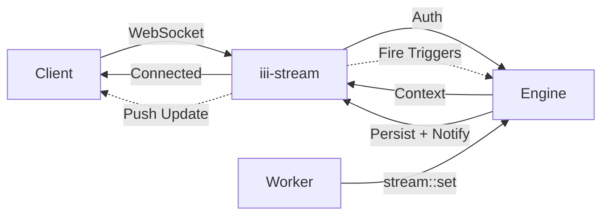

Durable streams for real-time data subscriptions.

```
iii-stream
```

## Architecture



## Data Flow

When a worker triggers `stream::set`, the engine:

1. Persists the data via the configured adapter (Redis or KvStore)
2. Publishes a notification to all WebSocket clients subscribed to that stream and group
3. Evaluates registered `stream` triggers and fires matching handlers

A single `stream::set` handles persistence, real-time delivery, and reactive logic in one operation.

## Groups

Streams organize data hierarchically: `stream_name` > `group_id` > `item_id`.

- **stream_name** identifies the top-level stream (e.g. `chat`, `presence`, `dashboard`)
- **group_id** partitions data within a stream (e.g. `room-1`, `team-alpha`)
- **item_id** uniquely identifies a record within a group (e.g. `user-123`, `msg-456`)

Clients subscribe at the group level by connecting to `ws://host:port/stream/{stream_name}/{group_id}/`. They receive all item-level changes within that group.

## Sample Configuration

```yaml
- name: iii-stream
  config:
    port: ${STREAM_PORT:3112}
    host: 0.0.0.0
    adapter:
      name: redis
      config:
        redis_url: ${REDIS_URL:redis://localhost:6379}
```

## Configuration

<ResponseField name="port" type="number">
  The port to listen on. Defaults to `3112`.
</ResponseField>

<ResponseField name="host" type="string">
  The host to listen on. Defaults to `0.0.0.0`.
</ResponseField>

<ResponseField name="auth_function" type="string">
  The authentication function to use. It's a path to a function that will be used to authenticate the client. You can
  register the function using the iii SDK and then use the path to the function here.
</ResponseField>

<ResponseField name="adapter" type="Adapter">
  The adapter to use. It's the adapter that will be used to store the streams. You can register the adapter using the
  iii SDK and then use the path to the adapter here.
</ResponseField>

## Adapters

### redis

Uses Redis as the backend for the streams. Stores stream data in Redis and leverages Redis Pub/Sub for real-time event delivery.

```yaml
name: redis
config:
  redis_url: ${REDIS_URL:redis://localhost:6379}
```

#### Configuration

<ResponseField name="redis_url" type="string">
  The URL of the Redis instance to use.
</ResponseField>

### kv

Built-in key-value store. Supports in-memory or file-based persistence. No external dependencies required.

```yaml
name: kv
config:
  store_method: file_based
  file_path: ./data/streams_store.db
```

#### Configuration

<ResponseField name="store_method" type="string">
  Storage method. Options: `in_memory` (lost on restart) or `file_based` (persisted to disk).
</ResponseField>

<ResponseField name="file_path" type="string">
  Directory path for file-based storage. Each stream is stored as a separate file.
</ResponseField>
## Functions

<ResponseField name="stream::set" type="function">
  Sets a value in the stream.

  <AccordionGroup>
    <Accordion iconName="settings" title="Parameters">
      <ResponseField name="stream_name" type="string" required>
        The ID of the stream to set the value in.
      </ResponseField>
      <ResponseField name="group_id" type="string" required>
        The group ID of the stream to set the value in.
      </ResponseField>
      <ResponseField name="item_id" type="string" required>
        The item ID of the stream to set the value in.
      </ResponseField>
      <ResponseField name="data" type="any" required>
        The value to set in the stream.
      </ResponseField>
    </Accordion>
    <Accordion title="Returns">
      <ResponseField name="old_value" type="any">
        The previous value, or `null` if the item was newly created.
      </ResponseField>
      <ResponseField name="new_value" type="any" required>
        The value now stored in the stream.
      </ResponseField>
    </Accordion>
  </AccordionGroup>
</ResponseField>

<ResponseField name="stream::get" type="function">
  Gets a value from the stream.

{' '}

<AccordionGroup>
  <Accordion title="Parameters">
    <ResponseField name="stream_name" type="string" required>
      The ID of the stream to retrieve the value from.
    </ResponseField>
    <ResponseField name="group_id" type="string" required>
      The group ID in the stream to retrieve the value from.
    </ResponseField>
    <ResponseField name="item_id" type="string" required>
      The item ID in the stream to retrieve.
    </ResponseField>
  </Accordion>
  <Accordion title="Returns">
    <ResponseField name="value" type="any" required>
      The value retrieved from the stream.
    </ResponseField>
  </Accordion>
</AccordionGroup>

</ResponseField>

<ResponseField name="stream::delete" type="function">
  Deletes a value from the stream.

  <AccordionGroup>
    <Accordion iconName="settings" title="Parameters">
      <ResponseField name="stream_name" type="string" required>
        The ID of the stream to delete the value from.
      </ResponseField>
      <ResponseField name="group_id" type="string" required>
        The group ID in the stream to delete the value from.
      </ResponseField>
      <ResponseField name="item_id" type="string" required>
        The item ID in the stream to delete.
      </ResponseField>
    </Accordion>
    <Accordion title="Returns">
      <ResponseField name="old_value" type="any">
        The value that was deleted, or `null` if the item did not exist.
      </ResponseField>
    </Accordion>
  </AccordionGroup>
</ResponseField>

<ResponseField name="stream::list" type="function">
  Retrieves a group from the stream. This function will return all the items in the group.
  <AccordionGroup>
    <Accordion iconName="settings" title="Parameters">
      <ResponseField name="stream_name" type="string" required>
        The ID of the stream to retrieve the group from.
      </ResponseField>
      <ResponseField name="group_id" type="string" required>
        The group ID in the stream to retrieve the group from.
      </ResponseField>
    </Accordion>
    <Accordion title="Returns">
      <ResponseField name="group" type="any[]" required>
        The group retrieved from the stream. It's an array of items in the group.
      </ResponseField>
    </Accordion>
  </AccordionGroup>
</ResponseField>

<ResponseField name="stream::list_groups" type="function">
  List all groups in a stream.

  <AccordionGroup>
    <Accordion iconName="settings" title="Parameters">
      <ResponseField name="stream_name" type="string" required>
        The ID of the stream to list groups from.
      </ResponseField>
    </Accordion>
    <Accordion title="Returns">
      <ResponseField name="groups" type="string[]" required>
        An array of group IDs in the stream.
      </ResponseField>
    </Accordion>
  </AccordionGroup>
</ResponseField>

<ResponseField name="stream::list_all" type="function">
  List all streams with their group metadata.

  <AccordionGroup>
    <Accordion iconName="settings" title="Parameters">
      This function takes no parameters.
    </Accordion>
    <Accordion title="Returns">
      <ResponseField name="stream" type="object[]" required>
        An array of stream metadata objects. Each object has an `id` (string) and a `groups` (string[]) field.
      </ResponseField>
      <ResponseField name="count" type="number" required>
        The total number of streams.
      </ResponseField>
    </Accordion>
  </AccordionGroup>
</ResponseField>

<ResponseField name="stream::send" type="function">
  Send a custom event to all subscribers of a stream group.

  <AccordionGroup>
    <Accordion iconName="settings" title="Parameters">
      <ResponseField name="stream_name" type="string" required>
        The ID of the stream to send the event to.
      </ResponseField>
      <ResponseField name="group_id" type="string" required>
        The group ID in the stream to send the event to.
      </ResponseField>
      <ResponseField name="type" type="string" required>
        The event type string delivered to subscribers.
      </ResponseField>
      <ResponseField name="id" type="string">
        Optional item ID to associate the event with.
      </ResponseField>
      <ResponseField name="data" type="any" required>
        The event payload delivered to subscribers.
      </ResponseField>
    </Accordion>
    <Accordion title="Returns">
      <ResponseField name="result" type="null">
        Returns `null` on success.
      </ResponseField>
    </Accordion>
  </AccordionGroup>
</ResponseField>

<ResponseField name="stream::update" type="function">
  Atomically update an item in the stream using a list of operations.

  <AccordionGroup>
    <Accordion iconName="settings" title="Parameters">
      <ResponseField name="stream_name" type="string" required>
        The ID of the stream containing the item to update.
      </ResponseField>
      <ResponseField name="group_id" type="string" required>
        The group ID in the stream containing the item to update.
      </ResponseField>
      <ResponseField name="item_id" type="string" required>
        The item ID in the stream to update.
      </ResponseField>
      <ResponseField name="ops" type="UpdateOp[]" required>
        The list of atomic operations to apply. Each operation is a tagged object with a `type` field (`set`, `merge`, `increment`, `decrement`, `append`, or `remove`) and associated fields (`path`, `value`, `by`). For `set` / `increment` / `decrement` / `append` / `remove`, paths are first-level field names. For `merge`, `path` accepts either a single string (legacy / first-level field) or an array of literal segments for nested merge — see the [state worker docs](/workers/iii-state) for the full contract and validation rules. Use `path: ""` (or omit `path`) to target the root value.
      </ResponseField>
    </Accordion>
    <Accordion title="Returns">
      <ResponseField name="old_value" type="any">
        The previous value, or `null` if the item was newly created.
      </ResponseField>
      <ResponseField name="new_value" type="any" required>
        The value now stored in the stream after applying the operations.
      </ResponseField>
      <ResponseField name="errors" type="UpdateOpError[]">
        Per-op validation errors. Currently emitted only by `merge` for inputs that violate validation bounds. Field is omitted when empty.
      </ResponseField>
    </Accordion>
  </AccordionGroup>
</ResponseField>

## Authentication

It's possible to implement a function to handle authentication.

1. Define a function to handle the authentication. It received one single argument with the request data.

<Expandable title="StreamAuthInput">
  <ResponseField name="headers" type="Record&lt;string, string&gt;" required>
    The HTTP headers sent with the request.
  </ResponseField>
  <ResponseField name="path" type="string" required>
    The request path.
  </ResponseField>
  <ResponseField name="query_params" type="Record&lt;string, string[]&gt;" required>
    Query parameters in the request, as a map from key to array of string values.
  </ResponseField>
  <ResponseField name="addr" type="string" required>
    The remote address (IP) of the request.
  </ResponseField>
</Expandable>

<Tabs>
<Tab title="Node / TypeScript">
```typescript
iii.registerFunction('onAuth', (input) => ({
  context: { name: 'John Doe' },
}))
```
</Tab>
<Tab title="Python">
```python
def on_auth(input):
    return {'context': {'name': 'John Doe'}}

iii.register_function("onAuth", on_auth)
```
</Tab>
<Tab title="Rust">
```rust
iii.register_function((RegisterFunctionMessage::with_id("onAuth".into()), |_input| async move {
    Ok(json!({ "context": { "name": "John Doe" } }))
}));

```
</Tab>
</Tabs>

2. Make sure you add the function to the configuration file.

```yaml
- name: iii-stream
  config:
    auth_function: onAuth
```

3. Now whenever someone opens a websocket connection, the function `onAuth` will be called with the request data.

## Trigger Types

This worker adds three trigger types: `stream` (item changes), `stream:join` (WebSocket connect), and `stream:leave` (WebSocket disconnect).

### stream:join and stream:leave

Fire when a client connects or disconnects via WebSocket. Both trigger types deliver the same payload to the handler:

<ResponseField name="subscription_id" type="string" required>
  The subscription ID, used for uniqueness and logging.
</ResponseField>
<ResponseField name="stream_name" type="string" required>
  The stream name of the subscription.
</ResponseField>
<ResponseField name="group_id" type="string" required>
  The group ID of the subscription.
</ResponseField>
<ResponseField name="id" type="string">
  The item ID of the subscription, if provided by the client.
</ResponseField>
<ResponseField name="context" type="object">
  The context generated by the authentication layer.
</ResponseField>

<Tabs>
<Tab title="Node / TypeScript">
```typescript
import { StreamJoinLeaveEvent } from 'iii-sdk/stream'

const fn = iii.registerFunction('onJoin', (input: StreamJoinLeaveEvent) => {
  console.log(`Joined ${input.stream_name}/${input.group_id}`, input.context)
  return {}
})

iii.registerTrigger({
  type: 'stream:join',
  function_id: fn.id,
  config: {},
})
```
</Tab>
<Tab title="Python">
```python
from iii import StreamJoinLeaveEvent

def on_join(input: StreamJoinLeaveEvent):
    print(f"Joined {input.stream_name}/{input.group_id}", input.context)
    return {}

iii.register_function("onJoin", on_join)
iii.register_trigger({'type': 'stream:join', 'function_id': 'onJoin', 'config': {}})
```
</Tab>
<Tab title="Rust">
```rust
use iii_sdk::{IIITrigger, StreamJoinLeaveCallRequest, StreamJoinLeaveTriggerConfig};

iii.register_function((RegisterFunctionMessage::with_id("onJoin".into()), |input| async move {
    let event: StreamJoinLeaveCallRequest = serde_json::from_value(input)?;
    println!("Joined {}/{}", event.stream_name, event.group_id);
    Ok(json!({}))
});

iii.register_trigger(
    IIITrigger::StreamJoin(StreamJoinLeaveTriggerConfig::new()).for_function("onJoin"),
)?;
```
</Tab>
</Tabs>

### stream

Fires when an item changes in the stream (via `stream::set`, `stream::update`, or `stream::delete`). Register with a config object to filter which stream, group, or item triggers the handler:

<ResponseField name="stream_name" type="string" required>
  The stream name to watch. Only changes on this stream fire the handler.
</ResponseField>
<ResponseField name="group_id" type="string">
  If set, only changes within this group fire the handler.
</ResponseField>
<ResponseField name="item_id" type="string">
  If set, only changes to this specific item fire the handler.
</ResponseField>
<ResponseField name="condition_function_id" type="string">
  Function ID for conditional execution. The engine invokes it with the event payload; if it returns `false`, the handler function is not called.
</ResponseField>

The handler receives a payload with the following shape:

<ResponseField name="type" type="string" required>
  The event type: `create`, `update`, or `delete`.
</ResponseField>
<ResponseField name="timestamp" type="number" required>
  Unix timestamp of the event.
</ResponseField>
<ResponseField name="streamName" type="string" required>
  The stream where the change occurred.
</ResponseField>
<ResponseField name="groupId" type="string" required>
  The group where the change occurred.
</ResponseField>
<ResponseField name="id" type="string">
  The item ID that changed.
</ResponseField>
<ResponseField name="event" type="object" required>
  The event detail object containing `type` and `data` fields.
</ResponseField>

<Tabs>
<Tab title="Node / TypeScript">
```typescript
import { StreamChangeEvent } from 'iii-sdk/stream'

const fn = iii.registerFunction('onChatMessage', (input: StreamChangeEvent) => {
  console.log(`[${input.event.type}] ${input.streamName}/${input.groupId}/${input.id}`, input.event.data)
  return {}
})

iii.registerTrigger({
  type: 'stream',
  function_id: fn.id,
  config: { stream_name: 'chat' },
})
```
</Tab>
<Tab title="Python">
```python
from iii import StreamChangeEvent

def on_chat_message(input: StreamChangeEvent):
    print(f"[{input.event.type}] {input.streamName}/{input.groupId}/{input.id}", input.event.data)
    return {}

iii.register_function("onChatMessage", on_chat_message)
iii.register_trigger({
    'type': 'stream',
    'function_id': 'onChatMessage',
    'config': {'stream_name': 'chat'},
})
```
</Tab>
<Tab title="Rust">
```rust
use iii_sdk::{IIITrigger, StreamCallRequest, StreamEventType, StreamTriggerConfig};

iii.register_function((RegisterFunctionMessage::with_id("onChatMessage".into()), |input| async move {
    let event: StreamCallRequest = serde_json::from_value(input)?;
    println!("[{:?}] {}/{}/{}: {:?}", event.event.event_type, event.stream_name, event.group_id, event.id.as_deref().unwrap_or(""), event.event.data);
    Ok(json!({}))
});

iii.register_trigger(
    IIITrigger::Stream(StreamTriggerConfig::new().stream_name("chat")).for_function("onChatMessage"),
)?;
```
</Tab>
</Tabs>

### Usage Example: Real-Time Presence

Streams organize data by `stream_name`, `group_id`, and `item_id`. Use for live presence, collaborative docs, or dashboards:

<Tabs>
<Tab title="Node / TypeScript">
```typescript
import { registerWorker, TriggerAction } from 'iii-sdk'

const iii = registerWorker('ws://localhost:49134')

iii.trigger({
  function_id: 'stream::set',
  payload: {
    stream_name: 'presence',
    group_id: 'room-1',
    item_id: 'user-123',
    data: { name: 'Alice', online: true, lastSeen: new Date().toISOString() },
  },
  action: TriggerAction.Void(),
})

const user = await iii.trigger({
  function_id: 'stream::get',
  payload: {
    stream_name: 'presence',
    group_id: 'room-1',
    item_id: 'user-123',
  },
})

const roomMembers = await iii.trigger({
  function_id: 'stream::list',
  payload: {
    stream_name: 'presence',
    group_id: 'room-1',
  },
})

iii.trigger({
  function_id: 'stream::delete',
  payload: {
    stream_name: 'presence',
    group_id: 'room-1',
    item_id: 'user-123',
  },
  action: TriggerAction.Void(),
})
```
</Tab>
<Tab title="Python">
```python
from iii import register_worker, TriggerAction

iii = register_worker('ws://localhost:49134')

iii.trigger({
    'function_id': 'stream::set',
    'payload': {
        'stream_name': 'presence',
        'group_id': 'room-1',
        'item_id': 'user-123',
        'data': {'name': 'Alice', 'online': True, 'lastSeen': '2026-01-01T00:00:00Z'},
    },
    'action': TriggerAction.Void(),
})

user = iii.trigger({
    'function_id': 'stream::get',
    'payload': {
        'stream_name': 'presence',
        'group_id': 'room-1',
        'item_id': 'user-123',
    },
})

room_members = iii.trigger({
    'function_id': 'stream::list',
    'payload': {
        'stream_name': 'presence',
        'group_id': 'room-1',
    },
})

iii.trigger({
    'function_id': 'stream::delete',
    'payload': {
        'stream_name': 'presence',
        'group_id': 'room-1',
        'item_id': 'user-123',
    },
    'action': TriggerAction.Void(),
})
```
</Tab>
<Tab title="Rust">
```rust
use iii_sdk::{register_worker, InitOptions, TriggerRequest, TriggerAction};
use serde_json::json;

let iii = register_worker("ws://localhost:49134", InitOptions::default());

iii.trigger(TriggerRequest::new("stream::set", json!({
    "stream_name": "presence",
    "group_id": "room-1",
    "item_id": "user-123",
    "data": { "name": "Alice", "online": true }
})).action(TriggerAction::void())).await?;

let user = iii.trigger(TriggerRequest::new("stream::get", json!({
    "stream_name": "presence",
    "group_id": "room-1",
    "item_id": "user-123"
}))).await?;

let room_members = iii.trigger(TriggerRequest::new("stream::list", json!({
    "stream_name": "presence",
    "group_id": "room-1"
}))).await?;

iii.trigger(TriggerRequest::new("stream::delete", json!({
    "stream_name": "presence",
    "group_id": "room-1",
    "item_id": "user-123"
})).action(TriggerAction::void())).await?;
```
</Tab>
</Tabs>

Clients connect via WebSocket to `ws://host:3112/stream/presence/room-1/` and receive real-time updates when items change.

### Usage Example: Join with Auth Context

Configure the stream worker with an auth function:

```yaml
- name: iii-stream
  config:
    port: 3112
    host: 0.0.0.0
    auth_function: stream::auth
    adapter:
      name: kv
      config:
        store_method: file_based
        file_path: ./data/stream_store
```

Register the auth function. Clients may send the token via `Authorization: Bearer <token>` (Node.js) or `Sec-WebSocket-Protocol: Authorization,<token>` (browser stream-client):

<Tabs>
<Tab title="Node / TypeScript">
```typescript
iii.registerFunction('stream::auth', (input) => {
  const auth = input.headers?.['authorization']?.replace(/^Bearer\s+/i, '')
  const proto = input.headers?.['sec-websocket-protocol']
  const token = auth ?? (proto?.startsWith('Authorization,') ? proto.slice(13) : null)
  return token ? { context: { userId: 'user-from-token' } } : { context: null }
})
```
</Tab>
<Tab title="Python">
```python
def stream_auth(input):
    auth = input.get('headers', {}).get('authorization', '')
    token = auth.replace('Bearer ', '', 1) if auth.startswith('Bearer ') else None
    if token:
        return {'context': {'userId': 'user-from-token'}}
    return {'context': None}

iii.register_function("stream::auth", stream_auth)
```
</Tab>
<Tab title="Rust">
```rust
iii.register_function((RegisterFunctionMessage::with_id("stream::auth".into()), |input| async move {
    let headers = input.get("headers").and_then(|h| h.as_object()));

    let token = headers
        .and_then(|h| h.get("authorization"))
        .and_then(|v| v.as_str())
        .and_then(|s| s.strip_prefix("Bearer "));

    match token {
        Some(_) => Ok(json!({ "context": { "userId": "user-from-token" } })),
        None => Ok(json!({ "context": null })),
    }
});
```
</Tab>
</Tabs>

Join/leave triggers receive the auth `context`:

<Tabs>
<Tab title="Node / TypeScript">
```typescript
import { StreamJoinLeaveEvent } from 'iii-sdk/stream'

const fn = iii.registerFunction('onJoin', (input: StreamJoinLeaveEvent) => {
  if (input.context?.userId) {
    console.log(`User ${input.context.userId} joined ${input.stream_name}/${input.group_id}/${input.id}`)
  }
  return {}
})

iii.registerTrigger({
  type: 'stream:join',
  function_id: fn.id,
  config: {},
})
```
</Tab>
<Tab title="Python">
```python
from iii import StreamJoinLeaveEvent

def on_join(input: StreamJoinLeaveEvent):
    if input.context and input.context.get('userId'):
        print(f"User {input.context['userId']} joined {input.stream_name}/{input.group_id}/{input.id}")
    return {}

iii.register_function("onJoin", on_join)
iii.register_trigger({'type': 'stream:join', 'function_id': 'onJoin', 'config': {}})
```
</Tab>
<Tab title="Rust">
```rust
use iii_sdk::{IIITrigger, StreamJoinLeaveCallRequest, StreamJoinLeaveTriggerConfig};

iii.register_function((RegisterFunctionMessage::with_id("onJoin".into()), |input| async move {
    let event: StreamJoinLeaveCallRequest = serde_json::from_value(input)?;
    if let Some(user_id) = event.context.as_ref().and_then(|c| c.get("userId")).and_then(|u| u.as_str()) {
        println!("User {} joined {}/{}/{}", user_id, event.stream_name, event.group_id, event.id.as_deref().unwrap_or(""));
    }
    Ok(json!({}))
});

iii.register_trigger(
    IIITrigger::StreamJoin(StreamJoinLeaveTriggerConfig::new()).for_function("onJoin"),
)?;
```
</Tab>
</Tabs>

### Usage Example: Conditional Join

<Tabs>
<Tab title="Node / TypeScript">
```typescript
import { StreamJoinLeaveEvent } from 'iii-sdk/stream'

const conditionFn = iii.registerFunction(
  { id: 'conditions::requireContext' },
  async (input: StreamJoinLeaveEvent) => input.context?.userId != null,
)

const fn = iii.registerFunction('onJoin', (input: StreamJoinLeaveEvent) => {
  console.log('User joined:', input.context?.userId, input.stream_name)
  return {}
})

iii.registerTrigger({
  type: 'stream:join',
  function_id: fn.id,
  config: { condition_function_id: conditionFn.id },
})
```
</Tab>
<Tab title="Python">
```python
from iii import StreamJoinLeaveEvent

def require_context(input: StreamJoinLeaveEvent):
    return input.context is not None and input.context.get('userId') is not None

iii.register_function("conditions::requireContext", require_context)

def on_join(input: StreamJoinLeaveEvent):
    print('User joined:', input.context.get('userId') if input.context else None, input.stream_name)
    return {}

iii.register_function("onJoin", on_join)
iii.register_trigger({
    'type': 'stream:join',
    'function_id': 'onJoin',
    'config': {'condition_function_id': 'conditions::requireContext'},
})
```
</Tab>
<Tab title="Rust">
```rust
use iii_sdk::{IIITrigger, StreamJoinLeaveCallRequest, StreamJoinLeaveTriggerConfig};

iii.register_function((RegisterFunctionMessage::with_id("conditions::requireContext".into()), |input| async move {
    let event: StreamJoinLeaveCallRequest = serde_json::from_value(input)?;
    let has_user = event.context
        .as_ref()
        .and_then(|c| c.get("userId"))
        .is_some();
    Ok(json!(has_user))
});

iii.register_function((RegisterFunctionMessage::with_id("onJoin".into()), |input| async move {
    let event: StreamJoinLeaveCallRequest = serde_json::from_value(input)?;
    let user_id = event.context.as_ref().and_then(|c| c.get("userId")).and_then(|u| u.as_str()).unwrap_or("");
    println!("User joined: {} {}", user_id, event.stream_name);
    Ok(json!({}))
});

iii.register_trigger(
    IIITrigger::StreamJoin(StreamJoinLeaveTriggerConfig::new().condition("conditions::requireContext"))
        .for_function("onJoin"),
)?;
```
</Tab>
</Tabs>
