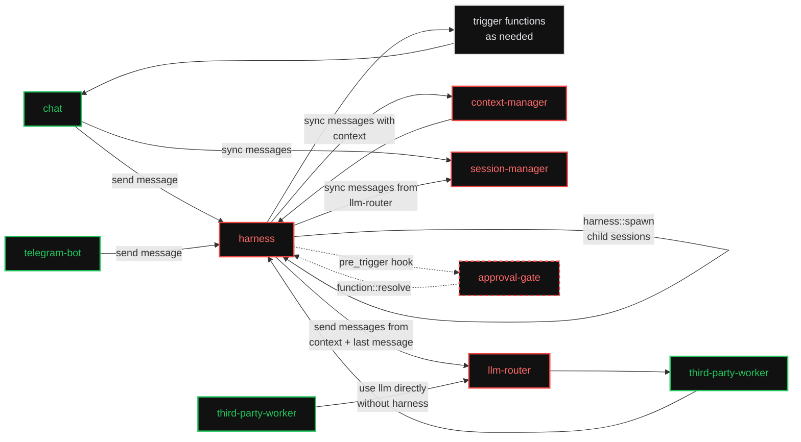

# Agentic Workers

A set of small, composable [iii](https://workers.iii.dev/) workers that, together, make up an
agentic chat backend — and, taken individually, each solve one problem well enough to be used on
their own.

The design splits the classic "agent harness" monolith into four standalone workers that talk to
each other only over the iii bus (functions, triggers, channels). Consumers (a web chat, a Telegram
bridge, any third-party worker) compose them however they need: the full loop through the `harness`,
or a single worker like `llm-router` directly.

## The overall architecture



### How to read the diagram

- **Green** (`chat`, `telegram-bot`, `third-party-worker`) are *example consumers*. They are not
  part of this spec; they show who calls in and how. Any worker or client can take their place.
- **Red** (`context-manager`, `session-manager`, `llm-router`, `harness`) are the four workers this
  spec defines. Each is **standalone**: installable and useful on its own, with no hard dependency on
  the other three.
- **White** (`trigger functions as needed`) is the **iii substrate itself**. Everything callable is a
  registered iii function; the harness invokes them with `iii.trigger(...)`. The model discovers what
  exists at runtime via `engine::functions::list` (through the `agent_trigger` invocation surface by
  default — see [Terminology](#terminology)). There is no separate "tools" worker.
- **Dashed** (`approval-gate`) is an **optional policy sibling**, specified in
  [approval-gate.md](approval-gate.md): it plugs into the harness via a `pre_trigger` hook and
  `harness::function::resolve` — the four core workers run with or without it.

## The four workers

| Worker | One-line role | Standalone value | Spec |
|---|---|---|---|
| [context-manager](context-manager.md) | Turn raw history + a model into a model-ready context (prune, summarise, fit the window). | Context-window management for any AI feature, not just this harness. | [context-manager.md](context-manager.md) |
| [session-manager](session-manager.md) | Durable, reactive, branching store of typed conversation entries. | A real-time conversation store any app can subscribe to. | [session-manager.md](session-manager.md) |
| [llm-router](llm-router.md) | One front door + a provider protocol in front of every LLM provider. | Call any model/provider through one stable surface, with or without an agent loop. | [llm-router.md](llm-router.md) |
| [harness](harness.md) | A thin durable turn loop that wires the other three together; spawns sub-agents as child sessions. | The "assemble the agent" worker; deliberately minimal. | [harness.md](harness.md) |

A consumer can install just one of these. `llm-router` on its own gives you provider-agnostic
completions. `session-manager` on its own gives you a reactive chat store. `harness` is the only
worker that depends on the other three — and even those dependencies are soft (it degrades to a
plain LLM loop without `context-manager`).

## Design principles

1. **Standalone first.** Every red worker is independently installable (`iii worker add <name>`) and
   has a coherent purpose by itself. Cross-worker calls are explicit `iii.trigger` calls, never
   in-process coupling.
2. **The harness is thin.** `harness` only sequences the other three plus function dispatch. Anything
   that grows real logic — approval gating, spend budgets, compaction *scheduling*,
   orchestration beyond spawn/join — becomes its own sibling worker rather than bloating the
   harness. The loop-coupled extension surfaces it does own — deferred function results,
   [`harness::spawn`](harness.md#sub-agents-harnessspawn), and the synchronous
   [hook points](harness.md#hooks) — exist so siblings and sub-agents plug in without loop changes:
   the harness provides the points, siblings provide the policy. See
   [harness.md § Out of scope](harness.md#out-of-scope-future-sibling-workers).
3. **`llm-router` is consumer-agnostic.** It never assumes a harness, a session, or a UI. It streams
   into a caller-supplied channel and returns. That is what lets a `third-party-worker` "use llm
   directly without harness".
4. **`context-manager` does not own storage.** It operates on message arrays passed in and returns
   results; the caller persists them. This keeps it reusable by any harness or AI feature.
5. **`session-manager` is the single reactive surface.** Consumers bind to its triggers (session
   created, message added/updated, status changed, meta updated, session deleted) and render live —
   they never poll and never need to know about the provider or the loop. The harness adds one
   orchestration-grade exception: `harness::turn_started` / `harness::turn_completed` fire at turn
   boundaries for consumers that react to outcomes rather than rendering transcripts.

## Consumer cookbook

Every consumer is the same triangle — **send** through the harness, **render** from
`session-manager` triggers, **observe turn boundaries** via `harness::turn_completed` — with
surface-specific wiring:

- **Web chat** (streaming UI): pass `session.metadata` (tenancy, e.g. `{ owner }`) on the first
  `harness::send`; bind `session::message-added` / `session::message-updated` /
  `session::status-changed` filtered by that metadata; render deltas last-write-wins by `revision`.
  Session status drives the spinner.
- **Telegram / Slack / WhatsApp bot**: webhooks redeliver — always pass `idempotency_key` (the
  platform update id) to `harness::send`. Map platform chat ↔ session via `session.metadata`
  (e.g. `{ telegram_chat_id }`). Either bind `session::message-updated` and edit the platform
  message throttled (~1/s), or skip streaming and bind `harness::turn_completed` to post one final
  message.
- **TUI / CLI**: the chat pattern for live rendering, or the blocking pattern —
  [`harness::run`](harness.md#harnessrun), then print `final_message` / `result`.
- **Backend event loops** (cron, system events, agent chains): `harness::run` with an
  [`output` contract](harness.md#output-contract) is "call an agent like a function"; or fire
  `harness::send` and bind `harness::turn_completed`. A chain (completed → send → completed …) must
  carry its own termination condition — `max_turns` bounds a single turn, not the chain (hop
  counter in `session.metadata`, or a budget sibling).

See [harness.md](harness.md) for `send` / `run` / `spawn` semantics and the turn events.

## Conventions

### Function ids

`<worker-prefix>::<verb>` or `<worker-prefix>::<namespace>::<verb>`. The prefixes are:

- `context::*` — context-manager
- `session::*` — session-manager
- `router::*` — llm-router (plus the `provider::<id>::*` protocol it defines for provider workers)
- `harness::*` — harness
- `approval::*` — approval-gate (optional sibling)

### Invocation modes

Every function is invoked through one of the three iii modes (see `iii-core-primitives`):

- **Sync** — `trigger({ function_id, payload })`: the caller needs the result (most reads, and
  `router::chat` which streams over a channel while the call is open).
- **Void** — `TriggerAction.Void()`: fire-and-forget side effects (e.g. notifications or metrics).
- **Enqueue** — `TriggerAction.Enqueue({ queue })`: durable async work with retry (the harness turn
  loop steps).

Each function's spec states its expected mode.

### Terminology

In iii there is no "tool" worker or domain concept — everything callable is a **function** registered
via `iii.registerFunction` and invoked via `iii.trigger`. Message content uses **function_call** and
**function_result** blocks.

The one exception is at the **provider adapter boundary**: OpenAI, Anthropic, and similar APIs expose
a `tools` array for function-calling. `llm-router` translates our invocation schema into that wire
format. In the harness loop the model sees a **single** provider tool by default — `agent_trigger`,
which takes `{ function, payload }` and can reach any allowed iii function — or one schema per
allowed function when a turn opts into `functions.expose: "native"`. See
[harness.md § Functions (the white box)](harness.md#functions-the-white-box).

### Reactive pattern

Workers expose reactivity in two shapes, and each worker spec separates them:

- **Trigger types emitted** — a custom trigger type *this* worker registers so *other* workers/clients
  can bind handlers to its events (e.g. `session::message-added`). Binding is always the two-step
  pattern:

```typescript
iii.registerFunction("my-worker::on-message-added", handler);
iii.registerTrigger({
  type: "session::message-added",
  function_id: "my-worker::on-message-added",
  config: { session_id: "s_123" }, // optional filters
});
```

- **Triggers bound** — event sources *this* worker subscribes to (engine `state` / `stream` /
  `subscribe` / `cron`, or another worker's trigger type).

## Cross-cutting contracts

These types are defined once here and referenced by every worker spec. They are grounded in the
field-proven shapes from the existing `harness/` package (`harness/src/types/*.ts`) so the design
maps cleanly onto a real implementation.

### Content blocks

The atomic units of message content. A message's `content` is an ordered array of these.

```typescript
type TextContent     = { type: "text"; text: string };
type ImageContent    = { type: "image"; mime: string; data: string }; // base64
type ThinkingContent = { type: "thinking"; text: string; signature?: string };
type FunctionCallContent = {
  type: "function_call";
  id: string;            // unique per call, echoed by the result
  function_id: string;   // the iii function id to invoke
  arguments: unknown;    // model-produced args (JSON)
};
type FunctionResultContent = {
  type: "function_result";
  function_call_id: string;
  content: ContentBlock[];
  is_error?: boolean;
};

type ContentBlock =
  | TextContent
  | ImageContent
  | ThinkingContent
  | FunctionCallContent
  | FunctionResultContent;
```

`FunctionResultMessage` (a `role`, below) is the **canonical transcript form** for function output;
`FunctionResultContent` (a block) is the adapter-boundary form for providers whose wire format
embeds tool results inside another message (e.g. Anthropic `tool_result` blocks in a `user` turn).
Workers in this spec store the message form and let provider adapters map it.

### Messages (the "many message types")

The canonical transcript message union. Owned by [session-manager](session-manager.md); consumed by
`context-manager`, `llm-router`, and `harness`.

```typescript
type Role = "user" | "assistant" | "function_result" | "custom";

type UserMessage = {
  role: "user";
  content: ContentBlock[];
  timestamp: number;
};

type AssistantMessage = {
  role: "assistant";
  content: ContentBlock[];
  stop_reason: StopReason;
  native_stop_reason?: string;     // provider's raw finish reason, passed through untouched
  error_message?: string | null;
  error_kind?: ErrorKind | null;
  warnings?: string[];             // report-and-continue notices (e.g. dropped unsupported param)
  usage?: Usage | null;
  model: string;
  provider: string;
  timestamp: number;
};

type FunctionResultMessage = {
  role: "function_result";
  function_call_id: string;
  function_id: string;
  content: ContentBlock[];
  details: unknown;
  is_error: boolean;
  timestamp: number;
};

// Escape hatch for app-specific entries (system notices, UI markers, attachments, …)
type CustomMessage = {
  role: "custom";
  custom_type: string;       // app-defined discriminator
  content: ContentBlock[];
  display?: string;
  details?: unknown;
  timestamp: number;
};

type AgentMessage =
  | UserMessage
  | AssistantMessage
  | FunctionResultMessage
  | CustomMessage;
```

Provider wire mapping: providers serialise `user` / `assistant` / `function_result` messages to
their native format. `custom` messages have **no** wire mapping — `context::assemble` (or the
harness, in raw mode) strips them before the router sees them. Replayed `thinking` blocks follow
each provider's rules (e.g. Anthropic requires the `signature`; providers drop blocks they cannot
replay).

### Session entries

How `session-manager` stores messages: each `AgentMessage` is wrapped in an entry envelope that gives
it identity, ordering, and a parent link (used for forking). Apps that need to persist non-message
items (system notices, UI markers, attachments) use the `custom` kind.

```typescript
type SessionEntry =
  | { kind: "message"; id: string; parent_id: string | null; timestamp: number;
      revision: number; origin?: Record<string, unknown>; message: AgentMessage }
  | { kind: "custom";  id: string; parent_id: string | null; timestamp: number;
      revision: number; origin?: Record<string, unknown>; custom_type: string; data: unknown };
```

`revision` starts at 0 and increments on every content update (streaming); events echo it so
consumers can apply full-message snapshots last-write-wins. `origin` is opaque writer-supplied
correlation — the harness sets `{ turn_id }` on everything its loop writes.

When to use which custom shape: a **`custom` message** (`role: "custom"` inside a `kind: "message"`
entry) is a transcript item — rendered in order, part of the conversation (system notices, UI
markers). A **`custom` entry** (`kind: "custom"`) is bookkeeping *about* the conversation that is
not a message at all (e.g. the harness's compaction record) — `session::messages` only returns it
when asked (`include_custom`). Neither reaches the model: providers only ever receive `user` /
`assistant` / `function_result` roles (see the wire-mapping note above).

### Streaming events

The discriminated union providers stream over an iii channel, relayed verbatim by `llm-router` and
the `harness`. Non-terminal content frames carry a `partial` accumulator (`usage`, `ping`, and
`stop` do not); `done`/`error` carry the final assembled message. `done` and `error` are terminal.

```typescript
type StopReason = "end" | "length" | "function_call" | "aborted" | "error";
type ErrorKind  = "auth_expired" | "rate_limited" | "context_overflow" | "transient" | "permanent";
type Usage = {
  input?: number; output?: number;
  cache_read?: number; cache_write?: number;   // prompt-cache splits (cache reads bill ≈10% of input)
  reasoning?: number;  // thinking/reasoning tokens, when the provider reports them separately
  cost_usd?: number;   // filled by llm-router from catalog pricing; providers leave it unset
};

type AssistantMessageEvent =
  | { type: "start";             partial: AssistantMessage }
  | { type: "text_start";        partial: AssistantMessage }
  | { type: "text_delta";        partial: AssistantMessage; delta: string }
  | { type: "text_end";          partial: AssistantMessage }
  | { type: "thinking_start";    partial: AssistantMessage }
  | { type: "thinking_delta";    partial: AssistantMessage; delta: string }
  | { type: "thinking_end";      partial: AssistantMessage }
  | { type: "functioncall_start";partial: AssistantMessage }
  | { type: "functioncall_delta";partial: AssistantMessage; delta: string }
  | { type: "functioncall_end";  partial: AssistantMessage }
  | { type: "usage";             usage: Usage }
  | { type: "ping" }                              // liveness heartbeat; consumers ignore
  | { type: "stop";              stop_reason: StopReason; error_message?: string; error_kind?: ErrorKind }
  | { type: "done";              message: AssistantMessage }   // terminal
  | { type: "error";             error: AssistantMessage };    // terminal
```

### Model descriptor

The capability record `llm-router` serves and every worker reads to make budget/feature decisions.

```typescript
// "minimal" requests the lowest reasoning effort and needs only `thinking` support;
// levels map to provider-native knobs via Model.thinking_budgets.
type ThinkingLevel = "minimal" | "low" | "medium" | "high" | "xhigh";

type Capability =
  | "thinking" | "thinking:low" | "thinking:medium" | "thinking:high" | "thinking:xhigh"
  | "tools" | "vision" | "cache" | "structured_output";

type Model = {
  id: string;                 // e.g. "claude-sonnet-4"
  provider: string;           // e.g. "anthropic"
  display_name?: string;
  context_window: number;     // total tokens
  max_output_tokens: number;
  input_limit?: number;       // usable input budget if distinct from context_window
  supports_thinking?: boolean;
  supports_xhigh?: boolean;
  supports_tools?: boolean;
  supports_vision?: boolean;
  supports_cache?: boolean;
  supports_structured_output?: boolean;
  thinking_budgets?: Partial<Record<ThinkingLevel, number>>;
  pricing?: { input?: number; output?: number; cache_read?: number; cache_write?: number };
};
```

### Function invocation schema

JSON-schema shape for a provider function-calling entry. `llm-router` passes it through to providers
as a `tools` array entry (adapter boundary). In the harness loop this is a **single** entry for
`agent_trigger` by default; a turn that opts into `functions.expose: "native"` attaches one entry
per allowed function instead (see
[harness.md § Functions (the white box)](harness.md#functions-the-white-box)).

```typescript
type AgentFunction = {
  name: string;            // invocation surface name ("agent_trigger", "submit_result", or a
                           // function id in native exposure mode)
  description: string;
  parameters: unknown;     // JSON Schema: { function: string, payload?: object }
  label?: string;
  execution_mode?: "parallel" | "sequential";
};
```

### Output contract

What a turn must produce — the typed-deliverable surface for sub-agents and backend automations
(see [harness.md § Output contract](harness.md#output-contract)). Free text by default; `json`
constrains the final answer to a JSON value, validated against `schema` when supplied. Delivery is
provider-native structured output when the model declares the `structured_output` capability, else
the harness's `submit_result` fallback.

```typescript
type OutputContract =
  | { type: "text" }
  | { type: "json"; schema?: unknown };   // JSON Schema; validated when supplied
```

### Channel reference

The wire shape of a streaming channel endpoint. The iii SDK hydrates a `write` ref into a live
`ChannelWriter` and a `read` ref into a `ChannelReader` before the handler runs.

```typescript
type StreamChannelRef = {
  channel_id: string;
  access_key: string;
  direction: "read" | "write";
};
```

### Credential

What `router::provider::resolve` returns to a provider worker. Secrets never transit agent-visible
surfaces (see [llm-router.md § Security](llm-router.md#security)).

```typescript
type Credential =
  | { type: "api_key"; key: string }
  | { type: "oauth";   access_token: string; refresh_token?: string; expires_at?: number;
      scopes?: string[]; provider_extra?: unknown };
```

## Cross-cutting conventions

### Observability

Every worker wraps its registered functions in OTel spans (no-op when OTel is not initialised),
named `<worker>.<verb>`, with `session_id` / `turn_id` / `request_id` attributes taken from the
request or its `metadata` / `origin` passthrough. The notable spans: `harness.turn` (per step),
`router.chat` (per stream: provider, model, usage), `context.assemble` (tokens before/after,
pruned/compacted flags), `context.compact` (lease wait, tokens), and `session.append` /
`session.update_message` (entry id, revision). Consumers propagate `metadata` so traces stitch
end-to-end.

### Error conventions

Errors thrown across the bus carry a stable snake_case code, worker-prefixed, in a
`{ code, message }` shape — e.g. `router/no_provider_for_model`, `router/ambiguous_model`,
`session/not_found`, `context/model_unresolved`, `harness/invalid_message_role`. The prose "Errors"
lists in each spec name the conditions; codes map 1:1 onto them. Failures *inside* a stream never
throw — they arrive as `error` frames carrying an `ErrorKind`.

### Trigger delivery

Custom trigger types are evaluated by the **emitting** worker: it owns the type's handler, keeps the
subscriber set, applies each binding's `config` filter, and dispatches. Delivery is at-least-once
and unordered across entries — consumers reconcile via `revision` (message updates) and the parent
chain (transcript order), never via arrival order. Subscriptions are engine registrations:
subscribers re-register on reconnect, and an emitter rebuilds its subscriber set from the engine
after a restart. The harness's `harness::hook::*` types are the one deliberate exception to async
delivery: the emitting worker invokes bound functions synchronously in-path, in deterministic
order, and acts on their return values (see [harness.md § Hooks](harness.md#hooks)).

## Security model

Everything callable over the bus is callable by the model through `agent_trigger`, so security is a
deployment property, not an option:

- **Provenance.** Every `iii.trigger` issued on behalf of a model (i.e. from
  `harness::function::trigger`) carries agent provenance in its invocation metadata, and the engine
  MUST propagate that mark through nested triggers — a function the agent calls cannot launder a
  call by re-triggering. `iii-permissions.yaml` rules apply to any call whose chain carries the
  mark; worker- and user-initiated calls bypass them. Without provenance propagation, agent-gating
  is advisory — deployments MUST NOT expose credentials on engines that lack it.
- **Fail closed.** The harness dispatch policy defaults to deny: when no `functions` allow-list is
  supplied, every `agent_trigger` call is refused (see
  [harness.md § Functions (the white box)](harness.md#functions-the-white-box)). Deployments opt
  functions in via `allow` globs or an approval sibling.
- **Sub-agent chains.** [`harness::spawn`](harness.md#sub-agents-harnessspawn) is the only
  model-reachable way to start new turns (`harness::send` / `harness::run` stay denied to in-run
  agents). Children inherit agent provenance, their function policy is the parent's intersected
  with the request (narrow, never escalate), and depth / fan-out / turn budgets bound the tree.
- **Hooks are operator-trusted code.** [Hook](harness.md#hooks) bindings are worker-plane trigger
  registrations on the harness's `harness::hook::*` trigger types — deployment code, never
  per-send and never model-reachable (trigger registration is an SDK surface, not a function
  `agent_trigger` can call), with `engine::triggers::list` as the audit surface. Hooks run with
  worker privileges and receive model-controlled data as input — hook code must treat its payload
  as untrusted (confused-deputy risk). Hook invocations carry the agent provenance mark of the
  work they wrap, and it propagates through their nested triggers, so a hook cannot launder an
  agent-gated call.
- **Agent exposure.** Each worker spec carries an "Agent exposure" section listing which of its
  functions may be exposed to in-run agents. The short version: reads are generally safe (tenancy
  caveats aside); every mutating surface of `session-manager`, the `harness` entry points, and the
  router's provider/config plane is deny-by-default.

## Spec index

- [context-manager.md](context-manager.md)
- [session-manager.md](session-manager.md)
- [llm-router.md](llm-router.md)
- [harness.md](harness.md)
- [approval-gate.md](approval-gate.md) — optional sibling: the policy + decision surface for
  human-held function calls (hook + pending inbox + notification triggers)

## Prior art

The existing [`harness/`](../../harness) package in this repo implements the same problem space as a
"thick" stack of 15 workers (`turn-orchestrator`, `session`, `context-compaction`, `models-catalog`,
`provider-*`, `approval-gate`, `llm-budget`, `hook-fanout`, …). This spec is a greenfield
consolidation of that experience into four standalone workers; it borrows the proven wire types and
streaming contract but is not bound to the current package's structure.

### Migration map

| Existing worker(s) | Replaced by |
|---|---|
| `turn-orchestrator` (`run::start`, `turn::*` FSM) | [harness](harness.md) (`harness::send`, `harness::turn`) |
| `session` (`session-tree::*`) | [session-manager](session-manager.md) (`session::*`) |
| `context-compaction` (`compact_now`, `prune_tool_outputs`) | [context-manager](context-manager.md) (`context::*`, storage-agnostic) |
| `models-catalog` (`models::*`) + the orchestrator's provider routing | [llm-router](llm-router.md) (`router::*`) |
| `provider-*` workers | same protocol shape, re-pointed at `router::provider::*` |
| `approval-gate` (`approval::*` + `consultBefore` / `turn::on_approval` in `turn-orchestrator`) | [approval-gate](approval-gate.md): the `approval::gate` `pre_trigger` hook + `harness::function::resolve`; drops the write-only `approvals` state scope (see [approval-gate.md § Prior art & migration](approval-gate.md#prior-art--migration)) |
| `llm-budget`, `hook-fanout` | [harness hooks](harness.md#hooks) + sibling policy/decision workers (see [harness.md § Out of scope](harness.md#out-of-scope-future-sibling-workers)); `hook-fanout`'s async side maps to the `harness::turn_*` events |

Function prefixes do not collide, so both stacks can run side by side during migration — with one
exception: `approval::*` is the same prefix in both stacks, so the old `approval-gate` worker is
retired when the greenfield sibling deploys. Transcripts
move with a one-shot copy from `session_tree:*` scopes into `session:*` (entry shapes are
compatible modulo the new envelope fields: `revision`, `origin`); compaction entries become
`custom_type: "compaction"` entries.
