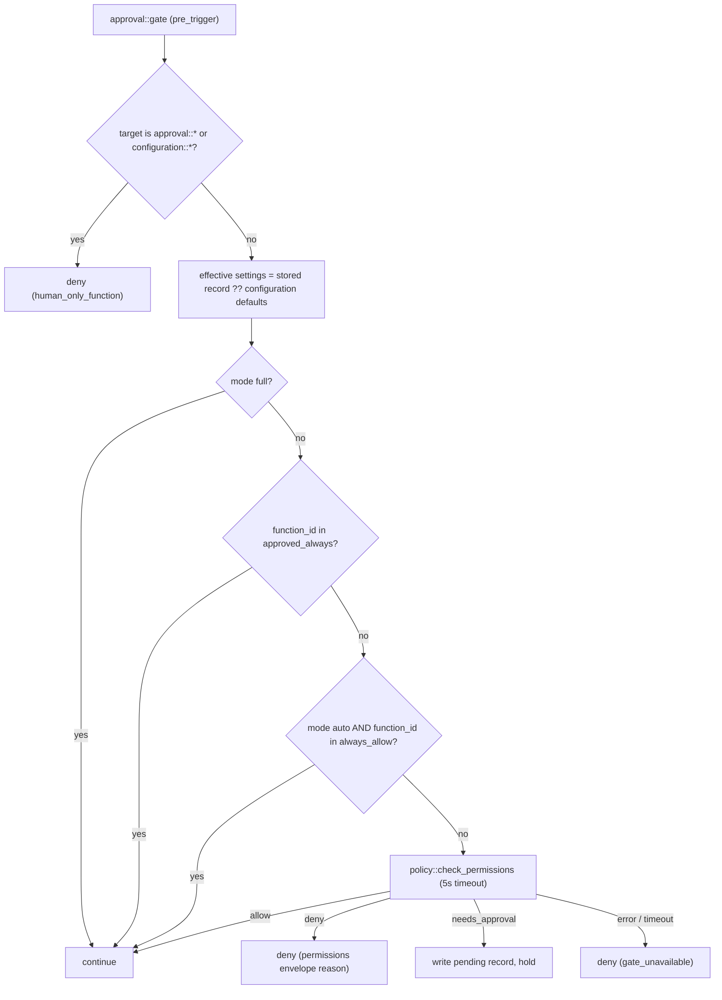
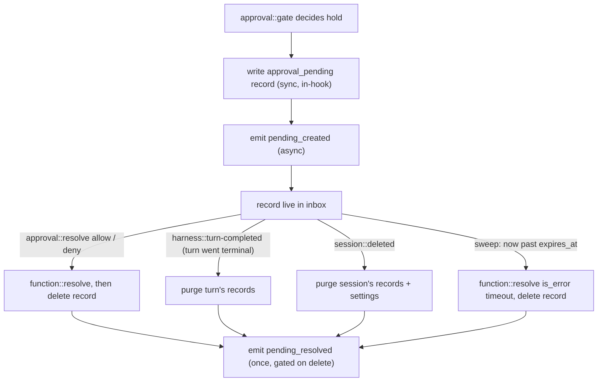

# approval-gate

Worker prefix: `approval::*`

## Definition

`approval-gate` is the **policy and decision surface for human-held function calls**: which calls
need a human, how the human answers, and how the decision reaches the parked turn. It is an
optional sibling of the [harness](harness.md) — the harness ships the mechanics (a `pre_trigger`
[hook](harness.md#hooks) that can *hold* a call, and
[`harness::function::resolve`](harness.md#harnessfunctionresolve) to deliver or release it); this
worker ships the policy, the decision RPCs, the pending inbox, and the notification triggers. The
harness never embeds approval logic (see
[harness.md § Out of scope](harness.md#out-of-scope-future-sibling-workers)).

Three surfaces, one worker:

1. **The gate** — `approval::gate`, a `pre_trigger` hook the worker binds itself at startup as
   an iii trigger on the harness's `harness::hook::pre_trigger` trigger type. It evaluates
   per-session mode, allow-lists, and the yaml policy, and answers `continue`, `deny`, or `hold`.
2. **The decision plane** — `approval::resolve` plus the per-session settings RPCs
   (`set_mode`, `add_always_allow`, `approve_always`, …). Human/console-only.
3. **The pending inbox** — a denormalized, **ephemeral** index of held calls
   (`approval::list-pending` / `approval::get-pending`) plus two trigger types
   (`approval::pending-created` / `approval::pending-resolved`) that notification workers and UIs
   bind to.

The inbox is deliberately ephemeral: a record exists only while a call is held. Every record has an
explicit deletion path and a sweep as GC backstop (see [State lifecycle](#state-lifecycle)) — the
worker keeps **no resolved-approval history**. The transcript's `function_result` and the
`pending_resolved` event are the audit trail; a deployment that wants history binds the trigger and
keeps its own log.

## Role in the stack

The gate sits *outside* the loop. It is called synchronously at one hook point, and it talks back
to the harness through exactly one function (`harness::function::resolve`). It never mutates the
turn record, never appends to the session, and never executes the held function itself — on
approval, the **harness** runs the released call through its own trigger pipeline
(`action: "execute"`; see [Decision flow](#decision-flow-approvalresolve)).

```mermaid
sequenceDiagram
  participant H as harness
  participant AG as approval-gate
  participant CFG as configuration
  participant UI as console / inbox UI
  participant N as notification worker

  Note over H,AG: startup: registerTrigger harness::hook::pre_trigger → approval::gate
  Note over AG,CFG: startup: configuration::register id "approval-gate"<br/>bind configuration trigger
  H->>AG: pre_trigger hook approval::gate
  alt policy allows
    AG-->>H: decision continue
  else policy denies
    AG-->>H: decision deny + reason
  else needs human
    AG->>AG: write approval_pending record (sync, in-hook)
    AG-->>H: decision hold + pending_timeout_ms
    Note over H: call checkpoints pending, held_by approval::gate;<br/>turn parks
    AG--)N: approval::pending-created (async)
    UI->>AG: approval::resolve {decision}
    alt allow
      AG->>H: harness::function::resolve {action: "execute"}
      Note over H: re-enqueue turn; run released call through<br/>remaining trigger pipeline
    else deny
      AG->>H: harness::function::resolve {action: "deliver", is_error}
    end
    AG->>AG: delete approval_pending record
    AG--)N: approval::pending-resolved (async)
  end
  UI->>CFG: configuration::set "approval-gate" entry
  CFG--)AG: configuration:updated trigger
  Note over AG: reload default_mode / always_allow_seed /<br/>pending_timeout_ms in memory
```

## Permission model

Approval behaviour is governed per session by a **permission mode** plus two allow-lists. The
semantics are ported unchanged from the proven implementation
(`harness/src/turn-orchestrator/hook.ts` `consultBefore`, exercised by
`mode-approval.e2e.test.ts`); only the wire mechanics differ.

- **`manual`** (default) — everything prompts except yaml `allow` rules and `approved_always`
  grants. The safe default.
- **`auto`** — like manual, plus the session's curated `always_allow` list short-circuits to allow.
- **`full`** — everything is allowed. No safety floor; UIs should render a persistent banner while
  active.

Two allow-lists with deliberately different semantics:

- **`approved_always`** — per-session grants made from an approval prompt ("approve always"
  button). They are *remembered human decisions*, not an auto-policy, so they hold in **every
  mode** — including manual.
- **`always_allow`** — a curated trust profile (seeded from the deployment's
  [`always_allow_seed`](#configuration)), consulted **only in auto mode**. Dormant under manual:
  the user can build it up, but it only takes effect when they opt into auto.

### Evaluation order

`approval::gate` evaluates each call against a single settings snapshot (race-safe — one read per
call):



### Mode matrix

| Mode | yaml `allow` | `approved_always` | `always_allow` | yaml `deny` | otherwise |
|---|---|---|---|---|---|
| `manual` | allow | allow | dormant | deny | hold |
| `auto` | allow | allow | allow | deny | hold |
| `full` | allow | allow | allow | allow | allow |

Fail-closed reaffirmation (see [README § Security model](README.md#security-model)): manual mode
never auto-allows anything except yaml `allow` rules and explicit `approved_always` grants. A
policy outage degrades to **deny**, never to allow or to an unattended hold.

## The `approval::gate` hook

One function, bound to the harness's `pre_trigger` point as an iii trigger. The worker registers
the binding itself at startup — installing the gate is installing the hook (see
[harness.md § Hooks › Registration](harness.md#registration)):

```typescript
iii.registerFunction("approval::gate", gate);
iii.registerTrigger({
  type: "harness::hook::pre_trigger",
  function_id: "approval::gate",
  config: {
    functions: ["shell::*", "harness::spawn"],
    timeout_ms: 5000,
    on_error: "fail_closed",
  },
});
```

`on_error: "fail_closed"` is already the `pre_*` default — a crashed gate must deny, not wave calls
through. The `functions` globs narrow which dispatches consult the gate; omit them to consult on
every call.

**Ordering caveat.** `pre_trigger` hooks run **after** the harness's fail-closed allow/deny globs —
a hook narrows the policy, never widens it (see
[harness.md § Hook points](harness.md#hook-points)). A call that matches no `allow` glob is denied
before the gate ever sees it. A deployment that wants *everything* gated by approvals therefore
sets a broad dispatch policy (`functions.allow: ["*"]`) and lets the gate hold/deny per this spec's
permission model.

Contract (maps `HookInput` → `HookOutput`, both defined in
[harness.md § Hooks › Contract](harness.md#contract)):

- **`{ decision: "continue" }`** — the permission model allows the call (mode / allow-lists / yaml
  `allow`).
- **`{ decision: "deny", reason }`** — yaml `deny` (the [`DenialEnvelope`](#denialenvelope)'s
  human-readable `reason`), human-only defense, or fail-closed transport failure
  (`gate_unavailable`). The harness answers the call with an `is_error` function_result carrying
  the reason — the model sees it and can adapt.
- **`{ decision: "hold", pending_timeout_ms }`** — yaml `needs_approval` (or any "no rule matched"
  fallback). Before returning `hold`, the gate **synchronously writes** the
  [`PendingApprovalRecord`](#pendingapprovalrecord) — a held call must never be invisible to the
  inbox. If that state write fails, the gate returns `deny` (`gate_unavailable`) instead: fail
  closed, never hold blind. `approval::pending-created` emits asynchronously *after* the record is
  written — notification fan-out never blocks the hot path.

The hook runs inside the harness's at-least-once steps and MUST be idempotent: a redelivered step
re-runs the gate for the same `function_call_id`. Re-evaluating the policy is naturally idempotent;
the pending-record write is keyed on `{ session_id, function_call_id }`, so a duplicate hold is a
no-op on the existing record (and emits no second `pending_created`).

Everything the record needs is on `HookInput` (`session_id`, `turn_id`, `depth`, `metadata`,
`call`); session context (`title`, `description`, `metadata`) is soft-fetched via
`session::get` at hold time — best-effort, fields are omitted on failure, and the fetch must
respect the hook's `timeout_ms` budget.

## Decision flow (`approval::resolve`)

The human decision arrives at `approval::resolve { session_id, function_call_id, decision, reason? }`
(console / inbox UI; human-only). The gate looks up the pending record (it carries the `turn_id`
the harness needs), then:

- **`decision: "allow"`** → `harness::function::resolve` with **`action: "execute"`** — the harness
  marks the held call *released*, re-enqueues the turn, and the loop runs it through the
  **remaining trigger pipeline**: the `pre_trigger` chain resumes after the holding hook, the
  target is invoked with the original call's provenance, `post_trigger` hooks run over the result,
  and the checkpoint flips `pending → dispatched → done` with the existing at-most-once redelivery
  protection (see [harness.md § `harness::function::resolve`](harness.md#harnessfunctionresolve)).
  The gate never invokes the target itself — doing so would bypass `post_trigger` redaction, the
  per-call checkpoints, and provenance propagation.
- **`decision: "deny"`** → `harness::function::resolve` with `action: "deliver"`,
  `is_error: true`, content rendering a [`DenialEnvelope`](#denialenvelope)
  (`denied_by: "user"`, the operator's `reason`, redacted `args_excerpt`), and the envelope as
  `details`.

Then, in order: delete the pending record (the [emit-once gate](#deletion-is-the-emit-gate)), and
emit `approval::pending-resolved` with `outcome: "allow" | "deny"`.

**No decision record is persisted — by design.** The prior implementation wrote every decision to a
state row (`approvals/<session_id>/<function_call_id>` via `harness/src/approval-gate/resolve.ts`)
that nothing ever deleted — one permanent row per resolved call, forever (the e2e suite even
asserts the row survives the turn). Greenfield removes the scope entirely: the decision flows
straight into `harness::function::resolve`, the turn record and transcript carry the durable
outcome, and the only approval-gate state row (the pending record) dies with the resolution.

**Idempotency.** Duplicate resolves are safe end to end: `harness::function::resolve` is
idempotent on the deterministic entry id (`e_<turn_id>_<function_call_id>`), and only the resolve
that actually deletes the pending record emits `pending_resolved`. A resolve for an unknown
`{ session_id, function_call_id }` returns `{ resolved: false }` and emits nothing. Crash ordering:
the gate calls `harness::function::resolve` *first*, then deletes, then emits — a crash between the
two leaks one record until the [sweep](#sweep-the-gc-backstop) collects it; it can never lose a
decision.

## State lifecycle

The sustainability contract. The state worker's interface is `{ scope, key, value }` — **no TTL,
no expiry** is part of that contract, so correctness MUST NOT rely on backend expiry (whether the
deployment backs `iii-state` with Redis, the file adapter, or anything else). Instead:

> **Every record this worker writes has an explicit deletion path, and a periodic sweep is the GC
> backstop for any path a crash interrupts.**



### `approval_pending/<session_id>/<function_call_id>` — the inbox record

- **Created**: synchronously inside `approval::gate`, *before* the hook returns `hold`. Write
  failure → fail-closed `deny`. There is never a held call without an inbox record.
- **Deleted** (any one of):
  1. **`approval::resolve`** — the primary path, immediately after `harness::function::resolve`
     succeeds.
  2. **`harness::turn-completed`** — the record's turn went terminal
     (`cancelled` / `failed`, e.g. `harness::stop` cascaded an abort). Purge every record carrying
     that `turn_id`; emit `pending_resolved` with `outcome: "aborted"`. (A `completed` turn has no
     live holds by construction; the purge is a harmless stale-record cleanup if any survived a
     crash.)
  3. **`session::deleted`** — purge every pending record for the session (plus the settings record,
     below); emit `pending_resolved` with `outcome: "aborted"` per record.
  4. **The sweep** — see below.

### Sweep (the GC backstop)

A cron-bound handler (`approval::sweep`, every ~60s) lists the `approval_pending` scope and, for
each record with `expires_at <= now`:

1. `harness::function::resolve` (`action: "deliver"`, `is_error: true`, timeout denial) — a no-op
   `{ resolved: false }` when the harness's own pending sweep or another path already resolved the
   call.
2. Delete the record.
3. Emit `approval::pending-resolved` with `outcome: "timeout"` (gated on the delete, below).

`expires_at = pending_at + pending_timeout_ms` — the same value the hook returned on `hold`, so the
gate's sweep and the harness's pending sweep fire on the same deadline and coexist idempotently
(deterministic entry ids make double-resolution a no-op; the harness sweep also remains the
backstop for holds whose gate worker died). The sweep also collects records orphaned by a crash
between resolve and delete — which is why no delete path needs to be transactional.

### `approval_settings/<session_id>` — per-session settings

- **Created lazily, on first mutation only.** Reads never write: the *effective* settings are the
  stored record when one exists, else the configuration defaults (`default_mode`,
  `always_allow_seed`) computed in memory. A session that never customizes its approvals writes
  **zero** state rows. On the first mutation (`set_mode`, `add_always_allow`, `approve_always`, …)
  the record is initialized from the current defaults — seed entries carry
  `granted_by: "seed"` — and the mutation is applied; from then on the stored record wins (a later
  seed change does not retroactively edit it).
- **Deleted** on `session::deleted` (the trigger binding replaces the prior deployment's unwired
  console-side cleanup), or explicitly via `approval::clear-settings`.

### Deletion is the emit gate

All four deletion paths delete through one helper: `state::set` with `value: null`, checking the
returned `old_value`. Only the caller that observed a non-null `old_value` emits
`pending_resolved` — concurrent paths (a resolve racing the sweep racing a turn abort) produce
exactly one event per record. This also keeps `pending_resolved` honest as a badge-clearing signal
for UIs.

### Why this matters operationally

Aggressive deletion is not just hygiene — it is what keeps the worker cheap. `state::list` returns
a whole scope, values-only, with no pagination or prefix queries; `approval::list-pending` is a
full-scope scan filtered in the worker. That stays O(live holds) — typically a handful — precisely
*because* fulfilled approvals are deleted the moment they resolve. Records are fully
self-describing (ids live inside the value) so the scan needs no key material.

| Record | Created | Deleted by | Backstop |
|---|---|---|---|
| `approval_pending/<sid>/<cid>` | in-hook, before `hold` returns | resolve · turn terminal · session deleted | sweep on `expires_at` |
| `approval_settings/<sid>` | first user mutation (lazy; reads never write) | `session::deleted` · `approval::clear-settings` | none needed — ≤1 row per session, dies with the session |
| decision records | — none in greenfield — | — | — |

## Configuration

The worker owns one entry — id **`approval-gate`** — in the engine's built-in `configuration`
worker, following the same pattern as [llm-router § Configuration](llm-router.md#configuration). At
startup it calls `configuration::register` with the id, a JSON Schema, and an `initial_value`.
Operators (and the console's Configuration screen, which renders the schema as a form) edit this
entry — deployment approval defaults live here and nowhere else; the hook binding is a trigger
registration, not configuration (see [The `approval::gate` hook](#the-approvalgate-hook)).

```jsonc
// configuration entry "approval-gate"
{
  "default_mode": "manual",            // manual | auto | full — sessions with no stored settings
  "always_allow_seed": [               // deployment trust profile for auto mode
    "state::get",
    "engine::functions::list"
  ],
  "pending_timeout_ms": 1800000        // hold deadline; drives expires_at (default 30 min)
}
```

| Field | Type | Purpose |
|---|---|---|
| `default_mode` | `"manual" \| "auto" \| "full"` | Effective mode for sessions with no stored `approval_settings` record. Default `"manual"`. |
| `always_allow_seed` | `string[]` (function ids / globs) | Effective `always_allow` list for sessions with no stored record; copied into the record on first mutation (see [lazy seeding](#approval_settingssession_id--per-session-settings)). |
| `pending_timeout_ms` | `number` | Returned as the hook's `pending_timeout_ms` on `hold`; sets `expires_at` on the pending record. Default `1_800_000` (matches the harness pending-sweep default). |

Reactive reload — no polling:

```typescript
iii.registerFunction("approval::on-config-change", async () => reloadDefaults());
iii.registerTrigger({
  type: "configuration",
  function_id: "approval::on-config-change",
  config: {
    configuration_id: "approval-gate",
    event_types: ["configuration:registered", "configuration:updated"],
  },
});
```

Soft dependency: without the `configuration` worker the gate runs on built-in defaults
(`{ default_mode: "manual", always_allow_seed: [], pending_timeout_ms: 1_800_000 }`) — fail-safe,
never fail-open. Per the configuration worker's boundaries: the entry holds **deployment**
defaults only (schema-validated, operator-editable); per-session data lives in `iii-state`, and
`configuration::set` replaces the whole value — clients read-merge-write to edit one field.

## Functions

The gate (called by the harness only, via the `harness::hook::pre_trigger` trigger binding):

- `approval::gate` — the `pre_trigger` hook: evaluate the permission model, answer
  `continue` / `deny` / `hold`; writes the pending record on hold.

Decision plane (human/console-only — see [Agent exposure](#agent-exposure)):

- `approval::resolve` — apply a human decision to a held call: release it for execution (`allow`)
  or deliver a denial (`deny`); deletes the pending record and emits `pending_resolved`.
- `approval::set-mode` — set the session's permission mode (`manual` / `auto` / `full`).
- `approval::add-always-allow` / `approval::remove-always-allow` — curate the session's auto-mode
  trust list (idempotent add / remove).
- `approval::approve-always` — record a per-session "approve always" grant (honoured in every mode).
- `approval::get-settings` — read the session's *effective* settings (stored record or
  configuration defaults); never writes.
- `approval::clear-settings` — drop the session's stored settings record.

Inbox reads (operator/console):

- `approval::list-pending` — the pending inbox across sessions, with tenancy filters; the catch-up
  path for notification workers after a restart.
- `approval::get-pending` — read one pending record; `null` when resolved or unknown.

Internal (trigger handlers; not called directly):

- `approval::on-config-change` — configuration trigger handler (reload deployment defaults).
- `approval::on-session-deleted` — `session::deleted` handler (purge settings + pending records).
- `approval::on-turn-completed` — `harness::turn-completed` handler (purge the turn's pending
  records).
- `approval::sweep` — cron handler (expire pending records past `expires_at`).

## Triggers

### Trigger types emitted

Two custom trigger types, registered by this worker and bound by consumers with the standard
two-step pattern (see [README § Reactive pattern](README.md#reactive-pattern)). Both configs accept
`{ session_id?: string; metadata?: Record<string, unknown> }` — `metadata` is an equality match
against the denormalized `session_metadata` on the record, so a multi-tenant notification worker
binds to only its own sessions (same convention as the
[session-manager triggers](session-manager.md#trigger-types-emitted)). Delivery is at-least-once
and unordered (see [README § Trigger delivery](README.md#trigger-delivery)); `list_pending` is the
reconciliation read.

- **`approval::pending-created`** — a call was held and its inbox record written. Fires
  asynchronously after the hook returns `hold` — never on the dispatch hot path. Bind notification
  workers here (push, email, Slack, PagerDuty, …).
  - Payload: `PendingApprovalRecord & { status: "pending" }`.
- **`approval::pending-resolved`** — a pending call left the inbox. Emitted exactly once per record
  (gated on the record delete — see
  [Deletion is the emit gate](#deletion-is-the-emit-gate)). Lets UIs clear badges and notification
  workers send "resolved" follow-ups.
  - Payload:

```typescript
type PendingResolvedEvent = {
  session_id: string;
  turn_id: string;
  function_call_id: string;
  function_id: string;
  outcome: "allow" | "deny" | "timeout" | "aborted";
  reason?: string;              // operator-supplied on deny
  session_metadata?: Record<string, unknown>;  // tenancy routing, from the record
  resolved_at: number;
};
```

### Triggers bound

Five bindings — the first is the gate itself; three of the rest exist to enforce the
[state lifecycle](#state-lifecycle):

- **`harness::hook::pre_trigger`** ([harness](harness.md#hooks)) → `approval::gate` — the
  synchronous hook binding itself (`functions` filter, `timeout_ms`, `on_error: "fail_closed"`;
  see [The `approval::gate` hook](#the-approvalgate-hook)).
- **`configuration`** on `configuration_id: "approval-gate"` → `approval::on-config-change` —
  reload deployment defaults reactively (replaces the prior deployment's
  `approval::on_harness_config` binding on the harness entry).
- **`session::deleted`** ([session-manager](session-manager.md#trigger-types-emitted)) →
  `approval::on-session-deleted` — purge `approval_settings/<sid>` and every
  `approval_pending/<sid>/*` record. This is the cascade the prior deployment lacked (its
  console-side `clearApprovalSettings` helper was never wired to a delete flow); session-manager
  needs no change — the event already exists.
- **`harness::turn-completed`** ([harness](harness.md#trigger-types-emitted)) →
  `approval::on-turn-completed` — purge the turn's pending records when it goes terminal; covers
  `harness::stop` cancellation cascades and failed turns without polling `harness::status`.
- **`cron`** (engine trigger, ~60s) → `approval::sweep` — the expiry backstop.

## Standalone use: notification workers

The inbox triggers make "tell a human something needs them" a composition, not a feature of this
worker:

```typescript
// notify-worker: bind at startup
iii.registerFunction("notify::on-approval-pending", async (evt) => {
  // evt is PendingApprovalRecord — self-sufficient for notification copy:
  // function id, redacted args excerpt, session title, expiry.
  await sendPush({
    userId: evt.session_metadata?.owner,
    title: `Approval needed: ${evt.function_id}`,
    body: evt.session_title ?? evt.session_id,
    expiresAt: evt.expires_at,
  });
});
iii.registerTrigger({
  type: "approval::pending-created",
  function_id: "notify::on-approval-pending",
  config: { metadata: { owner: "u_1" } },   // optional tenancy filter
});
```

After a restart (missed events), a notification worker reconciles with one
`approval::list-pending` call. Records carry everything a row needs (title, function, redacted
args, expiry) — no per-row round-trips.

---

## API Reference

Shared types (`ContentBlock`) are defined in
[README.md § Cross-cutting contracts](README.md#cross-cutting-contracts).
`HookInput` / `HookOutput` are defined in [harness.md § Hooks › Contract](harness.md#contract).

### Wire types

```typescript
type PermissionMode = "manual" | "auto" | "full";

type AlwaysAllowEntry = {
  function_id: string;
  granted_at: number;                    // ms epoch
  granted_by: "user_click" | "seed";     // "seed": copied from always_allow_seed on first mutation
};

// The stored per-session record (scope approval_settings). Reads compute the
// effective settings from configuration defaults when no record exists.
type ApprovalSettings = {
  mode: PermissionMode;
  always_allow: AlwaysAllowEntry[];      // consulted only in auto mode
  approved_always: AlwaysAllowEntry[];   // consulted in every mode
  mode_set_at: number;                   // ms epoch
};

type ApprovalGateConfigValue = {
  default_mode: PermissionMode;          // default "manual"
  always_allow_seed: string[];           // default []
  pending_timeout_ms: number;            // default 1_800_000
};
```

### `DenialEnvelope`

The structured denial shape, rendered into `is_error` function_results (resolve-deny delivers it as
`details` plus a text rendering; hook-level denies surface its `reason` through the harness):

```typescript
type DenialEnvelope = {
  schema_version: 1;
  status: "denied";
  denied_by: "permissions" | "user" | "gate_unavailable";
  function_id: string;
  rule_id?: string;                      // yaml rule id on permissions denials
  rule_action?: "deny";
  matched_constraint?: { field: string; operator: string; value: unknown };
  args_excerpt?: unknown;                // redacted (see Redaction)
  reason: string;                        // human/model-readable explanation
};
```

`reason` strings are written for the model as much as the human ("… Try different arguments or use
a different function.") — the denial is information the agent can adapt to, not just a wall.

### `PendingApprovalRecord`

The inbox payload — shared by both triggers, `list_pending`, and `get_pending`. Self-describing
(all ids inside the value) and notification-safe (arguments pass through redaction):

```typescript
type PendingApprovalRecord = {
  session_id: string;
  turn_id: string;
  function_call_id: string;
  function_id: string;
  arguments_excerpt: unknown;       // redacted — safe to forward to notification channels
  pending_at: number;               // ms epoch
  expires_at: number;               // pending_at + pending_timeout_ms

  // Denormalized session context — soft-fetched via session::get at hold time;
  // fields omitted when the fetch fails or session-manager is absent.
  session_title?: string;
  session_description?: string;
  session_metadata?: Record<string, unknown>;  // tenancy + routing (trigger config filter target)

  // Turn context, from HookInput.
  depth: number;                    // sub-agent depth (0 = top-level)

  // Optional: first text block of the assistant message that contained this
  // function_call — notification copy without opening the transcript. Best-effort.
  assistant_excerpt?: string;
};
```

`session_id` and `function_call_id` MUST NOT contain `/` — it is the reserved key separator in the
`approval_pending` scope; the gate validates at the boundary.

### `approval::gate`

The `pre_trigger` hook (see [The `approval::gate` hook](#the-approvalgate-hook)). Called by the
harness only; input/output are the harness hook contract.

- Invocation: **sync** (in the harness trigger path; budget = the binding's `timeout_ms`)

### `approval::resolve`

Apply a human decision to a held call (see [Decision flow](#decision-flow-approvalresolve)).

- Invocation: **sync**

```typescript
type ResolveRequest = {
  session_id: string;
  function_call_id: string;
  decision: "allow" | "deny";
  reason?: string | null;          // surfaced to the model on deny
};
type ResolveResponse = {
  resolved: boolean;               // false: unknown/already-resolved pending call
  turn_resumed?: boolean;          // passthrough from harness::function::resolve
};
```

Errors: `approval/invalid_payload` (bad shape, or `/` in ids). An unknown
`{ session_id, function_call_id }` is **not** an error — it returns `{ resolved: false }`
(duplicate decisions race benignly; see idempotency notes above).

### `approval::list-pending`

The pending inbox. Filters apply worker-side over the live scope (cheap — the scope only ever
holds live records). `metadata` is an equality match against `session_metadata` (tenancy, same
semantics as [`session::list`](session-manager.md#sessionlist)).

- Invocation: **sync**

```typescript
type ListPendingRequest = {
  session_id?: string;
  metadata?: Record<string, unknown>;
  limit?: number;                  // default 50
  cursor?: string;                 // opaque
};
type ListPendingResponse = {
  pending: PendingApprovalRecord[];   // ordered by pending_at ascending
  next_cursor?: string;
};
```

### `approval::get-pending`

- Invocation: **sync**

```typescript
type GetPendingRequest = { session_id: string; function_call_id: string };
type GetPendingResponse = { pending: PendingApprovalRecord } | null;  // null: resolved or unknown
```

### `approval::set-mode`

Set the session's permission mode. First mutation materializes the settings record from the
current configuration defaults (see
[lazy seeding](#approval_settingssession_id--per-session-settings)).

- Invocation: **sync**

```typescript
type SetModeRequest = { session_id: string; mode: PermissionMode };
type SetModeResponse = { settings: ApprovalSettings };
```

### `approval::add-always-allow` / `approval::remove-always-allow`

Curate the session's auto-mode trust list. Add is idempotent on `function_id`; remove of an absent
entry is a no-op. Removing a `granted_by: "seed"` entry works like any other — the stored record
overrides the deployment seed from first mutation on.

- Invocation: **sync**

```typescript
type AlwaysAllowMutationRequest = { session_id: string; function_id: string };
type AlwaysAllowMutationResponse = { settings: ApprovalSettings };
```

### `approval::approve-always`

Record a per-session "approve always" grant (honoured in **every** mode). Typically called by the
console from an approval prompt, immediately before `approval::resolve { decision: "allow" }`.

- Invocation: **sync**

```typescript
type ApproveAlwaysRequest = { session_id: string; function_id: string };
type ApproveAlwaysResponse = { settings: ApprovalSettings };
```

### `approval::get-settings`

Read the session's **effective** settings. Never writes (lazy seeding happens on mutation, not on
read).

- Invocation: **sync**

```typescript
type GetSettingsRequest = { session_id: string };
type GetSettingsResponse = {
  settings: ApprovalSettings;
  source: "stored" | "defaults";   // whether a per-session record exists
};
```

### `approval::clear-settings`

Drop the session's stored settings record (the session reverts to configuration defaults). Also
invoked internally by `approval::on-session-deleted`.

- Invocation: **sync**

```typescript
type ClearSettingsRequest = { session_id: string };
type ClearSettingsResponse = { cleared: boolean };
```

---

## Redaction

`arguments_excerpt` on pending records and `args_excerpt` on denial envelopes pass through a
recursive redaction walk before leaving the worker (ported from
`harness/src/approval-gate/redact.ts`): secret-keyed values (`password`, `token`, `api_key`,
`secret`, `authorization`, `*_key`, `*_token`, …) are replaced with `<redacted>`, strings are
clipped to 256 code points, and recursion is depth-capped (hostile self-referential args cannot
overflow). The walk never mutates its input. This is what makes pending records safe to forward to
notification channels (push payloads, Slack messages) without leaking call arguments.

## Human-only defense

All `approval::*` and `configuration::*` functions are operator surfaces — an agent that could call
`approval::set-mode` or `approval::resolve` would approve its own calls. Defense in depth:

1. **Agent exposure** (primary): deny all `approval::*` and `configuration::*` to in-run agents
   (below).
2. **Inside the gate** (backstop): `approval::gate` unconditionally denies any dispatch targeting
   `approval::*` or `configuration::*` with rule `human_only_function` — even under `mode: "full"`
   and even when the dispatch policy is `allow: ["*"]`. The settings RPCs are reached only through
   user-initiated console calls, which never pass through the trigger pipeline.

## Yaml policy dependency

The fallback step consults `policy::check_permissions` (the deployment's `iii-permissions.yaml`
rule engine) with `{ function_id, args }` under a 5s timeout. Replies map `allow` → continue,
`deny` → deny (permissions envelope, with `rule_id` / `matched_constraint`), `needs_approval` →
hold; **unparseable replies degrade to `needs_approval`** (a human look is the safe reading of
"don't know") while **transport failures and timeouts fail closed** to `deny`
(`gate_unavailable`) — a crashed policy worker must not wave calls through *or* pile up unattended
holds.

Soft dependency, with a sharp consequence: a deployment with **no** policy worker sees every
non-short-circuited call denied as `gate_unavailable`. Such deployments should run a trivial
policy worker (e.g. "everything `needs_approval`") or lean on `always_allow_seed` / per-session
modes. The gate does not own or parse `iii-permissions.yaml` itself — the rule engine is its own
surface.

Note the layering: the harness's fail-closed **glob policy** runs before the hook (coarse,
structural); the gate's **permission model** runs inside the hook (per-session, human-centric);
the **yaml rules** are the gate's fallback (deployment-wide, argument-aware). Narrowing only, at
every layer.

## State

| Scope | Key | Value | Written | Deleted |
|---|---|---|---|---|
| `approval_pending` | `<session_id>/<function_call_id>` | [`PendingApprovalRecord`](#pendingapprovalrecord) | in-hook, before `hold` returns | resolve · turn terminal · session deleted · sweep (`expires_at`) — see [State lifecycle](#state-lifecycle) |
| `approval_settings` | `<session_id>` | [`ApprovalSettings`](#wire-types) | first user mutation (lazy — reads never write) | `session::deleted` · `approval::clear-settings` |

The legacy `approvals` decision scope is gone (see [Decision flow](#decision-flow-approvalresolve));
pending **trigger** mechanics (`calls[id].state = "pending"`, `held_by`) live on the harness turn
record, which remains the loop's source of truth (see
[harness.md § State](harness.md#state)) — the inbox is a denormalized index over it, authoritative
only for "what needs human attention right now".

## Dependencies

- `harness` — the `harness::hook::pre_trigger` trigger type (the gate's binding) and
  [`harness::function::resolve`](harness.md#harnessfunctionresolve) (`execute` on allow, `deliver`
  on deny/timeout). Binds [`harness::turn-completed`](harness.md#trigger-types-emitted) for
  terminal-turn cleanup.
- `iii-state` — the two scopes above.
- `configuration` (soft) — the `approval-gate` entry; built-in defaults apply without it.
- `session-manager` (soft) — `session::get` for denormalized context at hold time;
  [`session::deleted`](session-manager.md#trigger-types-emitted) for cascade cleanup. Without it,
  records carry no session context and settings rely on `approval::clear-settings` for cleanup.
- `policy::check_permissions` (soft) — the yaml rule engine; unreachable → fail-closed deny.
- Engine `cron` trigger — the sweep.
- Registers two custom trigger types (`approval::pending-created`, `approval::pending-resolved`)
  and emits through the engine (see [README § Trigger delivery](README.md#trigger-delivery)).

## Agent exposure

Deny-by-default for in-run agents (see [README § Security model](README.md#security-model)):

- **Deny: all `approval::*`** — `resolve` (an agent approving its own held calls), every settings
  RPC (self-escalation: flip itself to `full`, allow-list its next call), `gate` (only the harness
  invokes it, via the configured hook binding), and the internal trigger handlers.
- **Deny: `configuration::*`** — the `approval-gate` entry is operator-controlled deployment
  policy.
- **Operator reads, not agent reads:** `approval::list-pending` / `approval::get-pending` are
  console/notification surfaces. Read-only and redacted, but they enumerate held calls across
  sessions — the same multi-tenant leak caveat as
  [`session::list`](session-manager.md#agent-exposure); keep them off agent allow-lists.

## Boundaries

- Does **not** run the agent loop, park turns, or execute approved functions — the harness owns
  dispatch end to end; the gate only answers hooks and calls `harness::function::resolve`.
- Does **not** store transcripts, decisions, or resolved-approval history — the transcript and
  `pending_resolved` events are the audit trail; the inbox holds live records only (see
  [State lifecycle](#state-lifecycle)).
- Does **not** own or evaluate `iii-permissions.yaml` — it consults `policy::check_permissions`
  and treats the rule engine as a sibling surface.
- Does **not** send notifications — it emits triggers; notification workers compose on top (see
  [Standalone use](#standalone-use-notification-workers)).
- Does **not** widen the dispatch policy — `pre_trigger` runs after the harness's fail-closed
  globs; gating "everything" is a dispatch-policy choice (`allow: ["*"]`), not a gate feature.

## Prior art & migration

The implemented stack (`harness/src/approval-gate/` + the consult/wake halves living in
`turn-orchestrator`) proves the permission semantics this spec ports; its wire mechanics map onto
greenfield primitives as follows. The implementation-era docs
([`harness/docs/workers/approval-gate.md`](../../harness/docs/workers/approval-gate.md), including
its "Pending-approval signalling" approach of deriving pending state from turn records) are
superseded by this spec.

| Current implementation | Greenfield |
|---|---|
| `consultBefore` inline in turn-orchestrator | `approval::gate` `pre_trigger` hook, bound as a `harness::hook::pre_trigger` trigger |
| `approval::resolve` → `state::set approvals/<sid>/<cid>` (write-only scope, **never deleted**) | `approval::resolve` → `harness::function::resolve`; **no decision records** |
| `turn::on_approval` state trigger + `function_awaiting_approval` FSM wake | harness deferred trigger + `action: "execute"` release |
| `awaiting_approval[]` on the turn record | `calls[id].state = "pending", held_by` on the harness turn record |
| Approved call executed by the orchestrator's FSM | released call executed by the harness dispatch pipeline (`post_dispatch` hooks included) |
| `harness.permissions.default_mode` (implementation-era harness entry) + `approval::on_harness_config` | own `approval-gate` configuration entry + `approval::on-config-change` |
| Settings record written eagerly with defaults | lazy seeding — first mutation writes; reads never write |
| Console `clearApprovalSettings` helper (defined, never wired) | `session::deleted` trigger binding purges settings + pending records |
| No pending signal; console derives from `turn_state_changed` + `awaiting_approval[]` | `approval::pending-created` / `pending_resolved` triggers + `approval_pending` inbox |
| No global pending list | `approval::list-pending` / `approval::get-pending` |
| No timeout for abandoned holds (parked turns stuck forever) | `expires_at` + gate sweep, harness pending sweep as second backstop |
