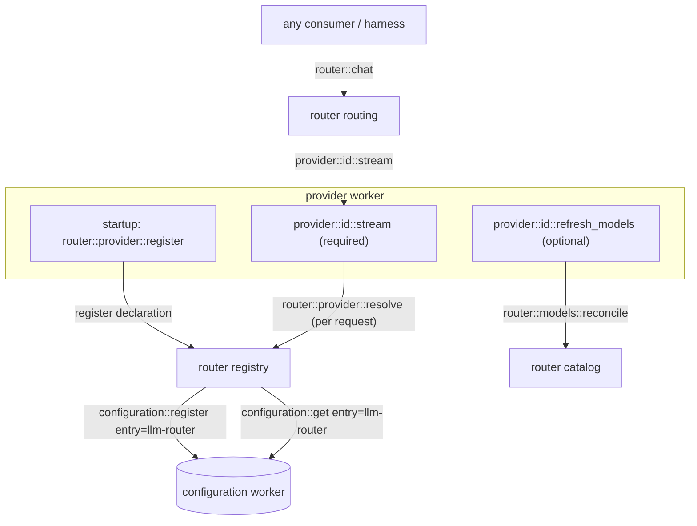

# llm-router

Worker prefix: `router::*` — plus the `provider::<id>::*` protocol it defines for provider workers.

## Definition

`llm-router` is the single front door to every LLM, and the protocol layer between consumers and
provider workers. A consumer never talks to a provider directly; it calls `router::chat` /
`router::complete` with a `model` and messages, and the router dispatches to the right provider. A
provider never talks to a consumer; it implements a narrow contract (`provider::<id>::stream`),
self-registers, and only ever talks back to the router.

The router owns five things:

1. **Routing** — map a `model` (and/or `provider`) to a `provider::<id>::stream` handler, from the
   live registry of declared providers. No hardcoded provider list.
2. **The provider registry** — providers self-declare at startup (`router::provider::register`); the
   router composes their config slices and resolves credentials per request
   (`router::provider::resolve`). Registration is identity-bound, idempotent, and survives boot
   ordering (see [Registration lifecycle](#registration-lifecycle)).
3. **Credentials & settings** — stored in the engine's built-in `configuration` worker under one
   `llm-router` entry; resolved centrally with env-var fallback. Provider workers never read keys
   from disk/env themselves.
4. **The model catalog** — capability records served from `router::models::*`, populated exclusively
   by provider discovery (`router::models::reconcile`); no baked-in seed of the router's own.
5. **The failure contract** — typed errors, timeouts, bounded retries, and cancellation are defined
   once, in the router (see [Stream liveness and cancellation](#stream-liveness-and-cancellation)
   and [Retries](#retries)). Providers implement protocol-specific recovery only; generic transport
   retries live in the router and nowhere else.

It is **consumer-agnostic**: it assumes no harness, session, or UI. It streams into a caller-supplied
channel and returns. That is exactly what lets a `third-party-worker` "use llm directly without
harness".

## Standalone use

- Any worker calls `router::chat` to stream a completion from whatever provider/model is configured,
  through one stable surface, swapping providers with zero call-site changes.
- A batch job calls `router::complete` for non-streaming one-shots.
- A model picker UI reads `router::models::list` and `router::provider::list`.

## The provider protocol



A provider worker MUST:

1. Register `provider::<id>::stream` honouring the channel-writer contract below.
2. Self-declare to the router at startup via `router::provider::register`, **retrying with backoff
   until acknowledged** (covers provider-before-router boot ordering), and **re-declare on
   `router::ready`** after a router restart (see [Registration lifecycle](#registration-lifecycle)).
3. Resolve credentials per request via `router::provider::resolve` (never read keys directly).
4. Treat closure of its stream channel as cancellation: abort the upstream request and stop writing
   frames (see [Stream liveness and cancellation](#stream-liveness-and-cancellation)).
5. Map upstream failures to the shared `ErrorKind` taxonomy on its `error` frames — five providers
   MUST NOT invent five taxonomies.
6. **Not** implement generic transport retries (429 / 5xx / connect errors) — retry policy is owned
   by the router (see [Retries](#retries)). Protocol-specific recovery stays provider-side (e.g. a
   local runtime auto-loading a cold model before re-issuing its own upstream request).

A provider worker MAY:

7. Register `provider::<id>::refresh_models` (live model discovery into the catalog).

### Provider stream contract

The router opens a channel and calls `provider::<id>::stream`. The iii SDK hydrates `writer_ref` into
a live `ChannelWriter` before the handler runs. The provider writes each `AssistantMessageEvent` as a
JSON text message, then closes. Terminal event is `done` or `error`.

```typescript
// Input (wire shape; writer_ref arrives hydrated as a ChannelWriter)
type ProviderStreamInput = {
  writer_ref: StreamChannelRef;     // direction "write"
  system_prompt?: string | null;
  model: string;
  messages: AgentMessage[];         // provider serialises to its own wire format
  tools?: AgentFunction[];          // provider adapter: maps to OpenAI/Anthropic "tools" array
  response_format?: { type: "json"; schema?: unknown }; // structured output; only sent to models
                                    // that declare the "structured_output" capability
  thinking_level?: ThinkingLevel;   // provider maps to its native knob or ignores
  max_output_tokens?: number;       // effective output budget, resolved + clamped by the router
                                    // (see Configuration § Output-token defaults)
  provider_options?: Record<string, unknown>; // this provider's passthrough slice, forwarded verbatim
  model_meta?: Model;               // optional hint: the catalog record at routing time
  resolution_key?: string;          // optional hint: lets the provider skip redundant resolve calls
};

type ProviderStreamOutput = { ok: boolean; status?: string };
```

`model_meta` and `resolution_key` are **optimizations, never sources of truth**: a provider MUST
behave identically when they are absent, and `router::provider::resolve` / `router::models::get`
remain authoritative. They exist so a many-call turn doesn't pay a resolve + catalog round-trip per
request — the router resolves once and forwards.

The `AssistantMessageEvent` union (see [README § Streaming events](README.md#streaming-events)) is
the **frozen, normative vocabulary** — new frame types are a contract revision, not a provider
choice. Per stream: `start` MUST come first and exactly one terminal `done`/`error` MUST come last
(the router synthesizes the terminal frame if the provider dies); the `*_start`/`*_delta`/`*_end`
triplets MUST be emitted for their block types; `usage` SHOULD be emitted as soon as usage is known
(including on streams that later fail); `ping` and `stop` MAY be emitted. Where a value appears both
mid-stream and on the terminal frame (`stop_reason`, `usage`), **the terminal frame is
authoritative** — `ChatResponse` copies are populated from it.

When a provider drops or degrades an unsupported request parameter (e.g. ignoring `thinking_level`
on a non-thinking model during a cold-catalog window) it SHOULD report-and-continue by appending to
`warnings` on the final `AssistantMessage` rather than failing the request, and MAY set
`native_stop_reason` to preserve the upstream's raw finish reason alongside the normalized
`StopReason`.

The router treats `provider::<id>::*` as an interface it *calls*, not functions it registers. See
[Authoring a provider](#authoring-a-provider).

### Stream liveness and cancellation

- **Heartbeat.** A provider SHOULD write `{ type: "ping" }` at least every 30s when the upstream is
  alive but producing no frames (long thinking stretches, queued requests). Consumers ignore `ping`.
- **Idle timeout.** The router applies an idle timeout per stream (default 120s without any frame;
  configurable in the `llm-router` entry). On expiry it cancels the provider call and writes a
  terminal `error` frame (`error_kind: "transient"`) to the caller's channel — a provider crash
  mid-stream can therefore never hang a consumer.
- **Cancellation.** [`router::abort`](#routerabort) (or the caller closing its read side) closes the
  provider's stream channel; channel closure **is** the abort signal, which a provider MUST honour
  by cancelling its upstream HTTP call — "the upstream keeps generating and billing to `max_tokens`
  after the user hit stop" is a contract violation. The router synthesizes the terminal frame if
  the provider exits without one.
- **Total budget.** The chain `consumer → router::chat → provider::<id>::stream` is two nested
  **sync** calls; SDK defaults (~30s) would kill any real turn. The router MUST set an explicit
  total-stream budget on its `provider::<id>::stream` call — default **300s**, configurable in the
  `llm-router` entry — and a consumer calling `router::chat` MUST use an outer timeout **≥ the
  router's inner budget** (outer ≥ inner, always; otherwise the consumer kills turns the router
  considers healthy). On expiry the router cancels the provider call and synthesizes the terminal
  `error` frame (`error_kind: "transient"`), exactly like the idle case.

### Retries

One retry policy, in the router, nowhere else:

- **What retries:** only `rate_limited` and `transient` failures (HTTP 429 / 5xx / connect errors).
  `auth_expired`, `context_overflow`, `permanent`, and all routing errors never retry.
- **When:** only **before the first frame has been relayed to the caller**. Once bytes have
  streamed, the failure is delivered as the `error` frame as specced — no silent restart of a
  half-delivered stream.
- **How much:** bounded — default 2 further attempts with capped exponential backoff + jitter,
  configurable in the `llm-router` entry.
- **Providers MUST NOT** layer generic retries underneath (stacked retry layers multiply worst-case
  latency unboundedly); protocol-specific recovery — a local runtime loading a cold model and
  re-issuing its own request — is allowed and stays inside the provider.

## Functions

Consumer-facing:

- `router::chat` — Stream a single assistant turn for a model into a caller-supplied channel; relays
  `AssistantMessageEvent` frames.
- `router::complete` — Non-streaming: return the final `AssistantMessage` (drains the stream
  internally).
- `router::abort` — Abort an in-flight `router::chat` stream by `request_id`.
- `router::models::list` — List available models, optionally filtered by provider/capability.
- `router::models::get` — Look up one model's capabilities by `(provider, id)`.
- `router::models::supports` — Check whether a model supports a capability.
- `router::provider::list` — Enumerate declared providers and their configured/available state.

Provider protocol (router side):

- `router::provider::register` — A provider self-declares its id, config schema, and defaults.
- `router::provider::resolve` — A provider resolves its credential + settings at request time.
  **Agent-gated** (see [Security](#security)).
- `router::provider::update_credential` — A provider persists a refreshed/rotated credential
  (OAuth). **Agent-gated.**
- `router::models::reconcile` — A provider replaces its catalog slice in one write.

## Triggers

### Trigger types emitted

The router registers three custom trigger types and fans out to bound handlers;
payloads are delivered verbatim (no envelope).

- **`router::models::changed`** — fires when the catalog changes (a provider reconciles). Payload:
  `{ provider: string; count: number }`. Lets pickers refresh reactively.
- **`router::provider::changed`** — fires when the provider registry changes (declare / availability
  flip). Payload: `{ provider: string; op: "register" | "available" | "unavailable" }`.
- **`router::ready`** — fires once when the router finishes booting. Providers bind to it and
  re-declare, so a router restart re-populates the registry without manual intervention (see
  [Registration lifecycle](#registration-lifecycle)).

Bind any of these the standard two-step way (see [README § Reactive pattern](README.md#reactive-pattern)):
`{ type: "router::models::changed", config: {} }` (and likewise for the other two types).

### Triggers bound

- **`router::on_worker_available`** bound to the engine topology trigger so the router notices
  provider workers connecting/disconnecting and flips availability (and can kick discovery):

```typescript
iii.registerFunction("router::on_worker_available", handler);
iii.registerTrigger({
  type: "subscribe",
  function_id: "router::on_worker_available",
  config: { topic: "engine::workers-available" },
});
```

  Topology events carry **worker ids**, not provider ids. The router maps between them using the
  worker-identity binding captured at `register` time (see
  [Registration lifecycle](#registration-lifecycle)). A worker connecting that has not registered
  any provider does **not** create an available provider; a provider flips `available: true` only
  when its bound worker is connected **and** its registration is complete.

- **`router::on_config_changed`** bound to the `configuration` worker's change trigger for the
  `llm-router` entry. The handler fingerprints each provider's config slice, diffs against the last
  seen fingerprint, and — debounced (~2s) — calls `provider::<id>::refresh_models` for each provider
  whose slice changed and that declared `supports_model_listing`. This is the **paste-a-key flow**:
  an operator adds an API key in the config UI → discovery runs → `router::models::reconcile` →
  `router::models::changed` → the picker populates within seconds, with no worker restart. Without
  this binding a key added at runtime would populate nothing until the provider worker restarts.

---

## API Reference

Shared types (`AgentMessage`, `AssistantMessage`, `AssistantMessageEvent`, `AgentFunction`, `Model`,
`ThinkingLevel`, `StreamChannelRef`, `Credential`, `Usage`) are defined in
[README.md § Cross-cutting contracts](README.md#cross-cutting-contracts).

### `router::chat`

Stream one assistant turn. The caller opens a channel and passes its `writer_ref`; the router resolves
the provider for `model`, calls `provider::<id>::stream`, and relays frames to the caller's channel
(or pipes the provider's writer through, implementation's choice). The call resolves when the stream
terminates.

- Invocation: **sync** (open while streaming — the bus's long-call pattern;
  [`harness::run`](harness.md#harnessrun) holds its call open the same way)

Request:

```typescript
type ChatRequest = {
  writer_ref: StreamChannelRef;     // direction "write"; the caller's channel
  request_id?: string;              // correlation id for router::abort + tracing; generated when omitted
  model: string;
  provider?: string;                // disambiguate when a model id exists on multiple providers
  system_prompt?: string | null;
  messages: AgentMessage[];
  tools?: AgentFunction[];          // provider adapter: maps to OpenAI/Anthropic "tools" array
  response_format?: { type: "json"; schema?: unknown };
                                    // provider-native structured output; requires the
                                    // "structured_output" capability (see Model capabilities)
  thinking_level?: ThinkingLevel;
  max_output_tokens?: number;       // optional override; clamped to the model's catalog ceiling
                                    // (see Configuration § Output-token defaults)
  provider_options?: Record<string, Record<string, unknown>>;
                                    // escape hatch, namespaced by provider id; the router forwards
                                    // only the routed provider's slice, verbatim. Keeps new provider
                                    // knobs from becoming protocol revs.
  metadata?: Record<string, unknown>; // passthrough for tracing (session_id, message_id, …)
};
```

The `tools` field is the **provider adapter boundary** — it maps to each provider's native
function-calling / tool-use API. In iii domain language these are [function invocation
schemas](README.md#function-invocation-schema), not "tools". The harness passes a single
`AgentFunction` entry for `agent_trigger` by default (per-function schemas in native exposure
mode); other callers may pass an empty array or their own schemas.

`response_format` is the same kind of boundary for structured output: providers map it to their
native JSON / JSON-Schema mode (e.g. OpenAI `response_format: json_schema`). Callers check
`router::models::supports(model, "structured_output")` first — supplying it for a model without the
capability throws before streaming starts, so callers can fall back (the harness falls back to its
`submit_result` strategy — see [harness.md § Output contract](harness.md#output-contract)).

Response:

```typescript
type ChatResponse = {
  ok: boolean;
  provider: string;
  model: string;
  stop_reason?: StopReason;
  usage?: Usage;
  error?: { code: string; message: string };  // present when ok === false; mirrors the throw code
                                              // or the error frame's error_kind
};
```

Streamed over the channel: a sequence of `AssistantMessageEvent`, terminating in `done` (carrying the
final `AssistantMessage`) or `error`. The router fills `usage.cost_usd` (on the `usage` frame and the
final message) from the catalog's `pricing` when the provider reports token counts but no cost. The
terminal frame is **authoritative** for `stop_reason`/`usage`; `ChatResponse` copies them from it
(including when the router relays rather than pipes through). On failed streams the final `error`
message SHOULD still carry the partial `Usage` when the provider reported it before dying.

Errors (thrown before streaming starts, in the
[`{ code, message }` convention](README.md#error-conventions)): `model is required`
(`router/invalid_request`); `no provider registered for model <id>`
(`router/no_provider_for_model`); `ambiguous model <id> (providers: …)` (`router/ambiguous_model`);
`unknown provider <id>` (`router/unknown_provider` — an explicit `provider` that is not registered
fails loudly, including typos); `provider <id> unavailable` (`router/provider_unavailable`);
`provider <id> not configured` (`router/not_configured` — a cloud provider with no usable
credential); `structured output unsupported for model <id>` (`router/structured_output_unsupported`
— a `response_format` was supplied but the model lacks the `structured_output` capability).
Mid-stream failures arrive as an `error` frame carrying an `ErrorKind`, not a thrown error.

Example:

```jsonc
// request
{
  "writer_ref": { "channel_id": "ch_1", "access_key": "…", "direction": "write" },
  "model": "claude-sonnet-4",
  "provider": "anthropic",
  "system_prompt": "You are concise.",
  "messages": [{ "role": "user", "content": [{ "type": "text", "text": "hi" }], "timestamp": 1 }],
  "tools": []
}
// channel frames (abbreviated)
{ "type": "start", "partial": { "role": "assistant", "content": [], "...": "..." } }
{ "type": "text_delta", "delta": "He", "partial": { "...": "..." } }
{ "type": "text_delta", "delta": "llo", "partial": { "...": "..." } }
{ "type": "usage", "usage": { "input": 12, "output": 2 } }
{ "type": "done", "message": { "role": "assistant", "content": [{ "type": "text", "text": "Hello" }], "stop_reason": "end", "model": "claude-sonnet-4", "provider": "anthropic", "timestamp": 2 } }
// response (after stream closes)
{ "ok": true, "provider": "anthropic", "model": "claude-sonnet-4", "stop_reason": "end", "usage": { "input": 12, "output": 2 } }
```

### `router::complete`

Non-streaming. Internally opens a channel, drains `router::chat`, returns the final message.

- Invocation: **sync**

```typescript
type CompleteRequest = Omit<ChatRequest, "writer_ref">;
type CompleteResponse = {
  message: AssistantMessage;
  usage?: Usage;
  provider: string;
  model: string;
};
```

### `router::abort`

Abort an in-flight stream. The router closes the provider's stream channel (closure **is** the
cancellation signal — see [Stream liveness and cancellation](#stream-liveness-and-cancellation))
and, if the provider has not already terminated, synthesizes a terminal `done` frame on the caller's
channel carrying the partial message with `stop_reason: "aborted"`. The original `router::chat` call
then resolves normally.

- Invocation: **sync**

```typescript
type AbortRequest = { request_id: string };
type AbortResponse = { aborted: boolean }; // false when unknown or already terminal
```

### `router::models::list`

- Invocation: **sync**

```typescript
type ModelsListRequest = {
  provider?: string;
  capability?: Capability;   // filter to models supporting it
};
type ModelsListResponse = { models: Model[] };
```

### `router::models::get`

- Invocation: **sync**

```typescript
type ModelsGetRequest = { provider: string; id: string };
type ModelsGetResponse = { model: Model } | null; // null when unregistered
```

### `router::models::supports`

- Invocation: **sync**

```typescript
type ModelsSupportsRequest = { provider: string; id: string; capability: Capability };
type ModelsSupportsResponse = { supported: boolean };
```

Unknown model or capability returns `{ supported: false }` — but for *request shaping* an unknown
model means "unknown", not "unsupported": see
[Capability defaults](#capability-defaults) for the cold-window rule. See
[Model capabilities](#model-capabilities) for what each capability means and how callers use it.

### `router::provider::list`

- Invocation: **sync**

```typescript
type ProviderInfo = {
  id: string;
  display_name: string;
  configured: boolean;          // has a usable credential (stored or via env)
  available: boolean;           // the provider worker is currently connected and registered
  supports_model_listing: boolean;
};
type ProviderListResponse = { providers: ProviderInfo[] };
```

`available` means the provider *worker* is reachable, not that the upstream API is healthy —
upstream health probes and cooldowns are out of MVP scope; an `available` provider can still fail a
request with a typed error.

### `router::provider::register`

Called by a provider worker at startup. The router merges the declaration's `config_schema` (or a
default `{ api_key (password), api_url, max_tokens }` derived from `defaults`) into the `llm-router`
configuration entry and (re)registers it, so the editable config shape grows with the running set of
providers.

- Invocation: **sync**

```typescript
type ProviderDeclaration = {
  id: string;                       // also the provider::<id>::* prefix and config key
  display_name?: string;
  credential_env_var?: string;      // fallback env var when no api_key configured (e.g. FOO_API_KEY)
  defaults?: { api_url?: string; max_tokens?: number; [k: string]: unknown };
  config_schema?: Record<string, unknown>; // custom JSON Schema; omit for the standard one
  supports_model_listing?: boolean;
  models?: Model[];                 // static catalog slice; reconciled at registration
};
type ProviderRegisterResponse = { ok: true; id: string };
```

When the declaration carries `models`, the router runs `router::models::reconcile` with them
immediately. A provider without live listing MUST declare its routable models here, so the catalog
never has silent holes — model-only routing and `context-manager`'s budget resolution
(`router::models::get`) both depend on catalog coverage; a missing record silently degrades a 200k
model to the conservative 8k fallback budget. Later `provider::<id>::refresh_models` discovery
replaces the slice.

Registration semantics (see [Registration lifecycle](#registration-lifecycle) for the full rules):

- **Idempotent** — re-registering the same id merges the declaration and **preserves operator-set
  config values**; declaration `defaults` never overwrite stored configuration.
- **Serialized** — the router serializes all registry/config-entry mutations through a single
  writer, so N providers booting concurrently cannot drop each other's schema slices via
  read-merge-write races.
- **Identity-bound** — the first registration binds the provider id to the calling worker's
  identity; later calls for that id from a different worker are rejected.

Secret-bearing fields in a custom `config_schema` MUST be marked write-only (`writeOnly: true` /
`format: "password"`), matching the default schema, so config UIs never echo stored keys.

### `router::provider::resolve`

Called by a provider worker per request to get its credential + effective settings. **Agent-gated**:
denied to in-run agents so a credential can't be exfiltrated through function calls (see
[Security](#security)). Worker-to-worker calls bypass the agent gate.

- Invocation: **sync**

```typescript
type ProviderResolveRequest = { id: string };
type ProviderResolveResponse = {
  configured: boolean;
  source: "config" | "env" | "none";
  credential: Credential | null;   // null when neither stored key nor env var present
  api_url?: string;
  max_tokens?: number;
};
```

### `router::provider::update_credential`

The write-back path for rotating credentials: an OAuth provider that refreshes an expired token
persists the new credential here — provider workers never write the configuration entry directly.
**Agent-gated** like `resolve` (see [Security](#security)).

- Invocation: **sync**

```typescript
type ProviderUpdateCredentialRequest = { id: string; credential: Credential };
type ProviderUpdateCredentialResponse = { ok: true };
```

### `router::models::reconcile`

Called by a provider to replace its catalog slice in one state write — the only catalog write path.

- Invocation: **sync**

```typescript
type ModelsReconcileRequest = { provider: string; models: Model[] };
type ModelsReconcileResponse = { provider: string; count: number };
```

Fires `router::models::changed`.

**Reconcile-to-empty guidance.** A provider MUST distinguish failure classes during discovery:

- **Auth failure** (invalid/revoked key) → reconcile to an **empty** slice; the models are genuinely
  unusable and the picker should reflect that.
- **Transient failure** (timeout, 5xx, network) → **do not reconcile**; keep the previous slice so a
  blip doesn't wipe a working catalog.

The empty reconcile doubles as the eviction path: catalog slices are not immortal, and removing a
provider's config slice (or letting an auth-failed discovery run) clears its models.

---

## Model capabilities

A `Model` (see [README § Model descriptor](README.md#model-descriptor)) is mostly a *capability
record*. Beyond `context_window` and `max_output_tokens`, it carries boolean flags and a few
quantitative fields that tell a caller what a model can do **before** a request is sent — so a
consumer adapts the request to the chosen model instead of hardcoding per-model behaviour.

### Capability strings

`router::models::supports` and the `capability` filter on `router::models::list` accept these
strings, each mapping to a field on `Model`:

- `tools` -> `supports_tools` — the model accepts function-calling (provider `tools` / tool-use API)
  and can emit `function_call` content. If false, callers must not attach invocation schemas.
- `vision` -> `supports_vision` — the model accepts `image` content blocks. If false, callers strip
  or textually describe images first.
- `cache` -> `supports_cache` — the provider supports prompt caching; the provider may insert cache
  markers to cut cost/latency on repeated prefixes.
- `structured_output` -> `supports_structured_output` — the provider can constrain decoding to JSON
  (optionally schema-guided) via a native `response_format`-style knob. If false, callers needing
  typed output use a function-calling fallback instead (the harness injects `submit_result` — see
  [harness.md § Output contract](harness.md#output-contract)).
- `thinking` -> `supports_thinking` — the model exposes a reasoning/thinking budget at all (a
  `thinking_level` of `"minimal"` likewise needs only this flag).
- `thinking:low` | `thinking:medium` | `thinking:high` -> still `supports_thinking` — the level picks
  a budget tier (mapped to the provider's native knob; see `thinking_budgets`).
- `thinking:xhigh` -> `supports_xhigh` — the model supports the extra-high reasoning tier specifically
  (a separate flag because not every thinking-capable model offers it).

Unknown strings return `{ supported: false }` and match no models.

### How callers use it

- **Discovery / model picker** — a UI lists only relevant models:
  `router::models::list({ capability: "tools" })` for an agent that needs function-calling, or
  `{ capability: "vision" }` for an image task.
- **Request shaping (harness)** — before a turn the harness checks `supports_tools` to decide whether
  to attach the `agent_trigger` invocation schema, `supports_vision` to decide whether to keep image
  blocks, `supports_thinking`/`supports_xhigh` to decide whether a requested `thinking_level` is
  honoured or dropped, and `supports_structured_output` to choose between provider-native
  `response_format` and the `submit_result` fallback for an
  [output contract](harness.md#output-contract). This is how one harness drives many models without
  per-model branches.
- **Budgeting (context-manager)** — `context::assemble` reads `context_window` / `input_limit` /
  `max_output_tokens` to size the usable window, and `thinking_budgets` to leave room for the
  reasoning tokens a thinking tier consumes.
- **Cost (a budget sibling)** — `pricing` lets a spend-tracking worker turn `Usage` into `cost_usd`.

### Catalog metadata sources

Live `/models` endpoints return little more than bare ids; nobody gets context windows, output
ceilings, thinking budgets, or pricing from them. Each provider is therefore expected to **embed
curated capability metadata** (e.g. a models.dev-derived snapshot, or the hand-maintained static
`models` slice in its declaration) and merge it with the live id list during discovery, submitting
the enriched records through the single `router::models::reconcile` write path. A provider that
reconciles bare ids degrades every downstream consumer — preflight sizing, output clamping,
thinking budgets — and should be treated as incomplete.

### Capability defaults

Capabilities come exclusively from provider discovery (`router::models::reconcile`) plus the static
declaration slice. For a **known** model, an absent flag reads as false: callers gate on the record.

For an **unknown** model (`models::get` → null — a cold window before a provider has registered, or
a slice pruned after a key outage), "unknown" means **unknown, not unsupported**. Request-shaping
callers MUST fail open — keep invocation schemas attached, keep image blocks, pass the requested
`thinking_level` through (providers MAY apply id-based heuristics, e.g. an OpenAI reasoning-model
id pattern) — and let the provider, the final arbiter, degrade or error. A literal
unknown-as-unsupported reading would strip images everywhere and drop thinking during every cold
window, including dropping the harness's own `agent_trigger` schema. Pickers and capability filters
simply don't list unknown models; only request shaping gets the permissive default.

## Configuration

One entry — id `llm-router` — in the built-in `configuration` worker holds provider credentials and
settings. Its `providers` JSON Schema is composed dynamically from each provider's declaration:

```jsonc
{
  "default_provider": "anthropic",   // optional; makes routing total (see Routing)
  "providers": {
    "anthropic": { "api_key": "sk-ant-…", "api_url": "https://api.anthropic.com/v1/messages", "max_tokens": 8192 },
    "openai":    { "api_key": "sk-…" },
    "lmstudio":  { "max_tokens": 8192 }   // local; no key needed
  },
  "routing_heuristics": [{ "pattern": "^gpt-", "provider": "openai" }]
}
```

> **Entry migration note.** In the previous-generation harness this content lived inside the single
> `harness` configuration entry, alongside a `permissions` block (`permissions.default_mode`). The
> split moves only the provider credentials/settings here; the permissions block is **re-homed to
> the harness's own configuration entry** — see [harness.md § Configuration](harness.md#configuration).
> Neither block may be silently dropped during migration.

### Output-token defaults

The effective `max_output_tokens` for a request is resolved by the router, once, with this
precedence — and forwarded as `ProviderStreamInput.max_output_tokens`:

1. **Explicit override** (request `max_output_tokens`, or the provider's configured `max_tokens`) —
   wins, clamped **down** to the model's catalog ceiling when known (a deliberate choice is
   honoured; the soft cap below does not apply), so an over-large value can't cause upstream 400s.
2. **Per-model default** — `min(model.max_output_tokens, soft cap)`. The soft cap defaults to
   **32 000** tokens (configurable in the `llm-router` entry), so high-output models (Claude
   64k/128k, GPT-5 272k) don't burn latency and cost on every routine turn.
3. **Unknown model** (cold catalog) — the provider's declared default (e.g. 8192).

## Routing

`decide(model, provider?)` resolves an **ordered candidate list** of `provider::<id>::stream`
targets — the MVP consumes `candidates[0]` only, but the list shape is specced now so fallback
chains can arrive later without a contract rev:

1. If `provider` is given and registered -> that provider (sole candidate). This MUST work on a
   **cold catalog**: an explicit-provider chat is routed with provider defaults even when the model
   id is not (yet) in the catalog. If `provider` is given but **not** registered -> throw
   `router/unknown_provider` (typo'd provider strings fail loudly — a deliberate change from the
   old silent-default behaviour).
2. Else, the unique provider whose catalog contains `model`. If **several** providers serve the same
   model id, the call fails with `ambiguous model <id> (providers: a, b)` — the caller must pass
   `provider`; the router never picks silently.
3. Else, an optional model-name heuristic from the `llm-router` configuration entry —
   `routing_heuristics: [{ pattern, provider }]`, first match wins (e.g.
   `{ "pattern": "^gpt-", "provider": "openai" }`).
4. Else, the configured `default_provider` when set.
5. Else -> throw `no provider registered for model <id>`.

With `default_provider` set, routing is a **total function** — cold boots, failed discovery, and
brand-new model ids degrade to the default provider instead of failing the turn. Deployments that
prefer loud failures simply leave it unset.

Routing reads the live registry; adding a provider worker makes its models routable with no router
change. Catalog uniqueness (step 2) applies to local runtimes too: a model that exists only in
lmstudio's slice routes to lmstudio implicitly — this deliberately revokes the old "never implicitly
route to local runtimes" guard. A local provider that doesn't want implicit traffic should simply
not reconcile those models into the catalog.

## Registration lifecycle

Three rules close the races and takeover surfaces inherent in self-registration:

1. **Identity binding.** The first successful `router::provider::register` for an id binds that
   provider id to the **calling worker's identity** (the engine-assigned worker identity on the
   call). Subsequent `register`, `reconcile`, `resolve`, and `update_credential` calls for that id
   MUST come from the same worker identity; mismatches are rejected. Re-binding to a new worker
   identity is an explicit operator action (config edit), not last-writer-wins. This also bounds
   `credential_env_var` as an env-read surface: a declaration can only name an env fallback for an
   id its own worker legitimately owns, so the registry can't be used to read arbitrary env vars
   (e.g. registering `id: "anthropic"` with `credential_env_var: "AWS_SECRET_ACCESS_KEY"`).
2. **Serialized merges.** All registry and `llm-router`-entry mutations funnel through one
   serialized writer in the router. Concurrent provider boots compose; no read-merge-write slice
   loss.
3. **Boot-order recovery.** Registration is not one-shot: providers retry `register` with backoff
   until acknowledged, and re-declare on `router::ready` after a router restart. The registry and
   catalog are durable in `iii-state`, so a restart restores the last known registry immediately
   and the re-declare pass reconciles it with reality.

## Security

Agent-gating relies on provenance propagation through nested triggers — see
[README § Security model](README.md#security-model).

Agent exposure (`iii-permissions.yaml`):

- **Deny to in-run agents:** `router::provider::resolve` and `router::provider::update_credential`
  (credential read/write), `router::provider::register` (provider spoofing),
  `router::models::reconcile` (catalog poisoning — it is the only catalog write path, deliberately
  carved out of the otherwise-safe `router::models::*` reads), and all of `configuration::*` (the
  entry carries plaintext keys). Provider workers and operator UIs call these as
  worker/user-initiated calls, which bypass the agent gate. The same four provider-protocol
  surfaces are additionally **identity-bound** (see
  [Registration lifecycle](#registration-lifecycle)), so even a trusted worker can't act on another
  worker's provider id.
- **Deny by default:** `router::chat` / `router::complete` / `router::abort` — not secret-bearing,
  but an agent that can call the router directly generates spend outside the harness loop's
  accounting and `max_turns` guard.
- **Safe:** `router::models::list` / `router::models::get` / `router::models::supports` /
  `router::provider::list`.

**Known limitation:** credentials are plaintext at rest inside the `llm-router` configuration entry
(parity with the previous harness; mitigated by the same deny rules above). Encryption at rest is
explicitly out of MVP scope and tracked as a future hardening item.

## Authoring a provider

To add a provider `foo`:

1. Implement `provider::foo::stream` honouring [the provider stream contract](#provider-stream-contract);
   write `AssistantMessageEvent` frames to the hydrated `writer_ref`, end with `done`/`error`, close.
   Honour [liveness and cancellation](#stream-liveness-and-cancellation): emit `ping` through silent
   stretches, abort the upstream request when the channel closes. Map upstream failures to
   `ErrorKind` on `error` frames, and leave generic retries to the router (see [Retries](#retries)).
2. At startup, call `router::provider::register` with
   `{ id: "foo", credential_env_var: "FOO_API_KEY", defaults, supports_model_listing, models }` —
   include the static `models` slice unless step 4 is implemented. Retry with backoff until
   acknowledged, and bind to `router::ready` to re-declare after router restarts.
3. In the stream handler, call `router::provider::resolve({ id: "foo" })` for the credential +
   `api_url`/`max_tokens` (or use the forwarded `resolution_key`/`model_meta` hints when present).
   Cloud providers throw `router/not_configured` on `credential: null`; local providers tolerate it.
   OAuth providers refresh expired tokens themselves and persist the result via
   `router::provider::update_credential`; on an upstream 401 (`auth_expired`), re-resolve once
   before failing the request — covering the race where a refresh landed mid-flight.
4. (Optional) Implement `provider::foo::refresh_models` -> `router::models::reconcile` for live model
   discovery, merging curated metadata per
   [Catalog metadata sources](#catalog-metadata-sources) and honouring the
   [reconcile-to-empty guidance](#routermodelsreconcile).

No router code changes: routing, config schema, and the picker all update from the declaration and
catalog.

## Dependencies

- `configuration` — the `llm-router` entry (credentials/settings) and its change trigger (the
  paste-a-key discovery binding).
- `iii-state` — model catalog and provider registry (both durable across router restarts).
- Engine channels (`engine::channels::create`, `StreamChannelRef`) — `router::chat` streaming.
  Not `iii-stream` (the durable `stream::*` store): the router uses only ephemeral
  point-to-point channels.
- Provider workers — one per upstream; discovered at runtime, not a build dependency.

## Boundaries

- Does **not** persist conversations or build context — pass full `messages` in each call (use
  [session-manager](session-manager.md) / [context-manager](context-manager.md) upstream).
- Does **not** run the agent loop, dispatch functions, or gate approvals — that is the
  [harness](harness.md).
- Does **not** seed models from a static list of its own — the catalog is provider-sourced via
  `router::models::reconcile` (live discovery, or the static `models` slice in a provider's
  declaration).
- Does **not** ship multi-tenant gateway machinery — virtual keys, per-key budgets, tpm/rpm rate
  limits, load-balancing strategies, response/semantic caching, guardrails hooks, spend dashboards,
  active health probes. Those exist to serve many untrusted tenants over HTTP; the single-tenant
  equivalents are covered by iii-permissions gating, the one credential store, and the `metadata`
  tracing seam.
