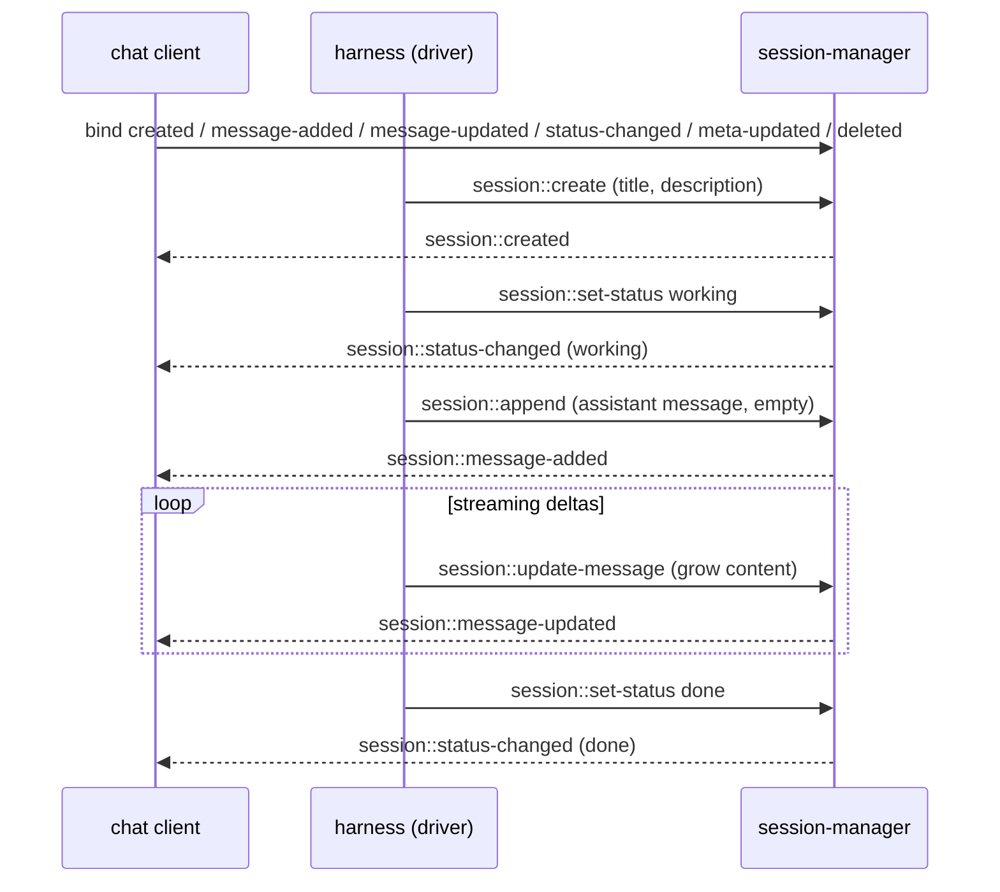

# session-manager

Worker prefix: `session::*`

## Definition

`session-manager` is the durable, reactive store for conversations. A session is an append-only log
of typed message entries (with optional fork branches; see [README § Session entries](README.md#session-entries)).
It carries a small amount of metadata — a `title`, a `description`, a coarse `status`, and an
app-defined `metadata` object — and the ordered messages that make up the conversation.

Two properties define it:

1. **Many message types.** It stores the full `AgentMessage` union — user, assistant,
   `function_result`, and `custom` — where content is the rich `ContentBlock[]` (text, image,
   thinking, function calls, function results). One transcript carries function calls, reasoning, images,
   and app-defined markers without a second store.
2. **Reactive.** State changes are exposed as **triggers other workers bind to** — not as a stream a
   caller has to publish into. The worker emits six trigger types: session created, message added,
   message updated, status changed, meta updated, and session deleted. **Every mutation has an
   event** — consumers subscribe once and render live with no polling and no separate publish call.

It is a **pure storage + notification surface**: it binds no triggers of its own and runs no agent
logic. It is independently useful as a real-time conversation database for any app.

## Session status

Every session has a coarse lifecycle status that consumers can render directly (a spinner, a "done"
badge, a list filter):

- `idle` — created and waiting; no work has run yet.
- `working` — the agent is thinking/responding (a turn is running).
- `done` — the agent finished the job (completed or cancelled) and the session is at rest.
- `error` — the last turn failed; the optional `status_reason` carries a short cause. Distinct from
  `done` so a **standalone** UI can render failures without asking the harness.

`session::create` starts a session at `idle`. The driver (typically the [harness](harness.md)) sets
`working` when a turn starts, `done` when it completes or is cancelled, and `error` when it fails,
via [`session::set-status`](#sessionset-status), which fires
[`session::status-changed`](#trigger-types-emitted).

## Standalone use

- A web/mobile chat app uses it as the source of truth and binds the trigger types for real-time
  UI, with or without the harness.
- A multi-channel bot stores every conversation here and forks sessions to explore alternatives.
- A dashboard binds `session::status-changed` to show which sessions are working vs done.

## Sub-agent linkage

When the [harness](harness.md#sub-agents-harnessspawn) spawns a sub-agent, the child is a normal
session whose relationship to its parent lives in `SessionMeta.metadata`:
`{ parent_session_id, parent_turn_id, function_call_id, depth }`. This is a convention, not new API
surface — `session::list` filters on it to reconstruct the agent tree, and trigger configs filter
on it to render a child's transcript live (e.g. `{ metadata: { parent_session_id: "s_7a1" } }` on
`session::message-updated`). Children are fully independent sessions: deleting the parent does not
cascade (a cleanup worker can walk the linkage metadata when a deployment wants that).

## Reactivity model

There is no "subscribe" or "publish" function. Reactivity is entirely via the six emitted trigger
types; a consumer binds handlers with the standard two-step pattern (see
[README § Reactive pattern](README.md#reactive-pattern)).

Streaming an assistant reply uses the same primitives as everything else: the driver appends an
(initially empty) assistant message — which fires `session::message-added` — then calls
`session::update-message` as tokens arrive — each firing `session::message-updated`. Updates may be
batched/throttled by the driver. Consumers render the growing message from those updates. Each
update carries a server-assigned monotonic `revision`; trigger deliveries may arrive out of order,
so consumers keep the highest revision per entry (last-write-wins on full-message snapshots).



## Functions

Lifecycle:

- `session::create` — Create a session with a `title` + `description` at status `idle`; fires
  `session::created`.
- `session::ensure` — Idempotently ensure a session with a given id exists.
- `session::get` — Read one session's metadata.
- `session::list` — List sessions with pagination/ordering.
- `session::set-meta` — Update a session's `title`/`description`/`metadata` (e.g. an auto-generated
  title); fires `session::meta-updated`.
- `session::set-status` — Set status `idle`/`working`/`done`/`error`; fires `session::status-changed`.
- `session::delete` — Delete a session and its entries; fires `session::deleted`.

Messages:

- `session::append` — Append one message entry; fires `session::message-added`.
- `session::append-many` — Append several message entries; fires `session::message-added` per entry.
- `session::update-message` — Replace the content of a message entry; fires `session::message-updated`.
- `session::messages` — Load the active-path `AgentMessage[]` (with entry ids), oldest first;
  supports pagination and role filtering.
- `session::get-message` — Read a single entry by id.

Branching:

- `session::fork` — Copy history up to an entry into a new session (copy-on-fork: fresh entry ids);
  fires `session::created` for the new session.
- `session::set-active-leaf` — Move the active path to end at a given entry (branch switch).

## Triggers

### Trigger types emitted

All six are custom trigger types this worker registers. Bind a handler with the two-step pattern
(see [README § Reactive pattern](README.md#reactive-pattern)); the config object filters which events
reach the handler. Every config additionally accepts `metadata?: Record<string, unknown>` — an
equality match against `SessionMeta.metadata` — so a multi-tenant consumer binds to only its own
sessions (e.g. `{ metadata: { owner: "u_1" } }`).

```typescript
type SessionStatus = "idle" | "working" | "done" | "error";
```

- **`session::created`** — a new session exists (via `session::create` or `session::fork`).
  - Config: `{}` (no filters).
  - Payload:

```typescript
type SessionCreatedEvent = {
  session_id: string;
  title: string;
  description: string;
  status: SessionStatus;        // "idle" on create
  forked_from?: string | null;  // source session id when created by fork
  created_at: number;
};
```

- **`session::message-added`** — a message was appended.
  - Config: `{ session_id?: string; roles?: Role[] }`.
  - Payload:

```typescript
type MessageAddedEvent = {
  session_id: string;
  entry_id: string;
  parent_id: string | null;
  message: AgentMessage;
  origin?: Record<string, unknown>; // writer-supplied correlation (e.g. { turn_id })
  timestamp: number;
};
```

- **`session::message-updated`** — a message's content changed (e.g. streaming deltas, edited
  function output).
  - Config: `{ session_id?: string; roles?: Role[] }`.
  - Payload:

```typescript
type MessageUpdatedEvent = {
  session_id: string;
  entry_id: string;
  message: AgentMessage;        // the full updated message
  revision: number;             // monotonic per entry; consumers keep the highest
  origin?: Record<string, unknown>; // writer-supplied correlation (e.g. { turn_id })
  timestamp: number;
};
```

- **`session::status-changed`** — a session's status changed.
  - Config: `{ session_id?: string }`.
  - Payload:

```typescript
type StatusChangedEvent = {
  session_id: string;
  status: SessionStatus;
  previous_status: SessionStatus;
  status_reason?: string;       // short cause, set on "error"
  timestamp: number;
};
```

- **`session::meta-updated`** — a session's `title`/`description`/`metadata` changed.
  - Config: `{ session_id?: string }`.
  - Payload:

```typescript
type MetaUpdatedEvent = {
  session_id: string;
  title: string;
  description: string;
  metadata?: Record<string, unknown>;
  timestamp: number;
};
```

- **`session::deleted`** — a session and its entries were removed.
  - Config: `{ session_id?: string }`.
  - Payload:

```typescript
type SessionDeletedEvent = { session_id: string; timestamp: number };
```

Example binding (live-render every assistant delta for one session):

```typescript
iii.registerFunction("ui::on_message_updated", async (evt) => render(evt.entry_id, evt.message));
iii.registerTrigger({
  type: "session::message-updated",
  function_id: "ui::on_message_updated",
  config: { session_id: "s_123", roles: ["assistant"] },
});
```

### Triggers bound

None. `session-manager` only emits; it subscribes to nothing.

---

## API Reference

Shared types (`AgentMessage`, `SessionEntry`, `ContentBlock`, `Role`) are defined in
[README.md § Cross-cutting contracts](README.md#cross-cutting-contracts).

```typescript
type SessionMeta = {
  session_id: string;
  title: string;
  description: string;
  status: SessionStatus;          // "idle" | "working" | "done" | "error"
  status_reason?: string;         // short cause, set on "error"
  metadata?: Record<string, unknown>; // app-defined; the tenancy hook (e.g. { owner: "u_1" })
  forked_from?: string | null;
  created_at: number;
  updated_at: number;
  message_count: number;
};
```

### `session::create`

Create a session at status `idle`. `title`/`description` may be supplied up front (e.g. derived from
the opening message) and refined later with `session::set-meta`. `metadata` is persisted onto
`SessionMeta` — it is the tenancy hook (e.g. `{ owner: "u_1" }`) that `session::list` and every
trigger config can filter on. Fires `session::created`.

- Invocation: **sync**

```typescript
type CreateRequest = {
  title?: string;                 // default ""
  description?: string;           // default ""
  metadata?: Record<string, unknown>;
};
type CreateResponse = { session_id: string; meta: SessionMeta };
```

Example:

```jsonc
// request
{ "title": "Weather question", "description": "User asks about today's forecast." }
// response
{ "session_id": "s_123", "meta": { "session_id": "s_123", "title": "Weather question",
  "description": "User asks about today's forecast.", "status": "idle", "created_at": 1717800000000,
  "updated_at": 1717800000000, "message_count": 0 } }
```

### `session::ensure`

- Invocation: **sync**. Fires `session::created` only when it creates the session.

```typescript
type EnsureRequest = {
  session_id: string;
  title?: string;
  description?: string;
  metadata?: Record<string, unknown>; // applied only when the session is created
};
type EnsureResponse = { session_id: string; meta: SessionMeta; created: boolean };
```

### `session::get`

- Invocation: **sync**

```typescript
type GetRequest = { session_id: string };
type GetResponse = { meta: SessionMeta } | null; // null when unknown
```

### `session::list`

- Invocation: **sync**

```typescript
type ListRequest = {
  limit?: number;        // default 50
  cursor?: string;       // opaque pagination cursor
  status?: SessionStatus; // optional filter
  metadata?: Record<string, unknown>; // equality filter against SessionMeta.metadata (tenancy)
  order?: "created_asc" | "created_desc" | "updated_desc"; // default updated_desc
};
type ListResponse = { sessions: SessionMeta[]; next_cursor?: string };
```

### `session::set-meta`

Update `title`/`description`/`metadata` (e.g. once a titling worker generates them from the first
exchange). Does not change status or messages. Fires `session::meta-updated`, so consumers render
new titles live instead of polling `session::get`. A supplied `metadata` object replaces the stored
one.

- Invocation: **sync**

```typescript
type SetMetaRequest = {
  session_id: string;
  title?: string;
  description?: string;
  metadata?: Record<string, unknown>;
};
type SetMetaResponse = { meta: SessionMeta };
```

### `session::set-status`

Set the session status. Fires `session::status-changed`. No-op (no event) if the status is unchanged.
`reason` is stored as `status_reason` (typically set with `error`, cleared on any other status).

- Invocation: **sync**

```typescript
type SetStatusRequest = { session_id: string; status: SessionStatus; reason?: string };
type SetStatusResponse = { status: SessionStatus; previous_status: SessionStatus };
```

### `session::delete`

Delete a session and its entries. Fires `session::deleted`. Forks are copies (see
[`session::fork`](#sessionfork)), so deleting a source session never affects sessions forked from it.

- Invocation: **sync**

```typescript
type DeleteRequest = { session_id: string };
type DeleteResponse = { deleted: boolean };
```

### `session::append`

Append one message entry. The entry id and `parent_id` are assigned by the worker (parent = current
active leaf) unless provided. Appending moves the active leaf to the new entry. Fires
`session::message-added`. **Idempotent on `entry_id`**: appending an id that already exists is a
no-op — the existing entry is returned and no event fires (this is what makes the harness's
redelivered steps safe; see [harness.md § Durability & idempotency](harness.md#durability--idempotency)).

- Invocation: **sync**

```typescript
type AppendRequest = {
  session_id: string;
  message: AgentMessage;
  parent_id?: string;           // override the parent (default: active leaf); also moves the active leaf
  entry_id?: string;            // caller-supplied id for idempotent appends
  origin?: Record<string, unknown>; // opaque correlation (e.g. { turn_id }), echoed on events
};
type AppendResponse = { entry_id: string; parent_id: string | null; timestamp: number };
```

Example:

```jsonc
// request
{
  "session_id": "s_123",
  "message": {
    "role": "user",
    "content": [{ "type": "text", "text": "What's the weather?" }],
    "timestamp": 1717800000000
  }
}
// response
{ "entry_id": "e_001", "parent_id": null, "timestamp": 1717800000000 }
```

### `session::append-many`

- Invocation: **sync**. Fires `session::message-added` for each appended entry, in order. Not
  idempotent — use `session::append` with `entry_id` where redelivery is possible.

```typescript
type AppendManyRequest = {
  session_id: string;
  messages: AgentMessage[];
  parent_id?: string;
  origin?: Record<string, unknown>;
};
type AppendManyResponse = { entry_ids: string[]; last_entry_id: string };
```

### `session::update-message`

Replace the content (and optionally `details`) of an existing message entry. Used for streaming
assistant deltas and for edited function output. Fires `session::message-updated`. Each successful
update increments the entry's `revision` (echoed on the event). Pass `expected_revision` for
optimistic concurrency: on mismatch nothing is written and `{ updated: false, revision }` returns
the current revision.

- Invocation: **sync**

```typescript
type UpdateMessageRequest = {
  session_id: string;
  entry_id: string;
  content: ContentBlock[];   // new content for the message
  details?: unknown;         // for function_result entries
  expected_revision?: number; // optimistic concurrency: no-op on mismatch
  origin?: Record<string, unknown>; // correlation echoed on the event
};
type UpdateMessageResponse = { updated: boolean; revision: number };
```

### `session::messages`

Load the active path as `AgentMessage[]`, each paired with its `entry_id`, oldest first. By default
only `kind: "message"` entries are returned; `include_custom` interleaves `kind: "custom"` entries
at their path position (how the harness finds its compaction record — see
[harness.md § Compaction persistence](harness.md#compaction-persistence)).

- Invocation: **sync**

```typescript
type MessagesRequest = {
  session_id: string;
  limit?: number;
  cursor?: string;
  roles?: Role[];                 // filter by role
  from_entry_id?: string;         // treat this entry as the leaf: return its parent chain,
                                  // root -> entry, oldest first (branch view)
  include_custom?: boolean;       // default false
};
type MessagesResponse = {
  messages: Array<{
    entry_id: string;
    message?: AgentMessage;                          // kind "message"
    custom?: { custom_type: string; data: unknown }; // kind "custom" (with include_custom)
  }>;
  next_cursor?: string;
};
```

### `session::get-message`

- Invocation: **sync**

```typescript
type GetMessageRequest = { session_id: string; entry_id: string };
type GetMessageResponse = { entry: SessionEntry } | null;
```

### `session::fork`

**Copy-on-fork**: copy every entry on the path from the root to `entry_id` into a new session with
fresh entry ids (the parent chain is preserved structurally); the new session's active leaf is the
copy of `entry_id`. After the fork the two sessions are fully independent — mutating or deleting one
never affects the other. Shared-structure storage is a permitted backend optimisation, not part of
the contract. Fires `session::created` for the new session (`forked_from` set to the source).

- Invocation: **sync**

```typescript
type ForkRequest = { session_id: string; entry_id: string; title?: string };
type ForkResponse = { session_id: string; meta: SessionMeta };
```

### `session::set-active-leaf`

Switch the active path to end at `entry_id` (switching to a non-leaf makes the chain above it the
active path). Subsequent `session::append` without `parent_id` chains from here. Appending with an
explicit `parent_id` also moves the active leaf to the new entry.

- Invocation: **sync**

```typescript
type SetActiveLeafRequest = { session_id: string; entry_id: string };
type SetActiveLeafResponse = { active_leaf: string };
```

---

## State

| Scope | Key shape | Value |
|---|---|---|
| `session:<session_id>` | `<entry_id>` | `SessionEntry` (`message` or `custom`) |
| `session_meta` | `<session_id>` | `SessionMeta` (incl. `title`, `description`, `status`) |
| `session_active_leaf` | `<session_id>` | `<entry_id>` (current active-path leaf) |

The **parent chain is the order**: the active path is the walk from the active leaf to the root,
reversed. `timestamp` is informational, never authoritative (an implementation on a key-less state
listing may re-sort by `(timestamp, id)` internally while rebuilding the chain, but that is not part
of the contract). Backends are pluggable: a filesystem backend (default; one append-only JSONL file
per session, replayed last-wins) and a bridge backend that defers raw storage — and event fan-out —
to a main session-manager on another iii instance via an internal `session::store::*` protocol; a
future SQL/blob backend can implement the same interface.

## Dependencies

- Storage backend (per deployment): filesystem `data_dir` (default), or a main session-manager
  instance reached over the bus (bridge mode).
- Registers six custom trigger types (`session::created`, `session::message-added`,
  `session::message-updated`, `session::status-changed`, `session::meta-updated`,
  `session::deleted`) and emits their events through the engine on every relevant mutation.

## Agent exposure

Deny-by-default for in-run agents (see [README § Security model](README.md#security-model)). An
agent that can write here can rewrite its own transcript, flip session status, or destroy history:

- **Deny:** `session::create`, `session::ensure`, `session::append`, `session::append-many`,
  `session::update-message`, `session::set-status`, `session::set-meta`, `session::set-active-leaf`,
  `session::fork`, `session::delete`.
- **Allow with care:** `session::get`, `session::list`, `session::messages`, `session::get-message`
  — read-only, but in multi-tenant deployments they leak other owners' sessions; deny unless the
  deployment is single-tenant.

## Boundaries

- Does **not** run agent logic, call LLMs, or build context — it only stores and notifies.
- Does **not** compact or summarise history — the full transcript is kept; condensing it for the
  model window is a transient concern of [context-manager](context-manager.md).
- Does **not** export or render transcripts (HTML/PDF/etc.) — that is a separate worker's concern.
- `custom` entries are an app escape hatch — keep large blobs in a blob store and reference them, not
  inline, to keep entries small.
- Does **not** authenticate callers or enforce tenancy — `SessionMeta.metadata` is the hook
  consumers filter on (list + trigger configs); access control lives in the deployment's permissions
  (see [README § Security model](README.md#security-model)).
