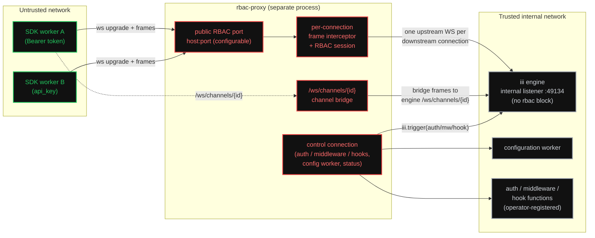
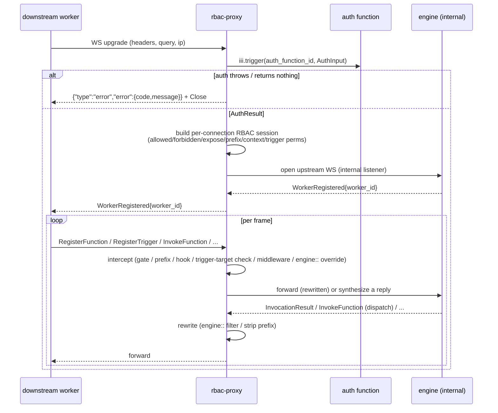

# RBAC Proxy Worker

A single standalone iii worker — `rbac-proxy` — that puts the engine's role-based
access control **in front of** the engine instead of inside it. It opens its own
configurable WebSocket port, speaks the iii worker protocol verbatim, and
transparently proxies every frame (functions **and** channels) to a trusted
engine listener — authenticating the connection, gating each invocation,
namespacing registrations, gating trigger bindings to permitted targets, running
middleware and registration hooks, and
**rewriting the results of the built-in `engine::*` discovery functions** so a
caller only ever sees what its boundaries allow.

It is the [`console`](../../console) reverse-proxy pattern (`src/proxy.rs`: one
outbound engine WebSocket per inbound connection, frames shuttled 1:1) with an
RBAC interceptor spliced into the middle and a second proxied route for
channels.

## Why this exists (and how it relates to the engine's `worker-gateway`)

The same RBAC surface already ships **inside** the engine. The
`iii-worker-manager` built-in opens one or more WebSocket listeners, and any
non-first listener can carry its own `auth_function_id`, `middleware_function_id`,
`expose_functions`, forbidden/allowed lists, `function_registration_prefix`, and
the three registration hooks; channels are mounted per listener at
`/ws/channels/{channel_id}`. The in-flight dev-experience overhaul goes further
and promotes that listener to a first-class engine concept,
[`worker-gateway`](../../../iii/tech-specs/2026-06-devexp/engine-and-gateway.md),
configured from the `worker-compose.yml` `gateway:` block — and **deletes** the
`iii-worker-manager` worker.

So this spec deliberately moves in the opposite direction: it re-homes the same
RBAC contract into an **out-of-process** worker. That is the entire point — the
properties a proxy worker has that an engine-native listener cannot:

| Property | Engine-native (`worker-gateway`) | `rbac-proxy` (this spec) |
|---|---|---|
| Where RBAC runs | In the engine process | A separate process / pod |
| Can front a **remote or managed** engine you don't own (hosted iii, a teammate's engine) | No — RBAC config is engine/compose config | **Yes** — it is just another worker pointed at an engine URL |
| Deploy / scale / restart / harden independently of the engine | No | **Yes** |
| Blast radius of an auth bug | The engine | The proxy only |
| Filters the `engine::*` discovery results to the caller | Partial — only `engine::functions::list` / `::info` are session-aware, and only **in-process** | **All eight** discovery functions, rewritten client-side (see [engine-overrides.md](engine-overrides.md)) |
| Wire protocol | iii worker protocol, unchanged | iii worker protocol, unchanged |

This is not a re-implementation of the engine for its own sake. The crucial
architectural consequence — derived in [rbac.md § The proxy has no
`Session`](rbac.md#the-proxy-has-no-engine-session) — is that a worker connected
over WebSocket receives **no in-process `Session` object**, so it cannot ask the
engine to filter on its behalf. The proxy therefore re-derives each downstream
connection's boundaries itself and rewrites every response client-side. The RBAC
logic is **vendored** from the engine (`is_function_allowed`, the wildcard
matcher, the infrastructure carve-out) so behaviour is byte-for-byte identical to
a `worker-gateway` listener — the proxy is just a different *home* for it.

> **Coexistence / migration.** `rbac-proxy` and `worker-gateway` are not
> mutually exclusive and do not collide: the engine runs its trusted internal
> listener with **no** `rbac` block, and the proxy is the only public door. A
> deployment can run the engine-native gateway, the proxy, or both (e.g. the
> gateway for co-located trusted workers and the proxy for an external tenant
> tier). Nothing in this spec changes the engine; it is pure worker code against
> the existing protocol.

## Architecture

The proxy maintains **two kinds of engine connection**:

- **One control connection** — the proxy's own worker identity (like `console`'s
  `register_worker(...)`). It registers `rbac-proxy::status`, integrates with the
  `configuration` worker, and invokes the operator's `auth` / `middleware` /
  registration-hook functions via `iii.trigger`. This mirrors how the engine's
  own worker-manager calls those functions with `engine.call(...)`.
- **One data connection per downstream worker** — exactly the `console` model: a
  fresh outbound WebSocket to the engine's internal listener, frames pumped both
  ways, but with the interceptor between the two halves. Per-connection identity,
  per-connection registrations, and cleanup-on-disconnect all fall out of the
  engine's existing per-connection semantics for free.

## The request lifecycle

Each numbered concern has a home:

1. **Authenticate on upgrade** — [rbac.md § Authentication](rbac.md#authentication).
2. **Gate every invocation** — [rbac.md § Access resolution](rbac.md#access-resolution-order).
3. **Gate trigger bindings** — [rbac.md § Trigger registration RBAC](rbac.md#trigger-registration-rbac)
   (verify the bound `function_id` before forwarding `RegisterTrigger`).
4. **Namespace registrations** — [rbac.md § Function registration prefix](rbac.md#function-registration-prefix)
   and the wire rewrites in [protocol-interception.md](protocol-interception.md).
5. **Middleware & registration hooks** — [rbac.md § Middleware](rbac.md#middleware)
   and [§ Registration hooks](rbac.md#registration-hooks).
6. **Filter `engine::*` results** — the new addition, [engine-overrides.md](engine-overrides.md).
7. **Bridge channels** — [protocol-interception.md § Channel bridge](protocol-interception.md#channel-bridge).

## Conventions

This worker follows the repo conventions documented in
[`workers/docs`](../../docs): the binary-worker SOP
([`sops/binary-worker.md`](../../docs/sops/binary-worker.md)) for structure, and
the `configuration`-worker SOP
([`sops/configuration.md`](../../docs/sops/configuration.md)) for hot-reloadable
config.

- **Function ids** are kebab-case `<worker>::<verb>`: `rbac-proxy::status`,
  `rbac-proxy::on-config-change`. Never snake_case.
- **Typed handlers only.** Every registered function uses a concrete
  `JsonSchema`-deriving input/output struct — never a `serde_json::Value`
  handler (binary-worker.md §7).
- **No committed `config.yaml`.** Runtime config lives in the `configuration`
  worker under id `rbac-proxy`; `WorkerConfig::default()` seeds first boot.
- **Two-step reactive binding** (`registerFunction` then `registerTrigger`) for
  the one trigger the proxy binds (its own `configuration` change feed).

## Spec index

- [rbac-proxy.md](rbac-proxy.md) — the worker: the two connection planes, file
  layout (mirroring `console`), `configuration`-worker integration and the
  port-rebind hot reload, the functions it registers, deployment, boundaries,
  agent exposure, dependencies, and testing.
- [rbac.md](rbac.md) — the RBAC contract, structured exactly like the existing
  [`worker-rbac.mdx`](../../../iii/docs/0-11-0/how-to/worker-rbac.mdx) how-to:
  auth function, `expose_functions`, middleware, the three registration hooks,
  channels, full example config, and the types reference — adapted to the proxy.
- [protocol-interception.md](protocol-interception.md) — the iii worker wire
  protocol the proxy parses, the per-frame interception/rewrite rules, the
  out-of-band rejection frame, the prefix mechanics, request/response
  correlation, and the channel bridge.
- [engine-overrides.md](engine-overrides.md) — **the new addition**: how the
  proxy rewrites the results of the eight discovery functions among the nine
  `EngineFunctions` (`iii/sdk/packages/rust/iii/src/engine.rs:15-25`) to the
  caller's boundaries — with a per-function filter table, the catalog/binding
  caches the rewrites depend on, and the worker-internals leak policy.

## Prior art

- [`console`](../../console) — the binary worker whose `src/proxy.rs` /
  `src/server.rs` / `src/main.rs` this worker mirrors for the proxy machinery and
  graceful-shutdown lifecycle.
- [`iii-worker-manager`](../../../iii/engine/src/workers/worker/README.md) — the
  engine built-in whose RBAC contract this worker re-homes. Its
  `rbac_config.rs` / `rbac_session.rs` are the source of truth the proxy
  vendors.
- [`worker-rbac.mdx`](../../../iii/docs/0-11-0/how-to/worker-rbac.mdx) — the
  operator-facing how-to whose structure [rbac.md](rbac.md) preserves.
- [`2026-06-devexp/engine-and-gateway.md`](../../../iii/tech-specs/2026-06-devexp/engine-and-gateway.md)
  — the overhaul that turns the listener into the engine-native `worker-gateway`;
  the architectural foil for this spec.
- [`approval-gate`](../../approval-gate) / [`context-manager`](../../context-manager)
  — the Tier-1 `configuration`-worker integration (ConfigCell + targeted
  rebuild) this worker copies.
