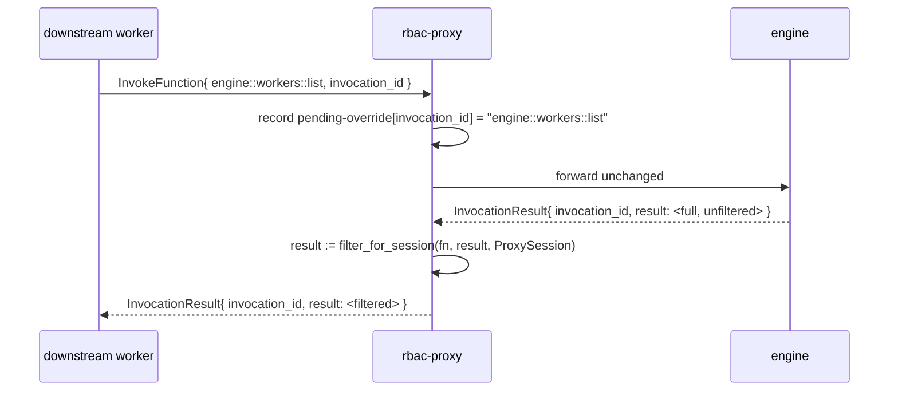

# Engine function overrides

This is the addition over the engine's RBAC contract. An engine RBAC listener
gates **invocation** of functions, but it only partially filters the
**discovery** surface. `EngineFunctions`
(`iii/sdk/packages/rust/iii/src/engine.rs:15-25`) holds **nine** ids — **eight
discovery surfaces** (`engine::functions::list/info`,
`engine::workers::list/info`, `engine::triggers::list/info`,
`engine::registered-triggers::list/info`) plus `engine::workers::register` (a
write/setup call in the infrastructure carve-out). Of the eight discovery
functions, just `engine::functions::list` and `engine::functions::info` are
session-aware in the engine, and even those filter against an in-process
`Session` a remote proxy never has (see
[rbac.md § The proxy has no engine `Session`](rbac.md#the-proxy-has-no-engine-session)).
The result is that a gated worker that *can* reach the discovery functions (they
are gated by `expose_functions` like any other function — they are **not** in
the carve-out) can still *enumerate* — via `engine::workers::list`,
`engine::triggers::list`, `engine::registered-triggers::list`, and the `::info`
variants — functions, workers, and triggers it can never call, including their
schemas, owners, and host metadata.

`rbac-proxy` closes that gap. It **result-filters the eight discovery functions**
and rewrites their results to the caller's boundaries before they reach the
downstream worker, so discovery shows exactly the surface the caller is allowed
to invoke — nothing more. The ninth id, `engine::workers::register`, is
intercepted only as the session's own setup call (carve-out pass-through, no
result rewrite).

## How the override works

The override does not replace the engine's implementation — the engine still
computes the answer. The proxy intercepts the **request** to record that this
`invocation_id` is an overridable `engine::*` call, lets the engine compute the
full result, then intercepts the **result** and filters it. Two of the eight
discovery functions cannot be filtered from their own response alone — a trigger
**type** carries no function binding, and `engine::workers::list` carries a
`function_count` but no per-function ids — so the filter also consults the
proxy's [catalog & binding caches](#catalog--binding-caches):



The filter predicate is the **same vendored `is_function_allowed`** used on the
invocation path ([rbac.md § Access resolution](rbac.md#access-resolution-order)),
applied to every function id that appears anywhere in a discovery result. A
result entry survives iff the caller would be allowed to invoke the function it
refers to. This guarantees the discovery surface and the invocation surface can
never disagree.

## Per-function rewrite table

`A(id)` below means "`is_function_allowed(id)` against this connection's
`ProxySession`" — i.e. the access-resolution decision flow. `strip(id)` removes
the session's own `{prefix}::` ([Prefix in results](#prefix-in-results)).

| Function | Request | Result rewrite | Empty / denied policy |
|---|---|---|---|
| `engine::functions::list` | pass through | keep `functions[]` entries where `A(function_id)`; `strip` ids and worker names | return the (possibly empty) filtered list |
| `engine::functions::info` | pass through | if `!A(function_id)` → error; else `strip` ids; drop `registered_triggers[]` whose target fails `A` | **`FORBIDDEN`** when `!A(function_id)` (engine parity — see note); `NOT_FOUND` when genuinely missing |
| `engine::triggers::list` | pass through | trigger **types** are capability metadata (`id`, `worker_name`, `description` — no function binding, no caller data), so pass through by default. **Optional hardening:** hide a type that exists *solely* to serve denied functions, derived from the [binding index](#catalog--binding-caches) | unchanged (or hardened-filtered) list |
| `engine::triggers::info` | pass through | recompute `instance_count` to the accessible subset via the [binding index](#catalog--binding-caches) so it cannot leak how many *hidden* functions use the type; keep schemas | visible by default (capability metadata); `NOT_FOUND` under optional hardening when all bindings are denied |
| `engine::registered-triggers::list` | pass through | drop entries where `!A(function_id)`; `strip` `function_id` | filtered list |
| `engine::registered-triggers::info` | pass through | deny if `!A(function_id)`; null out nested `function` / `trigger` envelopes that reference denied functions | `FORBIDDEN` when `!A(function_id)` |
| `engine::workers::list` | pass through | resolve each worker's function set via the [catalog cache](#catalog--binding-caches) (the response has only a `function_count`, no ids); drop workers with zero accessible functions; recompute `function_count`; strip worker-internal fields per [policy](#worker-internals-leak-policy) | filtered list |
| `engine::workers::info` | pass through | filter the nested `functions[]` / `trigger_types[]` / `registered_triggers[]` (this response *does* carry them) to accessible ones; recompute `function_count`; strip worker-internal envelope fields | `NOT_FOUND` when zero accessible functions |
| `engine::workers::register` | the session's own setup call (infra carve-out) | none (response is `{ success }`) | pass through; the proxy may stamp the session's own worker identity onto the call |

> **Denied-call error code (engine parity vs hardening).** The engine's
> `engine::functions::info` returns `FORBIDDEN` for a function the session may
> not see and `NOT_FOUND` only for one that does not exist
> (`engine_fn/mod.rs:1146-1164`) — so existence leaks via the code. The table
> defaults to **engine parity** (`FORBIDDEN` on denied) so the proxy matches a
> `worker-gateway` listener, and so the discovery deny code agrees with the
> invocation deny code in [rbac.md](rbac.md#access-resolution-order). A
> deployment that wants to *also* hide existence may opt into collapsing denied
> → `NOT_FOUND`; that is an **intentional divergence** and is listed in
> [rbac.md § Intentional divergences](rbac.md#intentional-divergences-from-the-engine).

Response shapes the proxy parses to do this (from
`engine/src/workers/engine_fn/mod.rs`) — the fields that leak and must be
filtered:

```rust
// engine::functions::list
struct FunctionSummary { function_id, worker_name, description?, metadata? }
// engine::functions::info
struct FunctionDetail { function_id, worker_name, description?, request_schema?,
                        response_schema?, metadata?, registered_triggers: Vec<RegisteredTriggerRef> }
struct RegisteredTriggerRef { id, trigger_type, config }
// engine::triggers::list  — NOTE: no function_id, no bound-functions list
struct TriggerTypeSummary { id, worker_name, description }
// engine::triggers::info  — NOTE: no function_id; instance_count is one aggregate integer
struct TriggerTypeDetail { id, worker_name, description, configuration_schema?,
                           request_schema?, response_schema?, instance_count }
// engine::registered-triggers::list / ::info  — these DO carry function_id
struct RegisteredTriggerSummary { id, trigger_type, function_id, worker_name, config, config_summary }
struct RegisteredTriggerDetail  { id, trigger_type, function_id, worker_name, config, metadata?,
                                  trigger: Option<TriggerTypeDetail>, function: Option<FunctionDetail> }
// engine::workers::list  — only a function_count, NO functions[] array
struct WorkerSummary { name?, description?, version?, id, runtime?, os?, status,
                       function_count, connected_at_ms, active_invocations, isolation?, ip_address? }
// engine::workers::info  — DOES nest the function/trigger arrays
struct WorkerInfoOutput { worker: WorkerDetailEnvelope, functions: Vec<FunctionSummary>,
                          trigger_types: Vec<TriggerTypeSummary>,
                          registered_triggers: Vec<RegisteredTriggerSummary> }
struct WorkerDetailEnvelope { /* WorkerSummary + */ pid?, internal, latest_metrics? }
```

The asymmetry matters: `engine::triggers::list/info` and `engine::workers::list`
do **not** carry the function ids needed to filter them, so the proxy must
cross-reference its caches (next section). Only `engine::workers::info` nests the
per-function arrays directly.

## Worker-internals leak policy

`engine::workers::list` / `::info` carry operational identity that a tenant in a
multi-tenant deployment should not see: `pid`, `ip_address`, `isolation`,
`internal`, and `latest_metrics`. The proxy gates these behind a single config
knob:

- **`expose_worker_internals: false`** (default) — strip the operational fields
  before returning. They live on different structs: `WorkerSummary`
  (`engine::workers::list`) carries only `ip_address` and `isolation`;
  `WorkerDetailEnvelope` (`engine::workers::info`) adds `pid`, `internal`, and
  `latest_metrics`. Strip `ip_address` + `isolation` from `WorkerSummary`, and
  `ip_address` + `isolation` + `pid` + `internal` + `latest_metrics` from
  `WorkerDetailEnvelope`. The caller still sees `name`, `version`, `status`,
  `function_count` (recomputed), and `connected_at_ms`.
- **`expose_worker_internals: true`** — pass them through (single-tenant /
  operator-trusted deployments where the full picture is wanted).

A deployment that wants per-session granularity can instead key the decision off
`AuthResult.context` (e.g. `context.admin === true`) in a small policy hook; the
config knob is the simple default.

## Prefix in results

When a session has a `function_registration_prefix`, its **own** functions live
in the engine registry as `{prefix}::{id}` and surface that way in discovery
results (`engine::functions::list` would show `tenant1::foo`). The worker
registered them bare (`foo`) and must see them bare. So the proxy **strips its
own session prefix** from every id and worker name in a discovery result:

- `function_id` / referenced `function_id` that start with `{prefix}::` → strip
  to the bare id the worker knows.
- A foreign function (another session's namespace, or an unprefixed global) is
  shown with its canonical id — it is not the caller's prefix and is not
  stripped.

This is symmetric with the dispatch-path strip in
[protocol-interception.md § Prefix resolution](protocol-interception.md#prefix-resolution):
the worker registers `foo`, the engine stores `tenant1::foo`, and on the way back
— whether as a dispatched invocation or a discovery result — the worker only ever
sees `foo`.

> **Multi-tenant leak caveat.** Stripping only the caller's *own* prefix means a
> **foreign** tenant's prefixed id can still surface through a **shared**
> (non-prefix-scoped) exposure. With `expose_functions: [{ metadata: { public:
> true } }]`, tenant 2's `tenant2::foo` carrying `public: true` passes `A` and is
> shown to tenant 1 as `tenant2::foo` — leaking tenant 2's prefix and existence.
> This is an accepted limitation of a shared expose list; a deployment that needs
> hard per-tenant isolation must scope each session's surface in the **auth
> function** (per-session `allowed_functions` / `forbidden_functions`, or a
> per-tenant `expose` policy) rather than relying on a global metadata filter.

## Catalog & binding caches

Several rewrites need data the invocation/discovery frame does not carry. The
proxy maintains two small TTL caches over its **control connection**, both
keyed by the **engine** id (prefixed where applicable, since that is what
discovery results and filters operate on):

- **Function catalog** (`function_id → { worker_name, metadata }`) from
  `engine::functions::list`. Needed for (a) **metadata** filters —
  `is_function_allowed` for `expose_functions: [{ metadata: { public: true } }]`
  needs the target's registered `metadata`; and (b) `engine::workers::list`,
  whose `WorkerSummary` carries a `function_count` but no ids — the proxy
  derives each worker's accessible-function set (hence the recomputed count and
  the drop-empty-workers rule) from this cache.
- **Binding index** (`registered_trigger_id → { trigger_type, function_id }`,
  plus a `trigger_type → [function_id]` rollup) from
  `engine::registered-triggers::list`. Needed for the `engine::triggers::info`
  `instance_count` recompute and the optional trigger-type hardening — a trigger
  *type* has no function binding in its own response, so type → bound functions
  comes only from the registered-trigger instances.

Both are refreshed lazily on a short TTL (seconds) and proactively on the
`engine::functions-available` trigger; mirror `console`'s function-list cache.

**Cache-miss semantics.** A miss is not uniformly fail-closed — it depends on
the filter kind:

- **Wildcard** filters (`match("api::*")`) need only the `function_id` string,
  never the catalog, so a never-before-seen `api::new` is correctly **allowed**
  on a cold cache. Do not over-fail-closed here.
- **Metadata** filters need the cached `metadata`, so a miss **fails closed** —
  a freshly-registered metadata-gated function is briefly invisible until the
  catalog refreshes, never wrongly exposed.

## Why not just patch the engine?

Making all eight discovery functions session-aware in the engine is the smaller
change *if* RBAC stays in-engine — and it is the right fix for `worker-gateway`.
But it does nothing for the out-of-process use case this spec targets: a proxy
fronting a **remote or managed** engine cannot patch that engine. Doing the
filtering in the proxy makes the discovery surface correct **regardless of the
engine version or who operates it** — the proxy only relies on the stable
`engine::*` request/response shapes, which are part of the SDK's public surface.
If the engine later gains full session-aware discovery, the proxy's overrides
become a redundant (but harmless) second layer that can be dropped per function.
