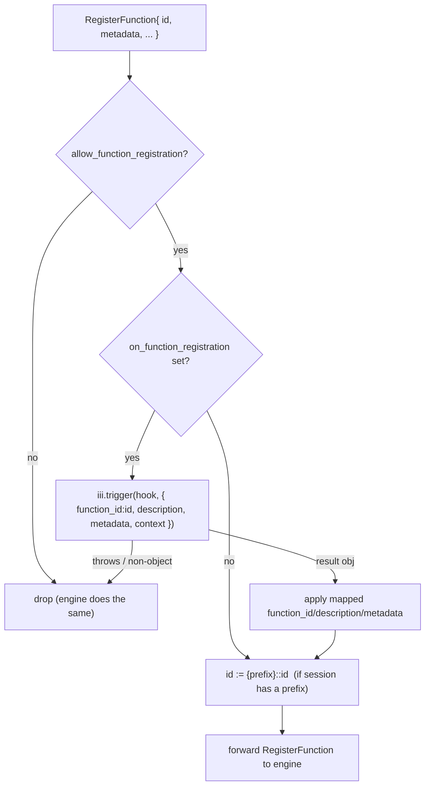
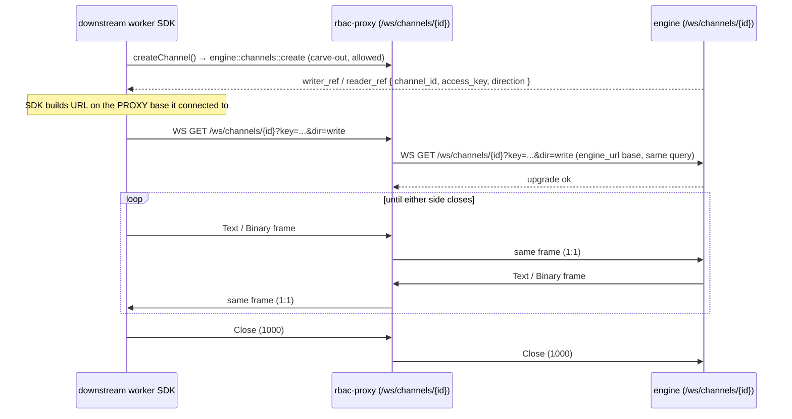

# Protocol & interception

The proxy speaks the iii worker WebSocket protocol verbatim
(`iii/engine/src/protocol.rs:40-126`). It does **not** invent a wire format — it
parses each JSON text frame, decides per message type whether to forward,
rewrite, or answer it, and re-serializes. This file is the reference for what
flows over the wire and what the proxy does to each frame.

The transport mechanics — one outbound engine WebSocket per inbound connection,
`axum::ws::Message` ↔ `tokio_tungstenite::Message` conversion, `tokio::select!`
on the two pump halves, close propagation — are the `console`
[`src/proxy.rs`](../../console/src/proxy.rs) pattern unchanged. The interceptor
is spliced into each pump half.

## Frame format

All protocol messages are WebSocket **Text** frames carrying a JSON object with
a `type` discriminant (lowercase). Binary frames are reserved for OpenTelemetry
(OTLP/MTRC/LOGS) and are forwarded untouched. The `Message` enum:

```rust
#[serde(tag = "type", rename_all = "lowercase")]
pub enum Message {
  RegisterTriggerType { id, description, trigger_request_format?, call_request_format? },
  RegisterTrigger     { id, trigger_type, function_id, config, metadata? },   // wire key: trigger_type
  TriggerRegistrationResult { id, trigger_type, function_id, error? },
  UnregisterTrigger   { id, trigger_type },
  RegisterFunction    { id, description?, request_format?, response_format?, metadata?, invocation? },
  UnregisterFunction  { id },
  InvokeFunction      { invocation_id: Option<Uuid>, function_id, data, traceparent?, baggage?, action? },
  InvocationResult    { invocation_id: Uuid, function_id, result?, error?, traceparent?, baggage? },
  RegisterService     { id, name, description?, parent_service_id? },
  Ping, Pong,
  WorkerRegistered    { worker_id },
}
```

Supporting shapes:

```rust
struct ErrorBody { code: String, message: String, stacktrace: Option<String> }

#[serde(tag = "type", rename_all = "lowercase")]
enum TriggerAction { Enqueue { queue: String }, Void }
```

- **Correlation** is by `invocation_id` (a UUID). `InvokeFunction` carries it
  (or `null` for `void`); the matching `InvocationResult` echoes it. The proxy
  **must preserve `invocation_id` byte-for-byte** through any rewrite, or the
  SDK's pending-call map never resolves.
- **Tracing.** `traceparent` / `baggage` (W3C Trace Context) ride both
  `InvokeFunction` and `InvocationResult`. The proxy forwards them untouched.
- **`WorkerRegistered { worker_id }`** is the engine's first frame on a new
  connection. The proxy forwards it downstream as-is (the upstream connection's
  `worker_id` is the worker's identity).
- **No `UnregisterTriggerType` variant exists in the Rust `Message` enum.** The
  Node and Python SDKs do emit an `unregistertriggertype` wire frame, but the
  Rust engine cannot deserialize it and **silently drops it** today
  (`engine/mod.rs` logs a "json decode error" and continues). The proxy treats
  it as an [unrecognised frame](#per-frame-interception) — forward unchanged —
  not as a prefix-rewrite target.

### The out-of-band rejection frame

There is one frame the engine emits that is **not** a `Message` enum variant: on
a failed RBAC handshake the engine sends a bare error object and then closes,
**before** any `WorkerRegistered` (`engine/mod.rs:1441-1459`):

```jsonc
{ "type": "error", "error": { "code": "AUTH_ERROR", "message": "..." } }
```

The proxy **must reproduce this exact shape and ordering** when its own auth
function rejects a connection: send the `error` text frame, then a WS Close, and
**never** open the upstream connection or send `WorkerRegistered`. SDK clients
already special-case this frame; diverging makes auth failures hang.

## Per-frame interception

The interceptor sits in both pump directions. The tables below give, for each
message type, the direction it travels and what the proxy does.

### Downstream → engine (frames the worker sends)

| Message | Proxy action |
|---|---|
| `RegisterFunction` | Run `on_function_registration` hook (map/deny) → check `allow_function_registration` → apply `{prefix}::` to `id` → forward. See [Registration frames](#registration-frames). |
| `RegisterTrigger` | Check `allowed_trigger_types` → run `on_trigger_registration` hook → [resolve prefix + verify target access](rbac.md#trigger-registration-rbac) → forward with resolved `function_id`, or reply `TriggerRegistrationResult{error}` on deny. |
| `RegisterTriggerType` | Check `allow_trigger_type_registration` → run `on_trigger_type_registration` hook → forward, or reply `TriggerRegistrationResult{error}` on deny. |
| `UnregisterFunction` | Its `id` **is** a function id, so re-apply `{prefix}::` to `id` (the engine prefixes it on registration via `resolve_registration_id`), then forward. |
| `UnregisterTrigger` | `{ id, trigger_type }` — `id` is a **trigger-instance** id, not a function id, and the engine never prefixes trigger ids. Forward **without** any prefix rewrite. |
| `InvokeFunction` (`engine::*` discovery) | Forward; record `invocation_id → function_id` in the pending-override map so the matching result is rewritten. See [engine-overrides.md](engine-overrides.md). |
| `InvokeFunction` (`engine::*` carve-out, e.g. `engine::channels::create`) | Allowed by carve-out → forward unchanged. |
| `InvokeFunction` (other) | [Access resolution](rbac.md#access-resolution-order): deny → synthesize `InvocationResult{error: FORBIDDEN}` (matching the engine, which replies even for a `void` action — fabricate an `invocation_id` when it is `null`; the worker simply has no pending entry for it); allow + middleware set → invoke middleware on the control connection, reply with its result; allow + no middleware → resolve [prefix](#prefix-resolution) → forward. |
| `InvocationResult` (worker answering a dispatched call) | Forward; correlation is by `invocation_id`, so the (bare) `function_id` is informational and passes through. |
| `RegisterService` | Forward unchanged (engine-internal service discovery; not gated). |
| `Ping` / `Pong` | Forward unchanged. |

### Engine → downstream (frames the engine sends)

| Message | Proxy action |
|---|---|
| `WorkerRegistered` | Forward unchanged. |
| `InvokeFunction` (engine dispatching a call **to** the worker) | Strip `{prefix}::` from `function_id` so the worker SDK finds its local handler → forward. Middleware does **not** apply to inbound dispatch. |
| `InvocationResult` (result of a call the worker made) | If `invocation_id` is in the pending-override map → rewrite `result` per [engine-overrides.md](engine-overrides.md) and drop the map entry → forward; else forward unchanged. |
| `TriggerRegistrationResult` | Strip `{prefix}::` from `function_id` (so the worker sees the id it sent) → forward. |
| `Ping` / `Pong` | Forward unchanged. |

Anything the proxy does not recognise is forwarded unchanged — the proxy never
drops a frame it cannot classify, so protocol additions degrade to pass-through
rather than breakage.

## Registration frames

`RegisterFunction` is gated by `allow_function_registration` and the
`on_function_registration` hook, then prefixed:



`RegisterTrigger` and `RegisterTriggerType` follow the same shape but gate on
`allowed_trigger_types` / `allow_trigger_type_registration` first. `RegisterTrigger`
additionally resolves the bound `function_id` and verifies the session may cause
that invocation (see [rbac.md § Trigger registration RBAC](rbac.md#trigger-registration-rbac)).
On denial, reply `TriggerRegistrationResult{ error: { code: "REGISTRATION_DENIED", message } }`
to the worker (see [rbac.md § Registration hooks](rbac.md#registration-hooks)).
Sending a denial frame is an
[intentional divergence](rbac.md#intentional-divergences-from-the-engine) — the
engine denies silently.

```mermaid
flowchart TD
  RT["RegisterTrigger{ function_id, trigger_type, ... }"] --> ATT{allowed_trigger_types<br/>includes trigger_type?}
  ATT -- no --> DENY["TriggerRegistrationResult{ error: REGISTRATION_DENIED }"]
  ATT -- yes --> HOOK{on_trigger_registration set?}
  HOOK -- yes --> CALL["iii.trigger(hook, { trigger_id, trigger_type, function_id, config, context })"]
  CALL -- throws / non-object --> DENY
  CALL -- result obj --> MAP["apply mapped trigger_id / trigger_type / function_id / config"]
  HOOK -- no --> RES
  MAP --> RES["resolve function_id → engine target<br/>(own-vs-foreign prefix rules)"]
  RES --> OWN{target registered<br/>by this session?}
  OWN -- yes --> FWD["forward RegisterTrigger with function_id := target"]
  OWN -- no --> ACC{is_function_allowed(target)?}
  ACC -- no --> DENY
  ACC -- yes --> FWD
```

> **Hook input note — ordering.** The hook sees the **bare** id, *before* prefix
> resolution or the target access check: the engine calls the hook with the
> worker-supplied `function_id`, applies the hook's optional mapping, and only
> then resolves the engine target (`engine/mod.rs:1251-1282` for
> `RegisterFunction`, `:784,:817-822` for `RegisterTrigger`). So the proxy order
> for `RegisterFunction` is **bare id → hook → apply `{prefix}::{id}` → forward**.
> For `RegisterTrigger` it is **bare id → hook → apply mapped id → resolve
> target (own-vs-foreign) → access check → forward** — see the flowchart above.
> (The engine's own `iii-worker-manager` README states "after
> `function_registration_prefix`", which is a **doc bug** — the code applies the
> prefix after the hook, not before. The proxy follows the code for
> `RegisterFunction`; for `RegisterTrigger` it additionally hardens beyond the
> engine by verifying target access after resolution.)

## Prefix resolution

The prefix is a private namespace for the **session's own** registrations
(see [rbac.md § Function registration prefix](rbac.md#function-registration-prefix)).
That creates one subtlety on the invocation path: when a prefixed session invokes
a function, is the target one of its own (registered bare, stored prefixed) or a
foreign function (canonical id)?

The proxy resolves it deterministically against the set of ids the session has
registered on this connection (it sees every `RegisterFunction`, so it knows
them):

```
on InvokeFunction{ function_id: F } from a session with prefix P:
  let candidate = "{P}::{F}"
  if the session registered candidate  -> target := candidate   (own function)
  else                                  -> target := F           (foreign function)
  run access-resolution against target  (the id as it exists in the engine)
  forward InvokeFunction with function_id := target
```

`expose_functions` / `forbidden` / `allowed` therefore match against the id **as
it exists in the engine registry** (foreign ids are canonical; own ids are
prefixed). This keeps wildcard patterns matching the right strings.

> **This is an intentional improvement over the engine, not parity — call it out
> as such.** The engine applies `function_registration_prefix` *only* on
> registration and inbound dispatch; its `InvokeFunction` handler uses the raw
> `function_id` verbatim (`engine/mod.rs` invoke path), so a prefixed worker that
> registered bare `foo` and then invokes bare `foo` gets `NOT_FOUND` on a real
> engine — the engine's transparent prefix is one-directional. The proxy's
> own-vs-foreign resolution above lets a prefixed session call its own bare-named
> function, which the engine does not. It is the right behaviour (a worker should
> be able to call what it registered), but because it diverges from a
> `worker-gateway` listener it is listed in
> [rbac.md § Intentional divergences](rbac.md#intentional-divergences-from-the-engine).
> A deployment that wants strict engine parity instead can disable own-id
> re-prefixing and accept that prefixed workers cannot self-invoke by bare name.
>
> Either way this is the single subtlety the implementation must test explicitly:
> a session calling its own `foo` (registered bare, stored `tenant1::foo`) and the
> same session calling a foreign `api::users::list` (matched against
> `expose_functions` unprefixed) — both covered by the unit tests in
> [rbac-proxy.md § Testing](rbac-proxy.md#testing).

## Channel bridge

A `StreamChannelRef` is `{ channel_id, access_key, direction }` and **carries no
host** (`sdk/.../channels.ts`, `protocol.rs:206-211`). The SDK builds the channel
URL from the address the worker connected to:

```
{engine_ws_base}/ws/channels/{channel_id}?key={url-encoded access_key}&dir={read|write}
```

Because a downstream worker connected to the **proxy's** port, its SDK dials
`/ws/channels/{id}` on the **proxy's** port. So the proxy must serve that route
and bridge it to the engine — and ref rewriting is neither needed nor possible
(there is no host in the ref to rewrite). This is **Pattern A**: mount and
bridge.



Bridge contract:

- The proxy mounts `GET /ws/channels/{channel_id}` on its RBAC port (alongside
  the `/` worker-protocol route), passing the `?key=` and `?dir=` query string
  through verbatim to `{engine_url}/ws/channels/{channel_id}`.
- Frames relay 1:1 in both directions: **Text↔Text, Binary↔Binary, Close↔Close**
  (preserving close code/reason), `Ping`/`Pong` pass through. This is the exact
  `axum_to_tungstenite` / `tungstenite_to_axum` conversion `console` already
  uses.
- **No auth function on the channel socket.** Channel access is independently
  validated by the engine against the `access_key` capability token (the engine
  returns 404 before upgrade on a bad key). The proxy does not re-authenticate
  the channel socket — it relays. The connection that *created* the channel was
  already authenticated on the worker-protocol port; the `access_key` is the
  capability for the data socket. (A deployment that wants to additionally bind
  channel sockets to the originating session can do so in the bridge, but it is
  not required for parity with the engine.)
- **Failure to dial the engine channel** → close the downstream channel socket
  with code `1011` (`internal error`), mirroring `console`'s dial-failure
  handling.

> **Backpressure / TTL.** The proxy bridge holds no buffer of its own beyond the
> socket — backpressure rides the WebSocket. Channel lifetime/TTL and the
> `mpsc` buffer remain the engine's `ChannelManager` concern; the proxy is a
> dumb relay. An idle channel that neither side connects expires in the engine
> (5-minute TTL) exactly as today.
