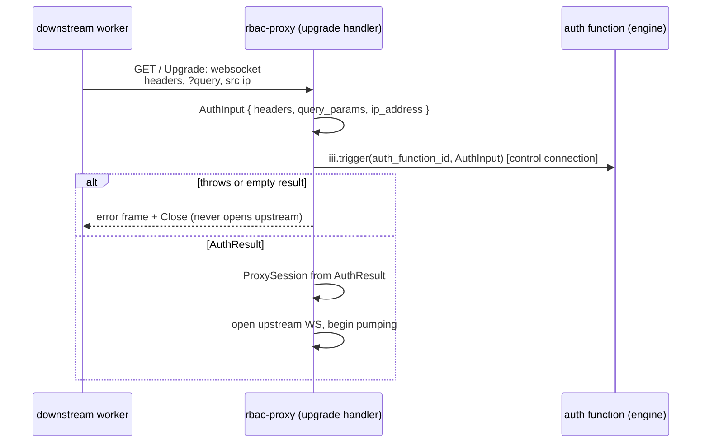
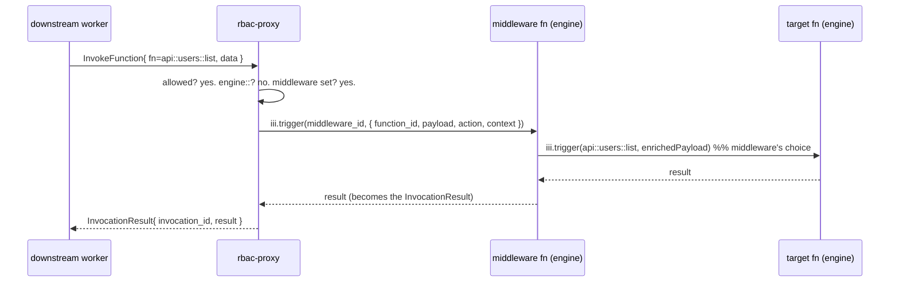

# RBAC contract

The `rbac-proxy` worker enforces the **same** role-based access control as an
engine `iii-worker-manager` RBAC listener — the contract documented in
[`worker-rbac.mdx`](../../../iii/docs/0-11-0/how-to/worker-rbac.mdx) and
[`iii-worker-manager/README.md`](../../../iii/engine/src/workers/worker/README.md).
This file mirrors that how-to's structure (auth function, `expose_functions`,
middleware, registration hooks, channels, full config, types reference) and
states where the proxy implementation differs from the in-engine one.

The behavioural promise is: **a connection through `rbac-proxy` is gated exactly
as the same connection through an engine RBAC listener would be.** The decision
logic is vendored verbatim from the engine (`rbac_config.rs`), so there is no
second, drifting copy of the rules — only a second *home* for them.

## The proxy has no engine `Session`

This is the load-bearing fact that determines the whole design.

Inside the engine, RBAC state lives in an in-process `Session` struct
(`engine/src/workers/worker/rbac_session.rs`) that the engine threads into the
invocation path and into the two session-aware discovery functions
(`engine::functions::list` / `::info`) via an in-process `SessionHandler`
closure. A worker connected over WebSocket — which is all `rbac-proxy` is from
the engine's point of view — **never receives that object.** When the proxy
calls `engine::functions::list` on its control or data connection, the engine
filters against *the proxy's own* session (which is unrestricted on the trusted
internal listener), not the downstream caller's.

Two consequences:

1. The proxy must **derive and hold each downstream connection's boundaries
   itself** — run the auth function, keep the resulting
   allowed/forbidden/expose/prefix/context/trigger-permissions for the life of
   the connection.
2. The proxy must **enforce every decision and rewrite every response
   client-side.** It cannot delegate filtering to the engine for *any* of the
   eight discovery functions — not even the two that are session-aware
   in-process. This is why [engine-overrides.md](engine-overrides.md) exists.

The per-connection session the proxy holds mirrors the engine's `Session`
fields:

```rust
// Held by the proxy for the lifetime of each downstream connection.
struct ProxySession {
    session_id: Uuid,
    ip_address: String,
    allowed_functions: Vec<String>,
    forbidden_functions: Vec<String>,
    allowed_trigger_types: Option<Vec<String>>, // None = all allowed
    allow_trigger_type_registration: bool,        // default false
    allow_function_registration: bool,            // default true
    context: Value,                               // forwarded to middleware + hooks
    function_registration_prefix: Option<String>, // private namespace
}
```

## Authentication

When `rbac.auth_function_id` is configured, the proxy invokes it **once per
WebSocket upgrade**, before it opens the upstream connection to the engine. The
function receives an `AuthInput` built from the upgrade request and returns an
`AuthResult`.



- `AuthInput.headers` — HTTP headers from the upgrade (e.g. `authorization`).
- `AuthInput.query_params` — `Record<string, string[]>` (repeated keys
  preserved).
- `AuthInput.ip_address` — the connecting client's IP, as the proxy sees it. In
  a deployment where the proxy is itself behind a load balancer, this is the
  peer address; honour `X-Forwarded-For` in the auth function if needed.

If `auth_function_id` is **unset**, the connection is allowed with a permissive
default session (`allowed_functions: []`, `forbidden_functions: []`,
`allow_trigger_type_registration: true`, `allow_function_registration: true`,
`context: {}`, no prefix) and `expose_functions` alone gates access — identical
to the engine default. A proxy facing an untrusted network **must** set
`auth_function_id`; see [Security](#security).

**Fail closed on a configured-but-unresolvable function.** "Unset" (permissive
default) is distinct from "set but the function can't be reached" (a typo, a
not-yet-registered or removed function, or an `iii.trigger` error). The latter is
treated as a failure, never as "allow":

- **Auth** unresolvable/errors → **reject the upgrade** (error frame + Close), as
  if it threw.
- **Middleware** unresolvable/errors → return an `InvocationResult{ error }` to
  the caller (**deny** the call); never silently forward to the target.
- **Registration hook** unresolvable/errors → **deny** the registration.

This is the only safe default for a security boundary: a broken policy function
denies, it does not open the door.

The auth function is a normal engine function the operator registers (from any
SDK). The TypeScript/Python/Rust examples in
[`worker-rbac.mdx` §2](../../../iii/docs/0-11-0/how-to/worker-rbac.mdx) apply
unchanged — they connect to the engine's **internal** listener, not to the proxy
port.

## `expose_functions`

`rbac.expose_functions` is a list of filters; a function is exposed if **any**
filter matches. An **empty** list exposes nothing *via the filter* — but
`allowed_functions` (rule 2) and the infrastructure carve-out (rule 3) still
admit their members, so an empty `expose_functions` is not "deny everything", it
is "expose only what the auth result explicitly allows plus the carve-out". Two
filter shapes, mixable in one list:

```yaml
rbac:
  expose_functions:
    - match("api::*")        # wildcard, anchored at both ends, * = any run of chars
    - match("*::public")
    - metadata:              # all keys must match (AND); filters are OR'd
        public: true
    - metadata:
        tier: free
        name: match("*public*")
```

The proxy vendors the engine matcher so the semantics are identical:

- **Wildcard** (`rbac_config.rs:46-82`) — `*` matches any run of characters,
  the pattern is anchored at both ends, case-sensitive. `*` alone matches
  everything.
- **Metadata** — exact JSON equality per key, or a nested `match("...")` for
  string values; a function with no metadata never matches a metadata filter.

Metadata matching requires the proxy to know a function's registered metadata.
It learns this from `engine::functions::list` (which carries `metadata` per
entry) over its control connection; see
[engine-overrides.md § Catalog & binding caches](engine-overrides.md#catalog--binding-caches).

## Access resolution order

Every `InvokeFunction` frame from a downstream connection walks the exact engine
decision flow (`rbac_config.rs:253-289`), evaluated by the proxy:

1. `function_id` in `forbidden_functions` → **deny**.
2. `function_id` in `allowed_functions` → **allow**.
3. `function_id` in the infrastructure carve-out → **allow**.
4. any `expose_functions` filter matches → **allow**.
5. otherwise → **deny**.

The **infrastructure carve-out** is vendored verbatim and is part of the
contract (additive-only within a major version):

```
engine::channels::create   engine::log::info    engine::baggage::get
engine::workers::register   engine::log::warn    engine::baggage::set
                            engine::log::error   engine::baggage::get_all
                            engine::log::debug
                            engine::log::trace
```

These ten ids keep connection setup, channel creation, logging, and context
propagation working regardless of the operator's `expose_functions`. The **eight
discovery** functions (`engine::functions::list/info`, `engine::workers::list/info`,
`engine::triggers::list/info`, `engine::registered-triggers::list/info`) are
**not** in the carve-out — they are gated by `expose_functions` like any other
function, and when reachable their results are rewritten to the caller's
boundaries (see [engine-overrides.md](engine-overrides.md)).

On **deny**, the proxy does not forward the frame. It synthesizes the engine's
`FORBIDDEN` reply directly back to the downstream connection. SDKs key the
rejection off the `code`, not the message, so matching `code: "FORBIDDEN"` is
what makes the pending call reject as it would against a real engine; reproduce
the engine's message and remediation branch too for parity:

```jsonc
{
  "type": "invocationresult",
  "invocation_id": "<echoed, or a fabricated UUID for a void action — see below>",
  "function_id": "<denied id>",
  // engine message shape: "function '<id>' not allowed (<remediation>)"
  // remediation = "remove from rbac.forbidden_functions" when the id was explicitly
  //               forbidden (rule 1), else "add to rbac.expose_functions" (rule 5).
  "error": { "code": "FORBIDDEN", "message": "function '<id>' not allowed (add to rbac.expose_functions)" }
}
```

The engine **always** sends this reply on deny — even for a `void` action,
where it fabricates an `invocation_id` because the frame carried `null`
(`engine/mod.rs`). The proxy mirrors that: fabricate a UUID for a denied `void`
call rather than dropping it silently (the worker has no pending entry for the
fabricated id, so it is harmless, and it keeps the proxy byte-compatible with the
engine's deny path).

## Middleware

When `middleware_function_id` is configured, every **allowed, non-`engine::`**
invocation is routed to the middleware instead of being forwarded to the engine.
The middleware receives a `MiddlewareFunctionInput` and **its return value
becomes the `InvocationResult`** the downstream caller receives.

> **The middleware contract, stated once and precisely** (it reads ambiguously
> across the engine code and docs): the middleware function receives
> `MiddlewareFunctionInput`; whatever it returns is returned to the caller as the
> result. **If the middleware wants the target function to actually run, it must
> invoke it itself** (`iii.trigger(function_id, payload)`). `engine::*` calls
> **bypass middleware entirely** (so connection setup, channel creation, and the
> discovery overrides are never wrapped). This matches the engine
> (`engine/mod.rs:940-981`).



`MiddlewareFunctionInput`:

| Field | Type | Description |
|---|---|---|
| `function_id` | string | The function the worker wants to invoke. |
| `payload` | object | The payload the worker sent. |
| `action` | TriggerAction or omitted | Routing action (`enqueue`, `void`), if any. |
| `context` | object | `AuthResult.context` for this session (`{}` when no auth fn). |

The middleware runs on the proxy's **control connection** (`iii.trigger`),
exactly as the engine runs it via `engine.call`. Keep middleware idempotent —
retries must not double-charge or double-log.

## Trigger registration RBAC

Workers connecting through the proxy may register trigger types and triggers,
subject to access control.

### Trigger type registration (`RegisterTriggerType`)

Two `AuthResult` fields gate new trigger types:

- **`allowed_trigger_types`** — trigger type ids the worker may bind triggers
  for. Omitted ⇒ all allowed.
- **`allow_trigger_type_registration`** — whether the worker may register *new*
  trigger types. Default `false`.

The proxy enforces both before forwarding `RegisterTriggerType`, then runs the
optional `on_trigger_type_registration` hook.

### Trigger instance registration (`RegisterTrigger`)

Binding a trigger tells the engine to invoke `function_id` when the trigger
fires. That dispatch is **engine-internal** — it does not pass back through the
proxy's `InvokeFunction` gate — so the proxy must verify at registration time
that the session is permitted to cause that invocation.

After `allowed_trigger_types` and the optional `on_trigger_registration` hook
(both see the worker-supplied bare ids), the proxy:

1. **Resolves the engine target** using the same own-vs-foreign
   [prefix resolution](protocol-interception.md#prefix-resolution) as
   `InvokeFunction` — not the blind `{prefix}::{id}` prepend used for
   `RegisterFunction`.
2. **Checks target access:**
   - if the resolved id is a function this session registered on this
     connection → **allow** (binding a trigger to the worker's own handler);
   - else run [access resolution](#access-resolution-order) on the resolved id →
     **allow** or **deny**.
3. On **deny**, reply `TriggerRegistrationResult{ error: { code:
   "REGISTRATION_DENIED", message } }` with the same remediation wording as an
   invoke deny (`"function '<id>' not allowed (add to rbac.expose_functions)"`
   unless rule 1 forbids it). On **allow**, forward `RegisterTrigger` with
   `function_id` set to the resolved engine id.

The registration hook remains the place for additional policy (audit, narrower
allowlists, config validation). The target-function access check is **always
on** — it is not optional and does not require configuring
`on_trigger_registration`.

## Registration hooks

For fine-grained control, configure hook functions invoked **before** each
registration. Each receives the registration details plus `AuthResult.context`;
it returns a result object with the (possibly mapped) fields to allow, or throws
to deny. Omitted result fields keep the original value.

```yaml
rbac:
  auth_function_id: my-project::auth-function
  on_function_registration_function_id: my-project::on-function-reg
  on_trigger_registration_function_id: my-project::on-trigger-reg
  on_trigger_type_registration_function_id: my-project::on-trigger-type-reg
  expose_functions:
    - match("api::*")
```

| Hook | Fires on | Input | Result (omitted ⇒ unchanged) |
|---|---|---|---|
| `on_function_registration_function_id` | `RegisterFunction` | `{ function_id, description?, metadata?, context }` | `{ function_id?, description?, metadata? }` |
| `on_trigger_registration_function_id` | `RegisterTrigger` | `{ trigger_id, trigger_type, function_id, config, context }` | `{ trigger_id?, trigger_type?, function_id?, config? }` |
| `on_trigger_type_registration_function_id` | `RegisterTriggerType` | `{ trigger_type_id, description, context }` | `{ trigger_type_id?, description? }` |

The TypeScript/Python/Rust hook examples in
[`worker-rbac.mdx` §6](../../../iii/docs/0-11-0/how-to/worker-rbac.mdx) port over
unchanged.

**Failure semantics** (matching the engine, `engine/mod.rs:663-867,1216-1355`):
a hook that throws or returns a non-object **denies** the registration. The proxy
must decide whether to surface that denial to the worker as a
`TriggerRegistrationResult{ error }` (for trigger/trigger-type registrations) or
mirror the engine's occasionally-silent drop. **Recommendation:** always send a
`TriggerRegistrationResult{ error: { code: "REGISTRATION_DENIED", message } }`
for trigger and trigger-type registrations (it is strictly more informative and
the SDK already handles that frame), and drop denied `RegisterFunction` frames
silently as the engine does (there is no ack frame for function registration).

The interaction with `function_registration_prefix` and the exact wire rewrites
live in
[protocol-interception.md § Registration frames](protocol-interception.md#registration-frames).

## Function registration prefix

When `AuthResult.function_registration_prefix` is set, the session gets a private
namespace. Because the proxy — not the engine's internal listener — is the RBAC
boundary here, **the proxy owns the prefix**:

- On a `RegisterFunction` from the worker, the proxy rewrites
  `id` → `{prefix}::{id}` before forwarding to the engine. On a `RegisterTrigger`,
  it resolves the referenced `function_id` with the same own-vs-foreign rules as
  `InvokeFunction` (see [Trigger registration RBAC](#trigger-registration-rbac)),
  not the blind prepend used for `RegisterFunction`.
- When the engine dispatches an `InvokeFunction` **back down** to the worker
  (a trigger fired, or another caller invoked the worker's function), the proxy
  strips `{prefix}::` from `function_id` before forwarding, so the worker SDK
  finds its locally-registered (bare) handler. The worker never sees the prefix.

This is the engine's transparent-namespace behaviour
(`engine/mod.rs:817-823` apply, `worker_connections/traits.rs` strip), relocated
to the proxy. The matching/resolution rules — which id `expose_functions` runs
against, and how the proxy resolves a worker invoking its *own* prefixed
function — are specified in
[protocol-interception.md § Prefix resolution](protocol-interception.md#prefix-resolution),
and surfaced in discovery results in
[engine-overrides.md § Prefix in results](engine-overrides.md#prefix-in-results).

## Channels

Channels work through the proxy port exactly as on the engine. The proxy mounts
`/ws/channels/{channel_id}` on its own RBAC port and bridges frames to the
engine's `/ws/channels/{channel_id}`. `engine::channels::create` is in the
infrastructure carve-out, so a worker can create channels even with empty
`expose_functions`. A `StreamChannelRef` is `{ channel_id, access_key,
direction }` and carries **no host**, so no ref rewriting is needed — the SDK
builds the channel URL from the address the worker connected to (the proxy
port), and the proxy forwards to the engine. Full mechanics:
[protocol-interception.md § Channel bridge](protocol-interception.md#channel-bridge).

## Full example config

The proxy's config lives in the `configuration` worker under id `rbac-proxy`
(not a `config.yaml`). Shown here as the equivalent YAML an operator would
`configuration::set` or seed:

```yaml title="configuration: rbac-proxy"
host: 0.0.0.0
port: 49200                       # the public RBAC port (req #2)
engine_url: ws://127.0.0.1:49134  # the trusted internal engine listener
expose_worker_internals: false    # strip pid/ip/metrics from engine::workers::* results
middleware_function_id: my-project::middleware-function
rbac:
  auth_function_id: my-project::auth-function
  on_function_registration_function_id: my-project::on-function-reg
  on_trigger_registration_function_id: my-project::on-trigger-reg
  on_trigger_type_registration_function_id: my-project::on-trigger-type-reg
  expose_functions:
    - match("api::*")
    - match("*::public")
    - metadata:
        public: true
```

See [rbac-proxy.md § Configuration](rbac-proxy.md#configuration) for the schema,
defaults, and hot-reload behaviour (a `port`/`host`/`engine_url` change rebinds
the listener; everything else takes effect on the next connection).

## Types reference

All types are wire-compatible with the engine's RBAC types
(`sdk/.../helpers/src/worker_connection_manager.rs`); the SDKs already export
them.

### AuthInput

| Field | Type | Description |
|---|---|---|
| `headers` | `Record<string, string>` | HTTP headers from the upgrade request. |
| `query_params` | `Record<string, string[]>` | Query params; repeated keys preserved. |
| `ip_address` | `string` | Connecting client IP as the proxy sees it. |

### AuthResult

| Field | Type | Default | Description |
|---|---|---|---|
| `allowed_functions` | `string[]` | `[]` | Allow beyond `expose_functions`. |
| `forbidden_functions` | `string[]` | `[]` | Deny even if exposed. Highest precedence. |
| `allowed_trigger_types` | `string[]` or omitted | omitted (all) | Trigger types the worker may bind. |
| `allow_trigger_type_registration` | `boolean` | `false` | May register new trigger types. |
| `allow_function_registration` | `boolean` | `true` | May register new functions. |
| `function_registration_prefix` | `string` or omitted | omitted | Private namespace prefix. |
| `context` | `object` | `{}` | Forwarded to middleware + hooks. |

### MiddlewareFunctionInput

| Field | Type | Description |
|---|---|---|
| `function_id` | `string` | Function being invoked. |
| `payload` | `object` | Caller payload. |
| `action` | TriggerAction or omitted | `enqueue` / `void`, if any. |
| `context` | `object` | Session auth context. |

### Registration hook I/O

`OnFunctionRegistrationInput` `{ function_id, description?, metadata?, context }`
→ `OnFunctionRegistrationResult` `{ function_id?, description?, metadata? }`.

`OnTriggerRegistrationInput` `{ trigger_id, trigger_type, function_id, config, context }`
→ `OnTriggerRegistrationResult` `{ trigger_id?, trigger_type?, function_id?, config? }`.

`OnTriggerTypeRegistrationInput` `{ trigger_type_id, description, context }`
→ `OnTriggerTypeRegistrationResult` `{ trigger_type_id?, description? }`.

All result fields are optional; omitting one keeps the original value. Throwing
denies the registration.

## Intentional divergences from the engine

The proxy aims for parity with a `worker-gateway` listener, but a few behaviours
are deliberately different. They are collected here so the parity claim elsewhere
in this spec is not read as absolute. Each is optional — a deployment that wants
strict parity can turn it off.

| Divergence | Engine behaviour | Proxy behaviour | Why |
|---|---|---|---|
| **Self-invoke under a prefix** | A prefixed worker invoking its own bare-named `foo` gets `NOT_FOUND` — the engine never re-prefixes invocation targets ([protocol-interception.md § Prefix resolution](protocol-interception.md#prefix-resolution)). | The proxy resolves the bare id to the session's own `{prefix}::foo` so the call succeeds. | A worker should be able to call what it registered. Opt-out: disable own-id re-prefixing for strict parity. |
| **Denied-discovery error code** | `engine::functions::info` distinguishes `FORBIDDEN` (denied) from `NOT_FOUND` (missing), leaking existence. | Defaults to engine parity (`FORBIDDEN`); a deployment may opt into collapsing denied → `NOT_FOUND` to also hide existence ([engine-overrides.md](engine-overrides.md)). | Hardening for hostile multi-tenant discovery. |
| **Registration-denial frame** | On an RBAC/hook denial of a trigger or trigger-type registration the engine returns **silently** (no `TriggerRegistrationResult`). | The proxy replies `TriggerRegistrationResult{ error: { code: "REGISTRATION_DENIED", … } }` so the worker learns *why* ([Registration hooks](#registration-hooks)). | A silent drop is hard to debug; the SDK already handles this frame. Opt-out: drop silently for strict parity. |
| **Trigger target access** | `RegisterTrigger` is gated only by trigger-type permissions and the optional hook; the engine does not verify the worker may invoke the bound `function_id`. | Before forwarding, the proxy resolves the target id and runs [access resolution](#access-resolution-order) (own registered functions exempt). | Trigger firing bypasses the invoke gate; without this check a worker could bind a trigger to a function it cannot call directly. |

Everything else — the access-resolution order, the carve-out, `AuthResult`
semantics, the middleware contract, the prefix apply/strip on `RegisterFunction`
and inbound dispatch — is byte-for-byte the engine's, by vendoring its decision
code.

## Security

- Only the proxy's RBAC port should face untrusted networks. The engine's
  internal listener (`engine_url`) and any other engine ports stay internal,
  reachable only by the proxy and trusted co-located workers. Enforce with
  firewall rules / network policy.
- Always set `auth_function_id` on a proxy facing an untrusted network. With no
  auth function, `expose_functions` alone gates access and every connection is
  admitted.
- Prefer narrow `expose_functions` patterns over `match("*")`. Audit the list
  when a new engine namespace appears.
- `forbidden_functions` is the hard-deny: per-user/per-role denylists the
  operator's `expose_functions` cannot override.
- The middleware is the place for request validation, rate limiting, and audit
  logging.
- `RegisterTrigger` always verifies the bound `function_id` against the session's
  access boundaries (see [Trigger registration RBAC](#trigger-registration-rbac)).
  Do not rely on the optional registration hook alone to block trigger-to-privileged
  bindings.
- Triggers and functions registered through a proxied connection are scoped to
  that engine connection and cleaned up when the downstream worker disconnects —
  the proxy closes the upstream WS on downstream close, and the engine's existing
  per-connection cleanup does the rest.
