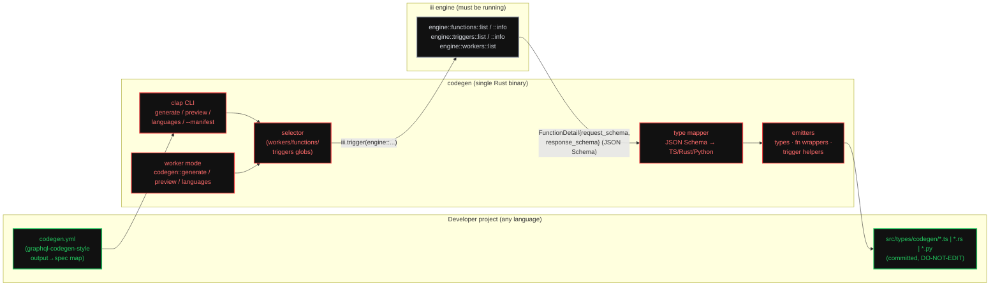
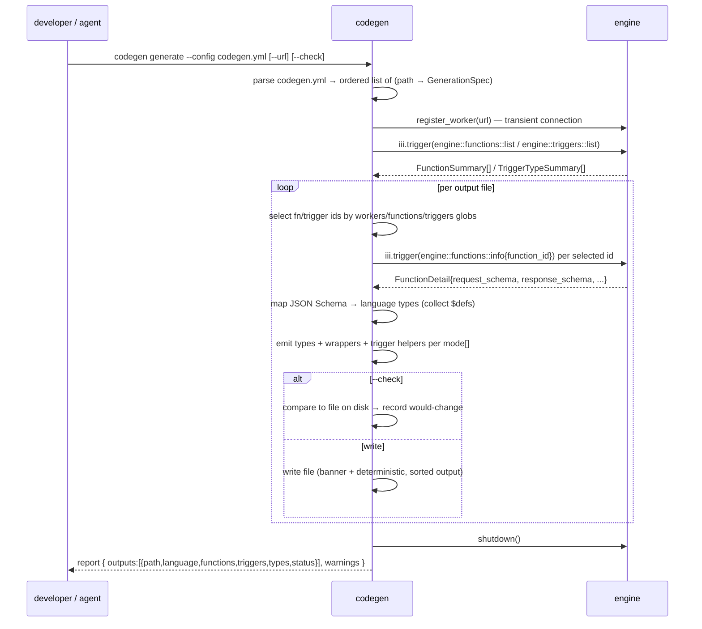

# Codegen Worker

A single standalone iii worker — `codegen` — that turns the engine's **live
function catalog** into typed, idiomatic client code in the caller's own
language. It connects to a running engine, reads the JSON Schemas every worker
registered for its functions and triggers, and emits **types**, **typed function
wrappers**, and **typed trigger-registration helpers** into the files a project
asks for — `graphql-codegen` for iii. It runs both as a worker (exposing
`codegen::*` functions) and as a self-contained binary (`codegen generate
--config codegen.yml`).

The load-bearing fact this spec is built around: **iii already describes every
function in JSON Schema.** A worker's `#[function]` macro emits
`schemars::schema_for!(Input)` / `schema_for!(Output)` at registration
(`iii/engine/function-macros/src/lib.rs:358-376`), the engine stores them as
`request_format` / `response_format` (`iii/engine/src/function.rs:28-36`), and
the built-in discovery functions hand them back verbatim
(`iii/engine/src/workers/engine_fn/mod.rs:190-203`). Codegen invents no schema of
its own — it is a **deterministic projection** of that catalog into language
types and SDK call sites. Correctness therefore reduces to two faithful
mappings: JSON Schema → language type, and "call function X" → the SDK's one call
primitive, `trigger({ function_id, payload })`.

## Why this exists (and how it relates to the SDK)

Today, calling another worker from the SDK is **untyped at the boundary**. You
write the `function_id` as a string and the payload as a free-form object; the
SDK's `trigger<TInput, TOutput>(...)` generics
(`iii/sdk/packages/node/iii/src/types.ts:159`) are real, but *you* supply
`TInput`/`TOutput` by hand, with nothing tying them to what the target worker
actually registered. A field rename in `harness` is a runtime error in every
consumer, discovered in production.

Codegen closes that gap by reading the same schemas the engine already holds and
materialising them as code you commit:

| Concern | Hand-written today | With `codegen` |
|---|---|---|
| Input / output types | Re-typed by hand per consumer, drift silently | Generated from the target's registered schema |
| Function id | Bare string literal, typo = runtime 404 | A namespaced method (`harness.send`), typo = compile error |
| Cross-language parity | Re-typed separately in TS, Rust, Python | One catalog → all languages, same source of truth |
| Trigger payloads | Untyped `config`/handler | Typed config + payload + return, end to end |
| Catalog drift | Found in production | Found by `codegen --check` in CI |
| Scope | n/a | Per-output globs over workers / functions / triggers |

This is **not** a worker scaffolder and **not** a schema authoring tool. Schemas
are owned by the workers that register them; codegen is strictly downstream. It
generates the *client* surface (callers + types) plus typed *subscription*
helpers for a worker's trigger types — never the server-side function bodies. See
[Boundaries](worker-and-cli.md#boundaries--non-goals).

## Architecture

The binary has **one core pipeline** shared by the CLI and the worker functions:
*select → discover → map → emit → write*. The CLI connects to the engine as a
transient worker (`register_worker`, `iii/sdk/packages/rust/iii/src/lib.rs:96`),
runs the pipeline once, and disconnects. Worker mode keeps the connection open
and runs the same pipeline on demand when `codegen::generate` is invoked. Both
read the catalog over the wire — so **codegen sees exactly the workers that are
connected and registered right now** (see
[discovery](discovery-and-types.md#the-catalog-is-live)).

## The generation lifecycle

Each numbered concern has a home:

1. **The config file** — every field, the output→spec map, and the
   `iii_instance` modes: [configuration.md](configuration.md).
2. **Selecting what to generate** — the `workers` / `functions` / `triggers`
   glob semantics: [configuration.md § Selection](configuration.md#selection-semantics).
3. **Reading the catalog** — the discovery functions and their exact response
   shapes: [discovery-and-types.md § Discovery](discovery-and-types.md#discovery-the-input-contract).
4. **JSON Schema → types** — the per-language mapping table, `$defs`, enums,
   nullability: [discovery-and-types.md § Type mapping](discovery-and-types.md#json-schema--language-types).
5. **Emitting wrappers & helpers** — the `trigger()` lowering, `iii_instance`,
   banners, determinism: [emitters.md](emitters.md).
6. **Packaging** — the Rust binary, the CLI surface, the `codegen::*` functions,
   deployment and testing: [worker-and-cli.md](worker-and-cli.md).

## Conventions

This worker follows the repo conventions in [`workers/docs`](../../docs): the
binary-worker SOP ([`sops/binary-worker.md`](../../docs/sops/binary-worker.md))
for structure and typed handlers, and the `configuration`-worker SOP
([`sops/configuration.md`](../../docs/sops/configuration.md)) for hot-reloadable
config.

- **Function ids** are kebab-case `<worker>::<verb>`: `codegen::generate`,
  `codegen::preview`, `codegen::languages`. Never snake_case.
- **Typed handlers only.** Every registered function uses a concrete
  `JsonSchema`-deriving input/output struct — never a bare `serde_json::Value`
  handler (binary-worker.md §7).
- **Generated files are owned by codegen.** Every emitted file opens with a
  `DO NOT EDIT` banner and is byte-deterministic, so re-running on an unchanged
  catalog is a no-op diff (see [emitters.md § Determinism](emitters.md#determinism--idempotency)).
- **The engine address** is never in `codegen.yml`. It comes from `--url`, then
  `$III_URL`, then `ws://127.0.0.1:49134` — identical to every other worker
  (`workers/coder/src/main.rs:14-49`).

## Spec index

- [configuration.md](configuration.md) — the `codegen.yml` contract: the
  output→spec map, `language` / `mode` / `workers` / `functions` / `triggers` /
  `iii_instance`, the precise glob **selection semantics**, the full config JSON
  Schema, and the worked example from the brief expanded field by field.
- [discovery-and-types.md](discovery-and-types.md) — the **input contract**: the
  eight `engine::*` discovery functions and their verbatim response shapes, why
  the catalog is live, and the **JSON Schema → TypeScript / Rust / Python** type
  mapping (objects, arrays, enums, `oneOf`, `$ref`/`$defs`, nullability, untyped
  passthrough) plus the type- and function-naming derivation rules.
- [emitters.md](emitters.md) — what each emitter produces per language and mode:
  the `trigger()` call lowering quoted against each SDK, the `iii_instance`
  `import` vs `argument` lowering, trigger-registration helpers, the file banner,
  determinism/idempotency, and `--check`.
- [worker-and-cli.md](worker-and-cli.md) — packaging: the Rust binary and file
  layout (mirroring `coder`), the `clap` CLI surface, the `codegen::generate` /
  `::preview` / `::languages` functions with their request/response schemas,
  `iii.worker.yaml`, deployment, dependencies, testing (golden + downstream
  compile), and boundaries / non-goals.

## Prior art

- [`coder`](../../coder) — the path-jailed binary worker whose
  `src/main.rs` clap setup, `iii.worker.yaml` (`deploy: binary`, multi-target),
  and `--manifest` flag this worker mirrors for CLI + packaging.
- [`graphql-codegen`](https://the-guild.dev/graphql/codegen) — the prior-art
  whose **multi-output `generates:` model**, `DO NOT EDIT` banners, and
  `--check` CI guard this spec adapts to iii's catalog.
- `engine::*` discovery — the introspection surface codegen consumes, defined in
  `iii/engine/src/workers/engine_fn/mod.rs` and enumerated as `EngineFunctions`
  in `iii/sdk/packages/rust/iii/src/engine.rs:15-25`; the same surface
  [`rbac-proxy`](../2026-06-22-rbac-proxy-worker/engine-overrides.md) rewrites.
- [`todo-worker`](../../todo-worker) / [`todo-worker-python`](../../todo-worker-python)
  — the canonical Node and Python SDK consumers; their hand-written `iii.ts` /
  `main.py` are what generated wrappers are designed to slot beside.
